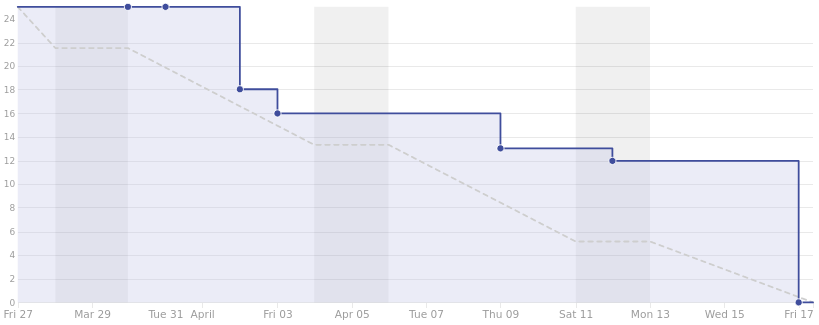
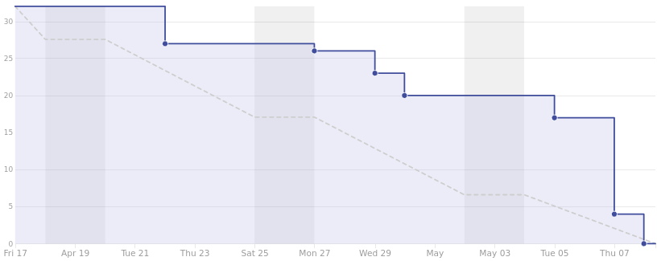

=========================
Plan de proyecto software
=========================

Introducción
------------
La finalidad de este apartado es definir el conjunto de actividades de desarrollo que se han llevado a cabo para gestionar la construcción de la infraestructura software propuesta. Estas actividades se pueden dividir en dos fases:

- Planificación temporal.
- Estudio de viabilidad.

La fase de planificación temporal agrupa todas aquellas actividades que tienen como objetivo organizar, planificar y desarrollar una serie de tareas dentro de un marco temporal. Todas ellas definen el intervalo de tiempo en el que se va a desarrollar el proyecto. Existen multitud de estrategias para determinar cada una de estas actividades, en mi caso, he optado por emplear metodologías ágiles.

En la segunda fase, se reúnen todas y cada una de las actividades que estudian y analizan la viabilidad del proyecto, tanto económica como legal.

Planificación temporal
----------------------

Para llevar a cabo la planificación temporal del proyecto he optado por utilizar metodologías ágiles, concretamente *Scrum*.

Por tanto, el desarrollo se ha dividido en iteraciones (*sprints*), cada una de las cuales ha tenido una duración aproximada de 2 semanas. Cada iteración se compone de una serie de tareas cuyo principal cometido es incluir nuevas funcionalidades a la infraestructura.

Las tareas de cada *sprint* son elaboradas en la reunión que se establece al terminar la iteración anterior. En mi caso, las reuniones se hacían tanto con la UBU, como con el CENIEH. Además de planificar las tareas de la siguiente iteración, se supervisan las del anterior.

Dado que el desarrollo se ha llevado a cabo en la plataforma Github, conviene mencionar que el término *sprint* comentado anteriormente se ve reflejado en esta plataforma como *milestone* y, cada una de sus tareas, se corresponden con *issues*.

Además se ha utilizado la herramienta *ZenHub* para llevar a cabo la planificación de los *sprints*, incluyendo en cada uno de ellos gráficos estadísticos como *burndown*. Además, incluye en GitHub un nuevo atributo denominado *story points*, el cual permite asociar, a cada tarea, una estimación del esfuerzo que vamos a realizar sobre ella. Para poder elaborar un seguimiento, se ha asociado un valor temporal a cada posible valor de *story points*.

.. table:: Relación entre esfuerzo (*story point*) y tiempo.
   :widths: auto

   ===================  ===================
   Story points         Estimación temporal
   ===================  ===================
   1                    < 1h
   2                    1h - 2h
   3                    2h - 4h
   5                    4h - 8h
   8                    8h - 16h
   13                   16h - 24h
   21                   1d - 3d
   40                   3d - 7d
   ===================  ===================

A continuación, describiré brevemente cada uno de los *sprints* ejecutados durante el desarrollo del proyecto.

*Sprint* 0 (28/02/2020 - 13/03/2020)
~~~~~~~~~~~~~~~~~~~~~~~~~~~~~~~~~~~~

Cuando se llevó a cabo la reunión de planificación de este primer *sprint*, llevaba trabajando ya con el CENIEH más de tres semanas. Durante este periodo de tiempo, llevé a cabo multitud de tareas relacionadas con el proyecto. Por ello, durante esta primera reunión, mostré todos los avances que había realizado hasta la fecha para conocer la opinión de mis dos tutores, Carlos López y Mario Juez.
Tras hacer una valoración de dichos avances, se plantearon nuevos objetivos: migrar todo el trabajo almacenado en el repositorio local del CENIEH al repositorio de Github, realizar un estudio detallado de las diferentes ontologías involucradas en el proyecto (CIDOC-CRM, ACDM y AO-CAT) y mejorar mi formación en los lenguajes de programación utilizados por la infraestructura escogida (*PHP*, *HTML* y *JavaScript*).

`Listado de tareas <https://github.com/gcm1001/TFG-CeniehAriadne/milestone/1>`__ asociadas al *Sprint* 0.

*Sprint* 1 (13/03/2020 - 27/03/2020)
~~~~~~~~~~~~~~~~~~~~~~~~~~~~~~~~~~~~

Los objetivos planteados para este *sprint* fueron: cubrir las nuevas necesidades del proyecto mediante el desarrollo de nuevos plugins para *Omeka*, estudiar la opción de implementar la tecnología *Docker*, avanzar con la documentación en *LaTeX* y aprender a utilizar el servicio de documentación *Read the docs*.

`Listado de tareas <https://github.com/gcm1001/TFG-CeniehAriadne/milestone/2>`__ asociadas al *Sprint* 1.

*Sprint* 2 (27/03/2020 - 17/04/2020)
~~~~~~~~~~~~~~~~~~~~~~~~~~~~~~~~~~~~

Los objetivos planteados para este *sprint* fueron: finalizar la formación en *Docker*, adaptar el diseño de la aplicación web a las necesidades del usuario objetivo, desarrollar un nuevo plugin que incorpore un sistema de estados para las colecciones/ítems, gestionar el proyecto a través de ZenHub y, por último, estudiar e implementar las prácticas software de la CI (Integración continua).

`Listado de tareas <https://github.com/gcm1001/TFG-CeniehAriadne/milestone/3>`__ asociadas al *Sprint* 2.

*Sprint* 3 (17/04/2020 - 08/05/2020)
~~~~~~~~~~~~~~~~~~~~~~~~~~~~~~~~~~~~
Los objetivos planteados para este *sprint* fueron: seguir con el análisis e implementación de la "Integración Continua" en el proyecto, finalizar el desarrollo del plugin "ARIADNEplus Monitor", desplegar la infraestructura sobre el servidor del CENIEH, actualizar el fichero README y avanzar con la documentación.

`Listado de tareas <https://github.com/gcm1001/TFG-CeniehAriadne/milestone/4>`__ asociadas al *Sprint* 3.

