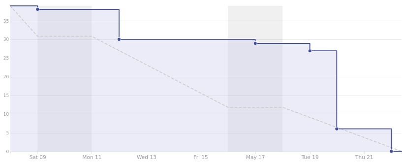
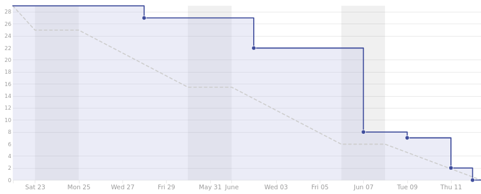
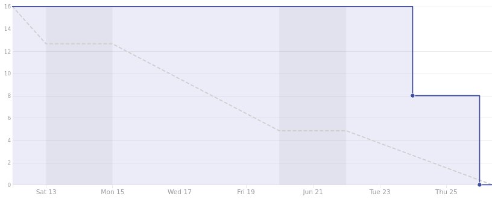

=========================
Plan de proyecto software
=========================

Introducción
------------
La finalidad de este apartado es definir el conjunto de actividades de desarrollo que se han llevado a cabo para gestionar la construcción de la infraestructura *software* propuesta. Estas actividades se pueden dividir en dos fases: planificación temporal y estudio de viabilidad.

La fase de planificación temporal agrupa todas aquellas actividades que tienen como objetivo organizar, planificar y desarrollar una serie de tareas dentro de un marco temporal. Todas ellas definen el intervalo de tiempo en el que se va a desarrollar el proyecto. Existen multitud de estrategias para determinar cada una de estas actividades, en este caso, se ha optado por emplear metodologías ágiles.

En la segunda fase, se reúnen todas y cada una de las actividades que estudian y analizan la viabilidad económica y legal del proyecto.

Planificación temporal
----------------------
Para llevar a cabo la planificación temporal del proyecto se ha optado por utilizar metodologías ágiles, concretamente *Scrum*.

El desarrollo se ha dividido en iteraciones (*sprints*), cada una de las cuales ha tenido una duración aproximada de 2 semanas. Cada iteración se compone de una serie de tareas cuyo principal cometido es incluir nuevas funcionalidades a la infraestructura.

Las tareas de cada *sprint* son elaboradas en la reunión que se establece al terminar la iteración anterior. Además de planificar las tareas de la siguiente iteración, se supervisan las del anterior. En nuestro caso, las reuniones se hacían tanto con la UBU como con el CENIEH.

Dado que el desarrollo se ha llevado a cabo en la plataforma *Github*, es importante aclarar que el término *sprint* comentado anteriormente se ve reflejado en esta plataforma como *milestone* y, cada una de sus tareas, se corresponden con las denominadas *issues*.

Además, se ha utilizado la herramienta *ZenHub* para llevar a cabo la planificación de los *sprints*. Esta herramienta permite llevar un seguimiento de cada *sprint* mediante gráficos estadísticos como *burndown*. También incluye en *GitHub* un nuevo atributo denominado *story points*, el cual permite asociar, a cada tarea, una estimación del esfuerzo que se va a realizar sobre ella.

Para poder trazar un seguimiento óptimo en cada *sprint*, se ha asociado un valor temporal a cada posible valor de *story points*.

.. table:: Relación entre esfuerzo (*story point*) y tiempo.
   :widths: auto

   ===================  ===================
   Story points         Estimación temporal
   ===================  ===================
   1                    < 1h
   2                    1h - 2h
   3                    2h - 4h
   5                    4h - 8h
   8                    8h - 16h
   13                   16h - 24h
   21                   1d - 3d
   40                   3d - 7d
   ===================  ===================

A continuación, se describen brevemente cada uno de los *sprints* ejecutados durante el desarrollo del proyecto.

*Sprint* 0 (28/02/2020 - 13/03/2020)
~~~~~~~~~~~~~~~~~~~~~~~~~~~~~~~~~~~~

Cuando se llevó a cabo la reunión de planificación de este primer *sprint*, llevaba trabajando ya con el CENIEH más de tres semanas. Durante este periodo de tiempo, llevé a cabo multitud de tareas relacionadas con el proyecto. Por ello, durante esta primera reunión, mostré todos los avances que había realizado hasta la fecha para conocer la opinión de mis dos tutores, Carlos López y Mario Juez.
Tras hacer una valoración de dichos avances, se plantearon nuevos objetivos: migrar todo el trabajo almacenado en el repositorio local del CENIEH al repositorio de Github, realizar un estudio detallado de las diferentes ontologías involucradas en el proyecto (*CIDOC-CRM*, *ACDM* y *AO-CAT*) y mejorar mi formación en los lenguajes de programación utilizados por la infraestructura escogida (*PHP*, *HTML* y *JavaScript*).

`Ver listado de tareas <https://github.com/gcm1001/TFG-CeniehAriadne/milestone/1>`__ asociadas al *Sprint* 0.

*Sprint* 1 (13/03/2020 - 27/03/2020)
~~~~~~~~~~~~~~~~~~~~~~~~~~~~~~~~~~~~

Los objetivos planteados para este *sprint* fueron: cubrir las nuevas necesidades del proyecto mediante el desarrollo de nuevos plugins para *Omeka*, estudiar la opción de implementar la tecnología *Docker*, avanzar con la documentación en *LaTeX* y aprender a utilizar el servicio de documentación *Read the docs*.

`Listado de tareas <https://github.com/gcm1001/TFG-CeniehAriadne/milestone/2>`__ asociadas al *Sprint* 1.

*Sprint* 2 (27/03/2020 - 17/04/2020)
~~~~~~~~~~~~~~~~~~~~~~~~~~~~~~~~~~~~

Los objetivos planteados para este *sprint* fueron: finalizar la formación en *Docker*, adaptar el diseño de la aplicación web a las necesidades del usuario objetivo, desarrollar un nuevo plugin que incorpore un sistema de estados para las colecciones/ítems, gestionar el proyecto a través de ZenHub y, por último, estudiar e implementar las prácticas software de la CI (Integración continua).

`Ver listado de tareas <https://github.com/gcm1001/TFG-CeniehAriadne/milestone/3>`__ asociadas al *Sprint* 2.

.. image:: ../_static/images/sprint02.png
   :alt: Diagrama *burndown* del *sprint* 2.
   :scale: 80%
   :align: center

*Sprint* 3 (17/04/2020 - 08/05/2020)
~~~~~~~~~~~~~~~~~~~~~~~~~~~~~~~~~~~~
Los objetivos planteados para este *sprint* fueron: seguir con el análisis e implementación de la "Integración Continua" en el proyecto, finalizar el desarrollo del plugin "ARIADNEplus Monitor", desplegar la infraestructura sobre el servidor del CENIEH, actualizar el fichero README y avanzar con la documentación.

`Ver listado de tareas <https://github.com/gcm1001/TFG-CeniehAriadne/milestone/4>`__ asociadas al *Sprint* 3.

.. image:: ../_static/images/sprint03.png
   :alt: Diagrama *burndown* del *sprint* 3.
   :scale: 80%
   :align: center

*Sprint* 4 (08/05/2020 - 22/05/2020)
~~~~~~~~~~~~~~~~~~~~~~~~~~~~~~~~~~~~
Los objetivos planteados para este *sprint* fueron: emplear alguna de las herramientas propuestas para evaluar la calidad del código. Añadir mejoras de usabilidad. Solucionar bugs de la interfaz. Desarrollar un plugin para la gestión de tags. Mejorar el README y seguir avanzando con la documentación.

`Ver listado de tareas <https://github.com/gcm1001/TFG-CeniehAriadne/milestone/5>`__ asociadas al *Sprint* 4.

*Sprint* 5 (22/05/2020 - 12/06/2020)
~~~~~~~~~~~~~~~~~~~~~~~~~~~~~~~~~~~~
Los objetivos planteados para este *sprint* fueron: introducir ciertas mejoras sobre el plugin ARIADNEplus Tracking. Crear la colección del CENIEH en periodO. Completar la colección "CIR" con ayuda del CENIEH. Añadir un estilo al repositorio OAI-PMH. Preparar la importación del CIR en ARIADNEplus. Actualizar el README.md y avanzar con la documentación.

`Ver listado de tareas <https://github.com/gcm1001/TFG-CeniehAriadne/milestone/6>`__ asociadas al *Sprint* 5.

*Sprint* 6 (12/06/2020 - 26/06/2020)
~~~~~~~~~~~~~~~~~~~~~~~~~~~~~~~~~~~~
Los objetivos planteados para este *sprint* fueron: finalizar el desarrollo de la aplicación, publicar la colección de periodos del CENIEH en periodO, publicar la colección del CIR en ARIADNEplus y continuar con la documentación (Memoria).

`Ver listado de tareas <https://github.com/gcm1001/TFG-CeniehAriadne/milestone/7>`__ asociadas al *Sprint* 6.

*Sprint* 7 (26/06/2020 - 17/07/2020)
~~~~~~~~~~~~~~~~~~~~~~~~~~~~~~~~~~~~
Los objetivos planteados para este *sprint* fueron: continuar con el proceso de integración del CIR en ARIADNEplus. Seguir desarrollando labores de documentación (memoria y anexos).

Estudio de viabilidad
---------------------

Viabilidad económica
~~~~~~~~~~~~~~~~~~~~
Este apartado recoge los análisis de costes y beneficios que se han llevado a cabo para determinar la viabilidad económica del proyecto.

Costes
^^^^^^
Los costes del proyecto se pueden clasificar en función de su naturaleza.

Costes de personal
******************
El proyecto se ha llevado a cabo por un desarrollador empleado a tiempo parcial durante 6 meses. La contratación se llevó a cabo mediante el programa de cooperación educativa entre la Universidad de Burgos y el consorcio CENIEH. De este acuerdo salieron dos contratos, uno de cuatro meses de duración y otro de dos.

.. table:: Contrato prácticas curriculares
   :name: contratoa
   :widths: auto

   +-----------------------+----------+
   | Concepto              | Coste    |
   +=======================+==========+
   | Salario mensual neto  | 400,00€  |
   +-----------------------+----------+
   | Retención IRPF        | 0,00€    |
   +-----------------------+----------+
   | Seguridad social      | 0,00€    |
   +-----------------------+----------+
   | Salario mensual bruto | 400,00€  |
   +-----------------------+----------+
   | Total (4 meses)       | 1600,00€ |
   +-----------------------+----------+

.. table:: Contrato prácticas extracurriculares
   :name: contratob
   :widths: auto

   +-----------------------+---------+
   | Concepto              | Coste   |
   +=======================+=========+
   | Salario mensual neto  | 391,51€ |
   +-----------------------+---------+
   | Retención IRPF        | 0,00€   |
   +-----------------------+---------+
   | Seguridad social      | 8,49€   |
   +-----------------------+---------+
   | Salario mensual bruto | 400,00€ |
   +-----------------------+---------+
   | Total (2 meses)       | 800,00€ |
   +-----------------------+---------+

El primer contrato, al tratarse de prácticas curriculares, queda exento de pagar cualquier tipo de cotización. Sin embargo, en el segundo contrato, al tratarse de prácticas extracurriculares se debe cotizar a la seguridad social.

Costes de *hardware*
********************
En este apartado se describen los costes relacionados con el equipamiento *hardware* que se ha utilizado para el desarrollo del proyecto. Para calcular el coste amortizado, se ha tenido en cuenta que el tiempo de uso coincide con la duración del proyecto (6 meses) y que su vida útil gira en torno a los 5 años.

.. table:: Costes de hardware
   :name: costehard
   :widths: auto

   +------------------------+-------+------------------+
   | Concepto               | Coste | Coste amortizado |
   +========================+=======+==================+
   | Ordenador portátil     | 1050€ | 105,00€          |
   +------------------------+-------+------------------+
   | Monitor auxiliar       | 249€  | 24.90€           |
   +------------------------+-------+------------------+
   | Servidor rack          | 1400€ | 160,00€          |
   +------------------------+-------+------------------+
   | Total                  | 2499€ | 269,90€          |
   +------------------------+-------+------------------+

Costes de *software*
********************
Todo el *software* utilizado para el desarrollo del proyecto era totalmente gratuito o contaba con planes libres de pago.

Otros costes
************
En la siguiente tabla se recogen los demás costes incluídos en el proyecto.

.. table:: Otros costes
   :name: otroscostes
   :widths: auto

   +--------------------+---------+
   | Concepto           | Coste   |
   +====================+=========+
   | Dominio ubucenh.es | 1,00€   |
   +--------------------+---------+
   | Internet           | 136,00€ |
   +--------------------+---------+
   | Total              | 137,00€ |
   +--------------------+---------+

Costes totales
**************
Sumando el total de cada uno de los costes anteriores mostrados con anterioridad, se obtiene el coste total.

.. table:: Costes totales
   :name: costestotales
   :widths: auto

   +------------+----------+
   | Concepto   | Coste    |
   +============+==========+
   | Personal   | 2400,00€ |
   +------------+----------+
   | *Hardware* | 269.90€  |
   +------------+----------+
   | *Software* | 0,00€    |
   +------------+----------+
   | Otros      | 137,00€  |
   +------------+----------+
   | Total      | 2806,90€ |
   +------------+----------+

Se podría añadir a esta cantidad el importe de 91.935 € que la Comisión Europea concedió al CENIEH para su integración en ARIADNEplus.

Beneficios
^^^^^^^^^^
Con la realización de este proyecto no se pretende obtener ningún beneficio económico o material. Cualquier persona podrá hacer uso del material desarrollado de forma totalmente gratuita.

Viabilidad legal
~~~~~~~~~~~~~~~~
Uno de los factores más importante a tener en cuenta en el desarrollo de un proyecto es escoger el tipo de licencia con el que se distribuirá cada una de sus partes. De esta forma, se define el marco legal en el que se puede utilizar cada parte, es decir, lo que se autoriza a hacer y lo que no.

A continuación, se asignará a cada una de las partes del proyecto, *Software* y documentación, la licencia que más se adapte a los objetivos del proyecto.

*Software*
^^^^^^^^^^
A lo largo del proyecto se han desarrollado varios complementos *software* para una misma aplicación. En este apartado se buscará qué licencia es la más adecuada para todos ellos.

Al hacer uso de recursos de terceros durante el desarrollo de los complementos, la elección de la licencia se ve condicionada por las licencias a las que estos están sometidos.

.. table:: Licencias de las dependencias utilizadas
   :name: licencias
   :widths: auto

   +----------------+----------+
   | Dependencia    | Licencia |
   +================+==========+
   | Zend Framework | BSD      |
   +----------------+----------+
   | Omeka Classic  | GPLv3    |
   +----------------+----------+
   | ZipStream      | MIT      |
   +----------------+----------+
   | Leaflet Draw   | MIT      |
   +----------------+----------+
   | Sweetalert 2   | MIT      |
   +----------------+----------+
   | Notify.js      | MIT      |
   +----------------+----------+

Se ha considerado escoger la licencia que *GNU General Public License v3.0* (GPLv3) para cada uno de los complementos *software* desarrollados por varios motivos:

- Es compatible con todas las licencias mostradas en la :numref:`licencias`.
- Al ser una licencia *copyleft*, garantiza que el *software* mantenga su carácter "libre", es decir, que pueda ser siempre utilizado, modificado y redistribuido por cualquier usuario.

Documentación
^^^^^^^^^^^^^
En el caso de la documentación (memoria y anexos), se ha optado por utilizar la versión más sencilla de las licencias *Creative Commons* [#]_, que es conocida como ́*Creative Commons Attribution 4.0 International* (CC BY 4.0).

Esta licencia es bastante permisiva ya que autoriza a realizar cualquier tipo de operación sobre el documento involucrado, esté o no modificado, sea o no comercial, siempre y cuando se cite al autor.

Existen otras versiones más restrictivas, sin embargo, nuestra intención es dar la mayor libertad posible sobre el material ofrecido en este proyecto.

.. References

.. [#] "Creative Commons." https://creativecommons.org/
