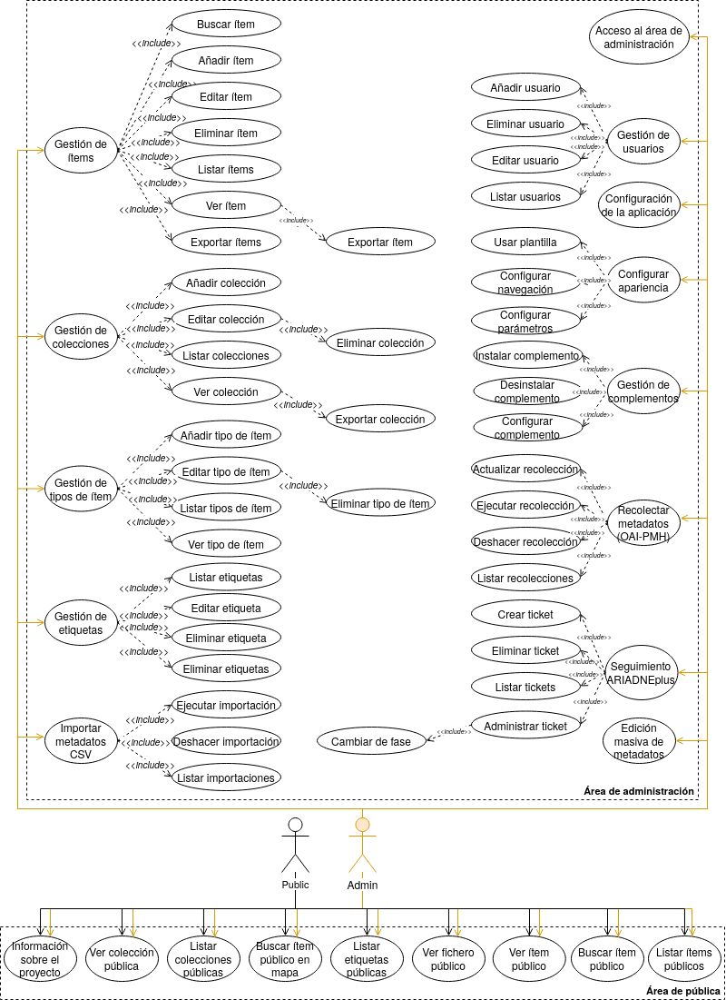

============================
Especificación de requisitos
============================

Introducción
------------
En este anexo se especifican todos los requisitos funcionales y no funcionales de la aplicación *software* propuesta, incluyendo todos aquellos que han sido aportados por complementos (*plugins*).

La aplicación se divide en dos áreas bien diferenciadas, una pública (*frontend*) y otra de administración (*backend*). Por este motivo, se llevará a cabo una especificación de requisitos para cada área.

Objetivos generales
-------------------
Los objetivos generales que se desean alcanzar con el desarrollo del proyecto son los siguientes:

- Proporcionar una infraestructura *software* que permita:

   - Gestionar los (meta)datos del CENIEH en la integración con ARIADNEplus.
   - Transformar el esquema de (meta)datos de origen (CENIEH) a un esquema estandarizado compatible con ARIADNEplus.
   - Compartir los datos de forma que estos sean accesibles desde el exterior.
   - Facilitar la integración de los (meta)datos en ARIADNEplus.

Catálogo de requisitos
----------------------
En este apartado se muestran todos los requisitos considerados para alcanzar todos y cada uno de los objetivos generales del proyecto.

Requisitos funcionales del área pública
~~~~~~~~~~~~~~~~~~~~~~~~~~~~~~~~~~~~~~~

- **RFAP-1 Búsqueda de ítems públicos**: el usuario debe ser capaz de hacer una búsqueda sobre los ítems públicos almacenados en la plataforma.
- **RFAP-2 Visualización de un ítem público**: el usuario debe poder visualizar el contenido (metadatos, tags, localización y/o ficheros) de un determinado ítem público.

   - **RFAP-2.1 Ver fichero**: el usuario debe poder visualizar la información del fichero asociado a un determinado ítem público.

- **RFAP-3 Listado de ítems públicos**: el usuario debe poder listar todos los ítems públicos de la plataforma.
- **RFAP-4 Listado de colecciones públicas**: el usuario debe poder listar todas las colecciones públicas almacenadas en la plataforma.
- **RFAP-5 Visualización de una colección pública**: el usuario debe poder visualizar una colección pública.
- **RFAP-6 Listado de etiquetas públicas**: el usuario debe poder listar todas las etiquetas existentes en la plataforma.
- **RFAP-7 Búsqueda de ítems por localización**: el usuario debe poder buscar un ítem tomando como referencia su ubicación.
- **RFAP-8 Información del proyecto**: el usuario debe poder conocer más información acerca del proyecto.

Requisitos no funcionales del área pública
~~~~~~~~~~~~~~~~~~~~~~~~~~~~~~~~~~~~~~~~~~

- **RNFAP-1 Usabilidad**: la aplicación debe presentar los datos de la forma más sencilla posible, evitando así que el usuario se pierda en el proceso de búsqueda o visualización.
- **RNFAP-2 Internacionalización**: la aplicación debe contar con un sistema que permita mostrar el contenido de la interfaz en múltiples idiomas.
- **RNFAP-3 Integridad**: la aplicación debe mostrar los datos tal y como se publicaron desde el área de administración, sin ningún tipo de alteración.

Requisitos funcionales del área de administración
~~~~~~~~~~~~~~~~~~~~~~~~~~~~~~~~~~~~~~~~~~~~~~~~~

- **RFAA-1 Acceso al área de administración**: la aplicación debe controlar el acceso al área de administración.

- **RFAA-2 Gestión de ítems**: la aplicación tiene que ser capaz de gestionar ítems.

   - **RFAA-2.1 Añadir ítem**: el operario debe poder añadir un nuevo ítem compuesto por metadatos, ficheros, etiquetas y una localización. Además, podrá asociarse a una colección, ser público o privado y ser destacado o normal.
   - **RFAA-2.2 Editar ítem**: el operario debe poder editar el contenido de un ítem ya existente.
   - **RFAA-2.3 Eliminar ítem**: el operario debe poder eliminar un ítem ya existente.
   - **RFAA-2.4 Listar ítems**: el operario debe poder listar todos los ítems existentes.
   - **RFAA-2.5 Ver ítem**: el operario debe poder visualizar todo el contenido asociado a un ítem.

      - **RFAA-2.5.1 Exportar ítem**: el operario debe poder exportar un ítem ya existente.

   - **RFAA-2.6 Buscar ítems**: el operario debe poder buscar un ítem de entre todos los existentes.
   - **RFAA-2.7 Exportar ítems**: el operario debe poder exportar varios ítems existentes a la vez.

- **RFAA-3 Gestión de colecciones**: la aplicación tiene que ser capaz de gestionar colecciones de ítems.

   - **RFAA-3.1 Añadir colección**: el operario debe poder añadir una colección nueva compuesta por metadatos o ficheros. Además, podrá ser pública o privada y ser destacada o normal.
   - **RFAA-3.2 Editar colección**: el operario debe poder editar el contenido de una colección ya existente.

      - **RFAA-3.2.1 Eliminar colección**: el operario debe poder eliminar una colección ya existente.

   - **RFAA-3.3 Listar colecciones**: el operario debe poder listar todas las colecciones existentes.
   - **RFAA-3.4 Ver colección**: el operario debe poder visualizar toda la información relativa a una colección.

      - **RFAA-3.4.1 Exportar colección**: el operario debe poder exportar una colección ya existente.

- **RFAA-4 Gestión de tipos de ítem**: la aplicación tiene que ser capaz de gestionar tipos de ítem.

   - **RFAA-4.1 Añadir tipo de ítem**: el operario debe poder añadir un tipo de ítem con los elementps apropiados.
   - **RFAA-4.2 Editar tipo de ítem**: el operario debe poder editar un tipo de ítem ya existente.

      - **RFAA-4.2.1 Eliminar tipo de ítem**: el operario debe poder eliminar un tipo de ítem ya existente.

   - **RFAA-4.3 Listar tipos de ítem**: el operario debe poder listar todos los tipos de ítem existentes.
   - **RFAA-4.4 Ver tipo de ítem**: el operario debe poder visualizar toda la información relativa a un tipo de ítem.

- **RFAA-5 Gestión de etiquetas**: la aplicación tiene que ser capaz de gestionar etiquetas.

   - **RFAA-5.1 Editar etiqueta**: el operario debe poder editar una etiqueta ya existente.
   - **RFAA-5.2 Eliminar etiqueta**: el operario debe poder eliminar una etiqueta ya existente.
   - **RFAA-5.3 Listar etiquetas**: el operario debe poder eliminar una etiqueta ya existente.
   - **RFAA-5.4 Eliminar etiquetas**: el operario debe poder eliminar varias etiquetas ya existentes.

- **RFAA-6 Importación de metadatos CSV**: la aplicación tiene que ser capaz de importar metadatos en formato CSV.

   - **RFAA-6.1 Ejecutar importación CSV**: el operario debe poder ejecutar una importación de metadatos en formato CSV.
   - **RFAA-6.2 Listar importaciones CSV**: el operario debe poder listar todas las importaciones ejecutadas.

      - **RFAA-6.2.1 Deshacer importación CSV**: el operario debe poder deshacer una importación ya ejecutada.

- **RFAA-7 Recolección de metadatos (OAI-PMH)**: la aplicación tiene que ser capaz de recolectar metadatos a través del protocolo OAI-PMH.

   - **RFAA-7.1 Ejecutar recolección**: el operario debe poder ejecutar una recolección a través del protocolo OAI-PMH.
   - **RFAA-7.2 Actualizar recolección**: el operario debe poder actualizar una recolección ya ejecutada.
   - **RFAA-7.3 Listar recolecciones**: el operario debe poder listar todas las recolecciones ejecutadas.
   - **RFAA-7.4 Ver recolección**: el operario debe poder visualizar toda la información relativa a una recolección.

      - **RFAA-7.4.1 Deshacer recolección**: el operario debe poder deshacer una recolección ya ejecutada.

- **RFAA-8 Seguimiento ARIADNEplus**: el operario tiene que ser capaz de realizar un seguimiento del proceso de integración de datos en ARIADNEplus.

   - **RFAA-8.1 Crear ticket de seguimiento**: el operario debe poder crear un ticket de seguimiento.
   - **RFAA-8.2 Eliminar ticket de seguimiento**: el operario debe poder eliminar un ticket de seguimiento ya existente.
   - **RFAA-8.3 Administrar ticket de seguimiento**: el operario debe poder administrar un ticket de seguimiento ya existente.

      - **RFAA-8.3.1 Cambiar de fase**: el operario debe poder cambiar de fase de un ticket existente.

- **RFAA-9 Edición masiva de metadatos**: el operario debe ser capaz de editar una gran cantidad de metadatos a la vez.

- **RFAA-10 Gestión de complementos**: el operario debe ser capaz de gestionar los complementos existentes en la aplicación.

   - **RFAA-10.1 Instalar complemento**: el operario debe poder instalar un complemento existente.
   - **RFAA-10.2 Configurar complemento**: el operario debe poder configurar un complemento ya instalado.
   - **RFAA-10.3 Desinstalar complemento**: el operario debe poder desinstalar un complemento ya instalado.

- **RFAA-11 Configuración de la apariencia**: el operario debe ser capaz de configurar la apariencia de la aplicación.

   - **RFAA-11.1 Usar plantilla**: el operario debe poder instalar (usar) una plantilla/tema existente.
   - **RFAA-11.2 Configurar plantilla**:  el operario debe poder configurar la plantilla instalada (usada).
   - **RFAA-11.3 Configurar parámetros**:  el operario debe poder configurar parámetros relacionados con la apariencia (número de ítems por página, entradas de navegación, etc.).

- **RFAA-12 Configuración de la aplicación**: el operario debe ser capaz de configurar aspectos de la aplicación.
- **RFAA-13 Gestión de usuarios**: la aplicación tiene que ser capaz de gestionar usuarios.

   - **RFAA-13.1 Añadir usuario**: el operario debe ser capaz de crear un nuevo usuario.
   - **RFAA-13.2 Editar usuario**: el operario debe ser capaz de editar un usuario existente.
   - **RFAA-13.3 Eliminar usuario**: el operario debe ser capaz de eliminar un usuario existente.
   - **RFAA-13.4 Listar usuarios**: el operario debe poder listar todas los usuarios existentes.

Requisitos no funcionales del área de administración
~~~~~~~~~~~~~~~~~~~~~~~~~~~~~~~~~~~~~~~~~~~~~~~~~~~~

- **RNFAA-1 Usabilidad**: la aplicación debe contar con una estructura clara y sencilla, que permita al operario desplazarse por todas las funcionalidades disponibles a través de pestañas o apartados bien posicionados.
- **RNFAA-2 Seguridad**: los datos de la aplicación solo podrán ser administrados o visualizados por usuarios autorizados.
- **RNFAA-3 Extensibilidad**: la aplicación debe contar con un sistema que permita agregar características y/o funcionalidades adicionales exigidas por los operarios.
- **RNFAA-4 Disponibilidad**: la aplicación debe ser accesible desde cualquier navegador común.
- **RNFAA-5 Robustez**: la aplicación debe estar preparada para un funcionamiento correcto ante excepciones que pudieran surgir.
- **RNFAA-6 Rendimiento y Escalabilidad**: la aplicación debe estar a la altura en cuanto a tiempos de respuesta y debe ser capaz de prestar servicio de acuerdo al tipo y tamaño de datos para el que ha sido concebido.
- **RNFAA-7 Mantenibilidad**: la aplicación debe ser de fácil instalación y mantenimiento, es decir, que cuente con código y diseño documentado y además pueda ser actualizada a versiones más modernas.
- **RNFAA-8 Estandarización**: la aplicación debe hacer uso de estándares internacionalmente aceptados para el almacenamiento de (meta)datos.
- **RNFAA-9 Interoperabilidad**: la aplicación debe permitir intercambiar información con otros sistemas de la misma índole.

Especificación de requisitos
----------------------------
A continuación se mostrará el diagrama de casos de usos que agrupa cada uno de los requisitos funcionales expuestos en el catálogo de requisitos. Además, se tratará cada uno de ellos por separado.

   Vista de la página de configuración principal de la aplicación, apartado "Search".

Actores
~~~~~~~

Se han considerado dos actores principales:

- **Public**: usuarios sin acceso al área de administración.
- **Admin**: usuarios con acceso al área de administración.

Casos de uso
~~~~~~~~~~~~

+--------------------------+--------------------------------------------------------------------------------------------+
| **CU-01**                | **Buscar ítems públicos**                                                                  |
+==========================+============================================================================================+
| **Versión**              | 1.0                                                                                        |
+--------------------------+--------------------------------------------------------------------------------------------+
| **Autor**                | Gonzalo Cuesta Marín                                                                       |
+--------------------------+--------------------------------------------------------------------------------------------+
| **Requisitos asociados** | RFAP-1                                                                                     |
+--------------------------+--------------------------------------------------------------------------------------------+
| **Descripción**          | Permite al usuario buscar objetos digitales públicos en la plataforma.                     |
+--------------------------+--------------------------------------------------------------------------------------------+
| **Precondición**         | Servidor y base de datos disponible.                                                       |
+--------------------------+--------------------------------------------------------------------------------------------+
| **Acciones**             | 1. El usuario introduce texto sobre el campo "Search".                                     |
|                          |                                                                                            |
|                          | 2. El usuario presiona la tecla "Enter".                                                   |
|                          |                                                                                            |
|                          | 3. Se muestran todos los resultados (ítems).                                               |
+--------------------------+--------------------------------------------------------------------------------------------+
| **Postcondición**        | Todos los ítems resultantes presentan coincidencias con el campo de texto introducido.     |
+--------------------------+--------------------------------------------------------------------------------------------+
| **Excepciones**          | - Ningún ítem encontrado (mensaje).                                                        |
+--------------------------+--------------------------------------------------------------------------------------------+
| **Importancia**          | Alta                                                                                       |
+--------------------------+--------------------------------------------------------------------------------------------+

+--------------------------+--------------------------------------------------------------------------------------------------+
| **CU-02**                | **Listar ítems públicos**                                                                        |
+==========================+==================================================================================================+
| **Versión**              | 1.0                                                                                              |
+--------------------------+--------------------------------------------------------------------------------------------------+
| **Autor**                | Gonzalo Cuesta Marín                                                                             |
+--------------------------+--------------------------------------------------------------------------------------------------+
| **Requisitos asociados** | RFAP-3                                                                                           |
+--------------------------+--------------------------------------------------------------------------------------------------+
| **Descripción**          | Permite al usuario ver una lista de todos los ítems públicos en la plataforma.                   |
+--------------------------+--------------------------------------------------------------------------------------------------+
| **Precondición**         | Servidor y base de datos disponible.                                                             |
+--------------------------+--------------------------------------------------------------------------------------------------+
| **Acciones**             | 1. El usuario pulsa sobre el botón "Menu".                                                       |
|                          |                                                                                                  |
|                          | 2. Se muestran todas las entradas del menú de navegación público.                                |
|                          |                                                                                                  |
|                          | 3. El usuario pulsa sobre la entrada "Browse Items".                                             |
|                          |                                                                                                  |
|                          | 4. Se muestra una lista con todos los ítems públicos de la plataforma.                           |
+--------------------------+--------------------------------------------------------------------------------------------------+
| **Postcondición**        | El número de ítems mostrado es igual al número de ítems públicos almacenado en la base de datos. |
+--------------------------+--------------------------------------------------------------------------------------------------+
| **Excepciones**          | - No existe ningún ítem público (vista especial).                                                |
+--------------------------+--------------------------------------------------------------------------------------------------+
| **Importancia**          | Alta                                                                                             |
+--------------------------+--------------------------------------------------------------------------------------------------+

+--------------------------+--------------------------------------------------------------------------------------+
| **CU-03**                | **Listar colecciones públicas**                                                      |
+==========================+======================================================================================+
| **Versión**              | 1.0                                                                                  |
+--------------------------+--------------------------------------------------------------------------------------+
| **Autor**                | Gonzalo Cuesta Marín                                                                 |
+--------------------------+--------------------------------------------------------------------------------------+
| **Requisitos asociados** | RFAP-4                                                                               |
+--------------------------+--------------------------------------------------------------------------------------+
| **Descripción**          | Permite al usuario ver una lista de todas las colecciones públicas en la plataforma. |
+--------------------------+--------------------------------------------------------------------------------------+
| **Precondición**         | Base de datos disponible.                                                            |
+--------------------------+--------------------------------------------------------------------------------------+
| **Acciones**             | 1. El usuario pulsa sobre el botón "Menu".                                           |
|                          |                                                                                      |
|                          | 2. Se muestran todas las entradas del menú de navegación público.                    |
|                          |                                                                                      |
|                          | 3. El usuario pulsa sobre la entrada "Browse Collections".                           |
|                          |                                                                                      |
|                          | 4. Se muestra una lista con todas las colecciones públicas de la plataforma.         |
+--------------------------+--------------------------------------------------------------------------------------+
| **Postcondición**        |                                                                                      |
+--------------------------+--------------------------------------------------------------------------------------+
| **Excepciones**          | - No existe ninguna colección pública (vista especial).                              |
+--------------------------+--------------------------------------------------------------------------------------+
| **Importancia**          | Alta                                                                                 |
+--------------------------+--------------------------------------------------------------------------------------+

+--------------------------+---------------------------------------------------------------------------------------+
| **CU-04**                | **Listar etiquetas públicas**                                                         |
+==========================+=======================================================================================+
| **Versión**              | 1.0                                                                                   |
+--------------------------+---------------------------------------------------------------------------------------+
| **Autor**                | Gonzalo Cuesta Marín                                                                  |
+--------------------------+---------------------------------------------------------------------------------------+
| **Requisitos asociados** | RFAP-6                                                                                |
+--------------------------+---------------------------------------------------------------------------------------+
| **Descripción**          | Permite al usuario ver una lista de todas las etiquetas almacenadas en la plataforma. |
+--------------------------+---------------------------------------------------------------------------------------+
| **Precondición**         | Base de datos disponible.                                                             |
+--------------------------+---------------------------------------------------------------------------------------+
| **Acciones**             | 1. El usuario pulsa sobre el botón "Browse all tags".                                 |
|                          |                                                                                       |
|                          | 2. Se muestra una lista con todas las etiquetas almacenadas en la plataforma.         |
+--------------------------+---------------------------------------------------------------------------------------+
| **Postcondición**        |                                                                                       |
+--------------------------+---------------------------------------------------------------------------------------+
| **Excepciones**          | - No existe ninguna etiqueta (vista especial).                                        |
+--------------------------+---------------------------------------------------------------------------------------+
| **Importancia**          | Alta                                                                                  |
+--------------------------+---------------------------------------------------------------------------------------+

+--------------------------+--------------------------------------------------------------------------------------------------+
| **CU-05**                | **Ver ítem público**                                                                             |
+==========================+==================================================================================================+
| **Versión**              | 1.0                                                                                              |
+--------------------------+--------------------------------------------------------------------------------------------------+
| **Autor**                | Gonzalo Cuesta Marín                                                                             |
+--------------------------+--------------------------------------------------------------------------------------------------+
| **Requisitos asociados** | RFAP-2, RFAP-2.1                                                                                 |
+--------------------------+--------------------------------------------------------------------------------------------------+
| **Descripción**          | Permite al usuario visualizar un ítem público existente.                                         |
+--------------------------+--------------------------------------------------------------------------------------------------+
| **Precondición**         | Servidor y base de datos disponible.                                                             |
|                          |                                                                                                  |
|                          | El ítem público a visualizar existe.                                                             |
+--------------------------+--------------------------------------------------------------------------------------------------+
| **Acciones**             | 1. El usuario pulsa sobre el título del ítem.                                                    |
|                          |                                                                                                  |
|                          | 2. Se muestra información general del ítem (metadatos, tags, localización y cita bibliográfica). |
+--------------------------+--------------------------------------------------------------------------------------------------+
| **Postcondición**        |                                                                                                  |
+--------------------------+--------------------------------------------------------------------------------------------------+
| **Excepciones**          | - El ítem no existe (mensaje).                                                                   |
+--------------------------+--------------------------------------------------------------------------------------------------+
| **Importancia**          | Alta                                                                                             |
+--------------------------+--------------------------------------------------------------------------------------------------+

+--------------------------+---------------------------------------------------------------------------+
| **CU-06**                | **Ver colección pública**                                                 |
+==========================+===========================================================================+
| **Versión**              | 1.0                                                                       |
+--------------------------+---------------------------------------------------------------------------+
| **Autor**                | Gonzalo Cuesta Marín                                                      |
+--------------------------+---------------------------------------------------------------------------+
| **Requisitos asociados** | RFAP-5                                                                    |
+--------------------------+---------------------------------------------------------------------------+
| **Descripción**          | Permite al usuario visualizar un ítem público existente.                  |
+--------------------------+---------------------------------------------------------------------------+
| **Precondición**         | Servidor y base de datos disponible.                                      |
|                          |                                                                           |
|                          | La colección pública a visualizar existe.                                 |
+--------------------------+---------------------------------------------------------------------------+
| **Acciones**             | 1. El usuario pulsa sobre el título de la colección.                      |
|                          |                                                                           |
|                          | 2. Se muestra el título de la colección.                                  |
|                          |                                                                           |
|                          | 3. Se muestra un botón para acceder a la lista de ítems de la colección.  |
+--------------------------+---------------------------------------------------------------------------+
| **Postcondición**        |                                                                           |
+--------------------------+---------------------------------------------------------------------------+
| **Excepciones**          | - La colección no existe (mensaje).                                       |
+--------------------------+---------------------------------------------------------------------------+
| **Importancia**          | Alta                                                                      |
+--------------------------+---------------------------------------------------------------------------+

+--------------------------+------------------------------------------------------------------------------------+
| **CU-07**                | **Ver fichero público**                                                            |
+==========================+====================================================================================+
| **Versión**              | 1.0                                                                                |
+--------------------------+------------------------------------------------------------------------------------+
| **Autor**                | Gonzalo Cuesta Marín                                                               |
+--------------------------+------------------------------------------------------------------------------------+
| **Requisitos asociados** | RFAP-2.1                                                                           |
+--------------------------+------------------------------------------------------------------------------------+
| **Descripción**          | Permite al usuario visualizar el fichero de un ítem público existente.             |
+--------------------------+------------------------------------------------------------------------------------+
| **Precondición**         | Servidor y base de datos disponible.                                               |
|                          |                                                                                    |
|                          | El ítem público asociado al fichero existe.                                        |
+--------------------------+------------------------------------------------------------------------------------+
| **Acciones**             | 1. El usuario pulsa sobre el nombre del fichero.                                   |
|                          |                                                                                    |
|                          | 2. Se muestra información general del fichero (nombre, metadatos e ítem asociado). |
+--------------------------+------------------------------------------------------------------------------------+
| **Postcondición**        |                                                                                    |
+--------------------------+------------------------------------------------------------------------------------+
| **Excepciones**          | - El fichero no existe (mensaje).                                                  |
+--------------------------+------------------------------------------------------------------------------------+
| **Importancia**          | Alta                                                                               |
+--------------------------+------------------------------------------------------------------------------------+

+--------------------------+--------------------------------------------------------------------------------------------------+
| **CU-08**                | **Buscar ítem público en mapa**                                                                  |
+==========================+==================================================================================================+
| **Versión**              | 1.0                                                                                              |
+--------------------------+--------------------------------------------------------------------------------------------------+
| **Autor**                | Gonzalo Cuesta Marín                                                                             |
+--------------------------+--------------------------------------------------------------------------------------------------+
| **Requisitos asociados** | RFAP-7                                                                                           |
+--------------------------+--------------------------------------------------------------------------------------------------+
| **Descripción**          | Permite al usuario buscar objetos digitales públicos en la plataforma.                           |
+--------------------------+--------------------------------------------------------------------------------------------------+
| **Precondición**         | Servidor y base de datos disponible.                                                             |
+--------------------------+--------------------------------------------------------------------------------------------------+
| **Acciones**             | 1. El usuario se desplaza a la localización deseada arrastrando el cursor por el mapa.           |
|                          |                                                                                                  |
|                          | 2. El usuario ajusta el zoom para una búsqueda más precisa (opcional).                           |
|                          |                                                                                                  |
|                          | 3. El usuario cambia la plantilla del mapa (opcional).                                           |
|                          |                                                                                                  |
|                          | 4. Se muestran los ítems, en forma de marcador, que estén ubicados en la zona geográfica fijada. |
|                          |                                                                                                  |
|                          | 5. El usuario pulsa sobre un marcador (ítem).                                                    |
|                          |                                                                                                  |
|                          | 6. Se muestra un bocadillo con información mínima del ítem (título).                             |
+--------------------------+--------------------------------------------------------------------------------------------------+
| **Postcondición**        |                                                                                                  |
+--------------------------+--------------------------------------------------------------------------------------------------+
| **Excepciones**          |                                                                                                  |
+--------------------------+--------------------------------------------------------------------------------------------------+
| **Importancia**          | Alta                                                                                             |
+--------------------------+--------------------------------------------------------------------------------------------------+

+--------------------------+-------------------------------------------------------------------+
| **CU-09**                | **Información del proyecto**                                      |
+==========================+===================================================================+
| **Versión**              | 1.0                                                               |
+--------------------------+-------------------------------------------------------------------+
| **Autor**                | Gonzalo Cuesta Marín                                              |
+--------------------------+-------------------------------------------------------------------+
| **Requisitos asociados** | RFAP-8                                                            |
+--------------------------+-------------------------------------------------------------------+
| **Descripción**          | Permite al usuario conocer más información acerca del proyecto.   |
+--------------------------+-------------------------------------------------------------------+
| **Precondición**         | Base de datos disponible.                                         |
+--------------------------+-------------------------------------------------------------------+
| **Acciones**             | 1. El usuario pulsa sobre el botón "Menu".                        |
|                          |                                                                   |
|                          | 2. Se muestran todas las entradas del menú de navegación público. |
|                          |                                                                   |
|                          | 3. El usuario pulsa sobre la entrada "About".                     |
|                          |                                                                   |
|                          | 4. Se muestran la información general del proyecto                |
+--------------------------+-------------------------------------------------------------------+
| **Postcondición**        |                                                                   |
+--------------------------+-------------------------------------------------------------------+
| **Excepciones**          |                                                                   |
+--------------------------+-------------------------------------------------------------------+
| **Importancia**          | Media                                                             |
+--------------------------+-------------------------------------------------------------------+

+-------------------------+----------------------------------------------------------------------------------------------+
| **CU-10**               | **Acceso al área de administración**                                                         |
+=========================+==============================================================================================+
| **Versión**             | 1.0                                                                                          |
+-------------------------+----------------------------------------------------------------------------------------------+
| **Autor**               | Gonzalo Cuesta Marín                                                                         |
+-------------------------+----------------------------------------------------------------------------------------------+
| **Requisitos asociados**| RFAA-1                                                                                       |
+-------------------------+----------------------------------------------------------------------------------------------+
| **Descripción**         | Permite al usuario acceder al área de administración.                                        |
+-------------------------+----------------------------------------------------------------------------------------------+
| **Precondición**        | Servidor y base de datos disponible.                                                         |
+-------------------------+----------------------------------------------------------------------------------------------+
| **Acciones**            | 1. Se muestra al usuario el formulario de inicio de sesión.                                  |
|                         |                                                                                              |
|                         | 2. El usuario introduce su nombre de usuario.                                                |
|                         |                                                                                              |
|                         | 3. El usuario introduce su contraseña de usuario.                                            |
|                         |                                                                                              |
|                         | 4. El usuario pulsa sobre el botón "Login".                                                  |
|                         |                                                                                              |
|                         | 5. Si los datos son correctos, se traslada al usuario al interior del área de administración.|
+-------------------------+----------------------------------------------------------------------------------------------+
| **Postcondición**       | El usuario accede a la pantalla principal del área de administración                         |
+-------------------------+----------------------------------------------------------------------------------------------+
| **Excepciones**         | -  Nombre de usuario o contraseña incorrectos (mensaje).                                     |
|                         |                                                                                              |
|                         | -  Usuario inactivo (mensaje).                                                               |
+-------------------------+----------------------------------------------------------------------------------------------+
| **Importancia**         | Alta                                                                                         |
+-------------------------+----------------------------------------------------------------------------------------------+

+--------------------------+--------------------------------------------------------------------------------------------+
| **CU-11**                | **Gestión de ítems**                                                                       |
+==========================+============================================================================================+
| **Versión**              | 1.0                                                                                        |
+--------------------------+--------------------------------------------------------------------------------------------+
| **Autor**                | Gonzalo Cuesta Marín                                                                       |
+--------------------------+--------------------------------------------------------------------------------------------+
| **Requisitos asociados** | RFAA-2, RFAA-2.1, RFAA-2.2, RFAA-2.3, RFAA-2.4, RFAA-2.5, RFAA-2.5.1, RFAA-2.6, RFAA-2.7   |
+--------------------------+--------------------------------------------------------------------------------------------+
| **Descripción**          | Permite al usuario gestionar ítems.                                                        |
+--------------------------+--------------------------------------------------------------------------------------------+
| **Precondición**         | Servidor y base de datos disponible.                                                       |
|                          |                                                                                            |
|                          | Sesión iniciada en área de administración.                                                 |
+--------------------------+--------------------------------------------------------------------------------------------+
| **Acciones**             | 1. El usuario pulsa sobre la entrada "Items" del submenú "Data Manager" del menú principal.|
|                          |                                                                                            |
|                          | 2. Se listan los ítems.                                                                    |
|                          |                                                                                            |
|                          | 3. Por cada ítem se da la opción de ver en detalle, editar o eliminar.                     |
|                          |                                                                                            |
|                          | 4. Se muestra un botón para añadir un ítem.                                                |
|                          |                                                                                            |
|                          | 5. Se muestra un botón y un desplegable para buscar o filtrar ítems.                       |
|                          |                                                                                            |
|                          | 6. Se muestran múltiples formatos de exportación disponibles.                              |
+--------------------------+--------------------------------------------------------------------------------------------+
| **Postcondición**        | El número de ítems listado es igual al número de ítems almacenado en la base de datos      |
+--------------------------+--------------------------------------------------------------------------------------------+
| **Excepciones**          | - Error al cargar ítems (mensaje).                                                         |
|                          |                                                                                            |
|                          | - No existe ningún mensaje (vista especial)                                                |
+--------------------------+--------------------------------------------------------------------------------------------+
| **Importancia**          | Alta                                                                                       |
+--------------------------+--------------------------------------------------------------------------------------------+

+--------------------------+---------------------------------------------------------------------------------------------------------------------------------------------+
| **CU-12**                | **Añadir ítem**                                                                                                                             |
+==========================+=============================================================================================================================================+
| **Versión**              | 1.0                                                                                                                                         |
+--------------------------+---------------------------------------------------------------------------------------------------------------------------------------------+
| **Autor**                | Gonzalo Cuesta Marín                                                                                                                        |
+--------------------------+---------------------------------------------------------------------------------------------------------------------------------------------+
| **Requisitos asociados** | RFAA-2.1                                                                                                                                    |
+--------------------------+---------------------------------------------------------------------------------------------------------------------------------------------+
| **Descripción**          | Permite al usuario añadir un nuevo ítem.                                                                                                    |
+--------------------------+---------------------------------------------------------------------------------------------------------------------------------------------+
| **Precondición**         | Servidor y base de datos disponible.                                                                                                        |                                                                            
+--------------------------+---------------------------------------------------------------------------------------------------------------------------------------------+
| **Acciones**             | 1. El usuario pulsa sobre el botón "Add an Item".                                                                                           |
|                          |                                                                                                                                             |
|                          | 2. Se muestra al usuario una ventana con varios formularios divididos en pestañas y varios botones.                                         |
|                          |                                                                                                                                             |
|                          | 3. El usuario pulsa sobre la pestaña "Dublin Core" para añadir metadatos estandarizados (opcional).                                         |
|                          |                                                                                                                                             |
|                          | 4. El usuario pulsa sobre la pestaña "Item Type Metadata" para añadir metadatos específicos (opcional).                                     |
|                          |                                                                                                                                             |
|                          | 5. El usuario pulsa sobre la pestaña "Files" para añadir ficheros (opcional).                                                               |
|                          |                                                                                                                                             |
|                          | 6. El usuario pulsa sobre la pestaña "Tags" para añadir etiquetas (opcional).                                                               |
|                          |                                                                                                                                             |
|                          | 7. El usuario pulsa sobre la pestaña "Map" para añadir una localización (opcional).                                                         |
|                          |                                                                                                                                             |
|                          | 8. El usuario marca la casilla "Public" para hacerlo público (opcional).                                                                    |
|                          |                                                                                                                                             |
|                          | 9. El usuario marca la casilla "Feature" para hacerlo destacado (opcional).                                                                 |
|                          |                                                                                                                                             |
|                          | 10. El usuario selecciona la colección a la que pertenece (opcional).                                                                       |
|                          |                                                                                                                                             |
|                          | 11. El usuario pulsa el botón "Add Item".                                                                                                   |
|                          |                                                                                                                                             |
|                          | 12. Si no hay ningún error, se guarda un nuevo ítem junto a los demás objetos asociados.                                                   |
+--------------------------+---------------------------------------------------------------------------------------------------------------------------------------------+
| **Postcondición**        | Existe un ítem más en la base de datos.                                                                                                     |
+--------------------------+---------------------------------------------------------------------------------------------------------------------------------------------+
| **Excepciones**          | - Error al crear ítem (mensaje).                                                                                                            |
|                          |                                                                                                                                             |
|                          | - Error con el tipo de fichero introducido (mensaje).                                                                                       |
+--------------------------+---------------------------------------------------------------------------------------------------------------------------------------------+
| **Importancia**          | Alta                                                                                                                                        |
+--------------------------+---------------------------------------------------------------------------------------------------------------------------------------------+

+--------------------------+------------------------------------------------------------------------------------------------------------------------------------------------+
| **CU-13**                | **Editar ítem**                                                                                                                                |
+==========================+================================================================================================================================================+
| **Versión**              | 1.0                                                                                                                                            |
+--------------------------+------------------------------------------------------------------------------------------------------------------------------------------------+
| **Autor**                | Gonzalo Cuesta Marín                                                                                                                           |
+--------------------------+------------------------------------------------------------------------------------------------------------------------------------------------+
| **Requisitos asociados** | RFAA-2.2                                                                                                                                       |
+--------------------------+------------------------------------------------------------------------------------------------------------------------------------------------+
| **Descripción**          | Permite al usuario editar un ítem existente.                                                                                                   |
+--------------------------+------------------------------------------------------------------------------------------------------------------------------------------------+
| **Precondición**         | Servidor y base de datos disponible.                                                                                                           |
|                          |                                                                                                                                                |
|                          | El ítem a editar existe.                                                                                                                       |
+--------------------------+------------------------------------------------------------------------------------------------------------------------------------------------+
| **Acciones**             | 1. El usuario pulsa sobre el elemento "Edit" del ítem que va a editar.                                                                         |
|                          |                                                                                                                                                |
|                          | 2. Se muestra al usuario una ventana con varios formularios divididos en pestañas y tres botones (guardar, ver en área pública y eliminar).    |                                                                                                                                                                               
|                          |                                                                                                                                                |
|                          | 3. El usuario pulsa sobre la pestaña "Dublin Core" para editar metadatos estandarizados (opcional).                                            |
|                          |                                                                                                                                                |
|                          | 4. El usuario pulsa sobre la pestaña "Item Type Metadata" para editar metadatos específicos (opcional).                                        |
|                          |                                                                                                                                                |
|                          | 4. El usuario pulsa sobre la pestaña "Files" para editar ficheros (opcional).                                                                  |
|                          |                                                                                                                                                |
|                          | 5. El usuario pulsa sobre la pestaña "Map" para editar una localización (opcional).                                                            |
|                          |                                                                                                                                                |
|                          | 6. El usuario modifica el estado de la casilla "Public" para hacerlo público/privado (opcional).                                               |
|                          |                                                                                                                                                |
|                          | 7. El usuario modifica el estado de la casilla "Feature" para hacerlo o no destacado (opcional).                                               |
|                          |                                                                                                                                                |
|                          | 8. El usuario modifica la colección a la que pertenece (opcional).                                                                             |
|                          |                                                                                                                                                |
|                          | 9.  El usuario pulsa el botón "Save Changes".                                                                                                  |
|                          |                                                                                                                                                |
|                          | 10. Si no hay ningún error, se actualiza el ítem junto a todos sus objetos asociados (metadatos/ficheros/etiquetas/localización).              |
+--------------------------+------------------------------------------------------------------------------------------------------------------------------------------------+
| **Postcondición**        | La información del ítem y de todos sus objetos asociados ha sido actualizada.                                                                  |
+--------------------------+------------------------------------------------------------------------------------------------------------------------------------------------+
| **Excepciones**          | - Error al guardar ítem (mensaje).                                                                                                             |
|                          |                                                                                                                                                |
|                          | - Error con el tipo de fichero introducido (mensaje).                                                                                          |
+--------------------------+------------------------------------------------------------------------------------------------------------------------------------------------+
| **Importancia**          | Alta                                                                                                                                           |
+--------------------------+------------------------------------------------------------------------------------------------------------------------------------------------+

+--------------------------+-----------------------------------------------------------------------------------------------------+
| **CU-14**                | **Eliminar ítem**                                                                                   |
+==========================+=====================================================================================================+
| **Versión**              | 1.0                                                                                                 |
+--------------------------+-----------------------------------------------------------------------------------------------------+
| **Autor**                | Gonzalo Cuesta Marín                                                                                |
+--------------------------+-----------------------------------------------------------------------------------------------------+
| **Requisitos asociados** | RFAA-2.3                                                                                            |
+--------------------------+-----------------------------------------------------------------------------------------------------+
| **Descripción**          | Permite al usuario eliminar un ítem existente.                                                      |
+--------------------------+-----------------------------------------------------------------------------------------------------+
| **Precondición**         | Servidor y base de datos disponible.                                                                |
|                          |                                                                                                     |
|                          | El ítem a eliminar existe.                                                                          |
+--------------------------+-----------------------------------------------------------------------------------------------------+
| **Acciones**             | 1. El usuario pulsa sobre "Delete".                                                                 |
|                          |                                                                                                     |
|                          | 2. Se muestra al usuario un mensaje de confirmación.                                                |
|                          |                                                                                                     |
|                          | 3. El usuario pulsa sobre el botón "Delete" para confirmar la eliminación.                          |
|                          |                                                                                                     |
|                          | 4. Se elimina el ítem de la vista.                                                                  |
|                          |                                                                                                     |
|                          | 5. Se informa al usuario que el ítem ha sido eliminado correctamente.                               |
+--------------------------+-----------------------------------------------------------------------------------------------------+
| **Postcondición**        | El ítem y sus objetos asociados (metadatos, ficheros y localización) no existen en la base de datos.|
+--------------------------+-----------------------------------------------------------------------------------------------------+
| **Excepciones**          | - Error al eliminar ítem (mensaje).                                                                 |
+--------------------------+-----------------------------------------------------------------------------------------------------+
| **Importancia**          | Alta                                                                                                |
+--------------------------+-----------------------------------------------------------------------------------------------------+

+-------------------------+---------------------------------------------------------------------------------------------------+
| **CU-15**               | **Listar ítems**                                                                                  |
+=========================+===================================================================================================+
| **Versión**             | 1.0                                                                                               |
+-------------------------+---------------------------------------------------------------------------------------------------+
| **Autor**               | Gonzalo Cuesta Marín                                                                              |
+-------------------------+---------------------------------------------------------------------------------------------------+
| **Requisitos asociados**| RFAA-2.4                                                                                          |
+-------------------------+---------------------------------------------------------------------------------------------------+
| **Descripción**         | Permite al usuario ver una lista de todos los ítems almacenados en la aplicación.                 |
+-------------------------+---------------------------------------------------------------------------------------------------+
| **Precondición**        | Servidor y base de datos disponible.                                                              |
+-------------------------+---------------------------------------------------------------------------------------------------+
| **Acciones**            | 1. El usuario pulsa sobre la entrada "Items" del submenú "Data Manager" del menú principal.       |
|                         |                                                                                                   |
|                         | 2. Se muestran los ítems en una tabla indicando su título, creador, tipo y fecha de creación.     |
|                         |                                                                                                   |
|                         | 3. Opcionalmente se pueden ordenar los ítems pulsando sobre alguna de las cabeceras de la tabla.  |
+-------------------------+---------------------------------------------------------------------------------------------------+
| **Postcondición**       |                                                                                                   |
+-------------------------+---------------------------------------------------------------------------------------------------+
| **Excepciones**         | - No existen ítems (vista especial).                                                              |
+-------------------------+---------------------------------------------------------------------------------------------------+
| **Importancia**         | Alta                                                                                              |
+-------------------------+---------------------------------------------------------------------------------------------------+

+--------------------------+------------------------------------------------------------------------------+
| **CU-16**                | **Ver ítem**                                                                 |
+==========================+==============================================================================+
| **Versión**              | 1.0                                                                          |
+--------------------------+------------------------------------------------------------------------------+
| **Autor**                | Gonzalo Cuesta Marín                                                         |
+--------------------------+------------------------------------------------------------------------------+
| **Requisitos asociados** | RFAA-2.5, RFAA-2.5.1                                                         |
+--------------------------+------------------------------------------------------------------------------+
| **Descripción**          | Permite al usuario visualizar un ítem                                        |
+--------------------------+------------------------------------------------------------------------------+
| **Precondición**         | Servidor y base de datos disponible.                                         |
|                          |                                                                              |
|                          | El ítem a visualizar existe.                                                 |
+--------------------------+------------------------------------------------------------------------------+
| **Acciones**             | 1. El usuario pulsa sobre el título del ítem a visualizar.                   |
|                          |                                                                              |
|                          | 2. Se obtiene la información del ítem (incluída la de sus objetos asociados).|
|                          |                                                                              |
|                          | 3. Se muestra información general del ítem.                                  |
|                          |                                                                              |
|                          | 4. Se muestra información de cada uno de los objetos asociados al ítem.      |
|                          |                                                                              |
|                          |    a. Metadatos (Elementos de texto)                                         |
|                          |    b. Ficheros (Miniatura y nombre)                                          |
|                          |    c. Etiquetas (Nombres)                                                    |
|                          |    d. Localización (Minimapa)                                                |
|                          |                                                                              |
|                          | 5. Se muestra información adicional.                                         |
|                          |                                                                              |
|                          |    a. Estado ARIADNE+.                                                       |
|                          |    b. Cita bibliográfica.                                                    |
|                          |    c. Formatos de exportación.                                               |
+--------------------------+------------------------------------------------------------------------------+
| **Postcondición**        |                                                                              |
+--------------------------+------------------------------------------------------------------------------+
| **Excepciones**          | - Error al cargar el ítem (mensaje).                                         |
+--------------------------+------------------------------------------------------------------------------+
| **Importancia**          | Alta                                                                         |
+--------------------------+------------------------------------------------------------------------------+

+--------------------------+------------------------------------------------------------------------+
| **CU-17**                | **Exportar ítem**                                                      |
+==========================+========================================================================+
| **Versión**              | 1.0                                                                    |
+--------------------------+------------------------------------------------------------------------+
| **Autor**                | Gonzalo Cuesta Marín                                                   |
+--------------------------+------------------------------------------------------------------------+
| **Requisitos asociados** | RFAA-2.5.1                                                             |
+--------------------------+------------------------------------------------------------------------+
| **Descripción**          | Permite al usuario exportar un ítem                                    |
+--------------------------+------------------------------------------------------------------------+
| **Precondición**         | Base de datos disponible.                                              |
+--------------------------+------------------------------------------------------------------------+
| **Acciones**             | 1. El usuario selecciona el formato de exportación.                    |
|                          |                                                                        |
|                          | 2. Se exporta el ítem en el formato seleccionado.                      |
+--------------------------+------------------------------------------------------------------------+
| **Postcondición**        | El formato del fichero exportado es el seleccionado.                   |
+--------------------------+------------------------------------------------------------------------+
| **Excepciones**          |                                                                        |
+--------------------------+------------------------------------------------------------------------+
| **Importancia**          | Alta                                                                   |
+--------------------------+------------------------------------------------------------------------+

+--------------------------+---------------------------------------------------------------------------+
| **CU-18**                | **Buscar ítems**                                                          |
+==========================+===========================================================================+
| **Versión**              | 1.0                                                                       |
+--------------------------+---------------------------------------------------------------------------+
| **Autor**                | Gonzalo Cuesta Marín                                                      |
+--------------------------+---------------------------------------------------------------------------+
| **Requisitos asociados** | RFAA-2.6                                                                  |
+--------------------------+---------------------------------------------------------------------------+
| **Descripción**          | Permite al usuario buscar uno o varios ítems                              |
+--------------------------+---------------------------------------------------------------------------+
| **Precondición**         | Servidor y base de datos disponible.                                      |
|                          |                                                                           |
|                          | Situado en la vista de gestión de ítems.                                  |
+--------------------------+---------------------------------------------------------------------------+
| **Acciones**             | 1. El usuario pulsa el botón "Search Items".                              |
|                          |                                                                           |
|                          | 2. Se muestra el formulario de búsqueda avanzada.                         |
|                          |                                                                           |
|                          | 3. El usuario introduce sus criterios de búsqueda.                        |
|                          |                                                                           |
|                          | 4. El usuario pulsa el botón "Search for Items".                          |
|                          |                                                                           |
|                          | 5. Se muestran los resultados (ítems) de la búsqueda.                     |
+--------------------------+---------------------------------------------------------------------------+
| **Postcondición**        | Los ítems mostrados cumplen con los criterios establecidos en la búsqueda.|
+--------------------------+---------------------------------------------------------------------------+
| **Excepciones**          | - La búsqueda no ha obtenido resultados (vista especial).                 |
+--------------------------+---------------------------------------------------------------------------+
| **Importancia**          | Alta                                                                      |
+--------------------------+---------------------------------------------------------------------------+

+-------------------------+-------------------------------------------------------------------------------+
| **CU-19**               | **Exportar ítems**                                                            |
+=========================+===============================================================================+
| **Versión**             | 1.0                                                                           |
+-------------------------+-------------------------------------------------------------------------------+
| **Autor**               | Gonzalo Cuesta Marín                                                          |
+-------------------------+-------------------------------------------------------------------------------+
| **Requisitos asociados**| RFAA-2.7                                                                      |
+-------------------------+-------------------------------------------------------------------------------+
| **Descripción**         | Permite al usuario exportar varios ítems.                                     |
+-------------------------+-------------------------------------------------------------------------------+
| **Precondición**        | Servidor y base de datos disponible.                                          |
+-------------------------+-------------------------------------------------------------------------------+
| **Acciones**            | 1. El usuario selecciona el formato de exportación.                           |
|                         |                                                                               |
|                         | 2. Se exportan todos los ítems de la página actual en el formato seleccionado.|
+-------------------------+-------------------------------------------------------------------------------+
| **Postcondición**       | El formato del fichero exportado es el seleccionado.                          |
+-------------------------+-------------------------------------------------------------------------------+
| **Excepciones**         |                                                                               |
+-------------------------+-------------------------------------------------------------------------------+
| **Importancia**         | Alta                                                                          |
+-------------------------+-------------------------------------------------------------------------------+

+-------------------------+-------------------------------------------------------------------------------------------------------------+
| **CU-20**               | **Gestión de colecciones**                                                                                  |
+=========================+=============================================================================================================+
| **Versión**             | 1.0                                                                                                         |
+-------------------------+-------------------------------------------------------------------------------------------------------------+
| **Autor**               | Gonzalo Cuesta Marín                                                                                        |
+-------------------------+-------------------------------------------------------------------------------------------------------------+
| **Requisitos asociados**| RFAA-3, RFAA-3.1, RFAA-3.2, RFAA-3.2.1, RFAA-3.3, RFAA-3.4, RFAA-3.4.1                                      |
+-------------------------+-------------------------------------------------------------------------------------------------------------+
| **Descripción**         | Permite al usuario gestionar colecciones.                                                                   |
+-------------------------+-------------------------------------------------------------------------------------------------------------+
| **Precondición**        | Servidor y base de datos disponible.                                                                        |
|                         |                                                                                                             |
|                         | Sesión iniciada en área de administración.                                                                  |
+-------------------------+-------------------------------------------------------------------------------------------------------------+
| **Acciones**            | 1. El usuario pulsa sobre la entrada "Collections" del submenú "Data Manager" del menú principal.           |
|                         |                                                                                                             |
|                         | 2. Se listan las colecciones.                                                                               |
|                         |                                                                                                             |
|                         | 3. Por cada colección se da la opción de ver en detalle, editar o eliminar.                                 |
|                         |                                                                                                             |
|                         | 4. Se muestra un botón para añadir colección.                                                               |
+-------------------------+-------------------------------------------------------------------------------------------------------------+
| **Postcondición**       | El número de colecciones listado debe coincidir con el número de colecciones almacenado en la base de datos.|
+-------------------------+-------------------------------------------------------------------------------------------------------------+
| **Excepciones**         | - No existe ninguna colección (vista especial).                                                             |
+-------------------------+-------------------------------------------------------------------------------------------------------------+
| **Importancia**         | Alta                                                                                                        |
+-------------------------+-------------------------------------------------------------------------------------------------------------+

+-------------------------+----------------------------------------------------------------------------------------------------------+
| **CU-21**               | **Añadir colección**                                                                                     |
+=========================+==========================================================================================================+
| **Versión**             | 1.0                                                                                                      |
+-------------------------+----------------------------------------------------------------------------------------------------------+
| **Autor**               | Gonzalo Cuesta Marín                                                                                     |
+-------------------------+----------------------------------------------------------------------------------------------------------+
| **Requisitos asociados**| RFAA-3.1                                                                                                 |
+-------------------------+----------------------------------------------------------------------------------------------------------+
| **Descripción**         | Permite al usuario añadir una nueva colección.                                                           |
+-------------------------+----------------------------------------------------------------------------------------------------------+
| **Precondición**        | Servidor y base de datos disponible.                                                                     |
+-------------------------+----------------------------------------------------------------------------------------------------------+
| **Acciones**            | 1. El usuario pulsa sobre el botón "Add a Collection".                                                   |
|                         |                                                                                                          |
|                         | 2. Se muestra al usuario una ventana con varias pestañas para desplazarse durante el proceso de creación.|
|                         |                                                                                                          |
|                         | 3. El usuario pulsa sobre la pestaña "Dublin Core" para añadir metadatos estandarizados (opcional).      |
|                         |                                                                                                          |
|                         | 4. El usuario pulsa sobre la pestaña "Files" para añadir ficheros (opcional).                            |
|                         |                                                                                                          |
|                         | 5. El usuario marca la casilla "Public" para hacer pública la colección (opcional).                      |
|                         |                                                                                                          |
|                         | 6. El usuario marca la casilla "Feature" para hacer destacada la colección(opcional).                    |
|                         |                                                                                                          |
|                         | 7. El usuario pulsa sobre el botón "Add Collection".                                                     |
+-------------------------+----------------------------------------------------------------------------------------------------------+
| **Postcondición**       | Existe una colección más en la base de datos.                                                            |
+-------------------------+----------------------------------------------------------------------------------------------------------+
| **Excepciones**         | - Error al crear la colección (mensaje).                                                                 |
|                         |                                                                                                          |
|                         | - Error con el tipo de fichero introducido (mensaje)                                                     |
+-------------------------+----------------------------------------------------------------------------------------------------------+
| **Importancia**         | Alta                                                                                                     |
+-------------------------+----------------------------------------------------------------------------------------------------------+

+-------------------------+-------------------------------------------------------------------------------------------------------+
| **CU-22**               | **Editar colección**                                                                                  |
+=========================+=======================================================================================================+
| **Versión**             | 1.0                                                                                                   |
+-------------------------+-------------------------------------------------------------------------------------------------------+
| **Autor**               | Gonzalo Cuesta Marín                                                                                  |
+-------------------------+-------------------------------------------------------------------------------------------------------+
| **Requisitos asociados**| RFAA-3.2                                                                                              |
+-------------------------+-------------------------------------------------------------------------------------------------------+
| **Descripción**         | Permite al usuario editar una colección existente.                                                    |
+-------------------------+-------------------------------------------------------------------------------------------------------+
| **Precondición**        | Servidor y base de datos disponible.                                                                  |
+-------------------------+-------------------------------------------------------------------------------------------------------+
| **Acciones**            | 1. El usuario pulsa sobre el texto "Edit" situado en la colección a editar.                           |
|                         |                                                                                                       |
|                         | 2. Se muestra al usuario una ventana con varios formularios divididos en pestañas y varios botones.   |
|                         |                                                                                                       |
|                         | 3. El usuario pulsa sobre la pestaña "Dublin Core" para editar metadatos estandarizados (opcional).   |
|                         |                                                                                                       |
|                         | 4. El usuario pulsa sobre la pestaña "Files" para editar ficheros (opcional).                         |
|                         |                                                                                                       |
|                         | 5. El usuario modifica el estado de la casilla "Public" para hacer pública la colección (opcional).   |
|                         |                                                                                                       |
|                         | 6. El usuario modifica el estado de la casilla "Feature" para hacer destacada la colección (opcional).|
|                         |                                                                                                       |
|                         | 7. El usuario pulsa sobre el botón "Save Changes".                                                    |
+-------------------------+-------------------------------------------------------------------------------------------------------+
| **Postcondición**       | La información de la colección y de todos sus objetos asociados ha sido actualizada.                  |
+-------------------------+-------------------------------------------------------------------------------------------------------+
| **Excepciones**         | - Error al guardar el ítem (mensaje).                                                                 |
|                         |                                                                                                       |
|                         | - Error con el tipo de fichero introducido (mensaje).                                                 |
+-------------------------+-------------------------------------------------------------------------------------------------------+
| **Importancia**         | Alta                                                                                                  |
+-------------------------+-------------------------------------------------------------------------------------------------------+

+-------------------------+------------------------------------------------------------------------------------------------------+
| **CU-23**               | **Eliminar colección**                                                                               |
+=========================+======================================================================================================+
| **Versión**             | 1.0                                                                                                  |
+-------------------------+------------------------------------------------------------------------------------------------------+
| **Autor**               | Gonzalo Cuesta Marín                                                                                 |
+-------------------------+------------------------------------------------------------------------------------------------------+
| **Requisitos asociados**| RFAA-3.2.1                                                                                           |
+-------------------------+------------------------------------------------------------------------------------------------------+
| **Descripción**         | Permite al usuario eliminar una colección existente.                                                 |
+-------------------------+------------------------------------------------------------------------------------------------------+
| **Precondición**        | Servidor y base de datos disponible.                                                                 |
+-------------------------+------------------------------------------------------------------------------------------------------+
| **Acciones**            | 1. El usuario pulsa sobre el elemento "Delete".                                                      |
|                         |                                                                                                      |
|                         | 2. Se muestra al usuario un mensaje de confirmación para ejecutar la eliminación.                    |
|                         |                                                                                                      |
|                         | 3. El usuario pulsa de nuevo sobre el botón "Delete".                                                |
|                         |                                                                                                      |
|                         | 4. Se elimina la colección de la vista.                                                              |
|                         |                                                                                                      |
|                         | 5. Se informa al usuario que la colección ha sido eliminada satisfactoriamente.                      |
+-------------------------+------------------------------------------------------------------------------------------------------+
| **Postcondición**       | La colección eliminada y sus objetos asociados (metadatos y ficheros) no existen en la base de datos.|
+-------------------------+------------------------------------------------------------------------------------------------------+
| **Excepciones**         | - Error al eliminar la colección (mensaje).                                                          |
+-------------------------+------------------------------------------------------------------------------------------------------+
| **Importancia**         | Alta                                                                                                 |
+-------------------------+------------------------------------------------------------------------------------------------------+

+-------------------------+--------------------------------------------------------------------------------------------------------------------------------+
| **CU-24**               | **Listar colecciones**                                                                                                         |
+=========================+================================================================================================================================+
| **Versión**             | 1.0                                                                                                                            |
+-------------------------+--------------------------------------------------------------------------------------------------------------------------------+
| **Autor**               | Gonzalo Cuesta Marín                                                                                                           |
+-------------------------+--------------------------------------------------------------------------------------------------------------------------------+
| **Requisitos asociados**| RFAA-3.3                                                                                                                       |
+-------------------------+--------------------------------------------------------------------------------------------------------------------------------+
| **Descripción**         | Permite al usuario ver una lista de todas las colecciones almacenadas en la aplicación.                                        |
+-------------------------+--------------------------------------------------------------------------------------------------------------------------------+
| **Precondición**        | Servidor y base de datos disponible.                                                                                           |
+-------------------------+--------------------------------------------------------------------------------------------------------------------------------+
| **Acciones**            | 1. El usuario pulsa sobre la entrada "Collections" del submenú "Data Manager" del menú principal.                              |
|                         |                                                                                                                                |
|                         | 2. Se muestran las colecciones en una tabla indicando su título, contribuidores, fecha de creación y número de ítems asociados.|
|                         |                                                                                                                                |
|                         | 3. Opcionalmente se pueden ordenar las colecciones pulsando sobre alguna de las cabeceras de la tabla.                         |
+-------------------------+--------------------------------------------------------------------------------------------------------------------------------+
| **Postcondición**       |                                                                                                                                |
+-------------------------+--------------------------------------------------------------------------------------------------------------------------------+
| **Excepciones**         | - No existen colecciones (vista especial).                                                                                     |
+-------------------------+--------------------------------------------------------------------------------------------------------------------------------+
| **Importancia**         | Alta                                                                                                                           |
+-------------------------+--------------------------------------------------------------------------------------------------------------------------------+

+-------------------------+-------------------------------------------------------------------------------------+
| **CU-25**               | **Ver colección**                                                                   |
+=========================+=====================================================================================+
| **Versión**             | 1.0                                                                                 |
+-------------------------+-------------------------------------------------------------------------------------+
| **Autor**               | Gonzalo Cuesta Marín                                                                |
+-------------------------+-------------------------------------------------------------------------------------+
| **Requisitos asociados**| RFAA-3.4, RFAA-3.4.1                                                                |
+-------------------------+-------------------------------------------------------------------------------------+
| **Descripción**         | Permite al usuario visualizar una colección.                                        |
+-------------------------+-------------------------------------------------------------------------------------+
| **Precondición**        | Servidor y base de datos disponible.                                                |
+-------------------------+-------------------------------------------------------------------------------------+
| **Acciones**            | 1. El usuario pulsa sobre el título de la colección a visualizar.                   |
|                         |                                                                                     |
|                         | 2. Se obtiene la información de la colección (incluída la de sus objetos asociados).|
|                         |                                                                                     |
|                         | 3. Se muestra información general de la colección.                                  |
|                         |                                                                                     |
|                         | 4. Se muestra información de cada uno de los objetos asociados a la colección.      |
|                         |                                                                                     |
|                         |    a. Metadatos (Elementos de texto).                                               |
|                         |    b. Ficheros (Nombre).                                                            |
|                         |                                                                                     |
|                         | 5. Se muestra información adicional.                                                |
|                         |                                                                                     |
|                         |    a. Estado ARIADNE+.                                                              |
|                         |    b. Lista de ítems asociados.                                                     |
|                         |    c. Formatos de exportación.                                                      |
|                         |    d. Número total de ítems.                                                        |
|                         |    e. Contribuidores.                                                               |
|                         |                                                                                     |
|                         | 6. Se muestran múltiples botones.                                                   |
|                         |                                                                                     |
|                         |    a. Editar.                                                                       |
|                         |    b. Ver en área pública.                                                          |
|                         |    c. Eliminar.                                                                     |
+-------------------------+-------------------------------------------------------------------------------------+
| **Postcondición**       |                                                                                     |
+-------------------------+-------------------------------------------------------------------------------------+
| **Excepciones**         | - Error al cargar la colección (mensaje).                                           |
+-------------------------+-------------------------------------------------------------------------------------+
| **Importancia**         | Alta                                                                                |
+-------------------------+-------------------------------------------------------------------------------------+

+-------------------------+--------------------------------------------------------------------+
| **CU-26**               | **Exportar colección**                                             |
+=========================+====================================================================+
| **Versión**             | 1.0                                                                |
+-------------------------+--------------------------------------------------------------------+
| **Autor**               | Gonzalo Cuesta Marín                                               |
+-------------------------+--------------------------------------------------------------------+
| **Requisitos asociados**| RFAA-3.4.1                                                         |
+-------------------------+--------------------------------------------------------------------+
| **Descripción**         | Permite al usuario exportar una colección.                         |
+-------------------------+--------------------------------------------------------------------+
| **Precondición**        | Servidor y base de datos disponible.                               |
+-------------------------+--------------------------------------------------------------------+
| **Acciones**            | 1. El usuario selecciona el formato de exportación de la colección.|
|                         |                                                                    |
|                         | 2. Se exporta la coleccción en el formato seleccionado.            |
+-------------------------+--------------------------------------------------------------------+
| **Postcondición**       | El formato del fichero exportado es el seleccionado.               |
+-------------------------+--------------------------------------------------------------------+
| **Excepciones**         |                                                                    |
+-------------------------+--------------------------------------------------------------------+
| **Importancia**         | Alta                                                               |
+-------------------------+--------------------------------------------------------------------+

+-------------------------+--------------------------------------------------------------------------------------------------------+
| **CU-27**               | **Gestión de tipos de ítem**                                                                           |
+=========================+========================================================================================================+
| **Versión**             | 1.0                                                                                                    |
+-------------------------+--------------------------------------------------------------------------------------------------------+
| **Autor**               | Gonzalo Cuesta Marín                                                                                   |
+-------------------------+--------------------------------------------------------------------------------------------------------+
| **Requisitos asociados**| RFAA-4, RFAA-4.1, RFAA-4.2, RFAA-4.2.1, RFAA-4.3, RFAA-4.4                                             |
+-------------------------+--------------------------------------------------------------------------------------------------------+
| **Descripción**         | Permite al usuario gestionar tipos de ítem.                                                            |
+-------------------------+--------------------------------------------------------------------------------------------------------+
| **Precondición**        | Servidor y base de datos disponible.                                                                   |
|                         |                                                                                                        |
|                         | Sesión iniciada en el área de administración.                                                          |
+-------------------------+--------------------------------------------------------------------------------------------------------+
| **Acciones**            | 1. El usuario pulsa sobre la entrada "Item Types" del submenú "Data Manager" del menú principal.       |
|                         |                                                                                                        |
|                         | 2. Se listan los tipos de ítem.                                                                        |
|                         |                                                                                                        |
|                         | 3. Por cada tipo de ítem se da la opción de ver en detalle o editar.                                   |
|                         |                                                                                                        |
|                         | 4. Se muestra un botón para añadir un tipo de ítem.                                                    |
+-------------------------+--------------------------------------------------------------------------------------------------------+
| **Postcondición**       | El número de tipos de ítem listado es igual al número de tipos de ítem almacenado en la base de datos. |
+-------------------------+--------------------------------------------------------------------------------------------------------+
| **Excepciones**         | - Error al cargar tipos de ítem (mensaje).                                                             |
|                         |                                                                                                        |
|                         | - No existe ningún tipo de ítem (vista especial).                                                      |
+-------------------------+--------------------------------------------------------------------------------------------------------+
| **Importancia**         | Alta                                                                                                   |
+-------------------------+--------------------------------------------------------------------------------------------------------+

+-------------------------+----------------------------------------------------------------------------------------+
| **CU-28**               | **Añadir tipo de ítem**                                                                |
+=========================+========================================================================================+
| **Versión**             | 1.0                                                                                    |
+-------------------------+----------------------------------------------------------------------------------------+
| **Autor**               | Gonzalo Cuesta Marín                                                                   |
+-------------------------+----------------------------------------------------------------------------------------+
| **Requisitos asociados**| RFAA-4.1                                                                               |
+-------------------------+----------------------------------------------------------------------------------------+
| **Descripción**         | Permite al usuario añadir un nuevo tipo de ítem.                                       |
+-------------------------+----------------------------------------------------------------------------------------+
| **Precondición**        | Servidor y base de datos disponible.                                                   |
+-------------------------+----------------------------------------------------------------------------------------+
| **Acciones**            | 1. El usuario pulsa sobre el botón "Add an Item Type".                                 |
|                         |                                                                                        |
|                         | 2. Se muestra al usuario el formulario para introducir datos del tipo de ítem.         |
|                         |                                                                                        |
|                         | 3. El usuario introduce el nombre.                                                     |
|                         |                                                                                        |
|                         | 4. El usuario introduce una descripción (opcional).                                    |
|                         |                                                                                        |
|                         | 5. El usuario añade elementos existentes o nuevos (opcional).                          |
|                         |                                                                                        |
|                         | 6. El usuario pulsa sobre el botón "Add Item Type".                                    |
|                         |                                                                                        |
|                         | 7. Si no hay ningún error, se guarda un nuevo tipo de ítem con los datos introducidos. |
+-------------------------+----------------------------------------------------------------------------------------+
| **Postcondición**       | Existe un tipo de ítem más en la base de datos.                                        |
+-------------------------+----------------------------------------------------------------------------------------+
| **Excepciones**         | - Error al crear el tipo de ítem (mensaje).                                            |
|                         |                                                                                        |
|                         | - No se ha introducido nombre del tipo de ítem (mensaje).                              |
+-------------------------+----------------------------------------------------------------------------------------+
| **Importancia**         | Alta                                                                                   |
+-------------------------+----------------------------------------------------------------------------------------+

+-------------------------+--------------------------------------------------------------------------------------------------+
| **CU-29**               | **Editar tipo de ítem**                                                                          |
+=========================+==================================================================================================+
| **Versión**             | 1.0                                                                                              |
+-------------------------+--------------------------------------------------------------------------------------------------+
| **Autor**               | Gonzalo Cuesta Marín                                                                             |
+-------------------------+--------------------------------------------------------------------------------------------------+
| **Requisitos asociados**| RFAA-4.2, RFAA-4.2.1                                                                             |
+-------------------------+--------------------------------------------------------------------------------------------------+
| **Descripción**         | Permite al usuario editar un tipo de ítem existente.                                             |
+-------------------------+--------------------------------------------------------------------------------------------------+
| **Precondición**        | Servidor y base de datos disponible.                                                             |
|                         |                                                                                                  |
|                         | Tipo de ítem a editar existente.                                                                 |
+-------------------------+--------------------------------------------------------------------------------------------------+
| **Acciones**            | 1. El usuario pulsa sobre el elemento "Edit".                                                    |
|                         |                                                                                                  |
|                         | 2. Se muestra al usuario el formulario con los datos actuales del tipo de ítem.                  |
|                         |                                                                                                  |
|                         | 3. El usuario modifica el nombre.                                                                |
|                         |                                                                                                  |
|                         | 4. El usuario modifica la descripción (opcional).                                                |
|                         |                                                                                                  |
|                         | 5. El usuario modifica los elementos (opcional).                                                 |
|                         |                                                                                                  |
|                         | 6. El usuario pulsa sobre el botón "Save Changes".                                               |
|                         |                                                                                                  |
|                         | 7. Si no hay ningún error, se actualiza el tipo de ítem en la base de datos.                     |
+-------------------------+--------------------------------------------------------------------------------------------------+
| **Postcondición**       | La información del tipo de ítem y de sus elementos ha sido sido actualizada en la base de datos. |
+-------------------------+--------------------------------------------------------------------------------------------------+
| **Excepciones**         | - Error al editar el tipo de ítem (mensaje).                                                     |
|                         |                                                                                                  |
|                         | - No se ha introducido nombre del tipo de ítem (mensaje).                                        |
+-------------------------+--------------------------------------------------------------------------------------------------+
| **Importancia**         | Alta                                                                                             |
+-------------------------+--------------------------------------------------------------------------------------------------+

+--------------------------+-----------------------------------------------------------------------------------+
| **CU-30**                | **Eliminar tipo de ítem**                                                         |
+==========================+===================================================================================+
| **Versión**              | 1.0                                                                               |
+--------------------------+-----------------------------------------------------------------------------------+
| **Autor**                | Gonzalo Cuesta Marín                                                              |
+--------------------------+-----------------------------------------------------------------------------------+
| **Requisitos asociados** | RFAA-4.2.1                                                                        |
+--------------------------+-----------------------------------------------------------------------------------+
| **Descripción**          | Permite al usuario eliminar un tipo de ítem existente.                            |
+--------------------------+-----------------------------------------------------------------------------------+
| **Precondición**         | Servidor y base de datos disponible.                                              |
|                          |                                                                                   |
|                          | Tipo de ítem a eliminar existente.                                                |
+--------------------------+-----------------------------------------------------------------------------------+
| **Acciones**             | 1. El usuario pulsa sobre el botón "Delete".                                      |
|                          |                                                                                   |
|                          | 2. Se muestra al usuario un mensaje de confirmación antes de ejecutar la acción.  |
|                          |                                                                                   |
|                          | 3. El usuario pulsa de nuevo sobre el botón "Delete".                             |
|                          |                                                                                   |
|                          | 4. Se elimina el tipo de ítem de la vista.                                        |
|                          |                                                                                   |
|                          | 5. Se informa al usuario que el tipo de ítem ha sido eliminado satisfactoriamente.|
+--------------------------+-----------------------------------------------------------------------------------+
| **Postcondición**        | Existe un tipo de ítem menos en la base de datos.                                 |
+--------------------------+-----------------------------------------------------------------------------------+
| **Excepciones**          | - Error al eliminar el tipo de ítem (mensaje).                                    |
+--------------------------+-----------------------------------------------------------------------------------+
| **Importancia**          | Alta                                                                              |
+--------------------------+-----------------------------------------------------------------------------------+

+-------------------------+-------------------------------------------------------------------------------------------------------------+
| **CU-31**               | **Listar tipos de ítem**                                                                                    |
+=========================+=============================================================================================================+
| **Versión**             | 1.0                                                                                                         |
+-------------------------+-------------------------------------------------------------------------------------------------------------+
| **Autor**               | Gonzalo Cuesta Marín                                                                                        |
+-------------------------+-------------------------------------------------------------------------------------------------------------+
| **Requisitos asociados**| RFAA-4.3                                                                                                    |
+-------------------------+-------------------------------------------------------------------------------------------------------------+
| **Descripción**         | Permite al usuario ver una lista de todos los tipos de ítem almacenados en la aplicación.                   |
+-------------------------+-------------------------------------------------------------------------------------------------------------+
| **Precondición**        | Servidor y base de datos disponible.                                                                        |
+-------------------------+-------------------------------------------------------------------------------------------------------------+
| **Acciones**            | 1. El usuario pulsa sobre la entrada "Item Types" del submenú "Data Manager" del menú principal.            |
|                         |                                                                                                             |
|                         | 2. Se muestran los tipos de ítem en una tabla indicando su nombre, descripción y número de ítems asignados. |
+-------------------------+-------------------------------------------------------------------------------------------------------------+
| **Postcondición**       |                                                                                                             |
+-------------------------+-------------------------------------------------------------------------------------------------------------+
| **Excepciones**         | - No existen tipos de ítem (vista especial).                                                                |
+-------------------------+-------------------------------------------------------------------------------------------------------------+
| **Importancia**         | Alta                                                                                                        |
+-------------------------+-------------------------------------------------------------------------------------------------------------+

+-------------------------+-----------------------------------------------------------------------------------------------------------+
| **CU-32**               | **Ver tipo de ítem**                                                                                      |
+=========================+===========================================================================================================+
| **Versión**             | 1.0                                                                                                       |
+-------------------------+-----------------------------------------------------------------------------------------------------------+
| **Autor**               | Gonzalo Cuesta Marín                                                                                      |
+-------------------------+-----------------------------------------------------------------------------------------------------------+
| **Requisitos asociados**| RFAA-4.4                                                                                                  |
+-------------------------+-----------------------------------------------------------------------------------------------------------+
| **Descripción**         | Permite al usuario visualizar un tipo de ítem.                                                            |
+-------------------------+-----------------------------------------------------------------------------------------------------------+
| **Precondición**        | Base de datos disponible.                                                                                 |
|                         |                                                                                                           |
|                         | El tipo de ítem a visualizar existe.                                                                      |
+-------------------------+-----------------------------------------------------------------------------------------------------------+
| **Acciones**            | 1. El usuario pulsa sobre el título del tipo de ítem a visualizar.                                        |
|                         |                                                                                                           |
|                         | 2. Se obtienen los datos del tipo de ítem de la base de datos (incluidos sus elementos e ítems asignados).|
|                         |                                                                                                           |
|                         | 3. Se muestra su información general (nombre, descripción y número de ítems asignados).                   |
|                         |                                                                                                           |
|                         | 4. Se muestran todos sus elementos (metadatos).                                                           |
|                         |                                                                                                           |
|                         | 5. Se muestra una pequeña lista con los últimos ítems asignados.                                          |
|                         |                                                                                                           |
|                         | 6. Se muestra un botón de editar y otro de eliminar.                                                      |
+-------------------------+-----------------------------------------------------------------------------------------------------------+
| **Postcondición**       |                                                                                                           |
+-------------------------+-----------------------------------------------------------------------------------------------------------+
| **Excepciones**         | - Error al cargar el tipo de ítem (mensaje).                                                              |
+-------------------------+-----------------------------------------------------------------------------------------------------------+
| **Importancia**         | Alta                                                                                                      |
+-------------------------+-----------------------------------------------------------------------------------------------------------+

+-------------------------+-----------------------------------------------------------------------------------------------+
| **CU-33**               | **Gestión de etiquetas**                                                                      |
+=========================+===============================================================================================+
| **Versión**             | 1.0                                                                                           |
+-------------------------+-----------------------------------------------------------------------------------------------+
| **Autor**               | Gonzalo Cuesta Marín                                                                          |
+-------------------------+-----------------------------------------------------------------------------------------------+
| **Requisitos asociados**| RFAA-5, RFAA-5.1, RFAA-5.2, RFAA-5.3, RFAA-5.4                                                |
+-------------------------+-----------------------------------------------------------------------------------------------+
| **Descripción**         | Permite al usuario gestionar etiquetas.                                                       |
+-------------------------+-----------------------------------------------------------------------------------------------+
| **Precondición**        | Servidor y base de datos disponible.                                                          |
|                         |                                                                                               |
|                         | Sesión iniciada en el área de administración.                                                 |
+-------------------------+-----------------------------------------------------------------------------------------------+
| **Acciones**            | 1. El usuario pulsa sobre la entrada "Tags" del submenú "Data Manager" del menú principal.    |
|                         |                                                                                               |
|                         | 2. Se listan las etiquetas.                                                                   |
|                         |                                                                                               |
|                         | 3. Por cada etiqueta se da la opción de editar o eliminar.                                    |
|                         |                                                                                               |
|                         | 4. Se muestra un botón de eliminar.                                                           |
|                         |                                                                                               |
|                         | 5. Se muestra un formulario de búsqueda.                                                      |
+-------------------------+-----------------------------------------------------------------------------------------------+
| **Postcondición**       | El número de etiquetas listado es igual al número de etiquetas almacenado en la base de datos.|
+-------------------------+-----------------------------------------------------------------------------------------------+
| **Excepciones**         | - Error al cargar etiquetas (mensaje).                                                        |
|                         |                                                                                               |
|                         | - No existe ninguna etiqueta (vista especial).                                                |
+-------------------------+-----------------------------------------------------------------------------------------------+
| **Importancia**         | Alta                                                                                          |
+-------------------------+-----------------------------------------------------------------------------------------------+

+-------------------------+--------------------------------------------------------------------------+
| **CU-34**               | **Editar etiqueta**                                                      |
+=========================+==========================================================================+
| **Versión**             | 1.0                                                                      |
+-------------------------+--------------------------------------------------------------------------+
| **Autor**               | Gonzalo Cuesta Marín                                                     |
+-------------------------+--------------------------------------------------------------------------+
| **Requisitos asociados**| RRFAA-5.1                                                                |
+-------------------------+--------------------------------------------------------------------------+
| **Descripción**         | Permite al usuario editar una etiqueta existente.                        |
+-------------------------+--------------------------------------------------------------------------+
| **Precondición**        | Servidor y base de datos disponible.                                     |
|                         |                                                                          |
|                         | La etiqueta a editar existe.                                             |
+-------------------------+--------------------------------------------------------------------------+
| **Acciones**            | 1. El usuario pulsa sobre el nombre de la etiqueta a editar.             |
|                         |                                                                          |
|                         | 2. El nombre de la etiqueta es ahora editable.                           |
|                         |                                                                          |
|                         | 3. El usuario introduce el nuevo valor para el nombre de la etiqueta     |
|                         |                                                                          |
|                         | 4. El usuario presiona la tecla enter o pulsa fuera de la etiqueta.      |
|                         |                                                                          |
|                         | 5. Si no hay ningún error, se actualiza la etiqueta en la base de datos. |
+-------------------------+--------------------------------------------------------------------------+
| **Postcondición**       | La información de la etiqueta ha sido actualizada en la base de datos.   |
+-------------------------+--------------------------------------------------------------------------+
| **Excepciones**         | - Error al cargar etiquetas (mensaje).                                   |
|                         |                                                                          |
|                         | - Campo vacio (ignora la acción).                                        |
+-------------------------+--------------------------------------------------------------------------+
| **Importancia**         | Alta                                                                     |
+-------------------------+--------------------------------------------------------------------------+

+-------------------------+----------------------------------------------------------------------------------+
| **CU-35**               | **Eliminar etiqueta**                                                            |
+=========================+==================================================================================+
| **Versión**             | 1.0                                                                              |
+-------------------------+----------------------------------------------------------------------------------+
| **Autor**               | Gonzalo Cuesta Marín                                                             |
+-------------------------+----------------------------------------------------------------------------------+
| **Requisitos asociados**| RRFAA-5.2                                                                        |
+-------------------------+----------------------------------------------------------------------------------+
| **Descripción**         | Permite al usuario eliminar una etiqueta existente.                              |
+-------------------------+----------------------------------------------------------------------------------+
| **Precondición**        | Servidor y base de datos disponible.                                             |
|                         |                                                                                  |
|                         | La etiqueta a eliminar existe.                                                   |
+-------------------------+----------------------------------------------------------------------------------+
| **Acciones**            | 1. El usuario pulsa sobre el aspa de la etiqueta a eliminar.                     |
|                         |                                                                                  |
|                         | 2. Se muestra al usuario un mensaje de confirmación antes de ejecutar la acción. |
|                         |                                                                                  |
|                         | 3. El usuario pulsa sobre el botón "Delete".                                     |
|                         |                                                                                  |
|                         | 4. Se elimina la etiqueta de la vista.                                           |
+-------------------------+----------------------------------------------------------------------------------+
| **Postcondición**       | Existe una etiqueta menos en la base de datos.                                   |
+-------------------------+----------------------------------------------------------------------------------+
| **Excepciones**         | - Error al eliminar la etiqueta (mensaje).                                       |
+-------------------------+----------------------------------------------------------------------------------+
| **Importancia**         | Alta                                                                             |
+-------------------------+----------------------------------------------------------------------------------+

+-------------------------+-------------------------------------------------------------------------------------------------------------------+
| **CU-36**               | **Listar etiquetas**                                                                                              |
+=========================+===================================================================================================================+
| **Versión**             | 1.0                                                                                                               |
+-------------------------+-------------------------------------------------------------------------------------------------------------------+
| **Autor**               | Gonzalo Cuesta Marín                                                                                              |
+-------------------------+-------------------------------------------------------------------------------------------------------------------+
| **Requisitos asociados**| RRFAA-5.3                                                                                                         |
+-------------------------+-------------------------------------------------------------------------------------------------------------------+
| **Descripción**         | Permite al usuario ver una lista de todas las etiquetas almacenadas en la aplicación.                             |
+-------------------------+-------------------------------------------------------------------------------------------------------------------+
| **Precondición**        | Servidor y base de datos disponible.                                                                              |
+-------------------------+-------------------------------------------------------------------------------------------------------------------+
| **Acciones**            | 1. El usuario pulsa sobre la entrada "Tags" del submenú "Data Manager" del menú principal.                        |
|                         |                                                                                                                   |
|                         | 2. Se muestran todas las etiquetas en forma de flecha con su nombre en el interior.                               |
|                         |                                                                                                                   |
|                         | 3. Opcionalmente el usuario puede buscar etiquetas por su nombre.                                                 |
|                         |                                                                                                                   |
|                         | 4. Opcionalmente el usuario puede ordenar etiquetas por su nombre, número de ítems asignados y fecha de creación. |
|                         |                                                                                                                   |
|                         | 5. Opcionalmente el usuario puede filtrar etiquetas por el tipo de objeto asignado.                               |
+-------------------------+-------------------------------------------------------------------------------------------------------------------+
| **Postcondición**       | Las etiquetas listadas contienen en su nombre el texto buscado.                                                   |
+-------------------------+-------------------------------------------------------------------------------------------------------------------+
| **Excepciones**         | - Error al eliminar las etiquetas (mensaje).                                                                      |
|                         |                                                                                                                   |
|                         | - No se poseen los permisos necesarios (mensaje).                                                                 |
+-------------------------+-------------------------------------------------------------------------------------------------------------------+
| **Importancia**         | Alta                                                                                                              |
+-------------------------+-------------------------------------------------------------------------------------------------------------------+

+-------------------------+--------------------------------------------------------------------------------------------+
| **CU-37**               | **Eliminar etiquetas**                                                                     |
+=========================+============================================================================================+
| **Versión**             | 1.0                                                                                        |
+-------------------------+--------------------------------------------------------------------------------------------+
| **Autor**               | Gonzalo Cuesta Marín                                                                       |
+-------------------------+--------------------------------------------------------------------------------------------+
| **Requisitos asociados**| RRFAA-5.4                                                                                  |
+-------------------------+--------------------------------------------------------------------------------------------+
| **Descripción**         | Permite al usuario eliminar varias etiquetas existentes.                                   |
+-------------------------+--------------------------------------------------------------------------------------------+
| **Precondición**        | Servidor y base de datos disponible.                                                       |
|                         |                                                                                            |
|                         | Las etiquetas a eliminar existen.                                                          |
+-------------------------+--------------------------------------------------------------------------------------------+
| **Acciones**            | 1. El usuario busca las etiquetas a eliminar por su nombre (opcional)                      |
|                         |                                                                                            |
|                         | 2. El usuario pulsa sobre el botón rojo "Delete Results".                                  |
|                         |                                                                                            |
|                         | 3. Se muestra al usuario un mensaje de confirmación antes de ejecutar la acción.           |
|                         |                                                                                            |
|                         | 4. El usuario pulsa sobre el botón "Delete".                                               |
|                         |                                                                                            |
|                         | 5. Se eliminan las etiquetas de la vista.                                                  |
+-------------------------+--------------------------------------------------------------------------------------------+
| **Postcondición**       | Existen N etiquetas menos en la base de datos, siendo N el número de etiquetas eliminadas. |
+-------------------------+--------------------------------------------------------------------------------------------+
| **Excepciones**         | - Error al eliminar las etiquetas (mensaje).                                               |
+-------------------------+--------------------------------------------------------------------------------------------+
| **Importancia**         | Alta                                                                                       |
+-------------------------+--------------------------------------------------------------------------------------------+

+-------------------------+--------------------------------------------------------------------------------------------------+
| **CU-38**               | **Importación de metadatos CSV**                                                                 |
+=========================+==================================================================================================+
| **Versión**             | 1.0                                                                                              |
+-------------------------+--------------------------------------------------------------------------------------------------+
| **Autor**               | Gonzalo Cuesta Marín                                                                             |
+-------------------------+--------------------------------------------------------------------------------------------------+
| **Requisitos asociados**| RRFAA-6, RFAA-6.1, RFAA-6.2, RFAA-6.2.1                                                          |
+-------------------------+--------------------------------------------------------------------------------------------------+
| **Descripción**         | Permite al usuario importar metadatos en formato CSV en la aplicación.                           |
+-------------------------+--------------------------------------------------------------------------------------------------+
| **Precondición**        | Servidor y base de datos disponible.                                                             |
|                         |                                                                                                  |
|                         | Sesión iniciada en el área de administración.                                                    |
+-------------------------+--------------------------------------------------------------------------------------------------+
| **Acciones**            | 1. El usuario pulsa sobre la entrada "CSV Import+" del submenú "Import Tools" del menú principal.|
|                         |                                                                                                  |
|                         | 2. Se muestra una ventana con dos pestañas, "Import" (actual) y "Status".                        |
+-------------------------+--------------------------------------------------------------------------------------------------+
| **Postcondición**       |                                                                                                  |
+-------------------------+--------------------------------------------------------------------------------------------------+
| **Excepciones**         | - Error al cargar el complemento (mensaje).                                                      |
+-------------------------+--------------------------------------------------------------------------------------------------+
| **Importancia**         | Alta                                                                                             |
+-------------------------+--------------------------------------------------------------------------------------------------+

+-------------------------+------------------------------------------------------------------------------------------------------------------------------+
| **CU-39**               | **Ejecutar importación CSV**                                                                                                 |
+=========================+==============================================================================================================================+
| **Versión**             | 1.0                                                                                                                          |
+-------------------------+------------------------------------------------------------------------------------------------------------------------------+
| **Autor**               | Gonzalo Cuesta Marín                                                                                                         |
+-------------------------+------------------------------------------------------------------------------------------------------------------------------+
| **Requisitos asociados**| RRFAA-6.1                                                                                                                    |
+-------------------------+------------------------------------------------------------------------------------------------------------------------------+
| **Descripción**         | Permite al usuario importar metadatos en formato CSV en la aplicación.                                                       |
+-------------------------+------------------------------------------------------------------------------------------------------------------------------+
| **Precondición**        | Servidor y base de datos disponible.                                                                                         |
+-------------------------+------------------------------------------------------------------------------------------------------------------------------+
| **Acciones**            | 1. El usuario accede a la pestaña "Import" del complemento "CSV Import+".                                                    |
|                         |                                                                                                                              |
|                         | 2. Se muestra el formulario de importación.                                                                                  |
|                         |                                                                                                                              |
|                         | 3. El usuario carga el fichero CSV con los metadatos.                                                                        |
|                         |                                                                                                                              |
|                         | 4. El usuario selecciona los delimitadores y cierres del fichero CSV cargado.                                                |
|                         |                                                                                                                              |
|                         | 5. El usuario establece los valores por defecto.                                                                             |
|                         |                                                                                                                              |
|                         | 6. El usuario configura las características para el proceso de importación.                                                  |
|                         |                                                                                                                              |
|                         | 7. El usuario pulsa sobre el botón "Next".                                                                                   |
|                         |                                                                                                                              |
|                         | 8. El usuario establece las relaciones entre el esquema de datos original y el esquema de datos de la aplicación (opcional). |
|                         |                                                                                                                              |
|                         | 9. El usuario pulsa sobre el botón "Next" (opcional).                                                                        |
|                         |                                                                                                                              |
|                         | 10. Si no hay ningún error, se ejecuta el proceso de importación.                                                            |
+-------------------------+------------------------------------------------------------------------------------------------------------------------------+
| **Postcondición**       | Existen nuevos objetos digitales (ítem, colecciones, ficheros, etc.) en la base de datos.                                    |
+-------------------------+------------------------------------------------------------------------------------------------------------------------------+
| **Excepciones**         | - No se ha introducido el campo identificador (mensaje).                                                                     |
|                         |                                                                                                                              |
|                         | - El formato del fichero no es compatible (mensaje).                                                                         |
|                         |                                                                                                                              |
|                         | - El tamaño del fichero excede el límite impuesto por el servidor (mensaje).                                                 |
+-------------------------+------------------------------------------------------------------------------------------------------------------------------+
| **Importancia**         | Alta                                                                                                                         |
+-------------------------+------------------------------------------------------------------------------------------------------------------------------+

+-------------------------+--------------------------------------------------------------------------------------------------------+
| **CU-40**               | **Listar importaciones CSV**                                                                           |
+=========================+========================================================================================================+
| **Versión**             | 1.0                                                                                                    |
+-------------------------+--------------------------------------------------------------------------------------------------------+
| **Autor**               | Gonzalo Cuesta Marín                                                                                   |
+-------------------------+--------------------------------------------------------------------------------------------------------+
| **Requisitos asociados**| RRFAA-6.2, RFAAA-6.2.1                                                                                 |
+-------------------------+--------------------------------------------------------------------------------------------------------+
| **Descripción**         | Permite al usuario ver una lista de todas las importaciones CSV ejecutadas.                            |
+-------------------------+--------------------------------------------------------------------------------------------------------+
| **Precondición**        | Servidor y base de datos disponible.                                                                   |
+-------------------------+--------------------------------------------------------------------------------------------------------+
| **Acciones**            | 1. El usuario accede a la pestaña "Status" del complemento "CSV Import+".                              |
|                         |                                                                                                        |
|                         | 2. Se listan en una tabla las importaciones CSV ejecutadas indicando su:                               |
|                         |                                                                                                        |
|                         |    a. Fecha de importación.                                                                            |
|                         |    b. Nombre del fichero.                                                                              |
|                         |    c. Número de filas contadas e ignoradas.                                                            |
|                         |    d. Número de objetos importados/actualizados/ignorados.                                             |
|                         |    e. Estado.                                                                                          |
|                         |                                                                                                        |
|                         | 3. Por cada importación se da la opción de deshacer dicha importación.                                 |
+-------------------------+--------------------------------------------------------------------------------------------------------+
| **Postcondición**       | El número de importaciones listado es igual al número de importaciones almacenado en la base de datos. |
+-------------------------+--------------------------------------------------------------------------------------------------------+
| **Excepciones**         | - Error al cargar las importaciones (mensaje).                                                         |
+-------------------------+--------------------------------------------------------------------------------------------------------+
| **Importancia**         | Alta                                                                                                   |
+-------------------------+--------------------------------------------------------------------------------------------------------+

+-------------------------+----------------------------------------------------------------------------------------------------------------------------+
| **CU-41**               | **Deshacer importación CSV**                                                                                               |
+=========================+============================================================================================================================+
| **Versión**             | 1.0                                                                                                                        |
+-------------------------+----------------------------------------------------------------------------------------------------------------------------+
| **Autor**               | Gonzalo Cuesta Marín                                                                                                       |
+-------------------------+----------------------------------------------------------------------------------------------------------------------------+
| **Requisitos asociados**| RRFAA-6.2.1                                                                                                                |
+-------------------------+----------------------------------------------------------------------------------------------------------------------------+
| **Descripción**         | Permite al usuario deshacer una importación CSV ya ejecutada.                                                              |
+-------------------------+----------------------------------------------------------------------------------------------------------------------------+
| **Precondición**        | Servidor y base de datos disponible.                                                                                       |
|                         |                                                                                                                            |
|                         | La importación CSV a deshacer existe.                                                                                      |
+-------------------------+----------------------------------------------------------------------------------------------------------------------------+
| **Acciones**            | 1. El usuario pulsa sobre el botón "Undo Import" de la importación CSV que pretende deshacer.                              |
|                         |                                                                                                                            |
|                         | 2. Se muestra un mensaje de confirmación antes de ejecutar la acción.                                                      |
|                         |                                                                                                                            |
|                         | 3. El usuario pulsa sobre el botón "Ok".                                                                                   |
|                         |                                                                                                                            |
|                         | 4. Se eliminan todos los objetos asociados a esa importación.                                                              |
|                         |                                                                                                                            |
|                         | 5. Opcionalmente el usuario puede eliminar el registro de la importación deshecha pulsando sobre el botón "Clear History". |
+-------------------------+----------------------------------------------------------------------------------------------------------------------------+
| **Postcondición**       | No existe ningún objeto en la base de datos asociado a la importación.                                                     |
+-------------------------+----------------------------------------------------------------------------------------------------------------------------+
| **Excepciones**         | - Error al deshacer la importación (mensaje).                                                                              |
+-------------------------+----------------------------------------------------------------------------------------------------------------------------+
| **Importancia**         | Alta                                                                                                                       |
+-------------------------+----------------------------------------------------------------------------------------------------------------------------+

+-------------------------+--------------------------------------------------------------------------------------------------------+
| **CU-42**               | **Recolección de metadatos (OAI-PMH)**                                                                 |
+=========================+========================================================================================================+
| **Versión**             | 1.0                                                                                                    |
+-------------------------+--------------------------------------------------------------------------------------------------------+
| **Autor**               | Gonzalo Cuesta Marín                                                                                   |
+-------------------------+--------------------------------------------------------------------------------------------------------+
| **Requisitos asociados**| RRFAA-7, RRFAA-7.1, RFAA-7.2, RFAA-7.3, RFAA-7.4, RFAA-7.4.1                                           |
+-------------------------+--------------------------------------------------------------------------------------------------------+
| **Descripción**         | Permite al usuario recolectar metadatos de otros repositorios de datos.                                |
+-------------------------+--------------------------------------------------------------------------------------------------------+
| **Precondición**        | Servidor y base de datos disponible.                                                                   |
|                         |                                                                                                        |
|                         | Sesión iniciada en el área de administración.                                                          |
+-------------------------+--------------------------------------------------------------------------------------------------------+
| **Acciones**            | 1. El usuario pulsa sobre la entrada "OAI-PMH Harvester" del submenú "Import Tools" del menú principal.|
|                         |                                                                                                        |
|                         | 2. Se muestra el formulario del proveedor de datos.                                                    |
|                         |                                                                                                        |
|                         | 3. Se listan las importaciones ejecutadas.                                                             |
|                         |                                                                                                        |
|                         | 4. Por cada importación se da la opción de ver en detalle o actualizar.                                |
+-------------------------+--------------------------------------------------------------------------------------------------------+
| **Postcondición**       | El número de recolecciones listado es igual al número de recolecciones almacenado en la base de datos. |
+-------------------------+--------------------------------------------------------------------------------------------------------+
| **Excepciones**         | - Error al cargar recolecciones (mensaje).                                                             |
+-------------------------+--------------------------------------------------------------------------------------------------------+
| **Importancia**         | Alta                                                                                                   |
+-------------------------+--------------------------------------------------------------------------------------------------------+

+-------------------------+----------------------------------------------------------------------------------------------------------+
| **CU-43**               | **Ejecutar recolección**                                                                                 |
+=========================+==========================================================================================================+
| **Versión**             | 1.0                                                                                                      |
+-------------------------+----------------------------------------------------------------------------------------------------------+
| **Autor**               | Gonzalo Cuesta Marín                                                                                     |
+-------------------------+----------------------------------------------------------------------------------------------------------+
| **Requisitos asociados**| RRFAA-7.1                                                                                                |
+-------------------------+----------------------------------------------------------------------------------------------------------+
| **Descripción**         | Permite al usuario recolectar metadatos de otro repositorio de datos.                                    |
+-------------------------+----------------------------------------------------------------------------------------------------------+
| **Precondición**        | Servidor y base de datos disponible.                                                                     |
|                         |                                                                                                          |
|                         | Disponer de un enlace al servicio OAI-PMH de un repositorio externo de datos.                            |
+-------------------------+----------------------------------------------------------------------------------------------------------+
| **Acciones**            | 1. El usuario introduce en enlace en el campo "Base URL".                                                |
|                         |                                                                                                          |
|                         | 2. El usuario pulsa sobre el botón "View sets".                                                          |
|                         |                                                                                                          |
|                         | 3. Se listan todos los conjuntos de datos del repositorio que se pueden recolectar.                      |
|                         |                                                                                                          |
|                         | 4. El usuario selecciona el formato de los datos del conjunto que desea recolectar.                      |
|                         |                                                                                                          |
|                         | 5. El usuario pulsa sobre el botón "Go" del conjunto que desea recolectar.                               |
|                         |                                                                                                          |
|                         | 4. Si no hay ningún error, se comunica al usuario que la recolección se ha ejecutado satisfactoriamente. |
+-------------------------+----------------------------------------------------------------------------------------------------------+
| **Postcondición**       | Existe una recolección más en la base de datos.                                                          |
+-------------------------+----------------------------------------------------------------------------------------------------------+
| **Excepciones**         | - Error de comunicación con el repositorio externo (mensaje).                                            |
|                         |                                                                                                          |
|                         | - URL inválida (mensaje).                                                                                |
|                         |                                                                                                          |
|                         | - Repositorio externo vacío (vista especial).                                                            |
+-------------------------+----------------------------------------------------------------------------------------------------------+
| **Importancia**         | Alta                                                                                                     |
+-------------------------+----------------------------------------------------------------------------------------------------------+

+-------------------------+-------------------------------------------------------------------------------------+
| **CU-44**               | **Actualizar recolección**                                                          |
+=========================+=====================================================================================+
| **Versión**             | 1.0                                                                                 |
+-------------------------+-------------------------------------------------------------------------------------+
| **Autor**               | Gonzalo Cuesta Marín                                                                |
+-------------------------+-------------------------------------------------------------------------------------+
| **Requisitos asociados**| RRFAA-7.2                                                                           |
+-------------------------+-------------------------------------------------------------------------------------+
| **Descripción**         | Permite al usuario actualizar una recolección existente                             |
+-------------------------+-------------------------------------------------------------------------------------+
| **Precondición**        | Servidor y base de datos disponible.                                                |
|                         |                                                                                     |
|                         | La recolección a actualizar existe.                                                 |
+-------------------------+-------------------------------------------------------------------------------------+
| **Acciones**            | 1. El usuario pulsa sobre el botón "Re-Harvest" de la recolección a actualizar.     |
|                         |                                                                                     |
|                         | 2. Se vuelve a ejecutar esa misma recolección.                                      |
|                         |                                                                                     |
|                         | 3. Se comunica al usuario que la recolección ha sido ejecutada satisfactoriamente.  |
+-------------------------+-------------------------------------------------------------------------------------+
| **Postcondición**       | La información de los objetos recolectados ha sido actualizada en la base de datos. |
+-------------------------+-------------------------------------------------------------------------------------+
| **Excepciones**         | - Error de comunicación con el repositorio externo (mensaje).                       |
+-------------------------+-------------------------------------------------------------------------------------+
| **Importancia**         | Alta                                                                                |
+-------------------------+-------------------------------------------------------------------------------------+

+-------------------------+---------------------------------------------------------------------------------------------------------+
| **CU-45**               | **Listar recolecciones**                                                                                |
+=========================+=========================================================================================================+
| **Versión**             | 1.0                                                                                                     |
+-------------------------+---------------------------------------------------------------------------------------------------------+
| **Autor**               | Gonzalo Cuesta Marín                                                                                    |
+-------------------------+---------------------------------------------------------------------------------------------------------+
| **Requisitos asociados**| RRFAA-7.3                                                                                               |
+-------------------------+---------------------------------------------------------------------------------------------------------+
| **Descripción**         | Permite al usuario ver una lista de todas las recolecciones ejecutadas.                                 |
+-------------------------+---------------------------------------------------------------------------------------------------------+
| **Precondición**        | Servidor y base de datos disponible.                                                                    |
+-------------------------+---------------------------------------------------------------------------------------------------------+
| **Acciones**            | 1. El usuario pulsa sobre la entrada "OAI-PMH Harvester" del submenú "Import Tools" del menú principal. |
|                         |                                                                                                         |
|                         | 2. Se muestran las recoleccionees en una tabla indicando su:                                            |
|                         |    a. Enlace del servicio.                                                                              |
|                         |    b. Prefijo del esquema de metadatos.                                                                 |
|                         |    c. Nombre del conjunto de datos recolectado.                                                         |
|                         |    d. Fecha de recolección.                                                                             |
+-------------------------+---------------------------------------------------------------------------------------------------------+
| **Postcondición**       |                                                                                                         |
+-------------------------+---------------------------------------------------------------------------------------------------------+
| **Excepciones**         | - No existen recolecciones (vista especial).                                                            |
+-------------------------+---------------------------------------------------------------------------------------------------------+
| **Importancia**         | Alta                                                                                                    |
+-------------------------+---------------------------------------------------------------------------------------------------------+

+-------------------------+---------------------------------------------------------------------+
| **CU-46**               | **Ver recolecciones**                                               |
+=========================+=====================================================================+
| **Versión**             | 1.0                                                                 |
+-------------------------+---------------------------------------------------------------------+
| **Autor**               | Gonzalo Cuesta Marín                                                |
+-------------------------+---------------------------------------------------------------------+
| **Requisitos asociados**| RRFAA-7.4, RFAA-7.4.1                                               |
+-------------------------+---------------------------------------------------------------------+
| **Descripción**         | Permite al usuario visualizar una recolección ya ejecutada.         |
+-------------------------+---------------------------------------------------------------------+
| **Precondición**        | Servidor y base de datos disponible.                                |
|                         |                                                                     |
|                         | La recolección a visualizar existe.                                 |
+-------------------------+---------------------------------------------------------------------+
| **Acciones**            | 1. El usuario pulsa sobre el estado de la recolección a visualizar. |
|                         |                                                                     |
|                         | 2. Se obtienen los datos de la recolección de la base de datos.     |
|                         |                                                                     |
|                         | 3. Se muestra su información general.                               |
|                         |                                                                     |
|                         |    a. Especificación y nombre del conjunto de datos recolectado.    |
|                         |    b. Prefijo de metadatos escogido.                                |
|                         |    c. Enlace del servicio.                                          |
|                         |    d. Estado actual.                                                |
|                         |    e. Fecha de inici y fin.                                         |
|                         |    f. Registros del proceso.                                        |
+-------------------------+---------------------------------------------------------------------+
| **Postcondición**       |                                                                     |
+-------------------------+---------------------------------------------------------------------+
| **Excepciones**         | - Error al cargar la recolección (mensaje).                         |
+-------------------------+---------------------------------------------------------------------+
| **Importancia**         | Alta                                                                |
+-------------------------+---------------------------------------------------------------------+

+-------------------------+-----------------------------------------------------------------------+
| **CU-47**               | **Deshacer recolección**                                              |
+=========================+=======================================================================+
| **Versión**             | 1.0                                                                   |
+-------------------------+-----------------------------------------------------------------------+
| **Autor**               | Gonzalo Cuesta Marín                                                  |
+-------------------------+-----------------------------------------------------------------------+
| **Requisitos asociados**| RFAA-7.4.1                                                            |
+-------------------------+-----------------------------------------------------------------------+
| **Descripción**         | Permite al usuario deshacer una recolección ya ejecutada.             |
+-------------------------+-----------------------------------------------------------------------+
| **Precondición**        | Servidor y base de datos disponible.                                  |
|                         |                                                                       |
|                         | La recolección a deshacer existe.                                     |
+-------------------------+-----------------------------------------------------------------------+
| **Acciones**            | 1. El usuario pulsa sobre el elemento "Delete Items".                 |
|                         |                                                                       |
|                         | 2. Se incia el proceso para eliminar los ítems recolectados.          |
|                         |                                                                       |
|                         | 3. Se informa al usuario que la recolección está siendo eliminada.    |
|                         |                                                                       |
|                         | 4. Se cambia el estado de la recolección a eliminada.                 |
+-------------------------+-----------------------------------------------------------------------+
| **Postcondición**       | Los ítems asociados a la recolección no existen en la base de datos.  |
+-------------------------+-----------------------------------------------------------------------+
| **Excepciones**         | - Error al eliminar la recolección (mensaje).                         |
+-------------------------+-----------------------------------------------------------------------+
| **Importancia**         | Alta                                                                  |
+-------------------------+-----------------------------------------------------------------------+

+-------------------------+-------------------------------------------------------------------------------------------------+
| **CU-48**               | **Seguimiento ARIADNEplus**                                                                     |
+=========================+=================================================================================================+
| **Versión**             | 1.0                                                                                             |
+-------------------------+-------------------------------------------------------------------------------------------------+
| **Autor**               | Gonzalo Cuesta Marín                                                                            |
+-------------------------+-------------------------------------------------------------------------------------------------+
| **Requisitos asociados**| RFAA-8, RFAA-8.1, RFAA-8.2, RFAA-8.3, RFAA-8.3.1                                                |
+-------------------------+-------------------------------------------------------------------------------------------------+
| **Descripción**         | Permite al usuario llevar un seguimiento de los procesos de integración de datos en ARIADNEplus.|
+-------------------------+-------------------------------------------------------------------------------------------------+
| **Precondición**        | Servidor y base de datos disponible.                                                            |
|                         |                                                                                                 |
|                         | Sesión iniciada en el área de administración.                                                   |
+-------------------------+-------------------------------------------------------------------------------------------------+
| **Acciones**            | 1. El usuario pulsa sobre la entrada "ARIADNEplus Tracking" del menú principal.                 |
|                         |                                                                                                 |
|                         | 2. Se listan los tickets.                                                                       |
|                         |                                                                                                 |
|                         | 3. Por cada ticket se da la opcion de administrar o eliminar.                                   |
|                         |                                                                                                 |
|                         | 4. Se muestra el elemento "Create a new one" para añadir un nuevo ticket.                       |
+-------------------------+-------------------------------------------------------------------------------------------------+
| **Postcondición**       | El número de tickets listado es igual al número de tickets almacenado en la base de datos.      |
+-------------------------+-------------------------------------------------------------------------------------------------+
| **Excepciones**         | - Error al cargar tickets (mensaje).                                                            |
|                         |                                                                                                 |
|                         | - No existe ningún ticket (vista especial).                                                     |
+-------------------------+-------------------------------------------------------------------------------------------------+
| **Importancia**         | Alta                                                                                            |
+-------------------------+-------------------------------------------------------------------------------------------------+

+-------------------------+---------------------------------------------------------------------------------------------------------------------------+
| **CU-49**               | **Crear ticket de seguimiento**                                                                                           |
+=========================+===========================================================================================================================+
| **Versión**             | 1.0                                                                                                                       |
+-------------------------+---------------------------------------------------------------------------------------------------------------------------+
| **Autor**               | Gonzalo Cuesta Marín                                                                                                      |
+-------------------------+---------------------------------------------------------------------------------------------------------------------------+
| **Requisitos asociados**| RFAA-8.1                                                                                                                  |
+-------------------------+---------------------------------------------------------------------------------------------------------------------------+
| **Descripción**         | Permite al usuario eliminar un ticket de seguimiento para el proceso de integración de una colección/ítem en ARIADNEplus. |
+-------------------------+---------------------------------------------------------------------------------------------------------------------------+
| **Precondición**        | Servidor y base de datos disponible.                                                                                      |
|                         |                                                                                                                           |
|                         | El objeto (ítem/colección) sobre el que se va a llevar el seguimiento existe.                                             |
+-------------------------+---------------------------------------------------------------------------------------------------------------------------+
| **Acciones**            | 1. El usuario pulsa sobre el elemento "create a new one".                                                                 |
|                         |                                                                                                                           |
|                         | 2. Se muestra al usuario un formulario guiado.                                                                            |
|                         |                                                                                                                           |
|                         | 3. El usuario selecciona el tipo de objeto que se va a integrar.                                                          |
|                         |                                                                                                                           |
|                         | 4. El usuario pulsa sobre el botón "Continue".                                                                            |
|                         |                                                                                                                           |
|                         | 5. El usuario selecciona el objeto que quiere a integrar.                                                                 |
|                         |                                                                                                                           |
|                         | 6. El usuario pulsa sobre el botón "Continue".                                                                            |
|                         |                                                                                                                           |
|                         | 7. Se muestra al usuario el objeto que ha seleccionado.                                                                   |
|                         |                                                                                                                           |
|                         | 8. El usuario selecciona la categoría ARIADNE a la que pertenece el objeto.                                               |
|                         |                                                                                                                           |
|                         | 9. El usuario pulsa sobre el botón "Create".                                                                              |
|                         |                                                                                                                           |
|                         | 10. Se requiere la confirmación del usuario antes de ejecutar la acción.                                                  |
|                         |                                                                                                                           |
|                         | 11. El usuario pulsa sobre el botón "Yes, create it!".                                                                    |
|                         |                                                                                                                           |
|                         | 12. Si no hay ningún error se le informa al usuario que el ticket a sido creado satisfactoriamente.                       |
+-------------------------+---------------------------------------------------------------------------------------------------------------------------+
| **Postcondición**       | Existe un ticket más en la base de datos.                                                                                 |
+-------------------------+---------------------------------------------------------------------------------------------------------------------------+
| **Excepciones**         | - Alguno de los campos requeridos están vacíos (alerta).                                                                  |
|                         |                                                                                                                           |
|                         | - El objeto que se desea integrar ya está en otro ticket de seguimieto (mensaje).                                         |
|                         |                                                                                                                           |
|                         | - Error al crear el ticket (alerta).                                                                                      |
+-------------------------+---------------------------------------------------------------------------------------------------------------------------+
| **Importancia**         | Alta                                                                                                                      |
+-------------------------+---------------------------------------------------------------------------------------------------------------------------+

+-------------------------+---------------------------------------------------------------------------+
| **CU-50**               | **Eliminar ticket de seguimiento**                                        |
+=========================+===========================================================================+
| **Versión**             | 1.0                                                                       |
+-------------------------+---------------------------------------------------------------------------+
| **Autor**               | Gonzalo Cuesta Marín                                                      |
+-------------------------+---------------------------------------------------------------------------+
| **Requisitos asociados**| RFAA-8.2                                                                  |
+-------------------------+---------------------------------------------------------------------------+
| **Descripción**         | Permite al usuario eliminar un ticket de seguimiento existente.           |
+-------------------------+---------------------------------------------------------------------------+
| **Precondición**        | Servidor y base de datos disponible.                                      |
|                         |                                                                           |
|                         | El ticket de seguimiento a eliminar existe.                               |
+-------------------------+---------------------------------------------------------------------------+
| **Acciones**            | 1. El usuario pulsa sobre el botón "✘" del ticket a eliminar.             |
|                         |                                                                           |
|                         | 2. Se requiere la confirmación del usuario antes de ejecutar la acción.   |
|                         |                                                                           |
|                         | 3. El usuario pulsa sobre el botón "Yes, delete it!".                     |
|                         |                                                                           |
|                         | 4. Se elimina el ticket de la vista.                                      |
|                         |                                                                           |
|                         | 5. Se informa al usuario de que el ticket a sido eliminado correctamente. |
+-------------------------+---------------------------------------------------------------------------+
| **Postcondición**       | Existe un ticket menos en la base de datos.                               |
+-------------------------+---------------------------------------------------------------------------+
| **Excepciones**         | - Error al eliminar el ticket (alerta).                                   |
+-------------------------+---------------------------------------------------------------------------+
| **Importancia**         | Alta                                                                      |
+-------------------------+---------------------------------------------------------------------------+

+--------------------------+--------------------------------------------------------------------+
| **CU-51**                | **Administrar ticket de seguimiento**                              |
+==========================+====================================================================+
| **Versión**              | 1.0                                                                |
+--------------------------+--------------------------------------------------------------------+
| **Autor**                | Gonzalo Cuesta Marín                                               |
+--------------------------+--------------------------------------------------------------------+
| **Requisitos asociados** | RFAA-8.3, RFAA-8.3.1                                               |
+--------------------------+--------------------------------------------------------------------+
| **Descripción**          | Permite al usuario administrar un ticket de seguimiento existente. |
+--------------------------+--------------------------------------------------------------------+
| **Precondición**         | Servidor y base de datos disponible.                               |
|                          |                                                                    |
|                          | El ticket de seguimiento a administrar existe.                     |
+--------------------------+--------------------------------------------------------------------+
| **Acciones**             | 1. El usuario pulsa sobre la fila del ticket a administrar.        |
|                          |                                                                    |
|                          | 2. Se muestra en una barra la fase actual del ticket.              |
|                          |                                                                    |
|                          | 3. Se muestran las tareas de la fase actual del ticket.            |
|                          |                                                                    |
|                          | 3. Se muestra un botón para cambiar de fase.                       |
+--------------------------+--------------------------------------------------------------------+
| **Postcondición**        |                                                                    |
+--------------------------+--------------------------------------------------------------------+
| **Excepciones**          | - Error al cargar el ticket (mensaje).                             |
|                          |                                                                    |
|                          | - El ticket se encuentra en progreso (vista especial).             |
|                          |                                                                    |
|                          | - El ticket es inválido (alerta).                                  |
+--------------------------+--------------------------------------------------------------------+
| **Importancia**          | Alta                                                               |
+--------------------------+--------------------------------------------------------------------+

+-------------------------+------------------------------------------------------------------------------------------+
| **CU-52**               | **Cambiar de fase**                                                                      |
+=========================+==========================================================================================+
| **Versión**             | 1.0                                                                                      |
+-------------------------+------------------------------------------------------------------------------------------+
| **Autor**               | Gonzalo Cuesta Marín                                                                     |
+-------------------------+------------------------------------------------------------------------------------------+
| **Requisitos asociados**| RFAA-8.3.1                                                                               |
+-------------------------+------------------------------------------------------------------------------------------+
| **Descripción**         | Permite al usuario cambiar la fase de un ticket de seguimiento existente.                |
+-------------------------+------------------------------------------------------------------------------------------+
| **Precondición**        | Servidor y base de datos disponible.                                                     |
|                         |                                                                                          |
|                         | El ticket de seguimiento a cambiar de fase existe.                                       |
+-------------------------+------------------------------------------------------------------------------------------+
| **Acciones**            | 1. Se muestra al usuario las operaciones que debe realizar.                              |
|                         |                                                                                          |
|                         | 2. El usuario sigue las indicaciones de la fase actual.                                  |
|                         |                                                                                          |
|                         | 3. Se completan todas las indicaciones de la fase actual.                                |
|                         |                                                                                          |
|                         | 4. El usuario pulsa sobre el botón "Next Phase".                                         |
|                         |                                                                                          |
|                         | 5. Si no hay ningún error, se informa al usuario que el cambio de fase ha sido un éxito. |
+-------------------------+------------------------------------------------------------------------------------------+
| **Postcondición**       | La fase del ticket ha sido modificada en la base de datos.                               |
+-------------------------+------------------------------------------------------------------------------------------+
| **Excepciones**         | - Error al cambiar de fase (alerta).                                                     |
|                         |                                                                                          |
|                         | - Algún paso interno de la fase es incorrecto (notificación).                            |
+-------------------------+------------------------------------------------------------------------------------------+
| **Importancia**         | Alta                                                                                     |
+-------------------------+------------------------------------------------------------------------------------------+

+--------------------------+------------------------------------------------------------------------------------------------------------------------------------------------+
| **CU-53**                | **Edición masiva de metadatos**                                                                                                                |
+==========================+================================================================================================================================================+
| **Versión**              | 1.0                                                                                                                                            |
+--------------------------+------------------------------------------------------------------------------------------------------------------------------------------------+
| **Autor**                | Gonzalo Cuesta Marín                                                                                                                           |
+--------------------------+------------------------------------------------------------------------------------------------------------------------------------------------+
| **Requisitos asociados** | RFAA-9                                                                                                                                         |
+--------------------------+------------------------------------------------------------------------------------------------------------------------------------------------+
| **Descripción**          | Permite al usuario editar metadatos de múltiples ítems a la vez.                                                                               |
+--------------------------+------------------------------------------------------------------------------------------------------------------------------------------------+
| **Precondición**         | Servidor y base de datos disponible.                                                                                                           |
|                          |                                                                                                                                                |
|                          | Sesión iniciada en el área de administración.                                                                                                  |
+--------------------------+------------------------------------------------------------------------------------------------------------------------------------------------+
| **Acciones**             | 1. El usuario pulsa sobre la entrada "Bulk Editor" del submenú "Edit Tools" del menú principal.                                                |
|                          |                                                                                                                                                |
|                          | 2. Se muestra el formulario para configurar el proceso de edición.                                                                             |
|                          |                                                                                                                                                |
|                          | 3. El usuario selecciona los ítems a editar en función de la colección a la que pertenecen.                                                    |
|                          |                                                                                                                                                |
|                          | 4. El usuario selecciona los ítems a editar en función del contenido de sus metadatos (opcional).                                              |
|                          |                                                                                                                                                |
|                          | 5. El usuario pulsa sobre el botón "Preview selected items" para previsualizar los ítems seleccionados (opcional).                             |
|                          |                                                                                                                                                |
|                          |    a. Se muestra una tabla con todos los ítems seleccionados indicando su título, descripción y tipo de ítem.                                  |
|                          |                                                                                                                                                |
|                          | 6. El usuario selecciona los metadatos que va a editar en los ítems seleccionados.                                                             |
|                          |                                                                                                                                                |
|                          | 5. El usuario pulsa sobre el botón "Preview selected fields" para previsualizar el contenido actual de los metadatos seleccionados (opcional). |
|                          |                                                                                                                                                |
|                          |    a. Se muestra una tabla con todos los metadatos seleccionados indicando su ítem asociado, nombre y contenido.                               |
|                          |                                                                                                                                                |
|                          | 6. El usuario define los cambios a realizar sobre los metadatos seleccionados.                                                                 |
|                          |                                                                                                                                                |
|                          | 7. El usuario marca la casilla "Background Job" para ejecutar los cambios en segundo plano (opcional).                                         |
|                          |                                                                                                                                                |
|                          | 8. El usuario pulsa sobre el botón "Apply Edits Now".                                                                                          |
|                          |                                                                                                                                                |
|                          | 9. Se ejecutan todos los cambios definidos sobre los metadatos seleccionados de los ítems seleccionados.                                       |
|                          |                                                                                                                                                |
|                          | 10. Si no hay ningún error se informa al usuario de que la operación ha sido ejecutada.                                                        |
+--------------------------+------------------------------------------------------------------------------------------------------------------------------------------------+
| **Postcondición**        | Los metadatos seleccionados de los ítems seleccionados han sido editados en la base de datos.                                                  |
+--------------------------+------------------------------------------------------------------------------------------------------------------------------------------------+
| **Excepciones**          | - Error al modificar un ítem (mensaje).                                                                                                        |
|                          |                                                                                                                                                |
|                          | - Error al ejecutar el proceso de edición (mensaje).                                                                                           |
+--------------------------+------------------------------------------------------------------------------------------------------------------------------------------------+
| **Importancia**          | Alta                                                                                                                                           |
+--------------------------+------------------------------------------------------------------------------------------------------------------------------------------------+

+--------------------------+-----------------------------------------------------------------------------------------------+
| **CU-54**                | **Gestión de complementos**                                                                   |
+==========================+===============================================================================================+
| **Versión**              | 1.0                                                                                           |
+--------------------------+-----------------------------------------------------------------------------------------------+
| **Autor**                | Gonzalo Cuesta Marín                                                                          |
+--------------------------+-----------------------------------------------------------------------------------------------+
| **Requisitos asociados** | RFAA-10, RFAA-10.1, RFAA-10.2, RFAA-10.3                                                      |
+--------------------------+-----------------------------------------------------------------------------------------------+
| **Descripción**          | Permite al usuario gestionar complementos que están en el interior de la aplicación.          |
+--------------------------+-----------------------------------------------------------------------------------------------+
| **Precondición**         | Servidor y base de datos disponible.                                                          |
|                          |                                                                                               |
|                          | Sesión iniciada en el área de administración                                                  |
+--------------------------+-----------------------------------------------------------------------------------------------+
| **Acciones**             | 1. El usuario pulsa sobre la entrada "Plugins" del menú global.                               |
|                          |                                                                                               |
|                          | 2. Se muestran todos los complementos existentes en la aplicación.                            |
|                          |                                                                                               |
|                          | 3. Por cada complemento no instalado se puede Instalar.                                       |
|                          |                                                                                               |
|                          | 4. Por cada complemento instalado se puede Desinstalar y Configurar.                          |
+--------------------------+-----------------------------------------------------------------------------------------------+
| **Postcondición**        | El número de complementos es igual al número de carpetas existentes en la carpeta */plugins/*.|
+--------------------------+-----------------------------------------------------------------------------------------------+
| **Excepciones**          | - Complemento inválido (mensaje).                                                             |
|                          |                                                                                               |
|                          | - Complemento no compatible (mensaje)                                                         |
|                          |                                                                                               |
|                          | - Complemento desactualizado (mensaje).                                                       |
|                          |                                                                                               |
|                          | - No existen complementos (vista especial).                                                   |
+--------------------------+-----------------------------------------------------------------------------------------------+
| **Importancia**          | Alta                                                                                          |
+--------------------------+-----------------------------------------------------------------------------------------------+

+--------------------------+--------------------------------------------------------------------------------+
| **CU-55**                | **Instalar complemento**                                                       |
+==========================+================================================================================+
| **Versión**              | 1.0                                                                            |
+--------------------------+--------------------------------------------------------------------------------+
| **Autor**                | Gonzalo Cuesta Marín                                                           |
+--------------------------+--------------------------------------------------------------------------------+
| **Requisitos asociados** | RFAA-10.1                                                                      |
+--------------------------+--------------------------------------------------------------------------------+
| **Descripción**          | Permite al usuario instalar un complemento existente.                          |
+--------------------------+--------------------------------------------------------------------------------+
| **Precondición**         | Servidor y base de datos disponible.                                           |
|                          |                                                                                |
|                          | El complemento a instalar existe en la aplicación.                             |
+--------------------------+--------------------------------------------------------------------------------+
| **Acciones**             | 1. El usuario pulsa sobre el botón "Install" del complemento a instalar.       |
|                          |                                                                                |
|                          | 2. Se muestra al usuario la página de configuración del complemento (opcional).|
|                          |                                                                                |
|                          |   2.1. El usuario rellena el formulario de configuración.                      |
|                          |   2.2. El usuario pulsa sobre el botó n "Save changes".                        |
|                          |                                                                                |
|                          | 3. Se notifica al usuario que el complemento se ha instalado con éxito.        |
+--------------------------+--------------------------------------------------------------------------------+
| **Postcondición**        | Existe un complemento más en la base de datos.                                 |
+--------------------------+--------------------------------------------------------------------------------+
| **Excepciones**          | - Tablas duplicadas en la base de datos (mensaje).                             |
|                          |                                                                                |
|                          | - Error en la instalación (mensaje).                                           |
+--------------------------+--------------------------------------------------------------------------------+
| **Importancia**          | Alta                                                                           |
+--------------------------+--------------------------------------------------------------------------------+

+-------------------------+-----------------------------------------------------------------------------------------+
| **CU-56**               | **Configurar complemento**                                                              |
+=========================+=========================================================================================+
| **Versión**             | 1.0                                                                                     |
+-------------------------+-----------------------------------------------------------------------------------------+
| **Autor**               | Gonzalo Cuesta Marín                                                                    |
+-------------------------+-----------------------------------------------------------------------------------------+
| **Requisitos asociados**| RFAA-10.2                                                                               |
+-------------------------+-----------------------------------------------------------------------------------------+
| **Descripción**         | Permite al usuario configurar un complemento instalado.                                 |
+-------------------------+-----------------------------------------------------------------------------------------+
| **Precondición**        | Servidor y base de datos disponible.                                                    |
|                         |                                                                                         |
|                         | El complemento a configurar está instalado en la aplicación y es configurable.          |
+-------------------------+-----------------------------------------------------------------------------------------+
| **Acciones**            | 1. El usuario pulsa sobre el botón "Configure" del complemento a configurar.            |
|                         |                                                                                         |
|                         | 2. Se muestra al usuario la página de configuración del complemento.                    |
|                         |                                                                                         |
|                         | 3. El usuario rellena el formulario de configuración.                                   |
|                         |                                                                                         |
|                         | 4. El usuario pulsa sobre el botón "Save changes".                                      |
|                         |                                                                                         |
|                         | 5. Se notifica al usuario que el complemento ha sido actualizado con éxito.             |
+-------------------------+-----------------------------------------------------------------------------------------+
| **Postcondición**       | Las opciones de configuración del complemento han sido actualizadas en la base de datos.|
+-------------------------+-----------------------------------------------------------------------------------------+
| **Excepciones**         | - Campos obligatorios vacíos (mensaje).                                                 |
|                         |                                                                                         |
|                         | - Campos inválidos (mensaje).                                                           |
|                         |                                                                                         |
|                         | - Error al guardar la configuración (mensaje).                                          |
+-------------------------+-----------------------------------------------------------------------------------------+
| **Importancia**         | Alta                                                                                    |
+-------------------------+-----------------------------------------------------------------------------------------+

+-------------------------+-----------------------------------------------------------------------------------+
| **CU-57**               | **Desinstalar complemento**                                                       |
+=========================+===================================================================================+
| **Versión**             | 1.0                                                                               |
+-------------------------+-----------------------------------------------------------------------------------+
| **Autor**               | Gonzalo Cuesta Marín                                                              |
+-------------------------+-----------------------------------------------------------------------------------+
| **Requisitos asociados**| RFAA-10.3                                                                         |
+-------------------------+-----------------------------------------------------------------------------------+
| **Descripción**         | Permite al usuario desinstalar un complemento instalado.                          |
+-------------------------+-----------------------------------------------------------------------------------+
| **Precondición**        | Servidor y base de datos disponible.                                              |
|                         |                                                                                   |
|                         | El complemento a desinstalar está instalado en la aplicación.                     |
+-------------------------+-----------------------------------------------------------------------------------+
| **Acciones**            | 1. El usuario pulsa sobre el botón "Uninstall" del complemento a desinstalar.     |
|                         |                                                                                   |
|                         | 2. Antes de ejecutar la acción, se muestra al usuario la pantalla de confirmación.|
|                         |                                                                                   |
|                         | 3. El usuario marca la casilla "Yes, I want to uninstall this plugin.".           |
|                         |                                                                                   |
|                         | 4. El usuario pulsa sobre el botón "Uninstall".                                   |
|                         |                                                                                   |
|                         | 5. Se actualiza la vista del complemento desinstalado.                            |
|                         |                                                                                   |
|                         | 6. Se notifica al usuario que el complemento ha sido desinstalado con éxito.      |
+-------------------------+-----------------------------------------------------------------------------------+
| **Postcondición**       | Existe un complemento menos en la base de datos.                                  |
+-------------------------+-----------------------------------------------------------------------------------+
| **Excepciones**         | - Error al desinstalar el complemento (mensaje).                                  |
|                         |                                                                                   |
|                         | - Marca la casilla de confirmación (mensaje).                                     |
+-------------------------+-----------------------------------------------------------------------------------+
| **Importancia**         | Alta                                                                              |
+-------------------------+-----------------------------------------------------------------------------------+

+--------------------------+---------------------------------------------------------------------------------------+
| **CU-58**                | **Configuración de la apariencia**                                                    |
+==========================+=======================================================================================+
| **Versión**              | 1.0                                                                                   |
+--------------------------+---------------------------------------------------------------------------------------+
| **Autor**                | Gonzalo Cuesta Marín                                                                  |
+--------------------------+---------------------------------------------------------------------------------------+
| **Requisitos asociados** | RFAA-11, RFAA-11.1, RFAA-11.2, RFAA-11.3                                              |
+--------------------------+---------------------------------------------------------------------------------------+
| **Descripción**          | Permite al usuario configurar la apariencia de la aplicación.                         |
+--------------------------+---------------------------------------------------------------------------------------+
| **Precondición**         | Servidor y base de datos disponible.                                                  |
|                          |                                                                                       |
|                          | Sesión iniciada en el área de administración.                                         |
+--------------------------+---------------------------------------------------------------------------------------+
| **Acciones**             | 1. El usuario pulsa sobre la entrada "Appearance" del menú global                     |
|                          |                                                                                       |
|                          | 2. Se muestra una pantalla con tres pestañas de configuración.                        |
|                          |                                                                                       |
|                          |    a. *Themes* (actual): configurar temas/plantillas.                                 |
|                          |    b. *Navigation*: configurar la navegación.                                         |
|                          |    c. *Settings*: configurar parámetros de apariencia.                                |
|                          |                                                                                       |
|                          | 3. Se listan todos los temas existentes en la aplicación.                             |
+--------------------------+---------------------------------------------------------------------------------------+
| **Postcondición**        | El número de temas es igual al número de carpetas existentes en la carpeta */themes/*.|
+--------------------------+---------------------------------------------------------------------------------------+
| **Excepciones**          | - Tema inválido (mensaje).                                                            |
|                          |                                                                                       |
|                          | - Tema no compatible (mensaje).                                                       |
+--------------------------+---------------------------------------------------------------------------------------+
| **Importancia**          | Alta                                                                                  |
+--------------------------+---------------------------------------------------------------------------------------+

+-------------------------+-------------------------------------------------------------------------------+
| **CU-59**               | **Usar plantilla**                                                            |
+=========================+===============================================================================+
| **Versión**             | 1.0                                                                           |
+-------------------------+-------------------------------------------------------------------------------+
| **Autor**               | Gonzalo Cuesta Marín                                                          |
+-------------------------+-------------------------------------------------------------------------------+
| **Requisitos asociados**| RFAA-11.1                                                                     |
+-------------------------+-------------------------------------------------------------------------------+
| **Descripción**         | Permite al usuario instalar (usar) una plantilla/tema existente.              |
+-------------------------+-------------------------------------------------------------------------------+
| **Precondición**        | Servidor y base de datos disponible.                                          |
|                         |                                                                               |
|                         | El tema a usar existe en la aplicación.                                       |
+-------------------------+-------------------------------------------------------------------------------+
| **Acciones**            | 1. El usuario pulsa sobre la pestaña "Themes".                                |
|                         |                                                                               |
|                         | 2. Se muestran todos los temas existentes en la aplicación.                   |
|                         |                                                                               |
|                         | 3. El usuario pulsa sobre el botón "Use this theme" del tema a usar.          |
|                         |                                                                               |
|                         | 4. Se actualiza la vista del tema actual.                                     |
|                         |                                                                               |
|                         | 5. Se informa al usuario que el tema actual se ha cambiado satisfactoriamente.|
+-------------------------+-------------------------------------------------------------------------------+
| **Postcondición**       | Las vistas del área pública han sido actualizadas.                            |
+-------------------------+-------------------------------------------------------------------------------+
| **Excepciones**         | - Error al usar el tema (mensaje).                                            |
+-------------------------+-------------------------------------------------------------------------------+
| **Importancia**         | Alta                                                                          |
+-------------------------+-------------------------------------------------------------------------------+

+-------------------------+-------------------------------------------------------------------------------+
| **CU-60**               | **Configurar plantilla**                                                      |
+=========================+===============================================================================+
| **Versión**             | 1.0                                                                           |
+-------------------------+-------------------------------------------------------------------------------+
| **Autor**               | Gonzalo Cuesta Marín                                                          |
+-------------------------+-------------------------------------------------------------------------------+
| **Requisitos asociados**| RFAA-11.2                                                                     |
+-------------------------+-------------------------------------------------------------------------------+
| **Descripción**         | Permite al usuario configurar una plantilla/tema en uso.                      |
+-------------------------+-------------------------------------------------------------------------------+
| **Precondición**        | Servidor y base de datos disponible.                                          |
|                         |                                                                               |
|                         | El tema a configurar está siendo usado por la aplicación y es configurable.   |
+-------------------------+-------------------------------------------------------------------------------+
| **Acciones**            | 1. El usuario pulsa sobre la pestaña "Themes".                                |
|                         |                                                                               |
|                         | 2. Se muestran todos los temas existentes en la aplicación.                   |
|                         |                                                                               |
|                         | 3. El usuario pulsa sobre el botón "Configure theme" del tema a configurar.   |
|                         |                                                                               |
|                         | 4. El usuario rellena el formulario de configuración.                         |
|                         |                                                                               |
|                         | 5. El usuario pulsa sobre el botón "Save changes".                            |
|                         |                                                                               |
|                         | 6. Se notifica al usuario que el tema ha sido actualizado con éxito.          |
+-------------------------+-------------------------------------------------------------------------------+
| **Postcondición**       | Las opciones de configuración del tema se han actualizado en la base de datos.|
+-------------------------+-------------------------------------------------------------------------------+
| **Excepciones**         | - Campos obligatorios vacíos (mensaje).                                       |
|                         |                                                                               |
|                         | - Campos inválidos (mensaje).                                                 |
|                         |                                                                               |
|                         | - Error al guardar el tema (mensaje).                                         |
+-------------------------+-------------------------------------------------------------------------------+
| **Importancia**         | Alta                                                                          |
+-------------------------+-------------------------------------------------------------------------------+

+-------------------------+------------------------------------------------------------------------------------+
| **CU-61**               | **Configurar otros aspectos de apariencia**                                        |
+=========================+====================================================================================+
| **Versión**             | 1.0                                                                                |
+-------------------------+------------------------------------------------------------------------------------+
| **Autor**               | Gonzalo Cuesta Marín                                                               |
+-------------------------+------------------------------------------------------------------------------------+
| **Requisitos asociados**| RFAA-11.3                                                                          |
+-------------------------+------------------------------------------------------------------------------------+
| **Descripción**         | Permite al usuario configurar parámetros relacionados con la apariencia.           |
+-------------------------+------------------------------------------------------------------------------------+
| **Precondición**        | Servidor y base de datos disponible.                                               |
+-------------------------+------------------------------------------------------------------------------------+
| **Acciones**            | 1. El usuario pulsa sobre la pestaña "Navigation" o "Settings".                    |
|                         |                                                                                    |
|                         | 2. Se muestran todas las opciones de configuración.                                |
|                         |                                                                                    |
|                         | 3. El usuario rellena el formulario de configuración.                              |
|                         |                                                                                    |
|                         | 4. El usuario pulsa sobre el botón "Save changes".                                 |
|                         |                                                                                    |
|                         | 5. Se notifica al usuario que la configuración ha sido guardada con éxito.         |
+-------------------------+------------------------------------------------------------------------------------+
| **Postcondición**       | Las opciones de configuración de apariencia se han actualizado en la base de datos.|
+-------------------------+------------------------------------------------------------------------------------+
| **Excepciones**         | - Campos obligatorios vacíos (mensaje).                                            |
|                         |                                                                                    |
|                         | - Campos inválidos (mensaje).                                                      |
|                         |                                                                                    |
|                         | - Error al guardar la configuración (mensaje).                                     |
+-------------------------+------------------------------------------------------------------------------------+
| **Importancia**         | Alta                                                                               |
+-------------------------+------------------------------------------------------------------------------------+

+-------------------------+----------------------------------------------------------------------------------------+
| **CU-62**               | **Configuración de la aplicación**                                                     |
+=========================+========================================================================================+
| **Versión**             | 1.0                                                                                    |
+-------------------------+----------------------------------------------------------------------------------------+
| **Autor**               | Gonzalo Cuesta Marín                                                                   |
+-------------------------+----------------------------------------------------------------------------------------+
| **Requisitos asociados**| RFAA-12                                                                                |
+-------------------------+----------------------------------------------------------------------------------------+
| **Descripción**         | Permite al usuario configurar parámetros de la aplicación.                             |
+-------------------------+----------------------------------------------------------------------------------------+
| **Precondición**        | Servidor y base de datos disponible.                                                   |
|                         |                                                                                        |
|                         | Sesión iniciada en el área de administración.                                          |
+-------------------------+----------------------------------------------------------------------------------------+
| **Acciones**            | 1. El usuario pulsa sobre la entrada "Settings" del menú global.                       |
|                         |                                                                                        |
|                         | 2. Se muestra una pantalla con tres pestañas de configuración.                         |
|                         |                                                                                        |
|                         |    a. *General* (actual): parámetros generales                                         |
|                         |    b. *Security*: parámetros de seguridad.                                             |
|                         |    c. *Search*: parámetros de búsqueda.                                                |
|                         |    d. *Element Set*: esquemas de metadatos.                                            |
|                         |    e. *Item Type Elements*: elementos de los tipos de ítem.                            |
|                         |    f. *API*: parámetros de la API.                                                     |
|                         |                                                                                        |
|                         | 3. El usuario pulsa sobre una de las pestañas de configuración.                        |
|                         |                                                                                        |
|                         | 4. Se actualiza el formulario de configuración.                                        |
|                         |                                                                                        |
|                         | 5. El usuario rellena el formulario de configuración.                                  |
|                         |                                                                                        |
|                         | 6. El usuario pulsa sobre el botón "Save changes".                                     |
|                         |                                                                                        |
|                         | 7. Se notifica al usuario que la configuración ha sido actualizada con éxito.          |
+-------------------------+----------------------------------------------------------------------------------------+
| **Postcondición**       | Las opciones de configuración de la aplicación se han actualizado en la base de datos. |
+-------------------------+----------------------------------------------------------------------------------------+
| **Excepciones**         | - Tema inválido (mensaje).                                                             |
|                         |                                                                                        |
|                         | - Tema no compatible (mensaje).                                                        |
+-------------------------+----------------------------------------------------------------------------------------+
| **Importancia**         | Alta                                                                                   |
+-------------------------+----------------------------------------------------------------------------------------+

+--------------------------+-----------------------------------------------------------------------------------------------+
| **CU-63**                | **Gestión de usuarios**                                                                       |
+==========================+===============================================================================================+
| **Versión**              | 1.0                                                                                           |
+--------------------------+-----------------------------------------------------------------------------------------------+
| **Autor**                | Gonzalo Cuesta Marín                                                                          |
+--------------------------+-----------------------------------------------------------------------------------------------+
| **Requisitos asociados** | RFAA-13, RFAA-13.1, RFAA-13.2, RFAA-13.3, RFAA-13.4                                           |
+--------------------------+-----------------------------------------------------------------------------------------------+
| **Descripción**          | Permite al usuario gestionar complementos que están en el interior de la aplicación.          |
+--------------------------+-----------------------------------------------------------------------------------------------+
| **Precondición**         | Servidor y base de datos disponible.                                                          |
|                          |                                                                                               |
|                          | Sesión iniciada en el área de administración                                                  |
+--------------------------+-----------------------------------------------------------------------------------------------+
| **Acciones**             | 1. El usuario pulsa sobre la entrada "Users" del menú global.                                 |
|                          |                                                                                               |
|                          | 2. Se listan todos los usuarios existentes en la aplicación.                                  |
|                          |                                                                                               |
|                          | 3. Por cada usuario se puede editar o eliminar.                                               |
|                          |                                                                                               |
|                          | 4. Se muestra un botón para añadir usuarios.                                                  |
|                          |                                                                                               |
|                          | 5. Se muestra un buscador de usuarios.                                                        |
+--------------------------+-----------------------------------------------------------------------------------------------+
| **Postcondición**        | El número de usuarios mostrado es igual al número de usuarios almacenados en la base de datos.|
+--------------------------+-----------------------------------------------------------------------------------------------+
| **Excepciones**          | - Complemento inválido (mensaje).                                                             |
|                          |                                                                                               |
|                          | - Complemento no compatible (mensaje)                                                         |
|                          |                                                                                               |
|                          | - Complemento desactualizado (mensaje).                                                       |
|                          |                                                                                               |
|                          | - No existen complementos (vista especial).                                                   |
+--------------------------+-----------------------------------------------------------------------------------------------+
| **Importancia**          | Alta                                                                                          |
+--------------------------+-----------------------------------------------------------------------------------------------+

+-------------------------+------------------------------------------------------------------------------------------------+
| **CU-64**               | **Añadir usuario**                                                                             |
+=========================+================================================================================================+
| **Versión**             | 1.0                                                                                            |
+-------------------------+------------------------------------------------------------------------------------------------+
| **Autor**               | Gonzalo Cuesta Marín                                                                           |
+-------------------------+------------------------------------------------------------------------------------------------+
| **Requisitos asociados**| RFAA-13.1                                                                                      |
+-------------------------+------------------------------------------------------------------------------------------------+
| **Descripción**         | Permite al usuario registrar un nuevo usuario.                                                 |
+-------------------------+------------------------------------------------------------------------------------------------+
| **Precondición**        | Servidor y base de datos disponible.                                                           |
+-------------------------+------------------------------------------------------------------------------------------------+
| **Acciones**            | 1. El usuario pulsa sobre el botón "Add a User".                                               |
|                         |                                                                                                |
|                         | 2. Se muestra al usuario el formulario de registro.                                            |
|                         |                                                                                                |
|                         | 3. El usuario rellena el formulario con un nombre de usuario, nombre público, *email* y *role*.|
|                         |                                                                                                |
|                         | 4. El usuario pulsa sobre el botón "Add User".                                                 |
|                         |                                                                                                |
|                         | 5. Se notifica al usuario que el usuario ha sido añadido con éxito.                            |
+-------------------------+------------------------------------------------------------------------------------------------+
| **Postcondición**       | Existe un usuario más en la base de datos.                                                     |
+-------------------------+------------------------------------------------------------------------------------------------+
| **Excepciones**         | - Campos inválidos (mensaje).                                                                  |
|                         |                                                                                                |
|                         | - Campos obligatorios vacíos (mensaje).                                                        |
|                         |                                                                                                |
|                         | - Error al crear usuario (mensaje).                                                            |
+-------------------------+------------------------------------------------------------------------------------------------+
| **Importancia**         | Alta                                                                                           |
+-------------------------+------------------------------------------------------------------------------------------------+

+-------------------------+----------------------------------------------------------------------------------------+
| **CU-65**               | **Editar usuario**                                                                     |
+=========================+========================================================================================+
| **Versión**             | 1.0                                                                                    |
+-------------------------+----------------------------------------------------------------------------------------+
| **Autor**               | Gonzalo Cuesta Marín                                                                   |
+-------------------------+----------------------------------------------------------------------------------------+
| **Requisitos asociados**| RFAA-13.2                                                                              |
+-------------------------+----------------------------------------------------------------------------------------+
| **Descripción**         | Permite al usuario editar un usuario existente.                                        |
+-------------------------+----------------------------------------------------------------------------------------+
| **Precondición**        | Servidor y base de datos disponible.                                                   |
|                         |                                                                                        |
|                         | El usuario a editar existe.                                                            |
+-------------------------+----------------------------------------------------------------------------------------+
| **Acciones**            | 1. El usuario pulsa sobre el texto "Edit" del usuario a editar.                        |
|                         |                                                                                        |
|                         | 2. Se muestra una pantalla con tres pestañas de configuración:                         |
|                         |                                                                                        |
|                         |    a. General: campos generales del usuario.                                           |
|                         |    b. Change password: campos para cambiar la contraseña.                              |
|                         |    c. API Keys: campo para establecer una clave para la API.                           |
|                         |                                                                                        |
|                         | 4. El usuario rellena los campos oportunos.                                            |
|                         |                                                                                        |
|                         | 5. El usuario pulsa sobre el botón "Save changes".                                     |
|                         |                                                                                        |
|                         | 6. Se notifica al usuario que la información del usuario ha sido actualizada con éxito.|
+-------------------------+----------------------------------------------------------------------------------------+
| **Postcondición**       | La información del usuario ha sido actualizada en la base de datos.                    |
+-------------------------+----------------------------------------------------------------------------------------+
| **Excepciones**         | - Campos obligatorios vacíos (mensaje).                                                |
|                         |                                                                                        |
|                         | - Campos inválidos (mensaje).                                                          |
|                         |                                                                                        |
|                         | - Error al guardar el usuario (mensaje).                                               |
+-------------------------+----------------------------------------------------------------------------------------+
| **Importancia**         | Alta                                                                                   |
+-------------------------+----------------------------------------------------------------------------------------+

+--------------------------+-----------------------------------------------------------------------+
| **CU-66**                | **Eliminar usuario**                                                  |
+==========================+=======================================================================+
| **Versión**              | 1.0                                                                   |
+--------------------------+-----------------------------------------------------------------------+
| **Autor**                | Gonzalo Cuesta Marín                                                  |
+--------------------------+-----------------------------------------------------------------------+
| **Requisitos asociados** | RFAA-13.3                                                             |
+--------------------------+-----------------------------------------------------------------------+
| **Descripción**          | Permite al usuario eliminar un usuario existente.                     |
+--------------------------+-----------------------------------------------------------------------+
| **Precondición**         | Servidor y base de datos disponible.                                  |
|                          |                                                                       |
|                          | El usuario a eliminar existe.                                         |
+--------------------------+-----------------------------------------------------------------------+
| **Acciones**             | 1. El usuario pulsa sobre el texto "Delete" del usuario a eliminar.   |
|                          |                                                                       |
|                          | 2. Antes de ejecutar la acción, se muestra una alerta de confirmación.|
|                          |                                                                       |
|                          | 3. El usuario pulsa sobre el botón "Delete".                          |
|                          |                                                                       |
|                          | 4. Se elimina al usuario de la vista.                                 |
|                          |                                                                       |
|                          | 5. Se informa al usuario de que la acción se ha completado con éxito. |
+--------------------------+-----------------------------------------------------------------------+
| **Postcondición**        | Existe un usuario menos en la base de datos.                          |
+--------------------------+-----------------------------------------------------------------------+
| **Excepciones**          | - Error al eliminar el usuario (mensaje).                             |
+--------------------------+-----------------------------------------------------------------------+
| **Importancia**          | Alta                                                                  |
+--------------------------+-----------------------------------------------------------------------+

+-------------------------+----------------------------------------------------------------------------------------------+
| **CU-67**               | **Listar usuarios**                                                                          |
+=========================+==============================================================================================+
| **Versión**             | 1.0                                                                                          |
+-------------------------+----------------------------------------------------------------------------------------------+
| **Autor**               | Gonzalo Cuesta Marín                                                                         |
+-------------------------+----------------------------------------------------------------------------------------------+
| **Requisitos asociados**| RFAA-13.4                                                                                    |
+-------------------------+----------------------------------------------------------------------------------------------+
| **Descripción**         | Permite al usuario ver una lista de todos los usuarios existentes.                           |
+-------------------------+----------------------------------------------------------------------------------------------+
| **Precondición**        | Servidor y base de datos disponible.                                                         |
+-------------------------+----------------------------------------------------------------------------------------------+
| **Acciones**            | 1. El usuario pulsa sobre la entrada "Users" del menú global.                                |
|                         |                                                                                              |
|                         | 2. Se muestran todos los usuarios dentro de una tabla.                                       |
|                         |                                                                                              |
|                         | 3. Por cada usuario se muestra su nombre de usuario, nombre público, *email* y *role*.       |
|                         |                                                                                              |
|                         | 4. Opcionalmente se pueden ordenar en función de alguno de sus campos.                       |
|                         |                                                                                              |
|                         | 5. Opcionalmente se pueden buscar por su nombre de usuario, nombre público o *email*.        |
+-------------------------+----------------------------------------------------------------------------------------------+
| **Postcondición**       | El número de usuarios listado es igual al número de usuarios almacenados en la base de datos.|
+-------------------------+----------------------------------------------------------------------------------------------+
| **Excepciones**         | - Error al desinstalar el complemento (mensaje).                                             |
|                         |                                                                                              |
|                         | - Marca la casilla de confirmación (mensaje).                                                |
+-------------------------+----------------------------------------------------------------------------------------------+
| **Importancia**         | Alta                                                                                         |
+-------------------------+----------------------------------------------------------------------------------------------+