========================
Especificación de diseño
========================

Introducción
------------
Este anexo recoge todos los aspectos relacionados con el diseño de la aplicación, incluyendo aquellos que forman parte de los complementos desarrollados. Con ello se pretende conocer en detalle tanto su funcionamiento como su estructura.

Diseño de datos
---------------
Para la gestión de datos, la aplicación hace uso de las siguientes entidades:

- **Ítem** (*Item*): es la materia prima de la aplicación. Agrupa toda la información de cada uno de los datos existentes en la plataforma. La mayor parte de entidades están relacionadas con esta entidad.
- **Conjunto de elementos** (*ElementSet*): representa un esquema de metadatos.
- **Elemento** (*Element*): representa un elemento (metadato) de un esquema de metadatos. Está relacionado con un conjunto de elementos (*ElementSet*).
- **Texto del elemento** (*ElementText*): representa el contenido de un elemento para una determinada entidad (e.g. ítem).
- **Colección** (*Collection*): representa una agrupación de ítems.
- **Etiqueta** (*Tag*): representa una etiqueta con texto simple.
- **Registros etiqueta** (*RecordsTag*): relaciona una etiqueta con uno o varios ítems.
- **Tipo de ítem** (*ItemType*): permite asignar un tipo a un ítem y añadirle a este elementos (metadatos) específicos del tipo.
- **Elementos de tipos de ítem**: (*ItemTypesElements*): representa la relación entre un elemento (metadato) y un tipo de ítem.
- **Fichero** (*File*): representa un fichero asignado a un ítem.
- **Fichero de colección** (*CollectionFile*): representa un fichero asignado a una colección.
- **Localización** (*Location*): representa la localización de un ítem.
- **Localización rectangular** (*BoxLocation*): representa la localización rectangular de un ítem.
- **Ticket de seguimiento ARIADNEplus** (*AriadnePlusTrackingTicket*): representa el *ticket* de seguimiento utilizado para el proceso de integración de un ítem o colección.
- **Entrada de registro ARIADNEplus** (*AriadnePlusLogEntry*): recoge todos los registros acontecidos durante un cambio de fase.
- **Mensaje de registros ARIADNEplus** (*AriadnePlusLogMsg*): recoge el contenido de un registro.

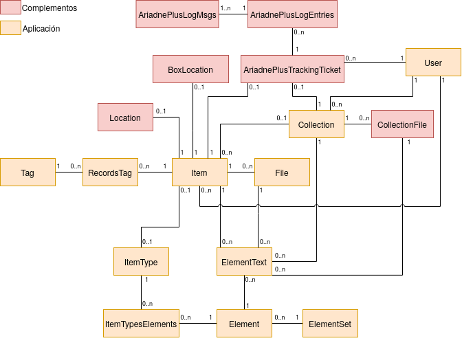

   Diagrama E/R de datos relacionados con la gestión de datos.

Diseño arquitectónico
---------------------
Como es lógico, el diseño de los complementos (*plugins*) desarrollados se ha visto condicionado por el diseño de la aplicación para la que iban dirigidos.

Modelo-Vista-Controlador (MVC)
~~~~~~~~~~~~~~~~~~~~~~~~~~~~~~
La aplicación propuesta usa el patrón de diseño *modelo-vista-controlador* (*MVC*), el cual ofrece una serie de consejos para organizar correctamente el código desarrollado y facilitar así su mantenimiento.

Las aplicaciones que siguen este patrón contienen clases que implementan la lógica de negocio (*modelos*), ficheros con código HTML y PHP (*vistas*), y clases que interactúan con los usuarios (*controladores*). En las vistas no se ha utilizado el término *clase* para referirnos a estas ya que, por lo general, son documentos simples que contienen fragmentos de código HTML y PHP.

Por tanto, podemos deducir que el diseño se divide en tres capas:

-  *Modelo*: modifica, gestiona y actualiza los datos de la aplicación. En nuestro caso, al contar con una única base de datos, es la capa donde se encuentra el código relacionado con las consultas, búsquedas, filtros y actualizaciones.
-  *Vista*: muestra al usuario final la interfaz gráfica de la aplicación, es decir, las páginas, ventanas, formularios, etc. En términos de programación se correspondería con el *frontend*. En la aplicación se correspondería con la interfaz pública y de administración.
-  *Controlador*: gestiona, atiende y procesa las peticiones realizadas por parte de los usuarios. A través de esta capa se comunican el *modelo* y la *vista*. El *controlador* solicita los datos necesarios al *modelo*, se manipulan acorde a la petición del usuario, y se entregan a la *vista* de forma que el usuario pueda visualizar los resultados esperados.

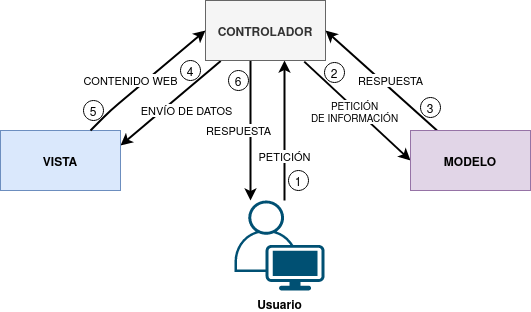

   Diagrama que muestra la relación entre el Modelo, Vista y Controlador del patrón MVC.

En el siguiente diagrama se muestra el comportamiento de la aplicación ante una *petición HTTP*.

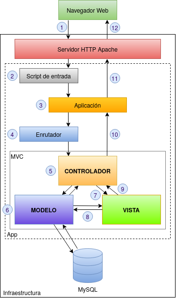

   Diagrama que muestra el comportamiento de la aplicación ante una petición HTTP.

1. El usuario entra a la aplicación a través de su navegador web con la dirección de la aplicación (e.g. *http://miaplicación.es*).
2. El servidor web con ayuda de la extensión PHP ejecuta el script de entrada (*index.php*).
3. Se crea una instancia de la aplicación (*Application*).
4. La aplicación usa el componente enrutador (*router*) para analizar la URL con la que se ha accedido y determinar qué controlador procesará la petición. Si la ruta existe, se instancia al *controlador* y se llama a la acción involucrada.
5. El método de la *acción* recupera los parámetros de las variables globales (e.g. *GET*, *POST*, *FILES*, etc.) y los procesa haciendo uso de los métodos de las clases *modelo*.
6. Las clases *modelo* recogen los datos provistos por el controlador y llevan a cabo las tareas oportunas (e.g recuperar, añadir, eliminar o modificar datos de la base de datos).
7. Después de llamar a los *modelos*, se pasa a la *vista* correspondiente para renderizar la página HTML.
8. La *vista* podría, en caso de necesitarlo, consultar datos del *modelo* para la renderización.
9. La *vista* produce la salida HTML.
10. El *controlador* envía los datos a la instancia de la *aplicación*.
11. Se envía la respuesta HTTP al *servidor web*.
12. La respuesta HTTP es enviada al navegador del *cliente* (usuario).

Diseño de paquetes
~~~~~~~~~~~~~~~~~~
Antes de mostrar cómo se encuentran organizados los complementos (*plugins*) que se han desarrollado, se va a realizar un estudio de cómo lo están los paquetes principales de la aplicación.

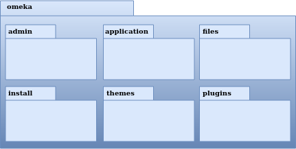

   Diagrama de paquetes de la aplicación.

- *omeka.admin* : contiene todas las clases de cada una de las *vistas* del área de administración.
- *omeka.application*: contiene la aplicación. Alberga todo el sistema *MVC*, así como las configuraciones y servicios utilizados.
- *omeka.files*: recoge todos los ficheros almacenados en la plataforma.
- *omeka.install*: contiene los ficheros de instalación inicial, necesarios para inicializar los parámetros principales de la aplicación.
- *omeka.themes*: recoge las plantillas de diseño (*themes*) utilizadas para personalizar el área pública (*frontend*) de la aplicación.
- *omeka.plugins*: contiene todos los complementos (*plugins*) utilizados para añadir nuevas funcionalidades a la aplicación.

De todos estos paquetes únicamente se especificará en detalle el paquete *plugins* por el hecho de que sólo se ha trabajado en la creación, modificación e instalación de complementos (*plugins*).

Complementos (*plugins*)
^^^^^^^^^^^^^^^^^^^^^^^^
Para obtener una visión más clara de cómo están organizados los complementos (*plugins*) se mostrará su estructura de directorios general.

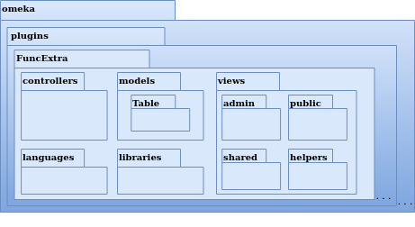

   Diagrama de paquetes del complemento ficticio *FuncExtra*.

- *omeka.plugins.FuncExtra*: representa el nivel superior del complemento. Alberga todo el sistema *MVC* del complemento.
- *omeka.plugins.FuncExtra.controllers*: contiene todas las clases de la capa *controlador*.
- *omeka.plugins.FuncExtra.libraries*: contiene clases externas utilizadas por el complemento.
- *omeka.plugins.FuncExtra.languages*: contiene las traducciones del texto existente en el complemento.
- *omeka.plugins.FuncExtra.models*: contiene las clases de la capa *modelo*. Permite al complemento crear y gestionar sus propias tablas en la base de datos.

   - *omeka.plugins.FuncExtra.Table*: contiene parte de las clases de la capa *modelo*.

- *omeka.plugins.FuncExtra.views*: contiene los archivos (que no clases) de la capa *vista*.

   - *omeka.plugins.FuncExtra.views.admin*: contiene las *vistas* solo visibles en el área de administración.
   - *omeka.plugins.FuncExtra.views.public*: contiene las *vistas* solo visibles en el área pública.
   - *omeka.plugins.FuncExtra.views.shared*: contiene las *vistas* visibles en ambas áreas.

A continuación, se muestran los paquetes de todos los complementos instalados en la aplicación.

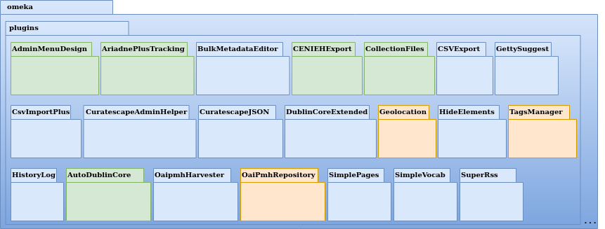

   Paquetes de los complementos instalados en la aplicación.

Son un total de 21 complementos, de los cuales 6 han sido creados específicamente para el proyecto (verdes) y el resto (azules) han sido recogidos de la página oficial de Omeka o de repositorios externos. De estos últimos se han modificado 3 para añadir nuevas funcionalidades (naranjas).

- *omeka.plugins.AdminMenuDesign*: permite ordenar las entradas del menú principal de navegación del área de administración en secciones (submenús).
- *omeka.plugins.AriadnePlusTracking*: implementa todas las funcionalidades relacionadas con los tickets de seguimiento para los procesos de integración en ARIADNEplus.
- *omeka.plugins.BulkMetadataEditor*: permite añadir, editar o eliminar metadatos de ítems de forma masiva.
- *omeka.plugins.CENIEHExport*: permite exportar ítems y colecciones en un formato compatible con ARIADNEplus.
- *omeka.plugins.CollectionFiles*: permite asociar ficheros a colecciones.
- *omeka.plugins.GettySuggest*: permite sugerir términos de los vocabularios Getty durante el relleno de un metadato.
- *omeka.plugins.CsvImportPlus*: permite importar elementos (metadatos, localizaciones, etc.) en formato CSV y gestionar las importaciones.
- *omeka.plugins.CuratescapeAdminHelper*: implementa funcionalidades que brindan ayuda a los administradores de la aplicación.
- *omeka.plugins.CuratescapeJSON*: implementa funcionalidades para la plantilla de diseño (*theme*).
- *omeka.plugins.DublinCoreExtended*: implementa nuevos elementos en el esquema de metadatos (*ElementSet*) *Dublin Core*.
- *omeka.plugins.Geolocation*: implementa diversas funcionalidades relacionadas con la geolocalización de los ítems.
- *omeka.plugins.HideElements*: permite ocultar elementos de los esquemas de metadatos (*ElementSet*) existentes en la plataforma.
- *omeka.plugins.TagsManager*: añade funcionalidades relacionadas con las etiquetas (*tags*).
- *omeka.plugins.HistoryLog*: permite llevar un registro detallado de todas las acciones (eliminar, editar, crear, etc.) ejecutadas en la plataforma.
- *omeka.plugins.AutoDublinCore*: permite automatizar el relleno de algunos elementos del esquema *Dublin Core*.
- *omeka.plugins.OaipmhHarvester*: permite recolectar metadatos de otros repositorios web y gestionar las recolecciones ejecutadas.
- *omeka.plugins.OaiPmhRepository*: permite que otros repositorios web recolecten metadatos de nuestra aplicación.
- *omeka.plugins.SimplePages*: permite añadir páginas simples como la de "About" al área pública.
- *omeka.plugins.SimpleVocab*: permite crear y gestionar vocabularios simples para elementos de un determinado esquema.
- *omeka.plugins.SuperRss*: muestra enlaces para compartir publicaciones (área pública) en redes sociales.

Diseño de clases
~~~~~~~~~~~~~~~~
Cada complemento puede contar con las siguientes clases, de las cuales sólo la primera es de uso obligatorio.

- *FuncExtraPlugin*:  representa la clase principal del complemento *FuncExtra*. Permite definir las llamadas a "*hooks*" y "*filters*" y establecer las opciones de configuración del complemento.
- *FuncExtraRecord*: implementa la capa *modelo* del complemento *FuncExtra*. Cada complemento puede implementar varios *modelos* o ninguno.

   - *Table_FuncExtraRecord*: es parte de la implementación de la capa *modelo*. Sobre él se implementan métodos para hacer búsquedas sobre la base de datos y obtener como resultado objetos de la clase *FuncExtraRecord*.

- *FuncExtra_IndexController*: implementa la capa *controlador* del complemento *FuncExtra*. En este caso, implementaría el *controlador* *index*. Cada complemento puede implementar varios *controladores* o ninguno.
- *FuncExtraHelper_View_Helper_Extra*: implementa el ayudante *Extra*. Este provee a las *vistas* del complemento *FuncExtra* métodos para llevar a cabo funciones complejas como, por ejemplo, añadir elementos a un formulario. Es una clase opcional.

.. figure:: ../_static/images/pck-3.png
   :name: da-pck-3
   :scale: 100%
   :align: center

   Paquete tipo del complemento ficticio FuncExtra.

Como se puede apreciar, el nombre de cada clase varía en función del complemento al que pertenece y, en el caso de los *modelos* y *controladores*, hay que considerar además el nombre del *modelo* o *controlador* que se está implementando. Adoptando estas medidas, se evitan posibles conflictos en la nomenclatura de las clases.

En el siguiente diagrama se muestra la interacción entre los componentes del complemento ficticio *FuncExtra* y la aplicación principal.

.. figure:: ../_static/images/pck-4.png
   :name: da-pck-4
   :scale: 70%
   :align: center

   Diagrama de clases del complemento ficticio FuncExtra.

Vemos como las implementaciones de las tres capas del complemeto *FuncExtra* (*models*, *views* y *controllers*) se acoplan a las capas de la aplicación principal para despúes interactuar entre ellas junto a todas las demás implementaciones de la aplicación, incluyendo las de los otros complementos instalados. Este acoplamiento hace posible que desde nuestro complemento se puedan reutilizar implementaciones tanto de la propia aplicación como de los otros complementos.

Además de estas clases, se pueden añadir clases externas dentro del paquete *libraries*.

El paquete *views* no tiene clases por el hecho de que las *vistas* no son consideradas como clases en el patrón *MVC*, sino una mezcla de código HTML y PHP.

Todos los complementos que se han instalado en la plataforma siguen esta estructura, sin embargo, al ser todos los componentes opcionales (salvo la clase principal), existen ciertas diferencias entre ellos.

A continuación, por motivos de brevedad, se mostrarán únicamente los diagramas de clase de los seis complementos que se han desarrollado de forma exclusiva para el proyecto. Aquellos que contengan paquetes nuevos se explicará su significado.

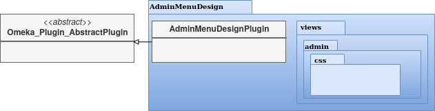

   Diagrama de clases del complemento AdminMenuDesign.

En el complemento *AdminMenuDesign* se hace uso de un paquete nuevo:

- *omeka.plugins.AriadnePlusTracking.views.css*: almacena las hojas de estilo *CSS* utilizadas por las *vistas* del complemento.

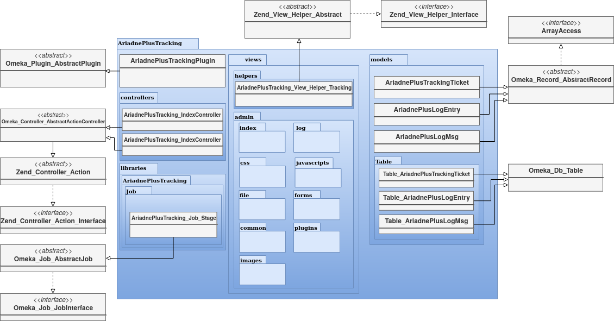

   Diagrama de clases del complemento AriadnePlusTracking.

En el complemento *AriadnePlusTracking* se utilizan varios paquetes nuevos:

- *omeka.plugins.AriadnePlusTracking.libraries.AriadnePlusTracking*: librería que implementa una nueva funcionalidad que permite ejecutar en segundo plano el proceso de cambio de fase del ticket.
- *omeka.plugins.AriadnePlusTracking.views.javascripts*: facilita el uso de *JavaScrip* dentro de las vistas del complemento.
- *omeka.plugins.AriadnePlusTracking.views.file*: implementa la carga de ficheros. En este caso se utiliza para el campo "JSON file of your matchings to Getty AAT" del esquema Monitor.
- *omeka.plugins.AriadnePlusTracking.views.forms*: implementa los formularios de las *vistas*.
- *omeka.plugins.AriadnePlusTracking.views.common*: implementa funcionalidades que se usan en varias *vistas*.
- *omeka.plugins.AriadnePlusTracking.views.plugins*: implementa la página de configuración del complemento.
- *omeka.plugins.AriadnePlusTracking.views.images*: facilita el uso de imágenes dentro de las *vistas* del complemento.

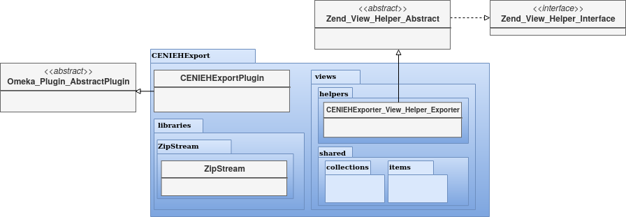

   Diagrama de clases del complemento CENIEHExport.

En el complemento *CENIEHExport* se hace uso de una nueva librería:

- *ZipStream*: librería que permite comprimir varios ficheros (.xml) en formato *.zip* de forma dinámica, sin tener que almacenar ningún fichero en el servidor.

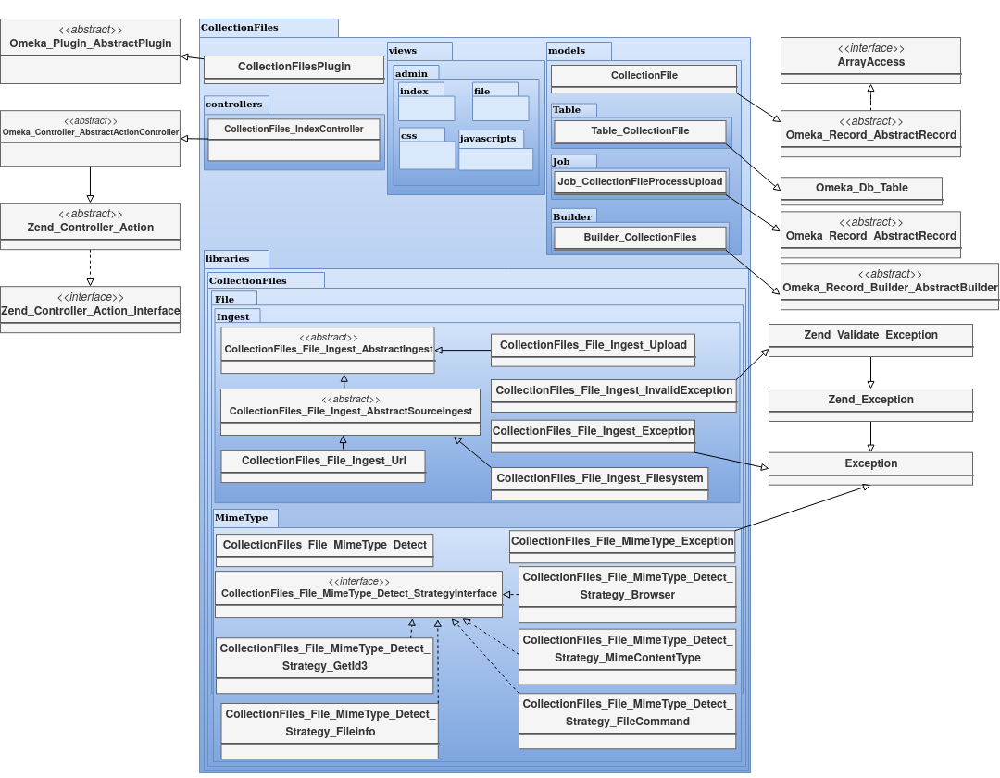

   Diagrama de clases del complemento CollectionFiles

En el complemento *CollectionFiles* se utiliza una nueva librería:

- *CollectionFiles*: librería que implementa todas las funcionalidades que permiten asociar ficheros a colecciones.

Además, se utilizan dos paquetes nuevos:

- *omeka.plugins.CollectionFiles.models.Builder*: paquete utilizado para implementar *builders*. En este caso, implementa el *builder* para el objeto *CollectionFile*.
- *omeka.plugins.CollectionFiles.models.Job*: paquete utilizado para implementar *jobs*. En este caso, el *job* implementado procesa la carga de ficheros.

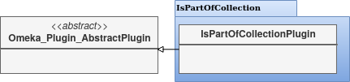

   Diagrama de clases del complemento AutoDublinCore

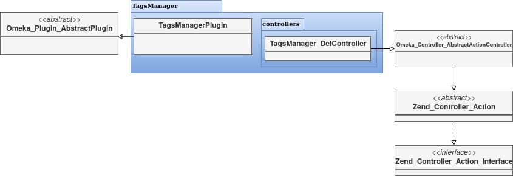

   Diagrama de clases del complemento TagsManager

Diseño procedimental
--------------------
En este apartado se muestra cómo interactúan los principales componentes de la aplicación ante un determinado evento.

En el diagrama de secuencia que se expone a continuación, se describe el funcionamiento interno de la aplicación ante una situación general donde el usuario accede a la aplicación para llevar a cabo una determinada acción.

.. figure:: ../_static/images/dp-seq.png
   :name: dp-seq
   :scale: 60%
   :align: center

   Diagrama de secuencia para un caso general.

En este caso se presupone que tanto el *controlador* como la *acción* indicada por el usuario son válidas. En caso contrario, se enviarían las excepciones correspondientes.

Diseño de interfaces
--------------------
Para la creación del complemento *AriadnePlusTracking* se llevaron a cabo una serie de prototipos que sirvieron de ayuda visual en las fases posteriores de desarrollo.

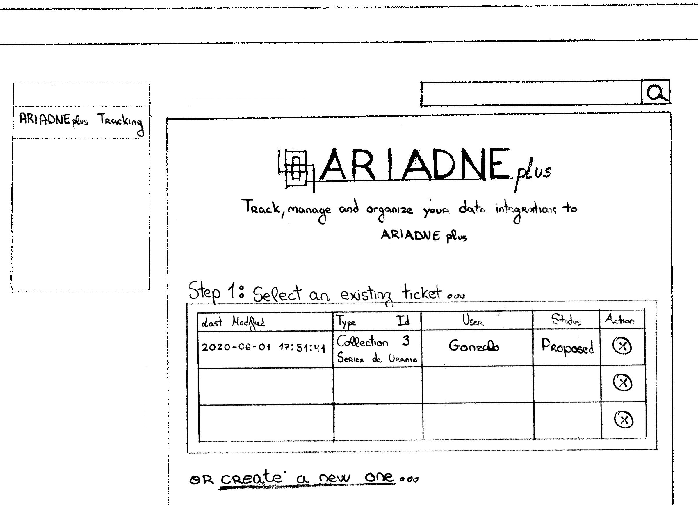

   Prototipos: página principal (ARIADNEplus Tracking)

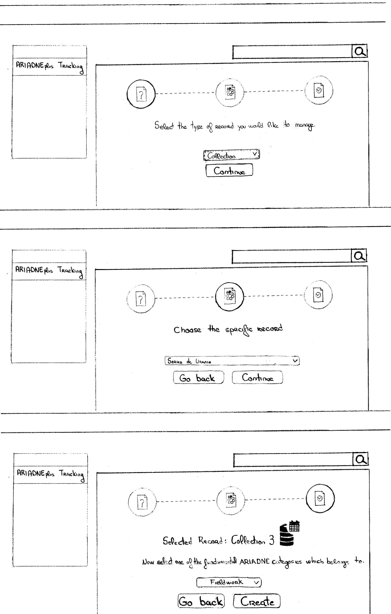

   Prototipos: creación de un ticket (ARIADNEplus Tracking)

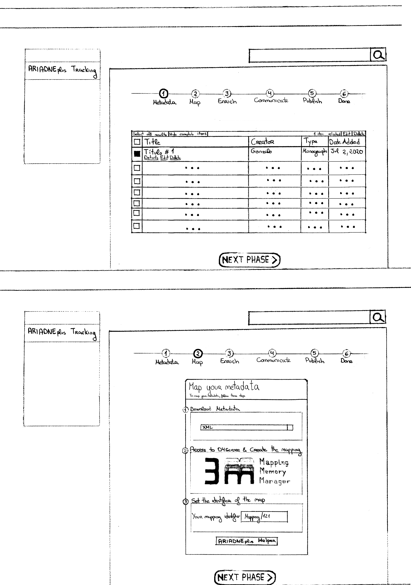

   Prototipos: primera y segunda fase de un ticket (ARIADNEplus Tracking)

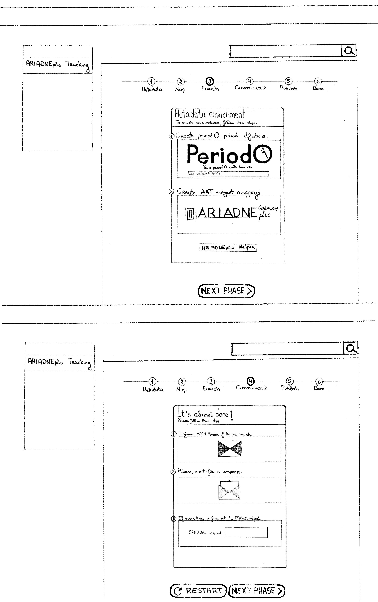

   Prototipos: tercera y cuarta fase de un ticket (ARIADNEplus Tracking)

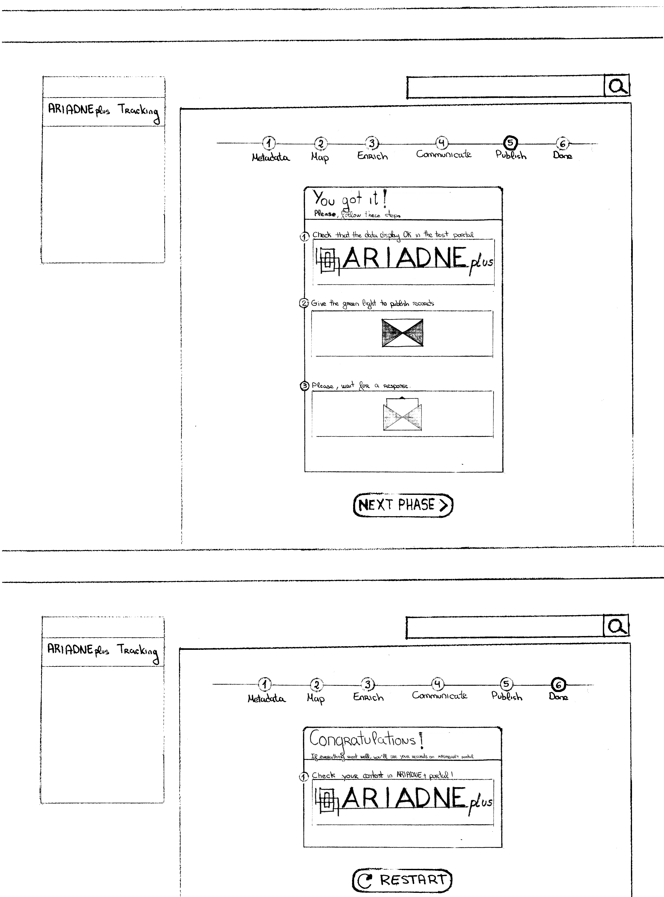

   Prototipos: quinta y sexta fase de un ticket (ARIADNEplus Tracking)

