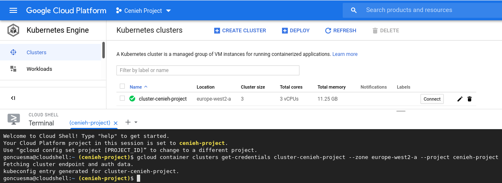
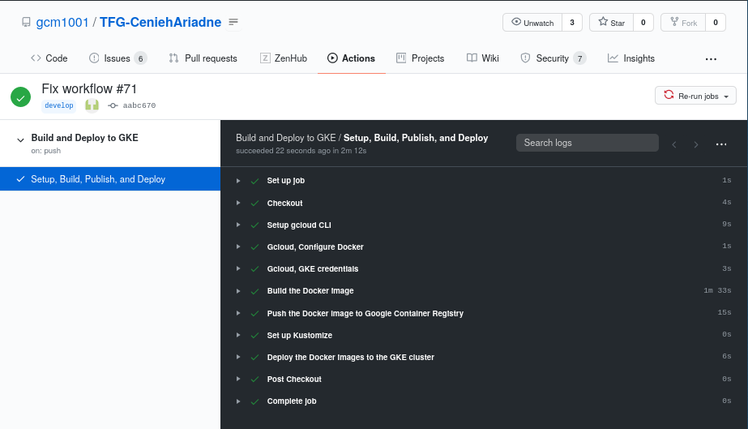
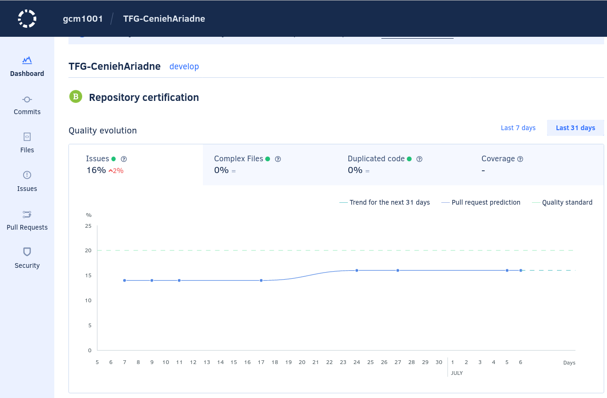
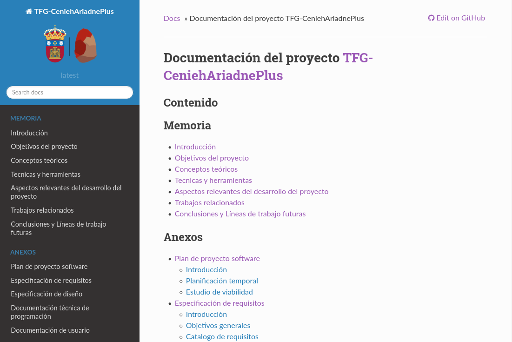
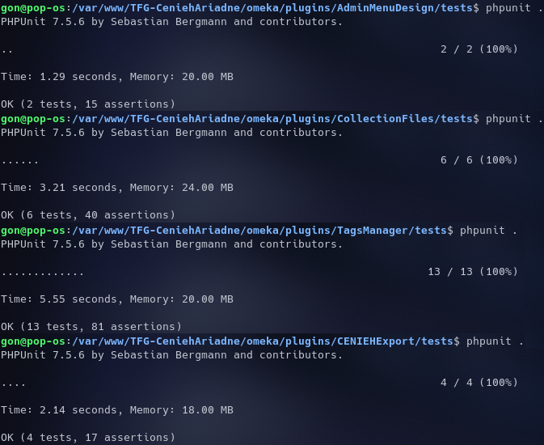

=====================================
Documentación técnica de programación
=====================================

Introducción
------------
Este anexo recoge la información necesaria para que cualquier usuario sea capaz de instalar, configurar y mantener la aplicación junto a todos los complementos (*plugins*) y temas (*themes*) propuestos en este proyecto.

Estructura de directorios
-------------------------
A continuación se listan los directorios que forman parte del repositorio del proyecto:

- */*: raíz del proyecto. Esta contiene ficheros de configuración de *Docker*, *Kustomize* (*Kubernetes*) y *GitHub*, el fichero *README.md*, y una copia de la licencia del repositorio.
- */.github/worksflows/*: contiene los flujos de trabajo (*workflows*) utilizados por el servicio *GitHub Actions*.
- */configFiles/*: recoge los ficheros de configuración de la aplicación utilizados para crear las imágenes de *Docker* que contienen a la aplicación.
- */docs/*: contiene toda la documentación del proyecto.
- */docs/LaTeX/*: documentación en formato *LaTeX*.
- */docs/readme/*: recoge material auxiliar (imágenes y gifs) utilizados en el *README.md*.
- */docs/sphinx/*: documentación en formato *reStructureText*.
- */gke-mysql/*: contiene los ficheros de configuración *Kustomize* utilizados para desplegar en *Kubernetes* el contenedor de la base de datos.
- */gke-omeka/*: contiene los ficheros de configuración *Kustomize* utilizados para desplegar en *Kubernetes* el contenedor de la aplicación.
- */omeka/*: recoge los archivos de la aplicación.
- */omeka/plugins/*: complementos propuestos para la aplicación.
- */omeka/themes/*: tema propuesto para la aplicación.
- */omeka/themes/curatescape/*: nivel superior del tema. Contiene todas las vistas públicas, ficheros de configuración, información y personalización del tema, y la imagen de la portada del tema.

El directorio */omeka/plugins/* cuenta además con un total de 21 subdirectorios, cada uno de los cuales se corresponde con un complemento. A continuación se expone la estructura de directorios que puede adquirir cada complemento:

- */omeka/plugins/<NombreDelComplemento>*/: nivel superior del complemento. Contiene el fichero principal y el fichero de información del complemento. En caso de ser configurable, puede contener además el fichero de la página de configuración.
- */omeka/plugins/<NombreDelComplemento>/controllers/*: *controladores* del complemento.
- */omeka/plugins/<NombreDelComplemento>/views/*: *vistas*.
- */omeka/plugins/<NombreDelComplemento>/views/public/*: *vistas* del área pública.
- */omeka/plugins/<NombreDelComplemento>/views/admin/*: *vistas* del área de administración.
- */omeka/plugins/<NombreDelComplemento>/views/shared/*: *vistas* comunes.
- */omeka/plugins/<NombreDelComplemento>/models/*: *modelos*.
- */omeka/plugins/<NombreDelComplemento>/libraries/*: funcionalidades externas a la aplicación.
- */omeka/plugins/<NombreDelComplemento>/languages/*: traducciones.
- */omeka/plugins/<NombreDelComplemento>/forms/*: formularios.
- */omeka/plugins/<NombreDelComplemento>/tests/*: test unitarios.

Manual de programador
---------------------
A lo largo de este apartado se van a explicar los procedimientos necesarios para acondicionar el entorno de desarrollo, instalar la aplicación junto a todos los complementos y temas propuestos, adoptar diversos servicios de integración continua y, por último, ejecutar sobre la aplicación/complementos pruebas.

Entorno de desarrollo
~~~~~~~~~~~~~~~~~~~~~
Antes de poder realizar cualquier tipo de operación sobre la aplicación o sobre cualquiera de los complementos propuestos, es necesario adaptar el entorno de desarrollo.

El sistema requerido por la aplicación es conocido como *LAMP* [#]_ , el cual debe contar con las siguientes herramientas:

- **Linux** como sistema operativo.
- **Apache** como servidor web.
- **MySQL/MariaDB** como gestor de base de datos.
- **PHP** como lenguage de programación.

Además, la aplicación necesita tener a su disposición el conjunto de herramientas *software* provisto por **ImageMagick**.

Aparte de los requerimientos propios de la aplicación, también es necesario un **editor de código** desde donde llevar a cabo las labores propias de desarrollo.

A continuación, se muestra información adicional de cada herramienta.

Linux
^^^^^
Cualquier sistema operativo que sea de tipo *Unix* es válido para la aplicación. En este proyecto se ha utilizado la distribución *Ubuntu 19.10*.

Servidor HTTP Apache
^^^^^^^^^^^^^^^^^^^^
El servidor HTTP Apache es un servidor web de código abierto que aporta al entorno las condiciones necesarias para mostrar la aplicación sobre el navegador. En el siguiente `enlace <http://httpd.apache.org/docs/trunk/es/install.html>`__ se puede encontrar una guía detallada para su instalación.

Si nuestro entorno ya cuenta con esta herramienta, para que la aplicación funcione correctamente, **se debe activar el módulo** *mod_rewrite*. Este permite que la aplicación pueda procesar *URLs* mucho menos complejas para los usuarios (*clientes*).

El proceso de activación no tiene mucha complicación. Desde cualquier terminal de Linux:

1. Activar el módulo *rewrite* y aplicar cambios reiniciando el demonio de Apache.

.. code-block::

   sudo a2enmod rewrite
   sudo /etc/init.d/apache2 restart

2. Editar el archivo de configuración del sitio asignado para la aplicación (el sitio por defecto es *000-default*).

.. code-block::

   sudo nano /etc/apache2/sites-enabled/000-default

3. Dentro de la etiqueta *Directory*, asignar el valor *All* a la directiva *AllowOverride*.

.. code-block::

   <VirtualHost>
   ...
      <Directory>
         AllowOverride All
         ...
      </Directory>
   </VirtualHost>

MySQL/MariaDB
^^^^^^^^^^^^^
MySQL es un *software* bastante conocido para la gestión de bases de datos relacionales. La aplicación propuesta **es compatible con cualquier versión de MySQL que sea superior a la 5.0**. A través de este `enlace <https://dev.mysql.com/doc/mysql-installation-excerpt/5.7/en/>`__ se accede a la guía de instalación oficial.

PHP
^^^
Es fundamental que el entorno tenga instalada una **versión de PHP superior a la 5.7**. En este `enlace <https://www.php.net/manual/es/install.php>`__ se explica cómo hacerlo.

Además, para poder hacer uso tanto de la aplicación como de todos los complementos propuestos, **es necesario instalar y activar los siguientes módulos/extensiones**:

- *mysqli*: permite acceder a la funcionalidad proporcionada por *MySQL 4.1* y posterior.
- *exif*: permite trabajar con metadatos de imágenes.
- *curl*: permite conectarse y comunicarse con diferentes tipos de servidores y diferentes tipos de protocolos.
- *mbstring*: permite manejar codificaciones basadas en *Unicode*, tales como *UTF-8* y *UCS-2*.

Una vez instalados, se deben realizar los siguientes cambios en el fichero de configuración PHP del servidor Apache (se suele encontrar en la ruta */etc/php/<version>/apache2/*):

1. Comenzar la edición del fichero.

.. code-block::

   sudo nano /etc/php/7.2/apache2/php.ini

2. Activar las extensiones instaladas descomentando (quitar el ';') las siguientes líneas.

.. code-block::

   extension=curl
   extension=mbstring
   extension=exif
   extension=mysqli

Recuerda que los cambios cometidos en este fichero no se aplican hasta reiniciar el servidor Apache.

*ImageMagick*
^^^^^^^^^^^^^
*ImageMagick* es un producto *software* que provee al entorno un conjunto de herramientas que permiten visualizar, modificar y transformar todo tipo de formatos de imagen. La aplicación propuesta requiere contar con esta *suite* instalada ya que la utiliza para procesar las imágenes internas. Los detalles de la instalación se encuentran en este `enlace <https://imagemagick.org/script/install-source.php>`__.

Editor de código
^^^^^^^^^^^^^^^^
En el proyecto se ha utilizado como editor de código **NetBeans**. Se eligió principalmente porque, además de ser uno de los editores más populares para PHP, da soporte al *framework* que utiliza la aplicación, *Zend Framework*. También ofrece funcionalidades a otros lenguajes utilizados en la aplicación como *JavaScript*, *HTML* y *CSS*. Se puede obtener de forma gratuita a través de este `enlace <https://netbeans.org/community/releases/82/install.html>`__.

En su página oficial se puede encontrar un `video-tutorial <https://netbeans.org/kb/docs/php/zend-framework-screencast.html>`__ que explica cómo desarrollar desde *NetBeans* aplicaciones PHP que utilizan como marco de trabajo *Zend Framework*.

Instalación de la aplicación
~~~~~~~~~~~~~~~~~~~~~~~~~~~~
Con el entorno de desarrollo ya preparado, podemos proceder con la instalación de la aplicación.

El primer paso consiste en **configurar el servidor**:

1. **Crear la base de datos (DB) MySQL** desde un usuario con permisos suficientes como para poder realizar operaciones sobre ella.

   * Durante el proceso, conviene apuntar los siguientes datos:

      - *Hostname* donde se encuentra alojada la DB.
      - Nombre de la DB.
      - Nombre del usuario de la DB.
      - Contraseña de usuario de la DB.

   * La base de datos ha de estar codificada en `utf8`.

.. code-block::

   sudo mysql -u root -
   CREATE DATABASE omekadb CHARACTER SET utf8mb4 COLLATE utf8mb4_unicode_ci;
   CREATE USER 'usuario'@'localhost' IDENTIFIED BY 'contraseña';
   GRANT ALL ON omeka.* TO 'usuario'@'localhost' IDENTIFIED BY 'contraseña' WITH GRANT OPTION;
   FLUSH PRIVILEGES;
   EXIT;

2. **Descargar** la version 2.7.1 de **Omeka**, desde su [web oficial](https://omeka.org/classic/download/) o desde su [repositorio oficial](http://github.com/omeka/Omeka) en GitHub.

.. code-block::

   cd /tmp && wget https://github.com/omeka/Omeka/releases/download/v2.7.1/omeka-2.7.1.zip

3. **Descomprimir** el fichero `.zip` recién descargado sobre un directorio desde donde podamos trabajar.

.. code-block::

   unzip omeka-2.7.1.zip -d <directorio_de_trabajo>

4. Desde el directorio escogido, buscar el fichero `db.ini` y **sustituir los valores 'XXXXX' por los datos de la base de datos** (anotados en el paso 1).

.. code-block::

   cd <directorio_de_trabajo>
   nano db.ini

   No es necesario modificar los parámetros `prefix` o `port`.
.. code-block::

   ;;;;;;;;;;;;;;;;;;;;;;;;;;;;;;;
   ; Database Configuration File ;
   ;;;;;;;;;;;;;;;;;;;;;;;;;;;;;;;
   ;
   ; Omeka requires MySQL 5 or newer.
   ;
   ; To configure your database, replace the X's with your specific
   ; settings. If you're unsure about your database information, ask
   ; your server administrator, or consult the documentation at
   ; <http://omeka.org/codex/Database_Configuration_File>.

   [database]
   host     = "localhost"
   username = "usuario"
   password = "contraseña"
   dbname   = "omekadb"
   prefix   = "omeka_"
   charset  = "utf8"
   ;port     = ""

5. **Descargar** el contenido del `repositorio del proyecto <https://github.com/gcm1001/TFG-CeniehAriadne>`__.

.. code-block::

   cd /tmp && wget https://github.com/gcm1001/TFG-CeniehAriadne/archive/master.zip

6. **Descomprimir** las carpetas `/omeka/plugins` y `/omeka/themes` del fichero `.zip` recién descargado.

.. code-block::

   unzip master.zip 'TFG-CeniehAriadne-master/omeka/plugins/*' 'TFG-CeniehAriadne-master/omeka/themes/*' -d <*directorio_de_trabajo*>

7. Desde el directorio de trabajo, **reemplazar las carpetas originales** *plugins* y *themes* por las previamente descargadas.

.. code-block::

   cd <*directorio_de_trabajo*>
   rm -rf ./plugins ./themes
   sudo cp -r ./TFG-CeniehAriadne-master/omeka/* .
   rm -rf ./TFG-CeniehAriadne-master

8. Mover todo el contenido del directorio de trabajo a la carpeta del servidor Apache.

.. code-block::

   mv -r <*directorio_de_trabajo*>/* <*directorio_del_servidor*>

9. **Dar permisos de lectura y escritura sobre todo el contenido de la aplicación**.

.. code-block::

   cd <*directorio_del_servidor*>
   sudo chown -R www-data:www-data <*directorio_de_trabajo*>
   sudo chmod -R 755 <*directorio_de_trabajo*>

Desde este instante, **la aplicación será accesible desde el navegador** (puerto 80).

Para finalizar con la instalación, se debe **completar el formulario de instalación** disponible en el directorio `/install` de la aplicación (e.g *http://miaplicacion.es/install*). Cuando se haya completado, la aplicación únicamente contará con la funcionalidad básica, es decir, no se verán los cambios introducidos por los complementos/temas. Para ello, es necesario instalarlos desde la interfaz. En los siguientes apartados se explicará como hacerlo.

Añadir funcionalidades a la aplicación
~~~~~~~~~~~~~~~~~~~~~~~~~~~~~~~~~~~~~~
Una de las características que hacen de la aplicación una magnífica plataforma para el proyecto es su **escalabilidad**. Gracias a su sistema de **complementos** o *plugins*, cualquier programador tiene la posibilidad de adaptarla a sus necesidades individuales sin necesidad de modificar el código base de la aplicación.

Además, cuenta con una fabulosa comunidad de desarrolladores que hacen públicas sus implementaciones. Por tanto, antes de comenzar con el desarrollo de un nuevo *plugin*, es recomendable comprobar que la funcionalidad que se desea implementar no está ya desarrollada (ver `Repositorio de complementos oficial <https://omeka.org/classic/plugins/>`__ o `Repositorio de Github <https://daniel-km.github.io/UpgradeToOmekaS/omeka_plugins.html>`__).

Cómo instalar complementos en la aplicación
^^^^^^^^^^^^^^^^^^^^^^^^^^^^^^^^^^^^^^^^^^^
En este apartado se muestra el procedimiento a seguir para instalar complementos en la aplicación.

Si se ha instalado la aplicación siguiendo los pasos incluídos en este manual (ver `Instalación de la aplicación`_), los complementos que incluyen cada una de las funcionalidades desarrolladas en este proyecto se encuentran ya ubicados en el interior de la aplicación.

En el caso de que se quiera añadir algún complemento adicional a los propuestos en este proyecto, se deben trasladar antes sus ficheros al directorio `/plugins/` de la aplicación.

Con los complementos ya ubicados en el interior de la aplicación, hay que hacer uso de la interfaz para completar su instalación. Los pasos a seguir son:

1. Acceder al área de administración (`aplicacion.es/admin/`).
1. Desde el gestor de complementos (`aplicacion.es/admin/plugins`).
2. Localizar el nombre del complemento que se desea instalar.
3. Hacer clic sobre el botón "*Install*" situado en la parte derecha del complemento.
4. En caso de que el *plugin* sea configurable, rellenar el formulario de configuración y hacer clic sobre el botón "*Save Changes*".

Para obtener información más detallada acerca de la gestión de complementos, ver el `manual de usuario <https://tfg-ceniehariadne.readthedocs.io/es/latest/anexos/E_Manual_usuario.html#manual-de-usuario>`__.

Personalizar el diseño de la aplicación
~~~~~~~~~~~~~~~~~~~~~~~~~~~~~~~~~~~~~~~
Si nuestra intención es modificar la estética de la aplicación, esta cuenta con un sistema de **temas** o plantillas que permite personalizar el área pública (*frontend*) del sitio.

Existe también la posibilidad de reutilizar temas de otros desarrolladores (ver `Repositorio de temas oficial <https://omeka.org/classic/themes/>`__ o `Repositorio de Github <https://daniel-km.github.io/UpgradeToOmekaS/omeka_themes.html>`__).

Cómo instalar temas en la aplicación
^^^^^^^^^^^^^^^^^^^^^^^^^^^^^^^^^^^^
Su proceso de instalación es muy similiar al de los complementos. Al igual que pasaba con estos, si se han seguido los pasos de instalación (ver `Instalación de la aplicación`_), el tema propuesto se encuentra ya almacenado en el interior de la aplicación.

En el caso de que se quiera añadir algún otro tema, se deben trasladar antes sus ficheros al directorio `/themes/` de la aplicación.

Con el tema ya almacenado en la aplicación, se puede llevar a cabo el proceso de instalación desde la interfaz.

Para instalar un tema (*theme*):

1. Acceder al área de administración (`aplicacion.es/admin/`).
2. Desde la página de configuración de diseño (`aplicacion.es/admin/appearance/`).
3. Hacer clic sobre la entrada "*Themes*" de la barra de navegación existente.
4. Localizar el nombre del tema que se desea instalar.
5. Hacer clic sobre el botón "*Use this theme*".

Para obtener información más detallada acerca de la gestión de temas, ver el `manual de usuario <https://tfg-ceniehariadne.readthedocs.io/es/latest/anexos/E_Manual_usuario.html#manual-de-usuario>`__.

Integración continua
~~~~~~~~~~~~~~~~~~~~
El repositorio del proyecto dispone de varios mecanismos de integración continua que facilitan la ejecución de alguna de las tareas típicas de desarrollo como, por ejemplo, el despliegue de la aplicación. En los siguientes apartados se explicará como se implementar cada uno de ellos.

GitHub Actions
^^^^^^^^^^^^^^
*GitHub Actions* es uno de los servicios ofrecidos por *Github* que permite crear, compartir y ejecutar código desde la misma plataforma, sin necesidad de utilizar servicios externos.

En este proyecto se ha utilizado esta herramienta para automatizar dos flujos de trabajo:

- *Workflow 1*: Despliegue de la aplicación sobre el entorno de desarrollo, incluyendo en ella los complementos/temas almacenados en el repositorio del proyecto.
- *Workflow 2*: Compilación y publicación de la imagen *Docker* utilizada por el entorno de producción para el despliegue de la aplicación y de los *plugins*/temas almacenados en el repositorio del proyecto.

A continuación se muestran las etapas por las que se ha pasado para consolidar el primer flujo de trabajo.

Etapa 01: Montar el servidor en la nube
***************************************
Para montar el servidor en la nube se ha utilizado la plataforma *Google Kubernetes Engine* (GKE) de *Google Cloud*.

El procedimiento a seguir es el siguientefa:

1. Crear un **nuevo proyecto** en *Google Cloud*.
2. Habilitar los siguientes **servicios**: *Container Registry* y *Kubernetes Engine API* (acceder a este `enlace <https://console.cloud.google.com/flows/enableapi?apiid=containerregistry.googleapis.com,container.googleapis.com>`__ para activarlos automáticamente).
3. Crear un **nuevo clúster** en *Google Cloud* (acceder a este `enlace <https://cloud.google.com/kubernetes-engine/docs/quickstart#create_cluster>`__ para activarlos automáticamente).
4. Crear una **nueva cuenta de servicio** (ver `tutorial <https://cloud.google.com/iam/docs/creating-managing-service-accounts>`__).
5. Añadir, a la cuenta recién creada, los siguientes **roles** (ver `tutorial <https://cloud.google.com/iam/docs/granting-roles-to-service-accounts#granting_access_to_a_service_account_for_a_resource>`__).

   - *Kubernetes Engine Developer*: nos permitirá desplegar aplicaciones en la plataforma GKE.
   - *Storage Admin*: nos permitirá publicar contenedores Docker en la plataforma Container Registry.

6. Crear una **clave** para la cuenta creada en el paso 4 (ver `tutorial <https://cloud.google.com/iam/docs/creating-managing-service-account-keys>`__).

   Vista del panel de administración de Google Cloud tras finalizar los pasos marcados.

Etapa 02: Configuración del *workflow*
**************************************
Para implementar las técnicas de integración continua a través de *Github Actions*, es necesario crear un flujo de trabajo (*workflow*) donde definir los procesos que se pretenden automatizar.

*Github Actions* permite definir más de un flujo de trabajo por repositorio. Estos deben ser almacenados dentro del repositorio sobre el directorio `/.github/worflows`. La sintaxis que siguen estos ficheros es *YAML*, por lo que la extensión ha de ser *.yaml*.

En este proyecto, el fichero de configuración utilizado para definir el *worflow* que automatiza el despliegue de la aplicación se llama *gke.yaml*.

A continuacón se explica brevemente en qué consiste cada una de las etiquetas utilizadas en este fichero:

- *name*: nombre del *workflow*.
- *on*: propiedades de activación del *workflow*.

   - *push*: se activa al realizar una operación de *push*.

      - *branches*: ramas sobre las que se activa.
      - *paths-ignore*: directorios que se ignoran.

- *env*: variables de entorno.
- *runs-on*: SO donde queremos ejecutar cada una de las acciones.
- *steps*: agrupa el conjunto de acciones a ejecutar.

   - *uses*: selecciona una acción externa para ser ejecutada.

      - *with*: indica parámetros de entrada para la acción externa.

   - *name*: nombra un paso/acción.
   - *run*: indica los comandos a ejecutar .

Los procesos que se han definido son los siguientes:

1. *Checkout*: recoge el contenido del repositorio.
2. *Setup gcloud CLI*: prepara el entorno para tener acceso a todas las herramientas existentes en la plataforma *Google Cloud*.
3. *Gcloud: Configure Docker*: prepara la configuración para *Docker*.
4. *Gcloud: GKE credentials*: obtiene las credenciales necesarias para publicar la imagen *Docker* en nuestro repositorio privado de *Google Cloud*.
5. *Build the Docker image*: compila la imagen *Docker* que contiene la aplicación y los complementos/temas.
6. *Push the Docker image to Google Container Registry*: publica la imagen *Docker* recién compilada en nuestro repositorio privado de *Google Cloud*.
7. *Set up kustomize*: instala la herramienta *Kustomize*, necesaria para administrar los ficheros de configuración .yaml.
8. *Deploy the Docker images to the GKE cluster*: compila los ficheros .yaml, actualiza el servidor, y comprueba que se han creado todos los servicios correspondientes.

Además, se utilizan los *secrets* de GitHub para ocultar información sensible en alguno de los procesos previamente definidos.

Etapa 03: Configurar ficheros *.yaml* para *Kustomize*
******************************************************
*Kustomize* será la aplicación que nos permitirá instalar la infraestructura completa sobre el sistema *Kubernetes* del servidor de *Google Cloud*.

El primer paso consiste en **configurar los recursos base** de nuestra plataforma, que son la aplicación (*Omeka Classic*) y el gestor de la base de datos (*MySQL*).

Para configurar ambos recursos hay que crear los siguientes ficheros:

- *service.yaml*: configura el servicio del recurso.
- *deployment.yaml*: configura despliegue del recurso.
- *kustomization.yaml*: recoge los componentes (servicio y despliegue) del recurso. Es utilizado por *Kustomize* para construir el entorno.

En el repositorio del proyecto, estos ficheros se encuentran ubicados en las carpetas */gke-omeka/* y */gke-mysql/*.

A continuación, se modifica la plantilla base del recurso *gke-omeka* a través del fichero de configuración */patch.yaml*. En él se definen:

1. Las variables de entorno que recogerán la información sensible de la aplicación (todas asociadas con un valor *secreto*).

   - *DB_HOST*: *hostname* de la base de datos.
   - *DB_USERNAME*: nombre de usuario del administrador de la base de datos.
   - *DB_PASSWORD*: contraseña del administrador de la base de datos.
   - *DB_DATABASE*: nombre de la base de datos.

2. El fichero de configuración de la base de datos (*db.ini*) (asociado a un *configMap*).

Para finalizar, sobre el directorio raíz del repositorio, se crea el fichero de configuración principal */kustomization.yaml*. Este indicará a *Kustomize* qué recursos pretendemos instalar (*gke-mysql* y *gke-mysql*) y las modificaciones a realizar sobre la plantilla de la aplicación (*patch.yaml*).

Etapa 04: Crear los secretos en el servidor
*******************************************
Los secretos utilizados por los ficheros *.yaml* de la etapa anterior tienen que estar definidos en el servidor de *Google Cloud*.

Para crear el *secreto* compuesto "*omeka-db*":

.. code-block::

   kubectl create secret omeka-db \
   --from-literal=user-password=$DB_PASSWORD \
   --from-literal=username=$DB_USERNAME \
   --from-literal=database=$DB_DATABASE

Para crear el *configMap* "*db-config*":

.. code-block::

   kubectl create configmap db-config \
   --from-file ./configFiles/db.ini

Antes de ejecutar ambos comandos se deben definir las variables de entorno utilizadas en el primero, y descargar del repositorio del proyecto el fichero *db.ini* ubicado en el directorio */configFiles/*.

Etapa final
***********
La última etapa consiste en ejecutar un *commit* sobre la rama *master* (siempre que el directorio afectado no sea */docs*). De esta manera, se comprueba que la acción recién creada se activa y finaliza correctamente.

   Ejecución del workflow.

Codacy
^^^^^^
*Codacy* proporciona una plataforma de revisión de código automatizada capaz de integrarse con múltiples repositorios, entre los que se encuentra *GitHub*.

Para poder utilizar esta plataforma con *GitHub* hay que seguir los siguientes pasos:

1. Instalar el complemento desde la `tienda oficial de Github <https://github.com/marketplace/codacy>`__.
2. Acceder a la plataforma `Codacy <https://codacy.com>`__.
3. Ingresar con la cuenta de *GitHub* y, en la pantalla emergente, seleccionar el repositorio que deseamos integrar.
4. En la siguiente pantalla se da la posibilidad de añadir otras integraciones (como *Slack* o *JIRA*). Se puede ignorar este paso.
5. Esperar a que finalice la revisión de código.

   Panel principal de la plataforma Codacy.

Tras esta primera revisión, cada vez que se ejecute un *commit* sobre la rama *main* del repositorio, *Codacy* evaluará la calidad de los cambios cometidos de forma automática.

Una ventaja de esta herramienta es que no necesita que el repositorio sobre el que está trabajando cuente con un fichero de configuración. Desde su plataforma, es posible realizar todas las tareas propias de configuración:

- Ignorar directorios.
- Activar / Desactivar patrones de código.
- Seleccionar las ramas a analizar.
- Gestionar las integraciones.
- Establecer las condiciones en las que los *commits* o *pulls request* son exitosos/fallidos.
- Indicar el umbral a partir del cual el repositorio es catalogado como "saludable".

*Read the Docs*
^^^^^^^^^^^^^^^
*Read the Docs* es una plataforma web que facilita la tarea de documentar productos *software* automatizando la compilación, versionado y hospedaje de los ficheros generados por la herramienta de documentación *Sphinx*. En el repositorio del proyecto, estos ficheros se encuentran dentro del directorio */docs/sphinx/*.

Para utilizar este servicio, basta con iniciar sesión en su página web a través de *GitHub*, otorgar los permisos necesarios, e importar el repositorio (proyecto) sobre el que se integrará el servicio.

Además, se pueden configurar otros aspectos de la documentación. Para ello, es necesario indicar a la herramienta donde se encuentra el fichero de configuración *conf.py*, que en este proyecto se ubica también en */docs/sphinx/*.

   Página principal de la documentación del proyecto hospedada en Read The Docs.

Pruebas del sistema
-------------------
Durante el desarrollo de los complementos (*plugins*), se han ido elaborado un conjunto de pruebas unitarias para comprobar el correcto funcionamiento de las distintas partes en las que estos se componen.

Para realizar esta tarea, se ha utilizado el *framework* de pruebas *PHPUnit*, el cual cuenta con una implementación adaptada a la estructura de la aplicación.

Antes de poder utilizar esta implementación, se debe configurar la sección de pruebas de la aplicación mediante el fichero de configuración *config.ini*. Este se encuentra localizado en el directorio `/application/tests/`.

Se deben indicar, al menos, los datos requeridos para la base de datos de prueba. **Es muy importante** que esta no sea la misma que la base de datos de la aplicación ya que, en cada ejecución de las pruebas, se ejecuta un *reset*.

A continuación se describen las propiedades de configuración del fichero *config.ini*:

- *db.host*: *hostname* donde se aloja la DB.
- *db.username*: nombre de usuario que tiene permisos en la DB.
- *db.password*: contraseña de usuario para acceder a la DB.
- *db.dbname*: nombre de la DB.
- *paths.tempDir*: directorio temporal (se resetea por cada ejecución).

Configurada la base de datos de prueba, se pueden empezar a desarrollar las pruebas unitarias.

Para el desarrollo de pruebas unitarias existen dos clases fundamentales:

- *Omeka_Test_AppTestCase*: extiende a la clase *TestCase* de *PHPUnit*. La función más importante que ofrece esta implementación se llama *dispatch*. Esta permite poner a prueba las tres capas en las que está diseñada la aplicación: *modelo*, *vista* y *controlador*.

- *Omeka_Test_Helper_Plugin*: permite instalar e inicializar complementos durante la ejecución de las pruebas.

Existe un inconveniente en este sistema y es que si un complemento (*plugin*) depende de otro/s complemento/s, no es posible ponerlo a prueba. Por este motivo, solo se han desarrollado pruebas para aquellos complementos que no dependían de otro/s.

Todas las pruebas desarrolladas se encuentran dentro del directorio */tests/* de cada complemento. A continuación, se exponen los resultados obtenidos en la ejecución de las pruebas.

   Resultados de la ejecución de las pruebas unitarias para cada uno de los complementos.

.. References

.. [#] "LAMP." https://es.wikipedia.org/wiki/LAMP