========================
Documentación de usuario
========================

Introducción
------------
En este apartado se pretende dotar al usuario de la información necesaria para la correcta utilización de la aplicación. En primer lugar, se especificarán los requisitos *software* con los que el usuario debe contar para acceder a la aplicación. Posteriormente, se explicará paso a paso el proceso de instalación y, finalmente, se mostrará el manual de usuario.

Requisitos de usuario
---------------------
Los requisitos de usuario varían en función del modo de instalación que vaya a llevar a cabo el usuario. Existen tres modos de instalación: Manual, *Docker* y *Kubernetes*.

Como es lógico, además de los requisitos que se van a mostrar a continuación, se debe contar con un **navegador web** desde el que se pueda acceder a la aplicación web.

Manual
~~~~~~
Si se escoge la opción manual hay que estar seguro de que el servidor cumple con todos y cada uno de los siguientes **requisitos**:

* Sistema Operativo Linux
* Apache HTTP Server (con el módulo *rewrite* activado)
* MySQL / MariaDB v5.0 o superior.
* PHP v5.4 o superior con las sisguientes extensiones instaladas:

   - mysqli
   - exif
   - curl
   - mbstring

* ImageMagick (Tratamiento de imágenes)

.. seealso::
   * `HTTP Apache Server <http://httpd.apache.org/docs/trunk/es/install.html>`__
   * `MySQL <https://dev.mysql.com/doc/mysql-installation-excerpt/5.7/en/>`__
   * `PHP <https://www.php.net/manual/es/install.php>`__
   * `ImageMagick <https://imagemagick.org/script/install-source.php>`__

Docker
~~~~~~
En este caso, solo es necesario un único **requisito**:

- *Docker* (Probado con la versión 19.03.6).

.. seealso::
   * `Docker Engine <https://docs.docker.com/engine/install/>`__

Kubernetes
~~~~~~~~~~
Si se pretende utilizar *Kubernetes* para el despliegue de la infraestructura se requiere:

- *Docker*
- La herramienta de línea de comandos de *Kubernetes*, *kubectl* (Probado en v1.18.2).
- *Kustomize* (probado en v3.1.0)

.. seealso::
   * `Docker Engine <https://docs.docker.com/engine/install/>`__
   * `Kubernetes <https://kubernetes.io/es/docs/tasks/tools/install-kubectl/>`__
   * `Kustomize <https://github.com/kubernetes-sigs/kustomize>`__

Instalación
-----------
Como se ha comentado en el apartado anterior, existen tres posibilidades distintas para instalar la aplicación en un servidor: *Manual*, *Docker* o *Kubernetes*.

Manual
~~~~~~
.. note::
   Para el siguiente tutorial se ha utilizado como S.O Ubuntu 19.10

.. warning::
   ¡ Es muy importante comprobar que se cumplen todos los `Requisitos de usuario`_ !

El primer paso consiste en **configurar el servidor**. Para ello, hay que seguir una serie de indicaciones:

1. **Crear la base de datos (DB) MySQL** desde un usuario con permisos suficientes como para poder realizar operaciones sobre ella.

   * Durante el proceso, conviene apuntar los siguientes datos:

      - *Hostname* donde se encuentra alojada la DB.
      - Nombre de la DB.
      - Nombre del usuario de la DB.
      - Contraseña de usuario de la DB.

   * La base de datos ha de estar codificada en ``utf8``.

::

   sudo mysql -u root -
   CREATE DATABASE omekadb CHARACTER SET utf8mb4 COLLATE utf8mb4_unicode_ci;
   CREATE USER 'usuario'@'localhost' IDENTIFIED BY 'contraseña';
   GRANT ALL ON omeka.* TO 'usuario'@'localhost' IDENTIFIED BY 'contraseña' WITH GRANT OPTION;
   FLUSH PRIVILEGES;
   EXIT;

2. **Descargar** la version 2.7.1 de **Omeka**, desde su `web oficial <https://omeka.org/classic/download/>`__ o desde su `repositorio oficial <http://github.com/omeka/Omeka>`__ en GitHub.

::

   cd /tmp && wget https://github.com/omeka/Omeka/releases/download/v2.7.1/omeka-2.7.1.zip

3. **Descomprimir** el fichero ``.zip`` recién descargado sobre un directorio desde donde podamos trabajar.

::

   unzip omeka-2.7.1.zip -d <directorio_de_trabajo>

4. Desde el directorio escogido, buscar el fichero ``db.ini`` y **sustituir los valores 'XXXXX' por los datos de la base de datos** (anotados en el paso 1).

::

   cd <directorio_de_trabajo>
   nano db.ini

   No es necesario modificar los parámetros ``prefix`` o ``port``.

::

   ;;;;;;;;;;;;;;;;;;;;;;;;;;;;;;;
   ; Database Configuration File ;
   ;;;;;;;;;;;;;;;;;;;;;;;;;;;;;;;
   ;
   ; Omeka requires MySQL 5 or newer.
   ;
   ; To configure your database, replace the X's with your specific
   ; settings. If you're unsure about your database information, ask
   ; your server administrator, or consult the documentation at
   ; <http://omeka.org/codex/Database_Configuration_File>.

   [database]
   host     = "localhost"
   username = "usuario"
   password = "contraseña"
   dbname   = "omekadb"
   prefix   = "omeka_"
   charset  = "utf8"
   ;port     = ""

5. **Descargar** el contenido del `repositorio del proyecto <https://github.com/gcm1001/TFG-CeniehAriadne>`__.

::

   cd /tmp && wget https://github.com/gcm1001/TFG-CeniehAriadne/archive/master.zip

6. **Descomprimir** las carpetas ``/omeka/plugins`` y ``/omeka/themes`` del fichero ``.zip`` recién descargado.

::

   unzip master.zip 'TFG-CeniehAriadne-master/omeka/plugins/*' 'TFG-CeniehAriadne-master/omeka/themes/*' -d <*directorio_de_trabajo*>

7. Desde el directorio de trabajo, **reemplazar las carpetas originales** *plugins* y *themes* por las previamente descargadas.

::

   cd <*directorio_de_trabajo*>
   rm -rf ./plugins ./themes
   sudo cp -r ./TFG-CeniehAriadne-master/omeka/* .
   rm -rf ./TFG-CeniehAriadne-master

8. Mover todo el contenido del directorio de trabajo a la carpeta del servidor Apache.

::

   mv -r <*directorio_de_trabajo*>/* <*directorio_del_servidor*>

9. **Dar permisos de lectura y escritura sobre todo el contenido de la aplicación**.

::

   cd <*directorio_del_servidor*>
   sudo chown -R www-data:www-data <*directorio_de_trabajo*>
   sudo chmod -R 755 <*directorio_de_trabajo*>

10. **Configurar el servidor Apache**:

   10.1. **Crear el archivo de configuración** correspondiente a la aplicación.

   ::

      nano /etc/apache2/sites-available/omeka.conf

   Cambiar los valores "*DocumentRoot*" y "*ServerName*".

   ::

      <VirtualHost *:80>
           ServerAdmin [email protected]
           DocumentRoot <directorio_del_servidor>
           ServerName <nombre_del_servidor>

           <Directory /var/www/html/omeka/>
                Options FollowSymlinks
                AllowOverride All
                Require all granted
           </Directory>

           ErrorLog ${APACHE_LOG_DIR}/error.log
           CustomLog ${APACHE_LOG_DIR}/access.log combined

      </VirtualHost>

   b. **Activar el sitio y el módulo rewrite** y **reiniciar el servidor** para aplicar los cambios.

   ::

      a2ensite omeka.conf
      a2enmod rewrite
      systemctl restart apache2.service

Desde este instante, **la aplicación será accesible desde el navegador** (puerto 80). El último paso consiste en **completar la instalación guiada desde el navegador**, disponible en el directorio ``/install`` (e.g *http://aplicacion.es/install*).

Una vez instalada la aplicación, para poder disfrutar de todas las mejoras propuestas en este proyecto, se deben instalar tanto los *plugins* como el tema propuesto (ver `Instalar complementos (plugins)`_ e `Instalar temas (themes)`_)

.. warning::
   Por temas de seguridad, conviene eliminar la carpeta ``/install/`` del directorio raíz una vez terminada la instalación de la aplicación.

.. seealso::
   * `Omeka Classic User Manual <https://omeka.org/classic/docs/Installation/Installation/>`__

Docker
~~~~~~
.. warning::
   ¡ Es muy importante comprobar que se cumplen todos los `Requisitos de usuario`_ !

.. note::
   Para el siguiente tutorial se ha utilizado como S.O Ubuntu 19.10

Para proceder al despliegue **se deben descargar**, del `repositorio del proyecto <https://github.com/gcm1001/TFG-CeniehAriadne>`__, los siguientes ficheros:

- ``/Dockerfile``
- ``/docker-compose.yml``
- ``/ConfigFiles/*.modificar``
- ``/omeka/plugins/*``

.. warning::
   Mantén los subdirectorios intactos.

A continuación debes **compilar la imagen**. Para ello, desde el directorio donde hayas almacenado la descarga anterior, ejecuta el siguiente comando:

::

   docker build -t nombre_imagen:tag .

**Recuerda muy bien el nombre de la imagen y el tag que pongas** porque será necesario para el siguiente paso, que consiste en configurar el archivo ``docker-compose.yml``.

En él, solo tenemos que cambiar la etiqueta ``image`` del servicio ``omeka_app`` con el nombre y el tag de la imagen recién compilada:

::

   ...
     omeka_app:
       image: nombre_imagen:tag

Si se ha publicado la imagen en *DockerHub*, se puede hacer referencia a esta indicando el nombre de usuario seguido de la imagen (e.g. username/nombre_de_mi_imagen:tag).

.. warning::
   Elimina el servicio ``omeka-db-admin`` si tu servidor está destinado a producción. Este servicio incorpora la herramienta *PhpMyAdmin* a la infraestructura, la cual tiene un alto grado de vulnerabilidades.

Por último, se crean los *secrets* correspondientes a las contraseñas de la base de datos:

::

   echo 'contraseña_usuario_db' | docker secret create omeka_db_password -
   echo 'contraseña_root_db' | docker secret create omeka_db_root_password -
   cp configFiles/db.ini.modificar configFiles/db.ini
   cp configFiles/mail.ini.modificar configFiles/mail.ini

.. warning::
   Debes modificar los ficheros recién creados (``db.ini`` y ``mail.ini`` con los datos relacionados con la base de datos y el protocolo IMAP. Ten en cuenta que la contraseña que introduzcas en el fichero tiene que coincidir con la del *secret* ``omeka_db_password``.

Ahora ya se puede desplegar la infraestructura ejecutando el siguiente comando desde el directorio de trabajo (donde se encuentra la descarga del primer paso).

::

   docker stack deploy -c docker-compose.yml nombre_del_entorno

Desde este instante la aplicación es accesible desde el navegador (puerto 80). Los siguientes pasos son los mismos que en la `instalación manual <Manual>`_.

Kubernetes
~~~~~~~~~~
.. warning::
   ¡ Es muy importante comprobar que se cumplen todos los `Requisitos de usuario`_ !

.. note::
   Para el siguiente tutorial se ha utilizado como S.O Ubuntu 19.10

El primer paso para desplegar la aplicación mediante *Kubernetes* es montar nuestra imagen *Docker* (Sigue los primeros pasos del punto anterior, **hasta la compilación de la imagen**).

El siguiente paso consiste en desplegar la aplicación. Para esta tarea utilizo el gestor de objetos *Kustomize*. Por ello, deberás contar con dicha herramienta. Además debes estar en posesión de los siguientes ficheros alojados en este repositorio:

- ``/kustomization.yaml``
- ``/patch.yaml``
- ``/gke-mysql/*``
- ``/gke-omeka/*``
- ``/configFiles/*.gke``

Se deben definir en el servidor los *secrets* y *configMaps* utilizados por los ficheros de configuración *.yaml*.

Para ello se ejecutan los siguientes comandos:

.. warning::
   Sustituir los *<valores>* por los datos apropiados.

- *omeka-db*: *secretos* relacionados con la base de datos.

::

   kubectl create secret generic omeka-db \
   --from-literal=user-password=<contraseña_db_usuario> \
   --from-literal=root-password=<contraseña_db_root> \
   --from-literal=username=<nombre_usuario>\
   --from-literal=database=<nombre_bd>

- *omeka-snmp*: *secretos* relacionados con el protocolo SNMP.

::

   kubectl create secret generic omeka-snmp \
   --from-literal=host=<host_snmp> \
   --from-literal=username=<correo_electronico> \
   --from-literal=password=<contraseña_correo> \
   --from-literal=port=<puerto_snmp> \
   --from-literal=ssl=<protocolo_seguridad_snmp>

- *omeka-imap*: *secretos* relacionados con el protocolo IMAP.

::

   kubectl create secret generic omeka-imap \
   --from-literal=host=<host_imap> \
   --from-literal=username=<correo_electronico> \
   --from-literal=password=<contraseña_correo> \
   --from-literal=port=<puerto_imap> \
   --from-literal=ssl=<protocolo_seguridad_imap>

- *db-config*: *mapa de configuración* para la base de datos.

::

   kubectl create configmap db-config \
   --from-file=./configFiles/db.ini.gke

- *snmp-config*: *mapa de configuración* para el protocolo SNMP.

::

   kubectl create configmap snmp-config \
   --from-file=./configFiles/config.ini.gke

- *imap-config*: *mapa de configuración* para el protocolo IMAP.

::

   kubectl create configmap imap-config \
   --from-file=./configFiles/mail.ini.gke

Por último, debemos indicar el identificador de nuestra imagen *Docker* en el fichero ``/gke-omeka/deployment.yaml``.

::

   ...
       spec:
         containers:
         - image: nombre_imagen:tag
   ...

Tras esto, solo faltaría ejecutar, desde el directorio raíz, el siguiente comando:

::

   kustomize build . | kubectl apply -f -

Desde este instante la aplicación es accesible desde el navegador (puerto 80). Los siguientes pasos son los mismos que en la `instalación manual <Manual>`_.

Manual de usuario
-----------------

.. warning::
   Este manual de usuario **no es válido para la versión original** de `Omeka Classic <https://omeka.org/classic>`__. Ciertos aspectos de la aplicación han sido alterados por los complementos/*plugins* instalados y el tema escogido. Por lo tanto, antes de seguir leyendo, comprueba que se ha instalado el tema y todos los *plugins* indicados en el apartado `Instalación`_.

.. note::
   Para acceder al **manual de usuario original**, pulsa `aquí <https://omeka.org/classic/docs/>`__.

Área de administración
~~~~~~~~~~~~~~~~~~~~~~
La zona de administración es el lugar desde donde el cual se gestionan los conjuntos de datos almacenados en la plataforma y, además, se pueden configurar otros aspectos de la aplicación como, por ejemplo, su diseño, seguridad, usuarios, etc.

Este área se encuentra ubicado en la ruta ``/admin`` desde la raíz del directorio donde se encuentra la aplicación. Si, por ejemplo, hemos accedido desde la URL `www.aplicacion.es`, al acceder a `www.aplicacion.es/admin` se nos mostrará la pantalla de inicio de sesión al sistema.

.. figure:: ../_static/images/admin-login.png
   :name: admin-login
   :scale: 60%
   :align: center

   Inicio de sesión del área de administración.

Después de introducir un nombre de usuario y contraseña válidos, se debe pulsar sobre el botón "*Login*". Si todo es correcto, accederemos al interior de la zona de administración.

Menús de navegación
^^^^^^^^^^^^^^^^^^^
Dentro del área de administración podemos desplazarnos a través de los dos menús de navegación disponibles:

.. figure:: ../_static/images/admin-view.png
   :name: admin-view
   :scale: 60%
   :align: center

   Vista principal del panel de administración.

1. **Menú global**: recoge los accesos hacia las principales zonas de configuración de la aplicación.

   a. *Plugins*: zona donde se gestionan complementos/*plugins*.
   b. *Appearance*: zona donde se gestionan temas de diseño.
   c. *Users*: zona donde se gestionan usuarios.
   d. *Settings* zona donde se gestiona la configuración de la aplicación.

2. **Menú principal**: a través de este menú se puede acceder a cada una de las funciones/complementos incluídos en la plataforma.

   a. *Dashboard*: recoge información general de la aplicación (número de ítems/coleciones almacenadas, *tags*, etc.).
   b. *ARIADNEplus Tracking*: zona donde se gestionan los procesos de integración de datos a la plataforma ARIADNEplus.
   c. *Data Manager*: zona donde se gestionan los objetos principales de la aplicación (ítems, tipo de ítems, ficheros, colecciones y tags).
   d. *Import Tools*: recoge las distintas herramientas de importación.
   e. *Export Tools*: recoge las distintas herramientas de exportación.
   f. *Edit Tools*: recoge las distintas herramientas de edición de objetos.
   g. *Others*: recoge herramientas auxiliares.

Gestionar complementos (*plugins*)
^^^^^^^^^^^^^^^^^^^^^^^^^^^^^^^^^^
La principal ventaja de esta aplicación es que puedes añadir nuevas funciones a través de los complementos o *plugins*. A través de la entrada *Plugins* del menú global, se accede al gestor de *plugins* (``/admin/plugins``), lugar donde se llevan a cabo todas las tareas de gestión relacionadas con este tipo de aplicaciones.

Instalar complementos (*plugins*)
*********************************
.. warning::
   Si se siguieron a rajatabla los pasos de la `Instalación`_, la aplicación ya cuenta con los *plugins* propuestos dentro de la carpeta ``/plugins/``. Por lo tanto, puedes saltarte el primer paso que ves a continuación e ir directamente a los puntos de instalación. **Para obtener más información de los complementos propuestos, ver el apartado** `Complementos (plugins)`_ .

El primer paso para instalar cualquier complemento, es descargarlo. Actualmente existen dos sitios desde donde se pueden obtener *plugins*:

1. `Página oficial de Omeka <https://omeka.org/classic/plugins/>`__
2. `Repositorio de Github <https://daniel-km.github.io/UpgradeToOmekaS/omeka_plugins.html>`__

Una vez descargado, se debe transportar la carpeta del *plugin* correspondiente a la carpeta ``/plugins/`` del directorio raíz de la aplicación.

Con los *plugins* ya almacenados en la aplicación, se puede llevar a cabo el proceso de instalación desde la plataforma.

Para instalar un complemento (*plugin*):

1. Desde el gestor de *plugins* (``/admin/plugins``).
2. Localizar el nombre del complemento que se desea instalar.
3. Hacer clic sobre el botón "*Install*".

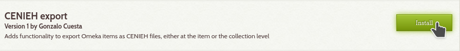

4. En caso de que el *plugin* sea configurable, rellenar el formulario de configuración y hacer clic en el botón "*Save Changes*".

Configurar complementos (*plugins*)
***********************************
Algunos complementos ofrecen la posibilidad de configurar la funcionalidad que implementan.

Para configurar un complemento (*plugin*):

1. Desde el gestor de *plugins* (``/admin/plugins``).
2. Localizar el nombre del complemento que se desea configurar.
3. Hacer clic sobre el botón "*Configure*".

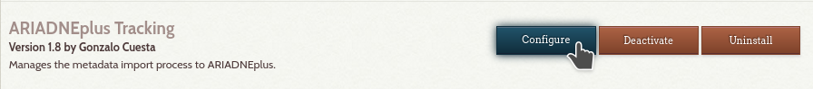

4. Modificar el formulario de configuración y hacer clic en el botón "*Save Changes*".

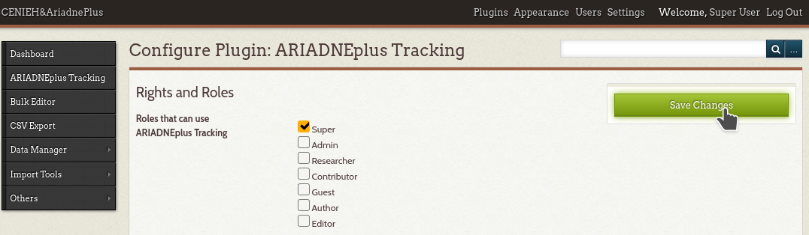

Activar/Desactivar complementos (*plugins*)
*******************************************
Al desactivar un complemento, todas las funciones que incluía en la aplicación desaparecen.

Para activar/desactivar un complemento (*plugin*):

1. Desde el gestor de *plugins* (``/admin/plugins``).
2. Localizar el nombre del complemento que se desea configurar.
3. Hacer clic sobre el botón "*Deactivate*" para desactivar o sobre el botón "*Activate*" para activar.

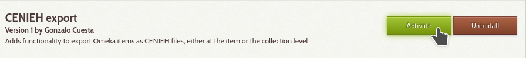

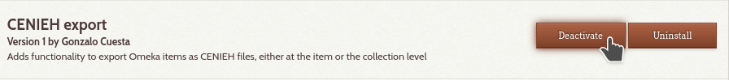

Desinstalar complementos (*plugins*)
************************************
Los complementos pueden ser desinstalados de la aplicación. Al desinstalar un complemento o *plugin* este puede volver a ser instalado siempre y cuando conservemos los ficheros correspondientes en la carpeta ``/plugins`` del directorio raíz de la aplicación.

Para desinstalar un complemento (*plugin*):

1. Desde el gestor de *plugins* (``/admin/plugins``).
2. Localizar el nombre del complemento que se desea desinstalar.
3. Hacer clic sobre el botón "*Uninstall*".

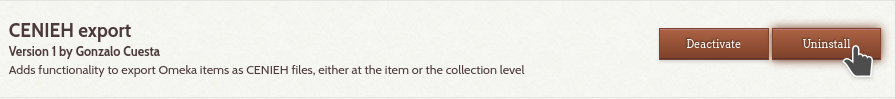

4. En la página actual (``/admin/plugins``), leer las consecuencias de la desinstalación y, en caso de estar conforme, marcar la casilla "*Yes, I want to uninstall this plugin.*".

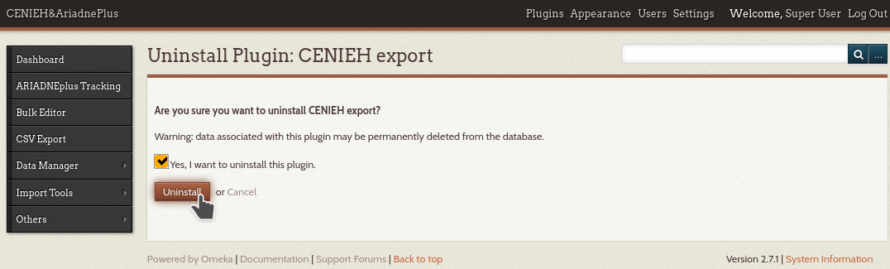

5. Hacer clic sobre el botón rojo "*Uninstall*".

En caso de que deseemos realizar una **desinstalación completa**, es decir, eliminar por completo la extensión de la aplicación, **despues de** ejecutar los pasos previamente mencionados, podemos eliminar los ficheros asociados al *plugin* de la carpeta *plugins* del directorio raíz de la aplicación.

Diseño de la aplicación
^^^^^^^^^^^^^^^^^^^^^^^
Desde la entrada "*Appearance*" del menú global podemos configurar todos los aspectos de la aplicación relacionados con el diseño, que son:

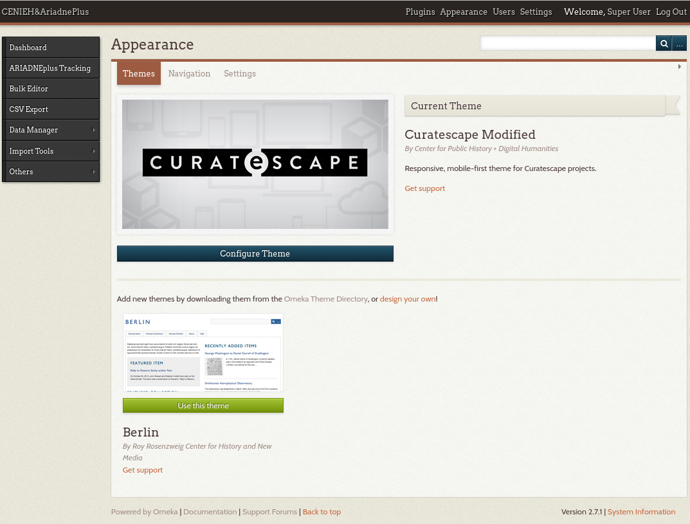

   Vista principal de la página de configuración del diseño de la aplicación.

- *Themes*: permite seleccionar y configurar el tema público de la aplicación.
- *Navigation*: permite gestionar la navegación pública de la aplicación ordenando, editando y añadiendo nuevas entradas. Además se puede seleccionar la página principal (*homepage*).
- *Settings*: permite configurar otros aspectos relacionados con el diseño de la aplicación.

Instalar temas (*themes*)
*************************
.. warning::
   Si se siguieron a rajatabla los pasos de la `Instalación`_, la aplicación ya cuenta el tema (*theme*) propuesto dentro de la carpeta ``/themes/``. Por lo tanto, puedes saltarte el primer paso que ves a continuación e ir directamente a los puntos de instalación. **El nombre del tema propuesto es "Curatescape".**

El primer paso para instalar cualquier tema es descargarlo. Actualmente existen dos sitios desde donde se pueden obtener temas (*themes*):

1. `Página oficial de Omeka <https://omeka.org/classic/themes/>`__
2. `Repositorio de Github <https://daniel-km.github.io/UpgradeToOmekaS/omeka_themes.html>`__

Una vez descargado, se debe transportar la carpeta del tema correspondiente a la carpeta ``/themes/`` del directorio raíz de la aplicación.

Con el tema ya almacenado en la aplicación, se puede llevar a cabo el proceso de instalación desde la plataforma.

Para instalar un tema (*theme*):

1. Desde la página de configuración de diseño (``/admin/appearance/``).
2. Hacer clic sobre la entrada "*Themes*" de la barra de navegación existente.
3. Localizar el nombre del tema que se desea instalar.
4. Hacer clic sobre el botón "*Use this theme*".

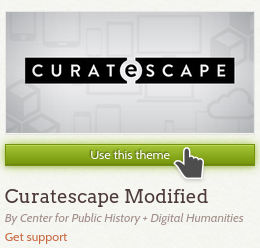

5. En caso de que el tema sea configurable, rellenar el formulario de configuración y hacer clic en el botón "*Save Changes*".

Modificar la navegación pública
*******************************
Es posible modificar ciertos aspectos de la navegación pública de la aplicación.

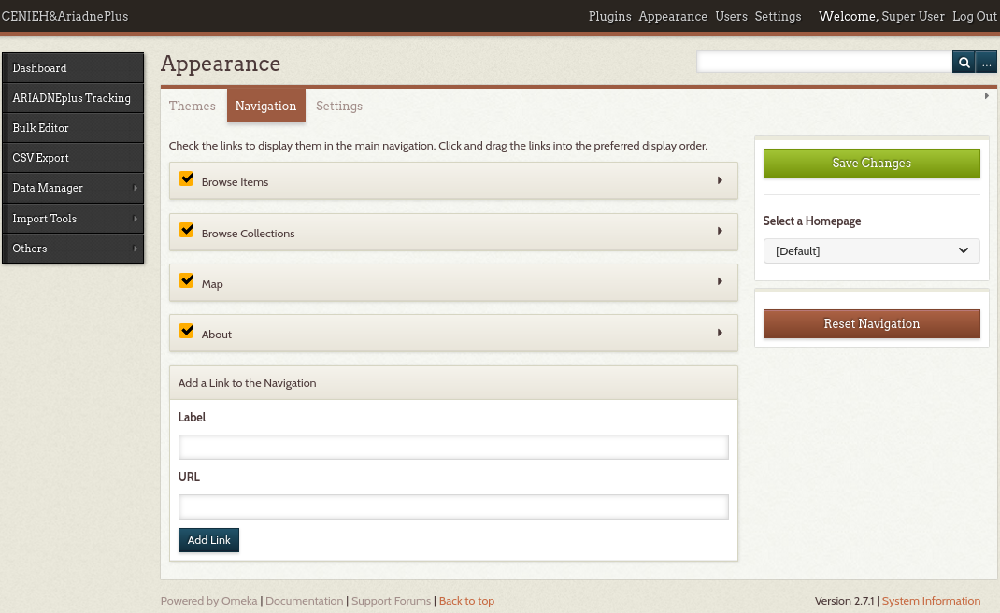

   Vista de la página de configuración de navegación.

Para realizar cambios en la navegación pública de la aplicación:

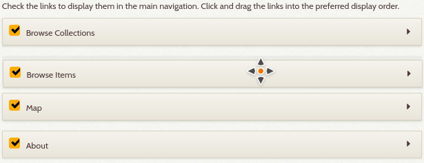

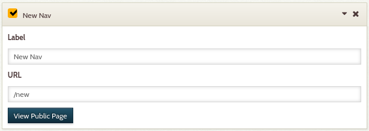

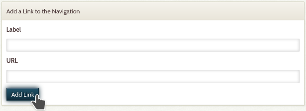

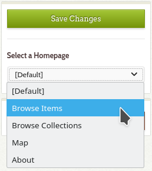

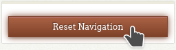

1. Desde la página de configuración de diseño (``/admin/appearance/``).
2. Hacer clic sobre la entrada "*Navigation*" de la barra de navegación existente.
3. Realizar los cambios necesarios:

   a. Cambiar el orden de las entradas de navegación existentes.

      |nav-1|

      1. Seleccionar y desplazar la entrada a la posición deseada.

   b. Editar las entradas de navegación existentes.

      |nav-2|

      1. Clicar sobre la flecha situada en la parte derecha de la entrada.
      2. Realizar los cambios oportunos.

   c. Desactivar las entradas de navegación existentes.

      1. Desmarcar la casilla situada en la parte izquierda de la entrada correspondiente.

   d. Añadir nuevas entradas de navegación.

      |nav-3|

      1. Introducir la etiqueta (*label*) y el enlace (*URL*) correspondiente a la nueva entrada.
      2. Hacer clic sobre el botón "*Add Link*".

   e. Establecer la página de inicio (*homepage*).

      |nav-4|

      1. Seleccionar la entrada que deseamos establecer como *homepage*.

   f. Resetear la configuración de navegación.

      |nav-5|

      1. Hacer clic sobre el botón rojo "*Reset Navigation*".

4. Hacer clic sobre el botón "*Save changes*".

Modificar otros aspectos del diseño de la aplicación
****************************************************
Existen ciertos aspectos del diseño de la aplicación que no están ligados ni a los temas ni a la navegación.

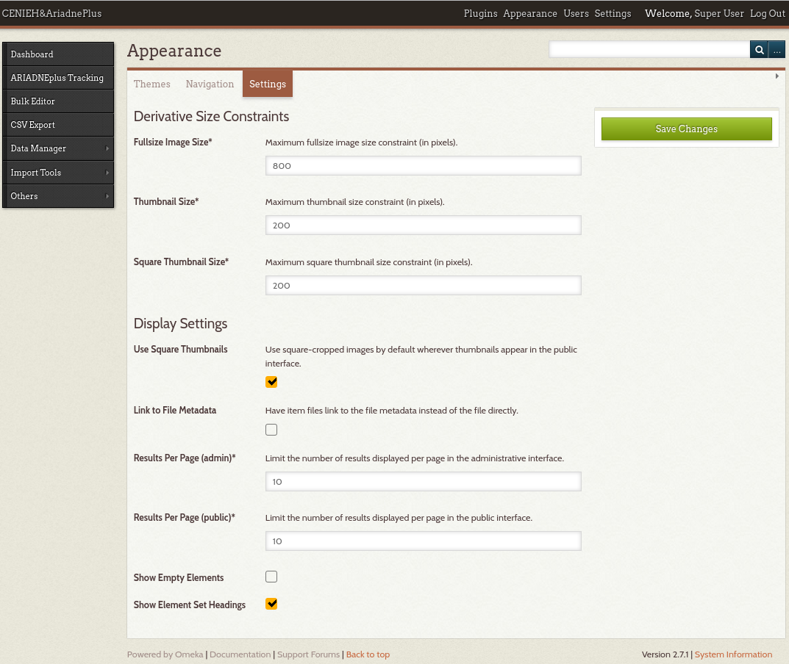

   Vista de la página de configuración de ciertos aspectos del diseño de la aplicación.

Para configurar estos aspectos:

1. Desde la página de configuración de diseño (``/admin/appearance/``).
2. Hacer clic sobre la entrada "*Settings*" de la barra de navegación existente.
3. Realizar los cambios oportunos:

   a. *Fullsize Image Size*: modificar el tamaño máximo de las imágenes.
   b. *Thumbnail Size*: modificar el tamaño de las imágenes en miniatura.
   c. *Thumbnail Size*: modificar el tamaño de las imágenes en miniatura cuadradas.
   d. *Use Square Thumbnails*: usar imágenes en miniatura cuadradas para representar imágenes en la interfaz pública.
   e. *Link to File Metadata*: cuando un ítem tenga un fichero asociado, enlazar el fichero con sus metadatos.
   f. *Results Per Page (admin)*: modificar el número de ítems mostrados por página en el gestor de ítems.
   g. *Results Per Page (public)*: modificar el número de ítems mostrados por página en el buscador de ítems (interfaz pública).
   h. *Show Empty Elements*: mostrar metadatos vacíos.
   i. *Show Element Set Headings*: mostrar el nombre del esquema de metadatos junto a sus elementos.

4. Hacer clic sobre el botón "*Save changes*".

Gestionar Usuarios
^^^^^^^^^^^^^^^^^^
Para acceder al gestor de usuarios se utiliza la entrada "*Users*" del menú global de navegación.

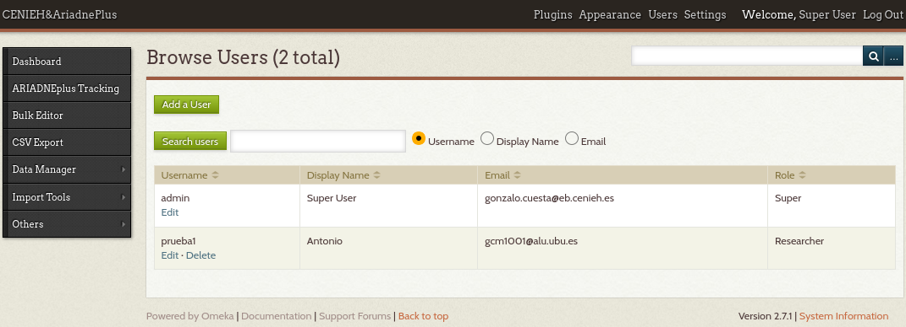

   Vista principal del gestor de usuarios.

Crear un nuevo usuario
**********************
Cuando se crea un usuario se envía un mensaje de confirmación al correo electrónico indicado durante su creación. Este no será activado hasta que se acceda al enlace de confirmación indicado en este mensaje. A través de este enlace se accede a una página donde el usuario debe establecer su contraseña.

Para crear un nuevo usuario:

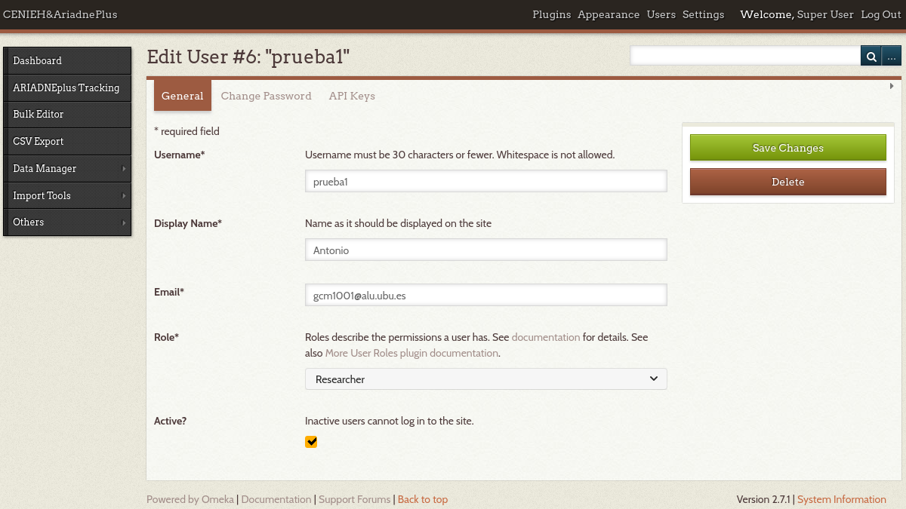

1. Desde el gestor de usuarios (``/admin/users``).
2. Hacer clic sobre el botón "*Add user*" situado en la parte superior izquierda del gestor.
3. En la página actual, especificar:

   |new-user|

   3.1. *Username*: nombre de usuario.
   3.2. *Display Name*: nombre que se mostrará a los demás usuarios.
   3.3. *Email*: correo electrónico.
   3.4. *Role*: rol de usuario. En función del rol un usuario cuenta con unos u otros permisos.

4. Hacer clic sobre el botón "*Add User*" situado en la parte derecha de la pantalla.

Eliminar un usuario
*******************
Al eliminar un usuario, no se eliminan ninguno de los objetos digitales (ítems, colecciones, *tags*, etc.) creados por dicho usuario, sin embargo, estos no podrán volver a ser asociados al usuario eliminado.

Para eliminar un usuario existente:

1. Desde el gestor de usuarios (``/admin/users``).
2. Buscar en la tabla de usuarios el usuario que se pretende eliminar.
3. Una vez localizado, hacer clic sobre el hipertexto "*Delete*" situado justo debajo del nombre de usuario.
4. Confirmar la eliminación haciendo clic sobre el botón rojo "*Delete*".

.. warning::
   No es posible eliminar al usuario creado durante la instalación de la aplicación.

Editar un usuario
*****************
Todos los usuarios existentes en la plataforma pueden ser modificados.

Para editar un usuario existente:

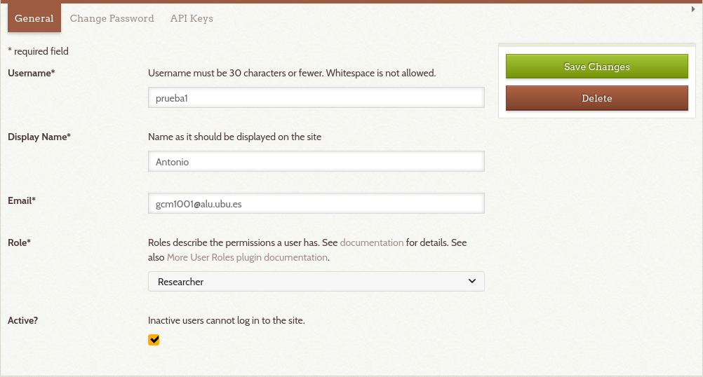

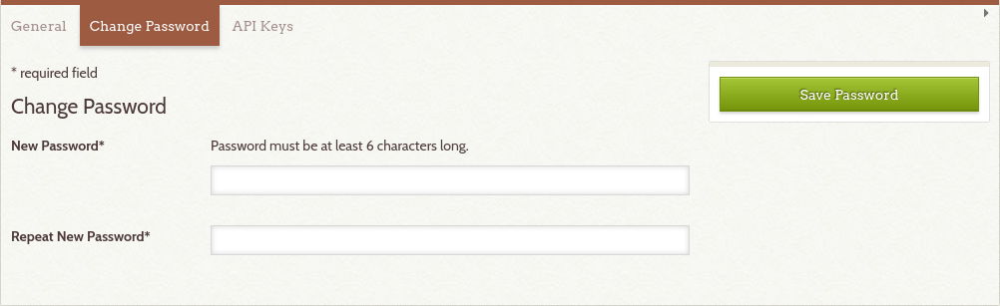

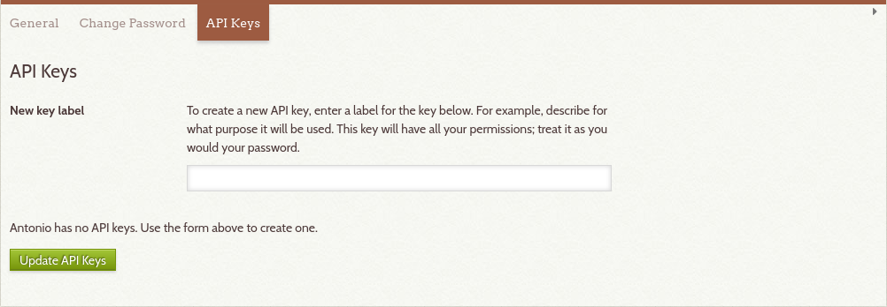

1. Desde el gestor de usuarios (``/admin/users``).
2. Buscar en la tabla de usuarios el usuario que se pretende editar.
3. Una vez localizado, hacer clic sobre el bipertexto "*Edit*" situado justo debajo del nombre de usuario.
4. En la página actual (``/admin/users/edit/<idUser>``), realizar las modificaciones oportunas.

   |user-mod-1|

   * *Username*: cambiar el nombre de usuario.
   * *Display Name*: cambiar el nombre que se mostrará a los demás usuarios.
   * *Email*: cambiar el correo electrónico.
   * *Role*: cambiar el rol de usuario.
   * *Active?*: activar/desactivar el usuario.

   |user-mod-2|

   * Cambiar la contraseña.

   |user-mod-3|

   * Establecer/Cambiar la clave API.

Configuración de la aplicación
^^^^^^^^^^^^^^^^^^^^^^^^^^^^^^
Muchos de los elementos de la aplicación pueden ser configurados. Desde la entrada "*Settings*" del menú global se puede acceder a la página desde donde se realizan estas configuraciones.

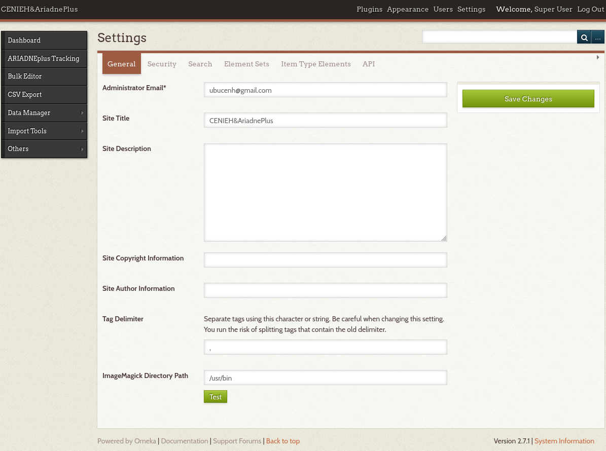

   Vista de la página de configuración principal de la aplicación.

A través de la barra de navegación podemos desplazarnos por las distintas zonas de configuración, cada una de las cuales abarca un aspecto determinado.

Configuración general
*********************
Desde la pestaña "*General*" de la barra de navegación existente en la página de configuración principal de la aplicación (``/admin/settings/``), se pueden llevan a cabo las siguientes configuraciones:

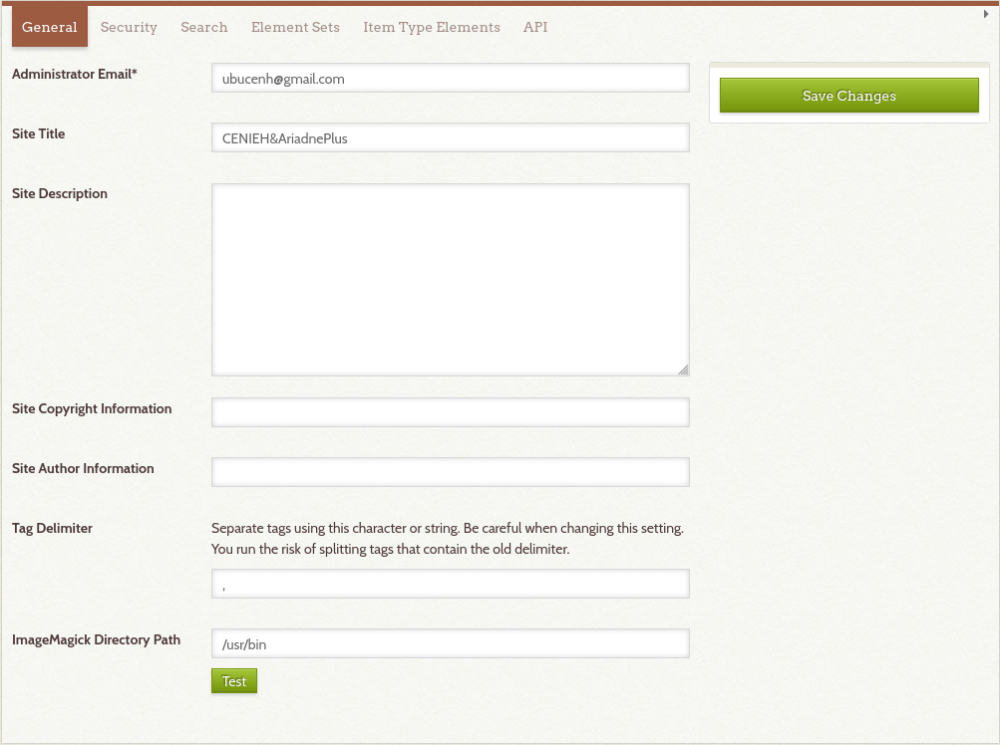

   Vista de la página de configuración principal de la aplicación, apartado "General".

* *Administrator Email*: email de administración.
* *Site Title*: título del sitio.
* *Site Description*: descripción del sitio:
* *Site Copyright Information*: información de *copyright* del sitio.
* *Site Author Information*: información del autor del sitio.
* *Tag Delimiter*: caracter usado para delimitar los *tags* de la aplicación.
* *ImageMagick Directory Path*: directorio donde se encuentra instalada la aplicación *ImageMagick*.

Configuración de la seguridad
******************************
Desde la pestaña "*Security*" de la barra de navegación existente en la página de configuración principal de la aplicación (``mi/admin/settings/``), se pueden llevan a cabo las siguientes configuraciones:

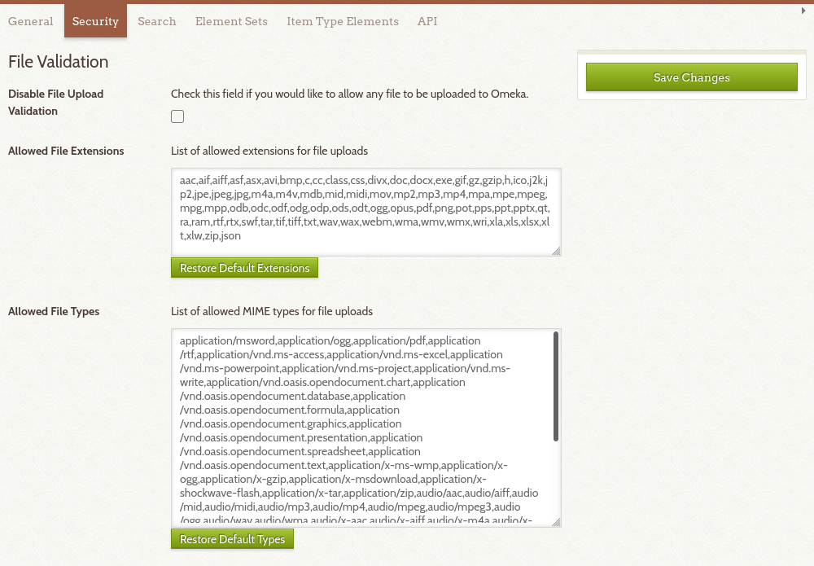

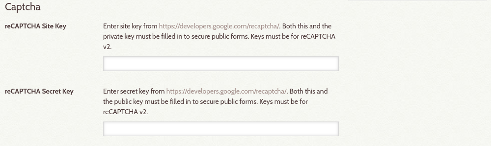

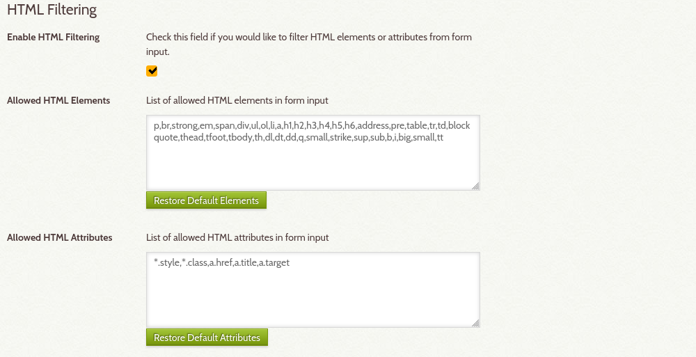

* *File Validation*: configuraciones relacionadas con la validación de ficheros.

   |sec-1|

   * *Disable File Upload Validation*: desactivar/activar la validación de ficheros (se permite cualquier entrada de ficheros).
   * *Allowed File Extensions*: extensiones de ficheros permitidas.
   * *Allowed File Types*: tipos (*MIME Types*) de ficheros permitidos.

* *Captcha*: configuraciones relacionadas con el sistema *Captcha*.

   |sec-2|

   * *reCAPTCHA Site Key*: establecer la clave del sitio utilizada por el sistema *Captcha*.
   * *reCAPTCHA Secret Key*: establecer la clave secreta utilizada por el sistema *Captcha*.

* *HTML Filtering*: configuraciones relacionadas con el filtro HTML.

   |sec-3|

   * *Enable HTML Filtering*: activar/desactivar el filtro HTML.
   * *Allowed HTML Elements*: indicar que elementos HTML pueden pasar el filtro HTML.
   * *Allowed HTML Attributes*: indicar que atributos HTML pueden pasar el filtro HTML.

Configuración de las búsquedas
******************************
Desde la pestaña "*Search*" de la barra de navegación existente en la página de configuración principal de la aplicación (``/admin/settings/``), se pueden llevan a cabo las siguientes configuraciones:

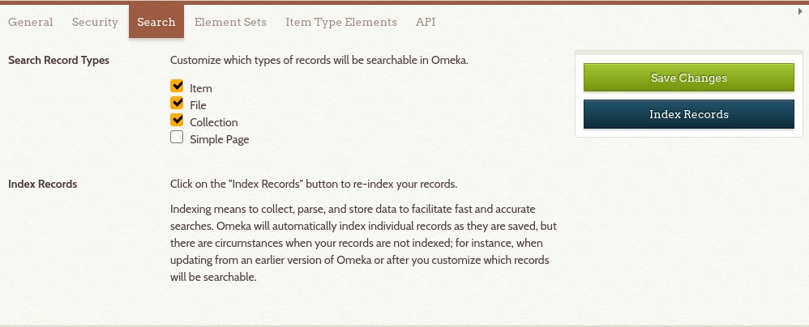

   Vista de la página de configuración principal de la aplicación, apartado "Search".

* *Search Record Types*: seleccionar que objetos digitales pueden ser buscados desde la aplicación.
* *Index Records*: clicar sobre el botón "*Index Records*" si se desea re-indexar todos los objetos digitales.

Configuración de los esquemas de metadatos
******************************************
Desde la pestaña "*Element Sets*" de la barra de navegación existente en la página de configuración principal de la aplicación (``/admin/settings/``), se pueden llevan a cabo las siguientes configuraciones:

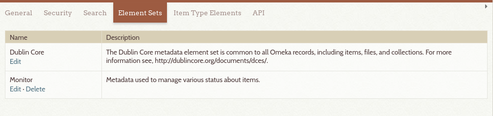

   Vista de la página de configuración principal de la aplicación, apartado "Element Sets".

* *Edit*: editar el esquema de metadatos.
* *Delete*: eliminar el esque de metadatos.

Configuración de los metadatos usados en los tipos de ítem
***********************************************************
Desde la pestaña "*Item Type Elements*" de la barra de navegación existente en la página de configuración principal de la aplicación (``/admin/settings/``), se pueden llevan a cabo las siguientes configuraciones:

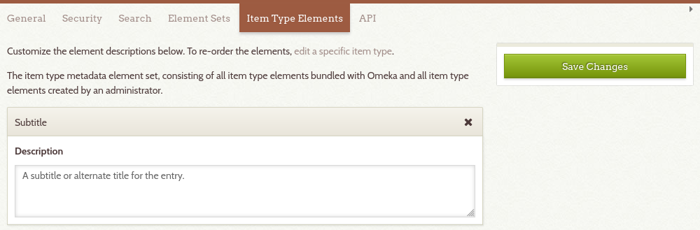

   Vista de la página de configuración principal de la aplicación, pestaña "Item Type Elements".

* *x*: eliminar el elemento (metadato) del esquema de metadatos utilizado por los tipos de ítem.
* *Description*: modificar/añadir una descripción al elemento (metadato) del esquema de metadatos utilizado por los tipos de ítem.

Configuración de la API
***********************
Desde la pestaña "*API*" de la barra de navegación existente en la página de configuración principal de la aplicación (``/admin/settings/``), se pueden llevan a cabo las siguientes configuraciones:

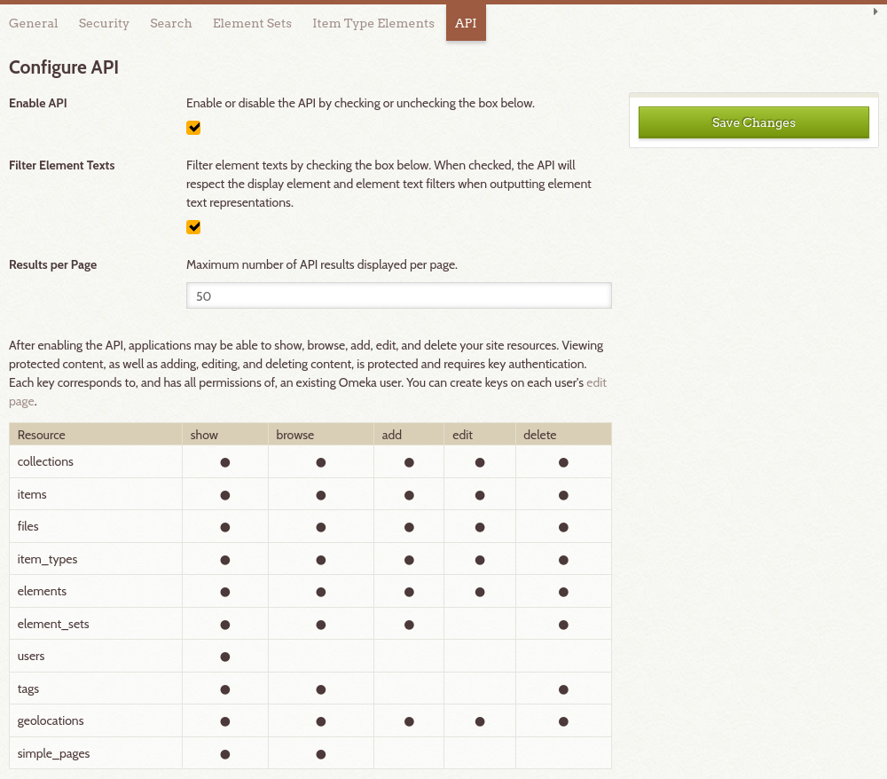

   Vista de la página de configuración principal de la aplicación, pestaña "API".

* *Enable API*: activar/desactivar la API.
* *Filter Element Texts*: activar/desactivar el filtro de esquemas de metadatos.
* *Results per Page*: establecer el número máximo de resultados por página.

Objetos digitales
~~~~~~~~~~~~~~~~~
Dentro de la aplicación nos podemos encontrar con cinco tipos de objetos digitales: **ítems** (*Items*), **colecciones** (*Collections*), **etiquetas** (*Tags*), **ficheros** (*Files*) y **tipos de ítem** (*Item Types*). En este apartado se explica la utilidad de cada uno de ellos y, además, se muestran algunos tutoriales de cómo gestionar estos objetos dentro de la aplicación.

*Items*
^^^^^^^
Los ítems son los **elementos principales** de la aplicación, utilizados para representar a cada uno de los objetos digitales almacenados en esta. A través de la entrada *Items*, dentro de la sección "*Data Manager*" del menú principal, se accede al gestor de ítems (``/admin/items/``), lugar donde se llevan a cabo todas las tareas de gestión relacionadas con este elemento.

.. figure:: ../_static/images/items-view.png
   :name: items-view
   :scale: 60%
   :align: center

   Vista principal del gestor de ítems.

Propiedades de un *Item*
************************
Cada *Item* está formado por:

- 0 o más elementos de información (metadatos).
- 0 o más ficheros (*Files*).
- 0 o más etiquetas (*Tags*).
- 0 o 1 geolocalización (*Geolocation*).

Además, presenta tres valores especiales:

- *Public*: indica si el ítem es público o no.
- *Feature*: indica si el ítem será destacado o no.
- *Collection*: indica si el ítem pertenece a una colección de ítems.

Crear un ítem
*************
Si se desean generar conjuntos de datos desde la aplicación, el primer paso es crear ítems.

.. figure:: ../_static/images/add-items-view.png
   :name: add-items-view
   :scale: 60%
   :align: center

   Vista utilizada para la creación de ítems.

Para crear un ítem:

1. Desde el gestor de ítems (``/admin/items/``).
2. Hacer clic sobre el botón "*Add an Item*" situado en la parte superior de la tabla (ver :numref:`items-view`).
3. En la página actual (``/admin/items/add``), se puede observar una barra de navegación (ver :numref:`add-items-view`). Desde ella se pueden configurar los elementos del ítem:

   a. *Dublin Core*: metadatos del esquema de metadatos *Dublin Core*.
   b. *Item Type Metadata*: metadatos asociados al tipo de *Item*.
   c. *Files*: ficheros asociados.
   d. *Tags*: etiquetas asociadas.
   e. *Map*: geolocalización del ítem.

4. Si queremos asignar el ítem a una colección:

   a. En la parte derecha de la página, debajo del botón "*Add Item*", hay un menú desplegable donde puede asignar el ítem actual a la colección seleccionada.

5. Además, se pueden marcar las casillas "*Public*" y/o "*Feature*" en la parte derecha del formulario, justo debajo del botón "*Add Item*".
6. Para finalizar, hacer clic sobre el botón "*Add Item*".

Editar un ítem
****************
Existen numerosos motivos por los que pueden surgir la necesidad de editar un ítem como, por ejemplo, cambiar el contenido de sus metadatados, agregar/eliminar ficheros, agruparlo a una colección, publicarlo, etc. 

.. figure:: ../_static/images/edit-items-view.png
   :name: edit-items-view
   :scale: 60%
   :align: center

   Vista utilizada para la edición de ítems.

Para editar un ítem existente:

1. Desde el gestor de ítems (``/admin/items/``).
2. Localizar la fila en la que se encuentra el ítem y hacer clic sobre el hipertexto "*Edit*" situado justo debajo del título del ítem (ver :numref:`items-view`).
3. En la página actual (``/admin/item/edit/<itemid>``), se puede observar una barra de navegación (ver :numref:`edit-items-view`). Desde ella se pueden configurar los elementos del ítem:

   a. *Dublin Core*: metadatos del esquema de metadatos *Dublin Core*.
   b. *Item Type Metadata*: metadatos asociados al tipo de ítem.
   c. *Files*: ficheros asociados.
   d. *Tags*: etiquetas asociadas.
   e. *Map*: geolocalización del ítem.

4. Asignar el ítem a una colección:

   a. En la parte derecha de la página, debajo del botón "*Add Item*", hay un menú desplegable donde puede asignar el ítem actual a la colección seleccionada.

5. Además, se pueden marcar las casillas "*Public*"  y/o "*Feature*" situadas en la parte derecha del formulario, justo debajo del botón "*Add Item*".

   a. *Public* para publicar el ítem.
   b. *Feature* para destacar el ítem.

6. Para finalizar, hacer clic sobre el botón "*Save Changes*".

Eliminar un ítem
****************
El gestor de ítems ofrece múltiples formas de eliminar un ítem existente en la plataforma.

*[Opción 1]* Para eliminar un ítem existente:

1. Desde el gestor de ítems (``/admin/items/``).
2. Localizar la fila en la que se encuentra el ítem y hacer clic sobre el hipertexto "*Delete*" situado justo debajo del título del ítem.
3. Confirmar la eliminación del ítem pulsando sobre el botón "*Delete*".

*[Opción 2]* Para eliminar un ítem existente:

1. Desde el gestor de ítems (``/admin/items/``).
2. Localizar la fila en la que se encuentra el ítem y hacer clic sobre el hipertexto "*Edit*" situado justo debajo del título del ítem.
3. En la página actual (``/admin/item/edit/<itemid>``), clicar sobre el botón "*Delete*" situado en la parte derecha del formulario.
4. Confirmar la eliminación del ítem pulsando sobre el botón "*Delete*".

*[Opción 3]* Para eliminar un ítem existente:

1. Desde el gestor de ítems (``/admin/items/``).
2. Localizar la fila en la que se encuentra el ítem y hacer clic sobre la casilla situada en la primera columna de la izquierda de la tabla.
3. Hacer clic sobre el botón "*Delete*" situado en la parte superior derecha de la tabla.
4. En la página actual (``/admin/items/batch-edit``), hacer clic sobre el botón "*Delete Items*" situado en la parte derecha de la página.

Buscar ítems
************
Otro de los servicios que incluye este gestor es la búsqueda de ítems. Cuando entramos a este apartado a través de la sección "*Data Manager*" del menú principal, se nos muestra una lista de ítems ordenados según su fecha de creación (de más recientes a más antiguos).

Como se puede apreciar en la :numref:`items-view`, los ítems son mostrados en una tabla donde cada fila representa a un ítem y cada columna contiene información específica de dicho ítem (título, creador, tipo de ítem y fecha de creación). Existe una columna adicional, en la parte izquierda de la tabla, que se utiliza para seleccionar varios ítems en el caso de que se quieran ejecutar una o varias acciones sobre varios ítems. Para ordenar los ítems en funcion de los campos de la tabla (título, creador y fecha de modificación), se debe clicar sobre el elemento deseado.

.. figure:: ../_static/images/special-items.png
   :name: special-items-view
   :scale: 60%
   :align: center

   Ítems especiales vistos desde el gestor de ítems: el primero es destacado, el segundo es privado y el tercero almacena un fichero (imagen).

Otra particularidad del gestor es que, en función de los valores especiales del ítem, se le da un formato u otro.

- Si al lado del título se encuentra el texto "(*Private*)" , el ítem no es público, es decir, solo será accesible desde la zona de administración.
- Si el fondo del título presenta una estrella, significa que el ítem es destacado (*feature*).
- Si el ítem tiene un archivo (*File*) asociado, se mostrará una miniatura del misma al lado del título.

Por defecto se muestran todos los ítems almacenados en la plataforma, sin embargo, es posible reducir su número ejecutando una búsqueda avanzada o aplicando filtros. De esta manera, se pueden enfocar las labores de gestión sobre unos ítems específicos.

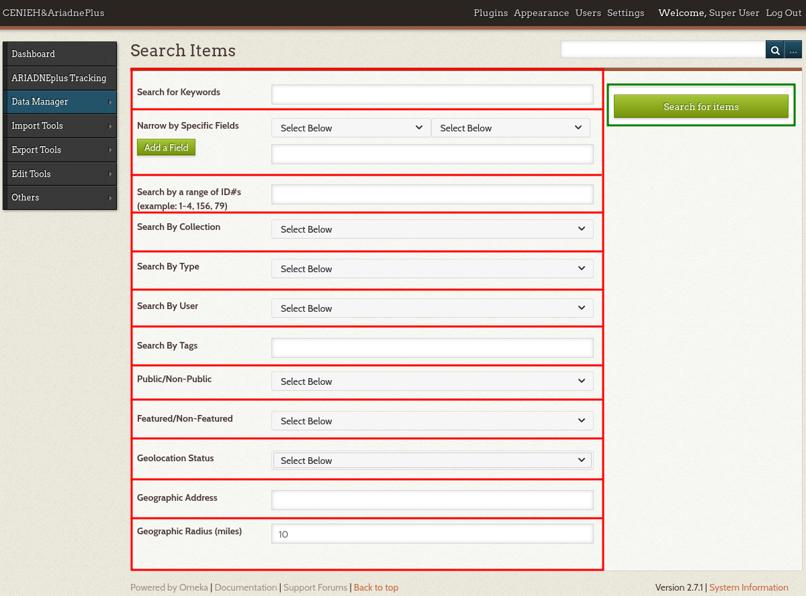

.. |search-filter| image:: ../_static/images/search-filter.png
   :scale: 60%
   :align: middle

Para buscar ítems mediante una búsqueda avanzada:

1. Desde el gestor de ítems (``/admin/items/``).
2. Hacer clic sobre el botón "*Search items*" situado justo encima/debajo de la tabla de ítems.
3. En la página actual (``/admin/items/search``), rellenar el formulario con los datos de búsqueda.

   |advanced-search|

   a. *Search for Keywords*: buscar por una cadena de texto específica (en cualquier elemento).
   b. *Narrow by Specific Fields*: buscar por un elemento (metadato) específico que..

      * *contains*: contenga una cadena de texto
      * *does not contain*: no contenga una cadena de texto
      * *is exactly*: sea exactamente una cadena de texto
      * *is not exactly*: no sea exactamente una cadena de texto
      * *is empty*: esté vacío
      * *is not empty*: no esté vacío
      * *starts with*: empiece por una cadena de texto
      * *ends with*: acabe por una cadena de texto
      * *matches*: coincida con una expresión
      * *does not match*: no coincida con una expresión

   c. *Search by a range of ID*: buscar por rangos de identificadores.
   d. *Search By Collection*: buscar por colección asociada.
   e. *Search By User*: buscar por el usuario que lo creó/importó.
   f. *Search By Tags*: buscar por *tags* asociados.
   g. *Public/Non-Public*: buscar por su estado de publicación.
   h. *Featured/Non-Featured*: buscar por su estado de destacado.
   i. *Geolocation Status*: buscar por su estado de geolocalización.
   j. *Geographic Address*: buscar por la dirección geográfica.
   k. *Geographic Radius*: buscar por el radio geográfico.

4. Hacer clic sobre el botón "*Search for items*".

Para buscar ítems mediante filtros de búsqueda:

1. Desde el gestor de ítems (``/admin/items/``).
2. Hacer clic sobre el desplegable "*Quick Filter*" situado justo encima/debajo de la tabla de ítems.
3. Seleccionar el filtro que se desee aplicar.

   |search-filter|

   a. *View all* (por defecto): ver todos los ítems.
   b. *Public*: ver ítems públicos.
   c. *Private*: ver ítems privados.
   d. *Featured*: ver ítems destacados.

Editar/Eliminar varios ítems a la vez
***************************************
La aplicación te permite modificar o eliminar varios ítems a la vez desde el gestor de ítems.

.. figure:: ../_static/images/batch-edit-view.png
   :name: batch-edit-view
   :scale: 60%
   :align: center

   Vista utilizada para la edición masiva de ítems.

Para editar/eliminar varios ítems a la vez:

1. Desde el gestor de ítems (``/admin/items/``).
2. Buscar los ítems que se quieran eliminar/editar (ver `Buscar ítems`_).
3. Marcar la casilla situada en la parte izquierda de la tabla de todos los ítems que se pretenden editar/eliminar.
   Si se desean seleccionar todos los ítems, hacer clic sobre el botón "*Select all results*" situado en la parte superior izquierda de la tabla.
   Si se desean seleccionar todos los ítems de la página actual, marcar la casilla alojada en la cabecera de la tabla.
4. Hacer clic sobre el botón "*Edit*" situado en la parte superior derecha de la tabla.
5. Al pulsar el botón "*Edit*", desde la página actual (``/admin/items/batch-edit``) podrás:

   * cambiar su accesibilidad (públicos / privados)
   * cambiar su estado (descatados o no destacados)
   * cambiar su tipo
   * cambiar o asociar todos los ítems a una colección
   * añadir etiquetas (*tags*)
   * ordenar los ítems seleccionados por el nombre de su fichero (*file*)
   * eliminar todos los ítems

6. Comprobar en la lista de ítems que todos los ítems seleccionados son correctos. Desmarcar los que no.
7. Hacer clic sobre el botón "*Save Changes*".

Visualizar un ítem completo
***************************
En la página principal del gestor de ítems (``/admin/items/``) solo se pueden visualizar los datos más característicos de cada ítem como su título o tipo. La aplicación te da la posibilidad de visualizar el ítem al completo, junto a todos sus metadatos, ficheros, *tags*, etc.

.. figure:: ../_static/images/show-items-view.png
   :name: show-items-view
   :scale: 60%
   :align: center

   Vista utilizada para visualizar ítems.

Para visualizar un ítem:

1. Desde el gestor de ítems (``/admin/items/``).
2. Buscar el ítem que se quiera visualizar (ver `Buscar ítems`_).
3. Hacer clic sobre el título del ítem, situado en la segunda columna de la tabla.
4. Visualizar el ítem desde la página actual (``/admin/items/show/<idItem>``).

Exportar ítems
**************
A través de este gestor también se pueden exportar ítems almacenados en la plataforma. Desde la página principal (``/admin/items/``) se pueden exportar varios ítems a la vez, sin embargo, desde la página de visualización (``/admin/items/show/<idItem>``) solo es posible exportar un único ítem. Por este motivo, alguno de los formatos de exportación disponibles se encontrarán en una sola vista o en ambas, dependiendo de los requisitos del lenguaje.

.. table:: Formato de exportación disponibles para los Items.
   :name: specialvaluestable
   :widths: auto

   +---------------+-----------+-------------------------------------------+--------------------------------------------------------------------------------------------------------------------------------------------------------------------------------+
   | Formato       | Extensión | Disponibilidad                            | Descripción                                                                                                                                                                    |
   +===============+===========+===========================================+================================================================================================================================================================================+
   | *atom*        | *none*    | `/admin/items/`                           | Esquema de metadatos oficial de *Omeka Classic*                                                                                                                                |
   |               |           |                                           |                                                                                                                                                                                |
   |               |           | `/admin/items/show/<idItem>`              |                                                                                                                                                                                |
   +---------------+-----------+-------------------------------------------+--------------------------------------------------------------------------------------------------------------------------------------------------------------------------------+
   | *dc-rdf*      | .rdf      | `/admin/items/`                           | Serialización `JsonML <http://www.jsonml.org/>`__ del esquema *omeka-xml*.                                                                                                     |
   |               |           |                                           |                                                                                                                                                                                |
   |               |           | `/admin/items/show/<idItem>`              |                                                                                                                                                                                |
   +---------------+-----------+-------------------------------------------+--------------------------------------------------------------------------------------------------------------------------------------------------------------------------------+
   | *dcmes-xml*   | .xml      | `/admin/items/`                           | Instancia `RDF/XML <https://www.w3.org/TR/rdf-syntax-grammar/>`__ del modelo `Dublin Core <http://dublincore.org/documents/dcmes-xml/>`__ simple.                              |
   |               |           |                                           |                                                                                                                                                                                |
   |               |           | `/admin/items/show/<idItem>`              |                                                                                                                                                                                |
   +---------------+-----------+-------------------------------------------+--------------------------------------------------------------------------------------------------------------------------------------------------------------------------------+
   | *json*        | .json     | `/admin/items/`                           | JSON simplificado utilizado principalmente para solicitudes `Ajax <https://en.wikipedia.org/wiki/Ajax_(programming)>`__.                                                       |
   |               |           |                                           |                                                                                                                                                                                |
   |               |           | `/admin/items/show/<idItem>`              |                                                                                                                                                                                |
   +---------------+-----------+-------------------------------------------+--------------------------------------------------------------------------------------------------------------------------------------------------------------------------------+
   | *mobile-json* | .json     | `/admin/items/`                           | Serialización `JsonML <http://www.jsonml.org/>`__ del modelo *omeka-xml*.                                                                                                      |
   |               |           |                                           |                                                                                                                                                                                |
   |               |           | `/admin/items/show/<idItem>`              |                                                                                                                                                                                |
   +---------------+-----------+-------------------------------------------+--------------------------------------------------------------------------------------------------------------------------------------------------------------------------------+
   | *omeka-xml*   | .xml      | `/admin/items/`                           | Esquema de metadatos oficial de *Omeka Classic*                                                                                                                                |
   |               |           |                                           |                                                                                                                                                                                |
   |               |           | `/admin/items/show/<idItem>`              |                                                                                                                                                                                |
   +---------------+-----------+-------------------------------------------+--------------------------------------------------------------------------------------------------------------------------------------------------------------------------------+
   | *rss2*        | .xml      | `/admin/items/`                           | Segunda versión del modelo *srss*.                                                                                                                                             |
   +---------------+-----------+-------------------------------------------+--------------------------------------------------------------------------------------------------------------------------------------------------------------------------------+
   | *srss*        | .xml      | `/admin/items/`                           | Modelo de metadatos empleado para la distribución (o sindicación, del inglés *syndication*) de noticias o información liberada a intervalos de tiempo en sitios web y weblogs. |
   +---------------+-----------+-------------------------------------------+--------------------------------------------------------------------------------------------------------------------------------------------------------------------------------+
   | *CENIEH*      | .xml      | `/admin/items/show/<idItem>`              | Esquema de metadatos empleado para el proceso de integración de datos entre el CENIEH y ARIADNEplus.                                                                           |
   +---------------+-----------+-------------------------------------------+--------------------------------------------------------------------------------------------------------------------------------------------------------------------------------+
   | *CSV*         | .csv      | `/admin/items/`                           | Formato abierto sencillo empleado para representar datos en forma de tabla.                                                                                                    |
   +---------------+-----------+-------------------------------------------+--------------------------------------------------------------------------------------------------------------------------------------------------------------------------------+

Para exportar un único ítem:

1. Desde el gestor de ítems (``/admin/items/``).
2. Buscar el ítem que se quiera exportar (ver `Buscar ítems`_).
3. Hacer clic sobre el título del ítem, situado en la segunda columna de la tabla.
4. Desde la página de visualización del ítem (``/admin/items/show/<idItem>``).
5. Hacer clic sobre el formato de exportación deseado existente en el panel "*Output Formats*" situado en la parte derecha de la pantalla (ver :numref:`show-items-view`).

Para exportar todos los ítems de una página:

1. Desde el gestor de ítems (``/admin/items/``).
2. Buscar los ítems que se quieran exportar (ver `Buscar ítems`_).
3. Hacer clic sobre el formato de exportación deseado de entre todos los que se encuentran en parte inferior de la pantalla, justo debajo de la tabla de ítems (ver :numref:`items-view`).

   a. Para exportar en formato CSV, hay que pulsar el botón situado justo debajo de los demás formatos de exportación.

.. seealso::
   * `Omeka Classic User Manual - Items <https://omeka.org/classic/docs/Content/Items/>`__

*Files*
^^^^^^^
Cuando se añaden nuevos ítems a la plataforma, es posible asociar ficheros (imágenes, documentos, etc.) a los mismos. Por cada uno de ellos se crea un elemento de tipo *File*, el cual contiene información detallada del fichero que se ha subido a la plataforma.

Estos elementos no tienen su propia página de gestión ya que son parte de los ítems, por lo que tiene más sentido que se gestionen desde el gestor de ítems (``/admin/items/``).

Tipos de ficheros admitidos
***************************
La aplicación acepta la gran mayoría de ficheros. Si se tiene algún error o inconveniente durante la subida de un fichero, consulta en este mismo manual cómo ajustar los tipos de fichero o extensiones permitidas en la aplicación.

Tamaño máximo de ficheros
*************************
Lamentablemente, no se puede configurar el tamaño máximo de los ficheros desde la aplicación. Para poder modificarlo, es necesario contactar con el administrador del servidor donde se encuentre alojada la aplicación.

Visualizar un fichero
*********************
A través de la página de visualización de ficheros (``/admin/files/show/<idFile>``) es posible obtener más informacion acerca de un determinado fichero.

.. figure:: ../_static/images/show-files-view.png
   :name: show-files-view
   :scale: 60%
   :align: center

   Vista utilizada para visualizar ficheros.

Para visualizar un fichero:

1. Desde el gestor de ítems (``/admin/items/``).
2. Buscar el ítem que contenga al archivo involucrado (ver `Buscar ítems`_).
3. Hacer clic sobre el título del ítem, situado en la segunda columna de la tabla (ver :numref:`items-view`).
4. Desde la página actual (``/admin/items/show/<idItem>``).
5. Hacer clic sobre la miniatura del fichero (parte superior, justo encima de los metadatos) o bien clicar sobre su nombre (parte derecha, panel "*File Metadata*).

Añadir metadatos a un fichero
*****************************
La aplicación permite asociar metadatos del esquema *Dublin Core* a los ficheros almacenados en la plataforma.

.. figure:: ../_static/images/edit-files-view.png
   :name: edit-files-view
   :scale: 60%
   :align: center

   Vista utilizada para editar ficheros.

[Opción 1] Para añadir metadatos a un fichero:

1. Desde el gestor de ítems (``/admin/items/``).
2. Buscar el ítem que contenga al archivo involucrado (ver `Buscar ítems`_).
3. Hacer clic sobre el hipertexto "*Edit*" situado justo debajo del título del ítem (ver :numref:`items-view`).
4. Desde la página actual (``/admin/items/edit/<idItem>``), acceder a la pestaña "*Files*" (ver :numref:`edit-items-view`).
5. Hacer clic sobre el hipertexto "*Edit*" situado en la parte derecha del nombre del fichero.

[Opción 2] Para añadir metadatos a un fichero:

1. Desde el gestor de ítems (``/admin/items/``).
2. Buscar el ítem que contenga al archivo involucrado (ver `Buscar ítems`_).
3. Hacer clic sobre el título del ítem, situado en la segunda columna de la tabla (ver :numref:`items-view`).
4. Desde la página actual (``/admin/items/show/<idItem>``).
5. En el panel "*File Metadata*", situado en la parte derecha de la pantalla, hacer clic sobre el nombre del fichero al que deseamos añadir metadatos (ver :numref:`show-items-view`)..
6. Desde la página actual (``/admin/files/show/<idFile>``), hacer clic sobre el botón "*Edit*".

.. seealso::
   * `Omeka Classic User Manual - Files <https://omeka.org/classic/docs/Content/Files/>`__

*Collections*
^^^^^^^^^^^^^
Las colecciones pueden ser usadas en una gran variedad de contextos en los que puede tener sentido utilizarlas para tus conjuntos de datos. En la aplicación, un ítem puede pertenecer a una única colección y, como es lógico, una colección puede contener múltiple ítems. A través de la entrada *Collections*, dentro de la sección "*Data Manager*" del menú principal, se accede al espacio (``/admin/collections``) donde se gestionan este tipo de elementos.

.. figure:: ../_static/images/collections-view.png
   :name: collections-view
   :scale: 60%
   :align: center

   Vista principal del gestor de colecciones.

Crear una colección
*******************
Antes de poder agrupar ítems en una colección, esta debe ser creada.

.. figure:: ../_static/images/add-collections-view.png
   :name: add-collections-view
   :scale: 60%
   :align: center

   Vista utilizada para crear colecciones.

Para crear una colección:

1. Desde el gestor de colecciones (``/admin/collections/``).
2. Hacer clic sobre uno de los dos botones "*Add a Collection*".
3. En la página actual (``/admin/collections/add``),  se puede observar una barra de navegación. Desde ella se pueden configurar los elementos de la colección:

   a. *Dublin Core*: metadatos del esquema *Dublin Core*.
   b. *Files*: ficheros asociados.

4. Si se quiere hacer pública la colección, marcar la casilla *Public* situada justo debajo del botón "*Add Collection*". Además, si se quiere destacar la colección, marcar la casilla "*Feature*".
5. Hacer clic sobre "*Add Collection*".

Añadir ítems a una colección
****************************
Las colecciones pueden agrupar un número ilimitado de ítems. Para añadir ítems a una colección existente se debe señalar a la colección en el valor especial "*Collection*" de cada ítem. Esta operación no se puede llevar a cabo desde el gestor de colecciones, debes editar ese campo desde el gestor de ítems (``/admin/items/``).

Para añadir un solo ítem a una colección:

.. figure:: ../_static/images/add-item-collection.png
   :name: add-item-collection
   :scale: 60%
   :align: center

   Añadir un ítem a una colección.

1. Desde el gestor de ítems (``/admin/items/``).
2. Localizar la fila en la que se encuentra el ítem y hacer clic sobre el hipertexto "*Edit*" situado justo debajo del título del ítem.
3. En la página actual (``/admin/item/edit/<itemid>``), en la parte derecha de la pantala, justo debajo del botón "*Add Item*", selecciona la colección en el campo "*Collection*".
4. Hacer clic sobre el botón "*Save Changes*".

Para añadir varios ítems a una colección:

.. figure:: ../_static/images/add-items-collection.png
   :name: add-items-collection
   :scale: 60%
   :align: center

   Añadir varios ítems a una colección.

1. Desde el gestor de ítems (``/admin/items/``).
2. Buscar los ítems que se quieran añadir a la colección.
3. Marcar la casilla situada en la parte izquierda de la tabla de todos los ítems que se pretenden añadir.
   Si se desean seleccionar todos los ítems, hacer clic sobre el botón "*Select all results*" situado en la parte superior izquierda de la tabla.
   Si se desean seleccionar todos los ítems de la página actual, marcar la casilla alojada en la cabecera de la tabla.
4. Hacer clic sobre el botón "*Edit*" situado en la parte superior derecha de la tabla.
5. Desde la página actual (``/admin/items/batch-edit``), seleccionar la colección en el campo "*Collection*".
6. Hacer clic sobre el botón "*Save Changes*".

Editar una colección
********************
Es posible modificar los datos exclusivos de la colección (no de sus ítems) una vez haya sido creada.

.. figure:: ../_static/images/edit-collections-view.png
   :name: edit-collections-view
   :scale: 60%
   :align: center

   Vista utilizada para editar colecciones.

Para editar una colección existente:

1. Desde el gestor de colecciones (``/admin/collections/``).
2. Hacer clic sobre el hipertexto "*Edit*".
3. En la página actual (``/admin/collections/edit/<collectionId>``), realizar las modificaciones oportunas.
4. Hacer clic sobre el botón "*Save Changes*".

Eliminar una colección.
***********************
Al eliminar una colección los ítems que estaban asociados a esta no se eliminan, simplemente se desvinculan. Por tanto, si se pretende eliminar tanto los ítems como la colección asociada, elimina primero los ítems asociados a la colección y, posteriormente, elimina la colección.

Para eliminar una colección existente:

1. Desde el gestor de colecciones (``/admin/collections/``).
2. Hacer clic sobre el hipertexto "*Edit*".
3. En la página actual (``/admin/collections/edit/<collectionId>``), hacer clic sobre el botón "*Delete*".
4. Confirmar la eliminación haciendo de nuevo clic sobre el botón "*Delete*".

Visualizar una colección
************************
Desde la página principal del gestor de colecciones (``/admin/collections/``) solo se muestran algunos datos de cada elemento. Si queremos conocer más información acerca de una colección, tendremos que acceder a su página de visualización.

.. figure:: ../_static/images/show-collections-view.png
   :name: show-collections-view
   :scale: 60%
   :align: center

   Vista utilizada para visualizar colecciones.

Para visualizar una colección:

1. Desde el gestor de colecciones (``/admin/collections/``).
2. Buscar la colección que se quiera visualizar.
3. Hacer clic sobre el título de la colección, situado en la segunda columna de la tabla.
4. Visualizar la colección desde la página actual (``/admin/collections/show/<idItem>``).

.. seealso::
   * `Omeka Classic User Manual - Collections <https://omeka.org/classic/docs/Content/Collections/>`__

*Tags*
^^^^^^
Desde la entrada "*Tags*", dentro de la sección "*Data Manager*"  del menú principal, se accede al gestor de etiquetas o *tags* (``/admin/tags/``). Las etiquetas son palabras clave o frases utilizadas para describir los datos almacenados en la plataforma. Permiten clasificar el contenido de los datos para facilitar su búsqueda. Estas se pueden asociar a ítems.

.. figure:: ../_static/images/tags-view.png
   :name: tags-view
   :scale: 60%
   :align: center

   Vista principal del gestor de etiquetas.

Desde el gestor de etiquetas, en la parte derecha se pueden observar todos los *tags* empleados en cada uno de los ítems existentes en la plataforma, mientras que en la parte izquierda, al lado del menú principal, hay un buscador y una explicación de cómo están representados los *tags*.

Ordenar *tags*
**************
Es posible ordenar las etiquetas en función de su nombre, número de apariciones, o fecha en la que se creó.

Para ordenar etiquetas:

1. Desde el gestor de etiquetas (``/admin/tags/``).
2. Hacer clic sobre alguno de los botones que se encuentran encima del conjunto de etiquetas.

   a. *Name*: se ordenan alfabéticamente por el nombre de cada etiqueta.
   b. *Count*: se ordenan en función del número de ítems asociado a cada etiqueta.
   c. *Date created*: se ordenan por fecha de creación. Por defecto más antiguos primero.

.. figure:: ../_static/images/tags-order-buttons.png
   :name: tags-order-buttons
   :scale: 100%
   :align: center

   Botones para ordenar etiquetas o *tags*.

Buscar *tags*
*************
Se pueden buscar etiquetas por su nombre.

.. figure:: ../_static/images/tags-search.png
   :name: tags-search
   :scale: 100%
   :align: center

   Botones para ordenar etiquetas o *tags*.

Para buscar etiquetas:

1. Desde el gestor de etiquetas (``/admin/tags/``).
2. Escribir el nombre de la etiqueta que se está buscando sobre el cuadro de texto situado en la parte izquierda de la pantalla.
3. Hacer clic sobre el botón "*Search tags*".

Para volver al estado de búsqueda inicial:

1. Desde el gestor de etiquetas (``/admin/tags/``).
2. Hacer clic sobre el botón "*Reset results*".

Editar *tags*
*************
Una vez creada una etiqueta, se puede modificar el nombre de esta. Este cambió se aplicará en todos los ítems que contengan a dicha etiqueta.

.. figure:: ../_static/images/tags-edit.png
   :name: tags-edit
   :scale: 100%
   :align: center

   Botones para ordenar etiquetas o *tags*.

Para editar una etiqueta:

1. Desde el gestor de etiquetas (``/admin/tags/``).
2. Buscar la etiqueta que se desea editar dentro del conjunto de etiquetas situado en la parte derecha de la pantalla.
3. Hacer clic sobre el nombre de la etiqueta.
4. Introducir el nuevo valor en el campo de texto emergente.
5. Pulsar la tecla '*Enter*' o clicar sobre cualquier punto externo.

Eliminar *tags*
***************
Es posible eliminar una o varias etiquetas a la vez. Es importante recalcar que, cuando se elimina una etiqueta, los ítems que están asociados no no se eliminan, simplemente se desvinculan de esta.

Para eliminar una sola etiqueta:

1. Desde el gestor de etiquetas (``/admin/tags/``).
2. Buscar la etiqueta que se desea eliminar dentro del conjunto de etiquetas situado en la parte derecha de la pantalla.
3. Hacer clic sobre botón "*x*" situado en la parte derecha de la etiqueta.
4. Confirmar la eliminación haciendo clic sobre el botón "*Delete*".

Para eliminar varias etiquetas a la vez:

1. Desde el gestor de etiquetas (``/admin/tags/``).
2. Buscar las etiquetas que se desean eliminar haciendo uso del buscador. Si se desean eliminar todas las etiquetas, ignorar este paso.
3. Hacer clic sobre botón rojo "*Delete results*" en caso de haber hecho una búsqueda, sino, hacer clic sobre el botón "*Delete all*".
4. Confirmar la eliminación haciendo clic sobre el botón "*Yes*".

Ver ítems asociados a una etiqueta
**********************************
Se pueden obtener todos los ítems asociados a una determinada etiqueta.

Para ello:

1. Desde el gestor de etiquetas (``/admin/tags/``).
2. Buscar la etiqueta que se desea eliminar dentro del conjunto de etiquetas situado en la parte derecha de la pantalla.
3. Hacer clic sobre el contador situado en la parte izquierda de la etiqueta.

.. seealso::
   * `Omeka Classic User Manual - Tags <https://omeka.org/classic/docs/Content/Tags/>`__

*Item Types*
^^^^^^^^^^^^
Cada ítem puede pertenecer a un determinado tipo, el cual aporta elementos extra al ítem. Por ejemplo, si un ítem hace referencia a una persona, puede resultar interesante indicar su fecha de nacimiento, fecha de muerte, ocupación, etc. Como el esquema de metadatos principal (*Dublin Core*) no contiene elementos que cubran esta información, atribuyendo un tipo al ítem se pueden incluir nuevos elementos que satisfazcan esa necesidad.

.. figure:: ../_static/images/item-type-view.png
   :name: item-type-view
   :scale: 60%
   :align: center

   Vista principal del gestor de tipos de ítem.

A través de la entrada "*Item Types*", dentro de la sección "*Data Manager*" del menú principal de administración, se puede acceder al gestor de tipos de ítem (``/admin/item-types``).

Tipos de ítem predefinidos
**************************
Cuando se accede al gestor de tipos de ítem (``/admin/item-types``) por primera vez se observan un conjunto de tipos de ítems ya definidos.

.. table:: Tipos de ítem predefinidos.
   :name: itemtypes
   :widths: auto

   +--------------------------+-----------------------------------------------------------------------------------------------------------------+---------------------------------------------------------+
   | Tipo de ítem             | Descripción                                                                                                     | Ejemplos                                                |
   +==========================+=================================================================================================================+=========================================================+
   | **Text**                 | Recurso cuyo principal contenido es texto                                                                       | Poemas, libros, cartas, artículos, etc.                 |
   +--------------------------+-----------------------------------------------------------------------------------------------------------------+---------------------------------------------------------+
   | **Moving Image**         | Conjunto de imágenes que puestas en sucesión imparten una sensación de movimiento                               | Animaciones, videos, películas, etc.                    |
   +--------------------------+-----------------------------------------------------------------------------------------------------------------+---------------------------------------------------------+
   | **Oral History**         | Recurso que contiene datos históricos obtenidos a partir de conferencias, charlas o reuniones.                  | Charlas, conferencias, entrevistas, etc.                |
   +--------------------------+-----------------------------------------------------------------------------------------------------------------+---------------------------------------------------------+
   | **Sound**                | Recurso cuyo principal cometido es ser escuchado.                                                               | Audios de cualquier tipo                                |
   +--------------------------+-----------------------------------------------------------------------------------------------------------------+---------------------------------------------------------+
   | **Still Image**          | Representación visual estática.                                                                                 | Pinturas, dibujos, planos, mapas, etc.                  |
   +--------------------------+-----------------------------------------------------------------------------------------------------------------+---------------------------------------------------------+
   | **Website**              | Recurso almacenado en una o varias páginas web.                                                                 | Página web                                              |
   +--------------------------+-----------------------------------------------------------------------------------------------------------------+---------------------------------------------------------+
   | **Event**                | Ocurrencia no persistente basada en el tiempo.                                                                  | Conferencia, *Workshop*, Exhibición, etc.               |
   +--------------------------+-----------------------------------------------------------------------------------------------------------------+---------------------------------------------------------+
   | **Email**                | Recurso cuyo contenido es el propio de un mensaje de correo electrónido (asunto, cuerpo, origen, destino, etc.) | Mensaje de correo electrónico                           |
   +--------------------------+-----------------------------------------------------------------------------------------------------------------+---------------------------------------------------------+
   | **Leson Plan**           | Recurso cuyo contenido ofrece una descripción detallada de un curso de formación.                               | Curso de formación                                      |
   +--------------------------+-----------------------------------------------------------------------------------------------------------------+---------------------------------------------------------+
   | **Hyperlink**            | Recurso existente en Internet.                                                                                  | Enlace, Referencia, etc.                                |
   +--------------------------+-----------------------------------------------------------------------------------------------------------------+---------------------------------------------------------+
   | **Person**               | Un individuo.                                                                                                   | Persona.                                                |
   +--------------------------+-----------------------------------------------------------------------------------------------------------------+---------------------------------------------------------+
   | **Interactive Resource** | Recurso que requiere la interacción del usuario para ser entenido, ejecutado o experimentado                    | Formularios, Aplicaciones, Entornos virtuales, etc.     |
   +--------------------------+-----------------------------------------------------------------------------------------------------------------+---------------------------------------------------------+
   | **Dataset**              | Datos codificados en una determinada estructura.                                                                | Metadatos.                                              |
   +--------------------------+-----------------------------------------------------------------------------------------------------------------+---------------------------------------------------------+
   | **Physical Object**      | Objeto o sustancia inanimada.                                                                                   | Cualquier objeto físico (e.g una piedra).               |
   +--------------------------+-----------------------------------------------------------------------------------------------------------------+---------------------------------------------------------+
   | **Service**              | Sistema que provee una o más funciones.                                                                         | Servicio de repostería, autentificación, bancario, etc. |
   +--------------------------+-----------------------------------------------------------------------------------------------------------------+---------------------------------------------------------+
   | **Software**             | Programa de ordenador.                                                                                          | Archuvos .java, .exe, etc.                              |
   +--------------------------+-----------------------------------------------------------------------------------------------------------------+---------------------------------------------------------+
   | **Curatescape Story**    | Historia narrativa que puede ser representada de forma especial por el tema *Curatescape*.                      | Rutas, viajes, etc.                                     |
   +--------------------------+-----------------------------------------------------------------------------------------------------------------+---------------------------------------------------------+

Editar un tipo de ítem
**********************
Se pueden modificar tipos de ítem existentes para modificar sus elementos (metadatos).

.. figure:: ../_static/images/edit-item-type.png
   :name: edit-item-type
   :scale: 60%
   :align: center

   Vista desde donde se edita un tipo de ítem.

Para modificar un tipo de ítem existente:

1. Desde el gestor de tipos de ítem (``/admin/item-types``).
2. Localizar el tipo de ítem que se desea editar en la tabla donde se encuentran todos los tipos (ver :numref:`item-type-view`).
3. Hacer clic sobre el hipertexto "*Edit*", situado justo debajo del nombre del tipo.
4. En la página actual (``/admin/item-types/edit/<idItemType>``), realizar las modificaciones oportunas (ver `Crear un tipo de ítem`_).
5. Hacer clic sobre el botón "*Save changes*" situado en la parte superior derecha de la pantalla.

Crear un tipo de ítem
**********************
En caso de que ninguno de los tipos de ítem predefinidos (ver :numref:`itemtypes`) cubra nuestras necesidades, se puede crear un nuevo tipo de ítem.

.. figure:: ../_static/images/add-item-type.png
   :name: add-item-type
   :scale: 60%
   :align: center

   Vista desde donde se añade un tipo de ítem

.. |it-name| image:: ../_static/images/name-item-type.png
   :scale: 100%
   :align: middle

.. |it-desc| image:: ../_static/images/desc-item-type.png
   :scale: 100%
   :align: middle

.. |it-e1| image:: ../_static/images/exi-item-type-1.png
   :scale: 100%
   :align: middle

.. |it-e2| image:: ../_static/images/exi-item-type-2.png
   :scale: 100%
   :align: middle

.. |it-n1| image:: ../_static/images/new-item-type-1.png
   :scale: 100%
   :align: middle

.. |it-n2| image:: ../_static/images/new-item-type-2.png
   :scale: 100%
   :align: middle

Para crear un tipo de ítem nuevo:

1. Desde el gestor de tipos de ítem (``/admin/item-types``).
2. Hacer clic sobre el botón "*Add an Item Type*", situado en la parte superior/inferior de la pantalla (ver :numref:`item-type-view`).
3. En la página actual (``/admin/item-types/add``):

   3.1. Establecer un nombre

   |it-name|

   3.2. Establecer una descripción

   |it-desc|

   3.3. Añadir un elemento existente.

      3.3.1. Seleccionar "*Existing*".

      3.3.2. Hacer clic sobre el botón "*Add element*".

      |it-e1|

      3.3.3. En el bloque del elemento emergente, seleccionar el elemento existente.

      |it-e2|

   3.4. Añadir un elemento nuevo

      1. Seleccionar "*New*".
      2. Hacer clic sobre el botón "*Add element*".

      |it-n1|

      3. En el bloque del elemento emergente, establecer el nombre y descripción del elemento.

      |it-n2|

4. Hacer clic sobre el botón "*Add Item Type*" situado en la parte superior derecha de la pantalla.

Visualizar un tipo de ítem
**************************
Antes de realizar tareas de gestión sobre un determinado tipo de ítem, se puede comprobar el estado actual del mismo.

.. figure:: ../_static/images/show-item-type.png
   :name: show-item-type
   :scale: 60%
   :align: center

   Vista desde donde se visualiza un tipo de ítem.

Para visualizar un tipo de ítem existente.

1. Desde el gestor de tipos de ítem (``/admin/item-types``).
2. Localizar el tipo de ítem que se desea eliminar en la tabla donde se encuentran todos los tipos (ver :numref:`item-type-view`).
3. Hacer clic sobre el nombre del tipo de ítem.
4. Visualizar el tipo de ítem en la página actual (``/admin/item-types/show/<idItemType>``).

Eliminar un tipo de item
************************
Al eliminar un tipo de ítem no se eliminan los elementos (metadatos) asignados al tipo de ítem. Sin embargo, todos los ítems que tengan asignado el tipo de ítem eliminado, perderán todos los metadatos especificados por el tipo de ítem.

[Opción 1] Para eliminar un tipo de ítem existente:

1. Desde el gestor de tipos de ítem (``/admin/item-types``).
2. Localizar el tipo de ítem que se desea eliminar en la tabla donde se encuentran todos los tipos (ver :numref:`item-type-view`).
3. Hacer clic sobre el hipertexto "*Edit*", situado justo debajo del nombre del tipo.
4. En la página actual (``/admin/item-types/edit/<idItemType>``), hacer clic sobre el botón rojo "*Delete*"  (ver :numref:`show-item-type`).
5. Confirmar la eliminación volviendo a pulsar sobre el botón "*Delete*".

[Opción 2] Para eliminar un tipo de ítem existente:

1. Desde el gestor de tipos de ítem (``/admin/item-types``).
2. Localizar el tipo de ítem que se desea eliminar en la tabla donde se encuentran todos los tipos (ver :numref:`item-type-view`).
3. Hacer clic sobre el nombre del tipo de ítem.
4. En la página actual (``/admin/item-types/show/<idItemType>``), hacer clic sobre el botón rojo "*Delete*".
5. Confirmar la eliminación volviendo a pulsar sobre el botón "*Delete*".

.. seealso::
   `Omeka Classic User Manual - Item Types <https://omeka.org/classic/docs/Content/Item_Types/>`__

Complementos (*plugins*)
~~~~~~~~~~~~~~~~~~~~~~~~

*CSV Import+*
^^^^^^^^^^^^^
Este complemento nos ofrece una herramienta que nos permite importar conjuntos de datos que están dispuestos en formato CSV. Se puede acceder a esta herramienta (``/admin/csv-import-plus/``) desde el menú principal de navegación a través de la entrada "*CSV Import+*", dentro de la sección "*Import Tools*".

.. figure:: ../_static/images/csv-import-plus-1.png
   :name: csv-import-plus-1
   :scale: 60%
   :align: center

   Vista principal de la herramienta *CSV Import+*.

Cuando se accede a esta herramienta, se nos muestra el primer paso a realizar para llevar a cabo la importación (ver :numref:`csv-import-plus-1`). Este es un formulario donde el usuario debe configurar los aspectos de la importación.

.. figure:: ../_static/images/csv-import-plus-2.png
   :name: csv-import-plus-2
   :scale: 60%
   :align: center

   Vista correspondiente al paso 2 del proceso de importación de la herramienta *CSV Import+*.

Además, existe un segundo paso opcional, donde se lleva a cabo el mapeo de datos de forma manual (ver :numref:`csv-import-plus-2`).

.. figure:: ../_static/images/csv-import-plus-status.png
   :name: csv-import-plus-status
   :scale: 60%
   :align: center

   Vista desde donde se visualizan los registros de la herramienta *CSV Import+*.

Tras finalizar el recorrido de importación, es posible visualizar el registro de cada importación desde la misma herramienta (``/admin/csv-import-plus/``), dentro de la pestaña "*Status*".

Importar datos CSV
******************
Antes de iniciar este proceso, es muy importante que el usuario que lo lleve a cabo conozca los datos que está importando para configurar adecuadamente el proceso de importación.

Para importar datos CSV:

1. Desde el complemento *CSV Import+* (``/admin/csv-import-plus/``).
2. En la pestaña *Import* (ver :numref:`csv-import-plus-1`), rellenar el formulario correspondiente al paso 1 (*Step 1: Select file and item settings*). **Es muy recomendable** dejar los valores por defecto (ver :numref:`formImport`).

   a. Hacer clic sobre el botón "*Next*".

4. Al seleccionar la opción *Perhaps, so the mapping should be done manually* para el campo *Contains extra data*, se debe completar un segundo paso (ver :numref:`csv-import-plus-2`) :

   a. Establecer las relaciones entre los elementos de origen (e.g *Localización*) y los elementos de destino (e.g. *Dublin Core:Spatial Coverage*) haciendo uso de la columna *Map To Element*.
   b. Si alguno de los elementos tiene contenido HTML, indícalo en la columna *Use HTML?*.
   c. Si alguno de los elementos representa un valor especial (ver :numref:`specialvalues`), selecciona dicho valor en la columna *Special Values*.

      - **Es obligatorio** que el conjunto de datos cuente con un único elemento que contega el identificador de cada registro. Luego siempre existirá un elemento con el valor especial *Identifier*.

   d. Si alguno de los elementos no pertenece a ningún elemento estandarizado, sino que pertenece a otro elemento de otro tipo de objeto, se debe indicar en la casilla *Extra Data?*.
   e. Hacer clic sobre el botón *Import CSV file*.

5. Puedes visualizar el progreso de la importación desde la pestaña *Status* (ver :numref:`csv-import-plus-status`).

Tablas de configuración
***********************

.. table:: Formulario de configuración de la herramienta de importación CSV Import+
   :name: formImport
   :widths: auto

   +----------------------------------------------------------------------------------------+------------------------------------------------------------------------------------------------------------------------------------------------------------------------------+---------------------------------------------------------------------------------------------------------------------------------+-----------------------------------------------------+
   |                                         Sección                                        |                                                                                     Campo                                                                                    |                                                              Valor                                                              |                  Valor por defecto                  |
   +========================================================================================+==============================================================================================================================================================================+=================================================================================================================================+=====================================================+
   | **Upload**: adjuntar el fichero CSV a importar                                         | **Upload CSV file**: fichero CSV que se pretende importar.                                                                                                                   |                                                                                                                                 |                                                     |
   +----------------------------------------------------------------------------------------+------------------------------------------------------------------------------------------------------------------------------------------------------------------------------+---------------------------------------------------------------------------------------------------------------------------------+-----------------------------------------------------+
   | **CSV Format**: configurar el formato CSV del fichero adjuntado                        | **Column Delimiter**: caracter utilizado para separar las columnas.                                                                                                          | - **comma**: ','                                                                                                                | **Coma**                                            |
   |                                                                                        |                                                                                                                                                                              | - **Semi-colon**: ';'                                                                                                           |                                                     |
   |                                                                                        |                                                                                                                                                                              | - **Colon**: '.'                                                                                                                |                                                     |
   |                                                                                        |                                                                                                                                                                              | - **pipe**: '|'                                                                                                                 |                                                     |
   |                                                                                        |                                                                                                                                                                              | - **tabulation**: '    '                                                                                                        |                                                     |
   |                                                                                        |                                                                                                                                                                              | - **carriage return**: '↵'                                                                                                      |                                                     |
   |                                                                                        |                                                                                                                                                                              | - **space**: ' '                                                                                                                |                                                     |
   |                                                                                        |                                                                                                                                                                              | - **custom**: ?                                                                                                                 |                                                     |
   |                                                                                        +------------------------------------------------------------------------------------------------------------------------------------------------------------------------------+---------------------------------------------------------------------------------------------------------------------------------+-----------------------------------------------------+
   |                                                                                        | **Enclosure**: caracter utilizado para delimitar las columnas.                                                                                                               | - **double quote**: '"'                                                                                                         | **double quote**                                    |
   |                                                                                        |                                                                                                                                                                              | - **single quote**: '''                                                                                                         |                                                     |
   |                                                                                        |                                                                                                                                                                              | - **custom**: ?                                                                                                                 |                                                     |
   |                                                                                        +------------------------------------------------------------------------------------------------------------------------------------------------------------------------------+---------------------------------------------------------------------------------------------------------------------------------+-----------------------------------------------------+
   |                                                                                        | **Element delimiter**: caracter utilizado para separar metadatos dentro de una misma celda.                                                                                  | - **comma**: ','                                                                                                                | **Semi-colon**                                      |
   |                                                                                        +------------------------------------------------------------------------------------------------------------------------------------------------------------------------------+ - **Semi-colon**: ';'                                                                                                           +-----------------------------------------------------+
   |                                                                                        | **Tag delimiter**: caracter utilizado para separar *tags* dentro de una misma celda.                                                                                         | - **Colon**: '.'                                                                                                                | **comma**                                           |
   |                                                                                        |                                                                                                                                                                              | - **pipe**: '|'                                                                                                                 |                                                     |
   |                                                                                        | **Si tus datos no contienen tags, puedes ignorarlo**.                                                                                                                        | - **tabulation**: '    '                                                                                                        |                                                     |
   |                                                                                        +------------------------------------------------------------------------------------------------------------------------------------------------------------------------------+ - **carriage return**: '↵'                                                                                                      +-----------------------------------------------------+
   |                                                                                        | **File delimiter**: caracter utilizado para separar rutas de archivos o *URLs* dentro de una misma celda.                                                                    | - **space**: ' '                                                                                                                | **comma**                                           |
   |                                                                                        |                                                                                                                                                                              | - **double space**: '  '                                                                                                        |                                                     |
   |                                                                                        | **Si tus datos no referencian ficheros, puedes ignorarlo.**                                                                                                                  | - **custom**: ?                                                                                                                 |                                                     |
   +----------------------------------------------------------------------------------------+------------------------------------------------------------------------------------------------------------------------------------------------------------------------------+---------------------------------------------------------------------------------------------------------------------------------+-----------------------------------------------------+
   | **Default values**: configurar los valores por defecto para todos los ítems a importar | **Item type**: tipo de ítem que pretendemos importar.                                                                                                                        | - **No default item type**                                                                                                      | **No default item type**                            |
   |                                                                                        |                                                                                                                                                                              | - **Tipo de ítem**                                                                                                              |                                                     |
   |                                                                                        +------------------------------------------------------------------------------------------------------------------------------------------------------------------------------+---------------------------------------------------------------------------------------------------------------------------------+-----------------------------------------------------+
   |                                                                                        | **Collection**: colección a la que pertenecen los ítems.                                                                                                                     | - **No default collection**                                                                                                     | **No default collection**                           |
   |                                                                                        |                                                                                                                                                                              | - **Colección**                                                                                                                 |                                                     |
   |                                                                                        | **Si el fichero contiene muchos ítems, conviene agruparlos dentro de una colección previamente creada.**                                                                     |                                                                                                                                 |                                                     |
   |                                                                                        +------------------------------------------------------------------------------------------------------------------------------------------------------------------------------+---------------------------------------------------------------------------------------------------------------------------------+-----------------------------------------------------+
   |                                                                                        | **Make records public**: activado, se publicarán los ítems tras la importación                                                                                               | - **Activado**                                                                                                                  | **Desactivado**                                     |
   |                                                                                        +------------------------------------------------------------------------------------------------------------------------------------------------------------------------------+ - **Desactivado**                                                                                                               |                                                     |
   |                                                                                        | **Feature**: activado, se marcarán los ítems importados como *feature*.                                                                                                      |                                                                                                                                 |                                                     |
   |                                                                                        +------------------------------------------------------------------------------------------------------------------------------------------------------------------------------+                                                                                                                                 |                                                     |
   |                                                                                        | **Elements are html**: activado, se considerará que el contenido de los ítems está en html.                                                                                  |                                                                                                                                 |                                                     |
   +----------------------------------------------------------------------------------------+------------------------------------------------------------------------------------------------------------------------------------------------------------------------------+---------------------------------------------------------------------------------------------------------------------------------+-----------------------------------------------------+
   | **Process**: configurar el proceso de importación.                                     | **Identifier field**: elemento que señala el identificador de cada ítem.                                                                                                     | - **No default identifier field**: no se especifica ningún campo como identificador.                                            | **No default identifier field**                     |
   |                                                                                        |                                                                                                                                                                              | - **Table identifier**: columna "table id" o "Identifier" de la tabla CSV del fichero adjuntado.                                |                                                     |
   |                                                                                        |                                                                                                                                                                              | - **Internal id**: identificador interno del registro en la aplicación.                                                         |                                                     |
   | **Las opciones por defecto son válidas para cualquier importación**                    |                                                                                                                                                                              | - **Elemento**: elemento de algún esquema de metadatos.                                                                         |                                                     |
   +----------------------------------------------------------------------------------------+------------------------------------------------------------------------------------------------------------------------------------------------------------------------------+---------------------------------------------------------------------------------------------------------------------------------+-----------------------------------------------------+
   |                                                                                        | **Action**: acción que se ejecutará en cada ítem.                                                                                                                            | - **No default action**: no se ejecuta ninguna acción.                                                                          | **No default action**                               |
   |                                                                                        |                                                                                                                                                                              | - **Update record if exist, else create one**: se actualiza el registro si existe, sino se crea.                                |                                                     |
   |                                                                                        |                                                                                                                                                                              | - **Create a new record**: se crea un nuevo registro.                                                                           |                                                     |
   |                                                                                        | **Para que estas acciones se ejecuten, el identificador del dato importado ha de coincidir con el identificador del ítem existente en la plataforma.**                       | - **Update values of specific fields**: se actualizan los valores de los campos especificados.                                  |                                                     |
   |                                                                                        |                                                                                                                                                                              | - **Add values to specific fields**: se añaden los valores a los campos especificados.                                          |                                                     |
   |                                                                                        |                                                                                                                                                                              | - **Replace values of all fields**: se reemplazan los valores en todos los campos.                                              |                                                     |
   |                                                                                        |                                                                                                                                                                              | - **Delete the record**: se elimina el registro.                                                                                |                                                     |
   |                                                                                        |                                                                                                                                                                              | - **Skip process of the record**: se ignora el registro.                                                                        |                                                     |
   +----------------------------------------------------------------------------------------+------------------------------------------------------------------------------------------------------------------------------------------------------------------------------+---------------------------------------------------------------------------------------------------------------------------------+-----------------------------------------------------+
   |                                                                                        | **Contains extra data**: indicar si nuestro conjunto de datos contiene elementos que no siguen ningún estándar de metadatos, sino que se refieren a otro tipos de registros. | - **No, so unrecognized column names will be noticed**: no, así que se avisará al usuario de las columnas que no se reconozcan. | **Perhaps, so the mapping should be done manually** |
   |                                                                                        |                                                                                                                                                                              | - **Perhaps, so the mapping should be done manually**: quizás, por lo tanto, el mapeo se debe hacer manualmente.                |                                                     |
   |                                                                                        | **Si no se tiene conocimientos de la aplicación, dejar el valor por defecto.**                                                                                               | - **Ignore unrecognized column names**: ignorar aquellas columnas que no pertenezcan a ningún esquema de metadatos.             |                                                     |
   |                                                                                        |                                                                                                                                                                              | - **Yes, so column names won't be checked**: si, luego el nombre de las columnas no se debe tener en cuenta.                    |                                                     |
   +----------------------------------------------------------------------------------------+------------------------------------------------------------------------------------------------------------------------------------------------------------------------------+---------------------------------------------------------------------------------------------------------------------------------+-----------------------------------------------------+

.. table:: Posibles valores especiales de un objeto (Item, Collection, File) que pueden ser indicados por un elemento durante la importación.
   :name: specialvalues
   :widths: auto

   +---------------------------+----------------------------------------------------------------------------------------+
   | Valor especial            | Significado                                                                            |
   +===========================+========================================================================================+
   | **Tags**                  | El elemento contiene *tags*.                                                           |
   +---------------------------+----------------------------------------------------------------------------------------+
   | **Collection (for item)** | El elemento contiene el identificador de la colección asociada al ítem.                |
   +---------------------------+----------------------------------------------------------------------------------------+
   | **Item (for file)**       | El elemento contiene el identificador del item asociado al fichero.                    |
   +---------------------------+----------------------------------------------------------------------------------------+
   | **Files**                 | El elemento contiene ficheros (rutas o URLs).                                          |
   +---------------------------+----------------------------------------------------------------------------------------+
   | **Public**                | El elemento contiene el valor que indica si el ítem es público o no (*true*/*false*).  |
   +---------------------------+----------------------------------------------------------------------------------------+
   | **Featured**              | El elemento contiene el valor que indica si el ítem es *feature* o no.                 |
   +---------------------------+----------------------------------------------------------------------------------------+
   | **Action**                | El elemento contiene el valor que indica una acción (*Delete*, *Update*, *Add*, etc.). |
   +---------------------------+----------------------------------------------------------------------------------------+
   | **Record type**           | El elemento contiene el tipo de registro que estamos importando (*Collection*/*Item*). |
   +---------------------------+----------------------------------------------------------------------------------------+
   | **Item type**             | El elemento contiene el tipo de ítem que estamos importando (e.g *dataset*).           |
   +---------------------------+----------------------------------------------------------------------------------------+
   | **Identifier field**      | El elemento es un campo de identificación.                                             |
   +---------------------------+----------------------------------------------------------------------------------------+
   | **Identifier**            | El elemento contiene el identificador del registro.                                    |
   +---------------------------+----------------------------------------------------------------------------------------+

Ejemplos de importación
***********************

A continuación, se muestran diferentes conjuntos de datos de ejemplo:

- **Conjunto de datos A**: cómo importar ítems simples que no siguen ningún esquema de metadatos. El formato CSV es normal.

   - Descripción del conjunto: contiene información acerca de tres libros, cada uno de los cuales tiene asociado una imagen (fichero) de Wikipedia. La información (metadatos) no sigue ningún estándar.
   - Fichero CSV: :download:`Conjunto de datos A <../_static/csv_files/conjunto-de-datos-A.csv>`
   - *CSV Format*: Por defecto.
   - *Default values*: Por defecto.
   - *Process*: Por defecto.
   - ¿ Contiene valores especiales ? : Sí, *Tags* y *Files*.
   - ¿ Contiene contenido extra ? : No

- **Conjunto de datos B**: cómo importar ítems simples con metadatos que siguen el esquema de metadatos *Dublin Core*. El formato CSV es normal.

   - Descripción del conjunto: es el mismo que el conjunto de datos A solo que en este caso los elementos (metadatos) sí que siguen un estándar (*Dublin Core*) aceptado por la plataforma. En estos casos, no hará falta realizar un mapeo manual.
   - Fichero CSV: :download:`Conjunto de datos B <../_static/csv_files/conjunto-de-datos-B.csv>`
   - *CSV Format*: Por defecto.
   - *Default values*: Por defecto.
   - *Process*: Por defecto.
   - ¿ Contiene valores especiales ? : Sí, *Tags* y *Files*.
   - ¿ Contiene contenido extra ? : No

- **Conjunto de datos C**: cómo importar ítems simples con metadatos que siguen el esquema de metadatos *Dublin Core*. El formato CSV presenta particularidades.

   - Descripción del conjunto: es el mismo que el conjunto de datos A o B solo que el formato CSV adopta delimitadores distintos a los que vienen por defecto.
   - Fichero CSV: :download:`Conjunto de datos C <../_static/csv_files/conjunto-de-datos-C.csv>`
   - *CSV format*:

      - *Column delimiter*: tabulation
      - *Enclosure*: quotation mark "
      - *Element delimiter*: custom ^^
      - *Tag delimiter*: double space
      - *File delimiter*: semi-colon

   - *Default values*: Por defecto.
   - *Process*: Por defecto ...

      - *Contains extra data*: puede adquirir tanto el valor de *Perhaps ...* como de *No, ...*. Si es este último, se automatiza el paso 2.

   - ¿ Contiene valores especiales ? : Sí, *Tags* y *Files*.
   - ¿ Contiene contenido extra ? : No

- **Conjuntos de datos D-1 y D-2**: cómo importar ficheros con metadatos que siguen el esquema de metadatos *Dublin Core*. El formato CSV presenta particularidades.

   - Descripción del conjunto:

      - D-1: contiene, además del mismo contenido de los conjuntos anteriores, información adicional (metadatos) de las imágenes (ficheros) asociadas a los ítems.
      - D-2: **requiere que alguno de los conjuntos de datos anteriores (A,B,C,D-1)**.

   - Ficheros CSV: :download:`Conjunto de datos D-1 <../_static/csv_files/conjunto-de-datos-D-1.csv>` y :download:`Conjunto de datos D-2 <../_static/csv_files/conjunto-de-datos-D-2.csv>` 
   - *CSV format*:

      - *Column delimiter*: tabulation
      - *Enclosure*: quotation mark "
      - *Element delimiter*: pipe
      - *Tag delimiter*: pipe
      - *File delimiter*: pipe

   - *Default values*: Por defecto.
   - *Process*: Por defecto ...

      - *Contains extra data*: puede adquirir el valor de *Perhaps ...* y de *No, ...*. Si es este último, se salta el paso 2.

   - ¿ Contiene valores especiales ? : Sí, *Tags* y *Files*.
   - ¿ Contiene contenido extra ? : No

- **Conjunto de datos E**: cómo importar metadatos de ítems y ficheros a la vez.

   - Descripción del conjunto: contiene metadatos tanto de ítems como de ficheros. **Es importante** tener en cuenta que las filas de los ficheros deben estar por debajo de las filas de los ítems, de lo contrario, se omitirían.
   - Fichero CSV: :download:`Conjunto de datos E <../_static/csv_files/conjunto-de-datos-E.csv>`
   - *CSV format*:

      - *Column delimiter*: tabulation
      - *Enclosure*: quotation mark "
      - *Element delimiter*: pipe
      - *Tag delimiter*: pipe
      - *File delimiter*: pipe

   - *Default values*: Por defecto.
   - *Process*: Por defecto.
   - ¿ Contiene valores especiales ? : Sí, *Tags*.
   - ¿ Contiene contenido extra ? : No

- **Conjunto de datos F**: cómo actualizar metadatos de ítems y ficheros existentes en la plataforma.

   - Descripción del conjunto: contiene el conjunto de datos E con nuevos datos. **Para que la actualización funcione**, debes importar antes el :download:`conjunto de datos E <../_static/csv_files/conjunto-de-datos-E.csv>`.
   - Fichero CSV: :download:`Conjunto de datos F <../_static/csv_files/conjunto-de-datos-F.csv>`
   - *CSV format*:

      - *Column delimiter*: tabulation
      - *Enclosure*: quotation mark "
      - *Element delimiter*: pipe
      - *Tag delimiter*: pipe
      - *File delimiter*: pipe

   - *Default values*: Por defecto.
   - *Process*:

      - *Action*: *Update the record if exists, else create one*.

   - ¿ Contiene valores especiales ? : Sí, *Tags*.
   - ¿ Contiene contenido extra ? : No

- **Conjunto de datos G**: cómo importar una colección de ítems simples con metadatos que siguen o no un esquema de metadatos.

   - Descripción del conjunto: contiene metadatos de una colección y los metadatos de dos ítems que pertenecen a dicha colección.
   - Fichero CSV: :download:`Conjunto de datos G <../_static/csv_files/conjunto-de-datos-G.csv>`
   - *CSV format*:

      - *Column delimiter*: tabulation
      - *Enclosure*: quotation mark "
      - *Element delimiter*: pipe
      - *Tag delimiter*: pipe
      - *File delimiter*: pipe

   - *Default values*: Por defecto.
   - *Process*: Por defecto.
   - ¿ Contiene valores especiales ? : Sí, *Record Type* y *Collection*.
   - ¿ Contiene contenido extra ? : No

- **Conjunto de datos H**: cómo actualizar metadatos de una colección existente en la plataforma.

   - Descripción del conjunto: contiene el conjunto de datos G con nuevos datos. **Para que la actualización funcione**, debes importar antes el :download:`conjunto de datos G <../_static/csv_files/conjunto-de-datos-G.csv>`.
   - Fichero CSV: :download:`Conjunto de datos G <../_static/csv_files/conjunto-de-datos-G.csv>`
   - *CSV format*:

      - *Column delimiter*: tabulation
      - *Enclosure*: quotation mark "
      - *Element delimiter*: pipe
      - *Tag delimiter*: pipe
      - *File delimiter*: pipe

   - *Default values*: Por defecto.
   - *Process*: Por defecto.
   - ¿ Contiene valores especiales ? : Sí, *Record Type* y *Collection*.
   - ¿ Contiene contenido extra ? : No

- **Conjunto de datos I**: cómo añadir ítems a una colección existente en la plataforma desde el formulario.

   - Descripción del conjunto: contiene metadatos de un ítem. **Para que la importación funcione**, debes importar antes el :download:`conjunto de datos G <../_static/csv_files/conjunto-de-datos-G.csv>`.
   - Fichero CSV: :download:`Conjunto de datos I <../_static/csv_files/conjunto-de-datos-I.csv>`
   - *CSV format*:

      - *Column delimiter*: tabulation
      - *Enclosure*: quotation mark "
      - *Element delimiter*: pipe
      - *Tag delimiter*: pipe
      - *File delimiter*: pipe

   - *Default values*

      - *Collection*: *collection-a*

   - *Process*: Por defecto.
   - ¿ Contiene valores especiales ? : Sí, *Record Type*.
   - ¿ Contiene contenido extra ? : No

- **Conjunto de datos J**: cómo importar contenido extra que no es gestionado como elementos, sino como datos de un objeto (tabla) específico. Los elementos existentes siguen un estándar.

   - Descripción del conjunto: contiene información (metadatos y valores especiales) de ítems y ficheros. Además, contiene contenido extra, en concreto, geolocalizaciones.
   - Fichero CSV: :download:`Conjunto de datos J <../_static/csv_files/conjunto-de-datos-J.csv>`
   - *CSV format*:

      - *Column delimiter*: tabulation
      - *Enclosure*: quotation mark "
      - *Element delimiter*: pipe
      - *Tag delimiter*: pipe
      - *File delimiter*: pipe

   - *Default values*: Por defecto.
   - *Process*:

      - *Identifier Field*: *Dublin Core : Identifier*
      - *Contains extra data*: puede ser tanto *Yes, ...* (paso 2 automatizado) como *Perhaps, ...* (paso 2 manual).

   - ¿ Contiene valores especiales ? : Sí, *Record Type*, *Item Type*, *Public*, *Featured*, *Item* y *File*.
   - ¿ Contiene contenido extra ? : Sí, *geolocation*.

- **Conjunto de datos K**: cómo importar contenido extra que no es gestionado como elementos, sino como datos de un objeto (tabla) específico. Los elementos existentes no siguen ningún estándar.

   - Descripción del conjunto: es igual al conjunto de datos J solo que en este caso el nombre de los elementos no sigue ningún estándar.
   - Fichero CSV: :download:`Conjunto de datos K <../_static/csv_files/conjunto-de-datos-K.csv>`
   - *CSV format*:

      - *Column delimiter*: tabulation
      - *Enclosure*: quotation mark "
      - *Element delimiter*: pipe
      - *Tag delimiter*: pipe
      - *File delimiter*: pipe

   - *Default values*: Por defecto.
   - *Process*: Por defecto.
   - ¿ Contiene valores especiales ? : Sí, *Record Type*, *Item Type*, *Public*, *Featured*, *Item* y *File*.
   - ¿ Contiene contenido extra ? : Sí, *geolocation*.

- **Conjunto de datos L**: cómo actualizar contenido extra existente en la plataforma.

   - Descripción del conjunto: es igual al conjunto de datos J solo que el contenido extra ha cambiado. **Para que la actualización funcione**, debes importar antes el :download:`conjunto de datos J <../_static/csv_files/conjunto-de-datos-J.csv>`.
   - Fichero CSV: :download:`Conjunto de datos L <../_static/csv_files/conjunto-de-datos-L.csv>`
   - *CSV format*:

      - *Column delimiter*: tabulation
      - *Enclosure*: quotation mark "
      - *Element delimiter*: pipe
      - *Tag delimiter*: pipe
      - *File delimiter*: pipe

   - *Default values*: Por defecto.
   - *Process*: Por defecto.
   - ¿ Contiene valores especiales ? : Sí, *Record Type*, *Item Type*, *Public*, *Featured*, *Item* y *File*.
   - ¿ Contiene contenido extra ? : Sí, *geolocation*.

- **Conjuntos de datos M-1, M-2 y M-3**: cómo gestionar el proceso de importación.

   - Descripción del conjunto:

      - M-1: contiene información acerca de dos colecciones con ítems.
      - M-2: similar al conjunto M-1 solo que este tiene contenido nuevo y actualizado ya que M-1 tiene algún error.
      - M-3: se introduce un nuevo valor especial, *Action*, que permite actúar al fichero CSV como si fuera un *script*.
   - Ficheros CSV: :download:`Conjunto de datos M-1 <../_static/csv_files/conjunto-de-datos-M-1.csv>`, :download:`Conjunto de datos M-2 <../_static/csv_files/conjunto-de-datos-M-2.csv>` y :download:`Conjunto de datos M-3 <../_static/csv_files/conjunto-de-datos-M-3.csv>`
   - *CSV format*:

      - *Column delimiter*: tabulation
      - *Enclosure*: quotation mark "
      - *Element delimiter*: pipe
      - *Tag delimiter*: pipe
      - *File delimiter*: pipe

   - *Default values*: Por defecto.
   - *Process*: Por defecto.
   - ¿ Contienen valores especiales ? : Sí, *Record Type*, *Item Type*, *Tags*, *Item*, *Collection* y *File*. Además, en el caso del M-1, *Action*.
   - ¿ Contienen contenido extra ? : Sí, *geolocation*.

Deshacer una importación CSV
****************************
Si por algún motivo se desea eliminar todos los elementos importados en una sesión, el complemento te permite realizar esta operación de forma sencilla.

Para deshacer una importación:

1. Desde el complemento *CSV Import+* (``/admin/csv-import-plus/``).
2. En la pestaña *Status* (ver :numref:`csv-import-plus-status`), localizar la fila de la tabla que muestre la sesión desde la que se importaron los elementos que se desean eliminar.
3. Hacer clic sobre el botón rojo "*Undo import*" situado bajo la columna "*Action*".
4. Esperar a que el contador alojado en la columna "*Imported records*" esté a 0. Puedes actualizarlo recargando la página.

Eliminar un registro de una importación CSV desecha
***************************************************

1. Desde el complemento *CSV Import+* (``/admin/csv-import-plus/``).
2. En la pestaña *Status* (ver :numref:`csv-import-plus-status`) , localizar la fila de la tabla que muestre la sesión asociada a la importación desecha.
3. Hacer clic sobre el botón rojo "*Clear History*" situado bajo la columna "*Action*".

.. seealso::
   * `Github Repository - CSV Import+ <https://github.com/biblibre/omeka-plugin-CsvImportPlus>`__

*OAI-PMH Harvester*
^^^^^^^^^^^^^^^^^^^
A través de esta herramienta se pueden importar registros almacenados en otros repositorios *on-line*. Para ello, hace uso del protocolo OAI-PMH, el cual define un mecanismo para la recolección de registros que contienen los metadatos de los repositorios.

.. figure:: ../_static/images/oai-pmh-harvester-view-1.png
   :name: oai-pmh-harvester-view-1
   :scale: 60%
   :align: center

   Vista principal del complemento OAI-PMH Harvester.

Recolectar metadatos de otros repositorios
******************************************
Antes de empezar con el proceso de recolección, hay que cerciorarse de que el repositorio objetivo tenga implementado el protocolo OAI-PMH. Lamentablemente, no existe ningún procedimiento específico de cómo realizar esta operación. Por tanto, si queremos recolectar metadatos de un repositorio determinado, hay que ponerse en contacto con el administrador del sitio para preguntarle si el repositorio dispone de este servicio. En tal caso, se deberá pedir además el enlace a dicho servicio.

.. figure:: ../_static/images/oai-pmh-harvester-view-2.png
   :name: oai-pmh-harvester-view-2
   :scale: 60%
   :align: center

   Vista de los conjuntos de metadatos ofrecidos por un repositorio on-line.

Para importar metadatos mediante el protocolo OAI-PMH:

1. Desde el complemento *OAI-PMH Harvester* (``/admin/oaipmh-harvester``).
2. Introducir el enlace del servicio OAI-PMH en el campo "*Base URL* de la sección "*Data Provider*" y hacer clic sobre el botón "*View Sets*".

   a. Si el enlace es correcto, se mostrará en la parte inferior todos los conjuntos de datos del repositorio objetivo (ver :numref:`oai-pmh-harvester-view-2`).

3. En este punto se presentan dos opciones:

   a. Recolectar todos los metadatos existentes en el repositorio (sección "*Harvest the entire repository*").
   b. Recolectar los metadatos de un conjunto de datos específico (sección "*Harvest a set*").

   Si se desea la opción a, localizar la fila correspondiente al conjunto de datos que se desea importar.

4. Seleccionar el esquema de metadatos en el que queremos obtener los metadatos.
5. Hacer clic sobre el botón "Go".

Actualizar una importación
**************************
Una de las ventajas de este protocolo es que nos permite realizar varios procesos de importación sobre un mismo repositorio, manteniendo así actualizados los metadatos recolectados de ese repositorio.

Después de que se haya completado el proceso de recolección de metadatos, aparecerá un botón con el nombre de "*Re-harvest*" en el registro de la tabla existente en la página principal del complemento (ver :numref:`oai-pmh-harvester-view-1`).

.. figure:: ../_static/images/re-harvest-button.png
   :name: re-harvest-button
   :scale: 60%
   :align: center

   Vista de los conjuntos de metadatos ofrecidos por un repositorio *on-line*.

Al hacer clic sobre ese botón se iniciará de nuevo el proceso de recolección, importando los nuevos ítems y aplicando cambios en los ya existentes.

Este proceso se puede hacer de forma manual volviendo a llevar a cabo los pasos del proceso de recolección.

Ver datos de una importación
****************************
Si queremos observar los acontecimientos que van sucediendo durante la importación, el complemento *OAI-PMH Harvester* lo permite.

.. figure:: ../_static/images/oai-pmh-harvester-status.png
   :name: oai-pmh-harvester-status
   :scale: 60%
   :align: center

   Vista de los datos de una recolección.

Para visualizar los datos de una importación:

1. Desde el complemento *OAI-PMH Harvester* (``/admin/oaipmh-harvester``).
2. En la tabla que contiene todas las recolecciones efectuadas (ver :numref:`oai-pmh-harvester-view-1`), clicar sobre el estado de la recolección que quieras visualizar.
3. En la página actual (ver :numref:`oai-pmh-harvester-status`), se mostrarán los datos de la importación.

Deshacer una importación
************************
Existe la posibilidad de eliminar todos los ítems/colecciones recolectadas.

Para deshacer una importación:

1. Desde el complemento *OAI-PMH Harvester* (``/admin/oaipmh-harvester``).
2. En la tabla que contiene todas las recolecciones efectuadas (ver :numref:`oai-pmh-harvester-view-1`), clicar sobre el estado (*Complete*) de la recolección que quieras deshacer.
3. En la página actual (ver :numref:`oai-pmh-harvester-status`), hacer clic sobre el hipertexto "*Delete Items*".

.. seealso::
   * `Github Repository - OAI-PMH Harvester <https://github.com/omeka/plugin-OaipmhHarvester>`__
   * `Omeka Classic User Manual - OAI-PMH Harvester <https://github.com/omeka/plugin-OaipmhHarvester>`__

*ARIADNEplus Tracking*
^^^^^^^^^^^^^^^^^^^^^^
El complemento *ARIADNEplus Tracking* incluye nuevas funciones que facilitan el **proceso de integración** en *ARIADNEplus* para cada conjunto de datos almacenado en la plataforma. Antes de iniciar cualquier proceso de integración, deben existir conjuntos de datos dentro de la plataforma con los que podamos trabajar (Ver `Importar datos CSV`_ , `Recolectar metadatos de otros repositorios`_ , `Crear un ítem`_ o `Crear una colección`_).

.. figure:: ../_static/images/ariadne-plus-tracking.png
   :name: ariadne-plus-tracking
   :scale: 60%
   :align: center

   Vista principal del complemento *ARIADNEplus* Tracking.

Crear un ticket
***************
Para someter una colección o ítem al proceso de integración de ARIADNEplus se debe crear antes un *ticket*. Este nos guiará y permitirá llevar un seguimiento del proceso.

.. figure:: ../_static/images/ariadne-plus-tracking-new.png
   :name: ariadne-plus-tracking-new
   :scale: 60%
   :align: center

   Vista desde donde se crean los tickets

Para crear un nuevo ticket:

1. Desde el complemento *ARIADNEplus Tracking* (``/admin/ariadne-plus-tracking``).
2. En la página principal, hacer clic sobre el hipertexto "*create new one*" situado bajo la tabla de tickets (ver :numref:`ariadne-plus-tracking`)..
3. En la página actual (ver :numref:`ariadne-plus-tracking-new`), seguir los pasos indicados:
   a. Seleccionar el tipo de dato que se pretende gestionar, pudiendo escoger entre "*Collection*" o "*Item*", y hacer clic sobre el botón *Continue*.
   b. Seleccionar el dato específico que se pretende introducir en el proceso y hacer clic sobre el botón *Continue*.
   c. Seleccionar la categoría fundamental de ARIADNEplus a la que el elemento seleccionado pertenece y hacer clic sobre el botón *Create*.
4. Aceptar el mensaje de confirmación haciendo clic sobre "*Yes, create it*".

Eliminar un *ticket*
********************
Pueden darse diversos motivos por los que ya no interese seguir con el proceso de integración para un determinado conjunto de datos. En tal caso, es conveniente eliminar el *ticket* correspondiente.

Para eliminar un ticket existente:

1. Desde el complemento *ARIADNEplus Tracking* (``/admin/ariadne-plus-tracking``).
2. En la página principal, debemos visualizar una tabla con, al menos, una entrada (ver :numref:`ariadne-plus-tracking`).
3. Localizar, en la tabla, la fila correspondiente al ticket que se quiere eliminar.
4. Hacer clic sobre el botón circular "x" situado en la columna *Action* (última columna).
5. Aceptar el mensaje de confirmación haciendo clic sobre "*Yes, delete it*".

Ver registros de un *ticket*
****************************
Cada vez que se solicita un cambio de fase, se genera un registro, el cual contiene un conjunto de mensajes informativos que indican los cambios que se van realizando. Puede resultar útil si queremos saber más acerca de lo que ocurre "por detrás" en cada cambio de fase.

Para someter una colección o ítem al proceso de integración de ARIADNEplus se debe crear antes un *ticket*. Este nos guiará y permitirá llevar un seguimiento del proceso.

.. figure:: ../_static/images/ariadne-plus-tracking-logs.png
   :name: ariadne-plus-tracking-logs
   :scale: 60%
   :align: center

   Vista desde donde se observan los registros de cada ticket

Para visualizar los registros de un ticket existente:

1. Desde el complemento *ARIADNEplus Tracking* (``/admin/ariadne-plus-tracking``).
2. En la página principal, debemos visualizar una tabla con, al menos, una entrada.
3. Localizar, en la tabla, la fila correspondiente al ticket que se quiere consultar.
4. Hacer clic sobre el hipertexto situado en las columnas *Type* e *Id* (segunda columna por la izquierda).

Cambiar de fase dentro un *ticket*
**********************************
El ciclo de vida de un ticket pasa por seis fases distintas, cada una de las cuales cuenta con sus propias reglas. Para pasar de una fase a otra, se deberán cumplir las reglas de la fase de partida. En la :numref:`rulesticket`, se muestra el conjunto de reglas por fase.

.. table:: Reglas existentes en el ciclo de vida de un ticket.
   :name: rulesticket
   :widths: auto

   +--------+------------------------------------------------------------------------------------------------+---------------------------------------------------------------------------------+
   |  Fase  |                                       Reglas                                                   |                                 Tipos de regla                                  |
   +========+================================================================================================+=================================================================================+
   |   01   | - **[S]** Todos los ítems involucrados en el proceso deben tener el estado "Complete".         | - Regla supervisada **[S]**: la aplicación exige que la regla se cumpla.        |
   |        |                                                                                                | - Regla opcional **[O]**: la aplicación avisa que la regla se cumpla.           |
   +--------+------------------------------------------------------------------------------------------------+ - Regla no supervisada **[NS]**: la aplicación no realiza ninguna comprobación. |
   |   02   | - **[S]** Indicar un identificador de mapeo válido. E.g. Mapping/123                           |                                                                                 |
   +--------+------------------------------------------------------------------------------------------------+                                                                                 |
   |   03   | - **[S]** Indicar un enlace válido hacia tu colección en periodO.                              |                                                                                 |
   |        | - **[O]** Adjuntar el fichero de definición de mapeo (.json) del vocabulario en la plataforma. |                                                                                 |
   +--------+------------------------------------------------------------------------------------------------+                                                                                 |
   |   04   | - **[NS]** Establecer comunicación con el contacto de ARIADNEplus.                             |                                                                                 |
   |        | - **[S]** Indicar el *SPARQL endpoint* obtenido fruto de la comunicación con ARIADNEplus.      |                                                                                 |
   +--------+------------------------------------------------------------------------------------------------+                                                                                 |
   |   05   | - **[NS]** Validar el contenido publicado en el portal fantasma de ARIADNEplus.                |                                                                                 |
   |        | - **[NS]** Enviar el mensaje de confimación al contacto.                                       |                                                                                 |
   +--------+------------------------------------------------------------------------------------------------+---------------------------------------------------------------------------------+

Además de cumplir con estas reglas, se deben tener en cuenta las siguientes condiciones:

- **El paso de fases es secuencial**, esto implica que, por ejemplo, para pasar a la fase 03 hemos tenido que completar previamente las fases 01 y 02.
- Para garantizar la consistencia de los datos, **no se permite cambiar de fase en sentido contrario**, por lo que si pasamos a la fase 02, no podremos retroceder hacia la fase 01.

   - Existen algunas **excepciones** a esta limitación: en las fases 04 y 06 es posible retroceder hasta la fase 01. Estas excepciones vienen dadas por el propio proceso de integración al que estamos sometiendo los datos.

Cada vez que ejecuta satisfactoriamente un cambio de fase, se actualiza el estado del ticket.

Para cambiar de fase dentro de un *ticket*:

1. Desde el complemento *ARIADNEplus Tracking* (``/admin/ariadne-plus-tracking``).
2. En la página principal, debemos visualizar una tabla con, al menos, una entrada. Cada entrada es un *ticket*.
3. Clicar sobre la fila correspondiente al ticket que se quiere gestionar.
4. En la página actual (``/ariadne-plus-tracking/index/ticket``), hacer clic sobre el botón "*Next Phase*" en caso de querer avanzar de fase o sobre el botón "*Restart*" en caso de querer retroceder hasta la primera fase. Ambos situados en la parte inferior central de la aplicación.

Configuración
*************
La aplicación permite configurar ciertos aspectos que afectan al proceso de integración. Para acceder a la página de configuración, ver `Configurar complementos (plugins)`_

A continuación se muestran todas las opciones posibles de configuración:

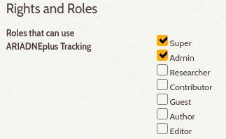

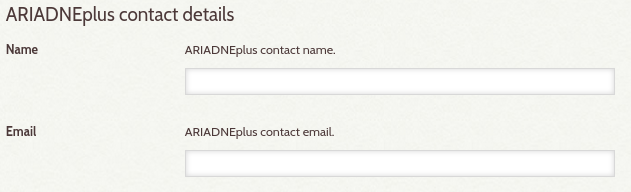

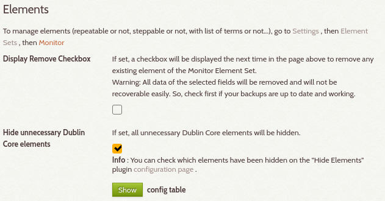

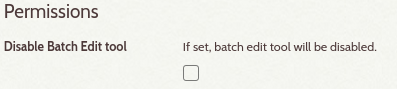

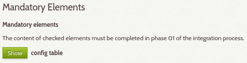

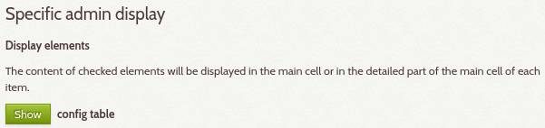

- "*Rights and Roles*": gestionar qué usuarios pueden utilizar la herramienta.

   - Marcar los roles permitidos.

      |at-cf-1|

- "*ARIADNEplus contact details*": establece la información de contacto de la persona encargada de supervisar las importaciones del CENIEH.

   - Campo "*Name*": nombre de la persona a la que nos estamos refiriendo.
   - Campo "*Email*": correo electrónico al que se enviarán los mensajes de comunicación en las fases que así se requiera.

      |at-cf-2|

- "*Elements*": gestiona aspectos relacionados con los elementos de los esquemas de metadatos existentes en la plataforma.

   - Campo "*Display Remove Checkbox*": si se activa, se mostrará un *checkbox* en la página de configuración de elementos para eliminar cualquier elemento existente en el esquema de metadatos *Monitor*. Este esquema es el que recoge todos los campos relacionados con el proceso de integración (estado de los metadatos, categoría ARIADNEplus, etc.).

      - **Aviso**: todos los datos almacenados en los elementos seleccionados se eliminarán y no serán recuperables. Por lo tanto, verifique primero si las copias de seguridad están actualizadas y funcionando.

   - "*Hide unnecessary Dublin Core elements*": si se activa, todos los elementos del esquema de metadatos *Dublin Core* considerados como innecesarios para el proyecto se ocultarán. Estos pueden ser configurados desde la tabla que puede ser desplegada pulsando sobre el botón "Show".

      |at-cf-3|

- Sección "Permissions": gestiona los permisos de los usuarios.

   - Campo "*Disable Batch Edit Tool*": si se activa, la edición masiva de ítems será desactivada.

      |at-cf-4|

- "*Mandatory Elements*": establece los elementos del esquema de metadatos *Dublin Core* que serán obligatorios durante el proceso de integración, es decir, han de ser rellenados obligatoriamente. Estos pueden ser configurados desde la tabla que puede ser desplegada pulsando sobre el botón "Show".

      |at-cf-5|

- "*Specific admin display*": establece los elementos que serán mostrados en las distintas zonas del buscador de ítems. Estos pueden ser configurados desde la tabla que puede ser desplegada pulsando sobre el botón "Show".

      |at-cf-6|

   - "*Search*": en el buscador de ítems, saldrá como opción de búsqueda el elemento seleccionado.
   - "*Filter*": en la lista de filtros del buscador, aparecerá el elemento seleccionado como un filtro más.
   - "*Directly*": en cada ítem/colección aparecerá directamente sobre la tabla el elemento seleccionado.
   - "*Details*": se mostrará el elemento seleccionado en el desplegable donde se muestran los detalles de cada ítem/colección.

.. seealso::
   * `Github Repository - ARIADNEplus Tracking <https://github.com/gcm1001/TFG-CeniehAriadne/tree/master/omeka/plugins/AriadnePlusTracking>`__

*CSV Export*
^^^^^^^^^^^^
El complemento *CSV Export* permite exportar todos los ítems almacenados en la plataforma en formato CSV. A través de la entrada "*CSV Export*", dentro de la sección "*Export Tools*" del menú principal de administración, se accede a la página principal del complemento.

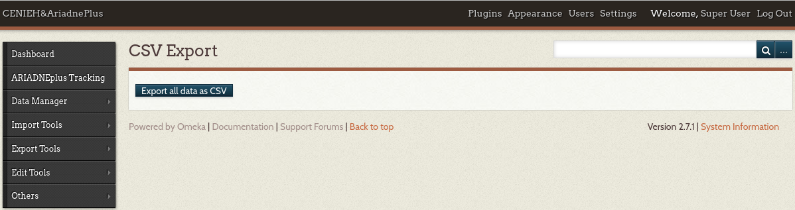

   Vista principal del complemento CSV Export

Desde su página principal solo se puede exportar **TODOS** los ítems almacenados en la plataforma.

Para exportar todos los ítems existentes en formato CSV:

1. Desde el complemento *CSV Export* (``/admin/csv-export/``).
2. Hacer clic sobre el botón "*Export all data as CSV*".
3. Confirmar la descarga.

Si solo deseas exportar un ítem/colección específico en CSV, mira la sección `Exportar ítems`_.

El documento CSV descargado podrá volver a ser importado a la plataforma a través del complemento `CSV Import+`_ independientemente de las modificaciones que se hagan sobre él.

.. seealso::
   * `Github Repository - CSV Export <https://github.com/gcm1001/TFG-CeniehAriadne/tree/master/omeka/plugins/AriadnePlusTracking>`__

*Bulk Editor*
^^^^^^^^^^^^^
El complemento *Bulk Editor* aporta una herramienta denominada *Bulk Metadata Editor* que permite modificar los metadatos de múltiples ítems a la vez en base a unas reglas. El acceso a esta herramienta se encuentra dentro de la sección "*Edit Tools*" del menú principal de administración.

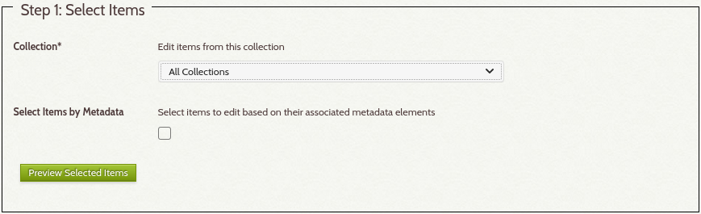

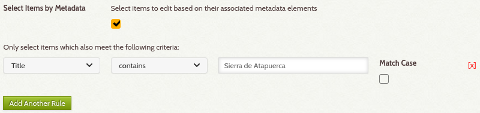

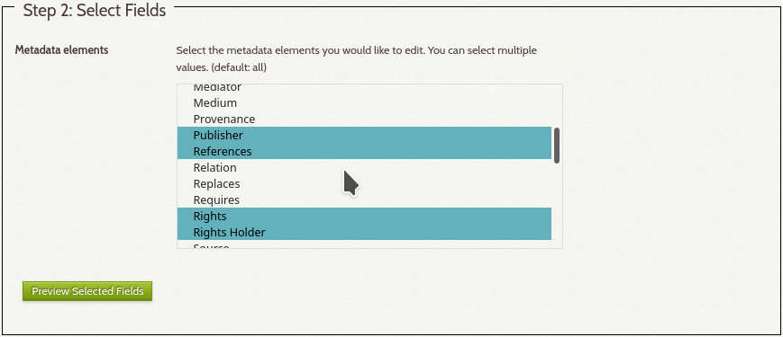

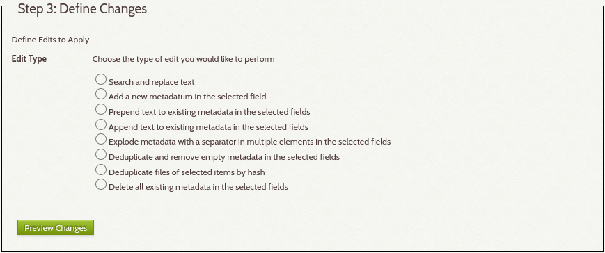

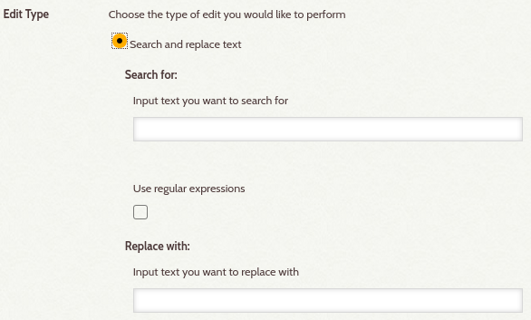

.. |be-3-2| image:: ../_static/images/be-3-2.png
   :scale: 100%
   :align: middle

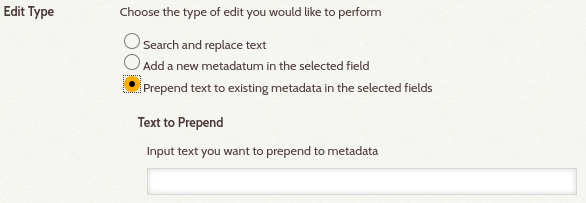

.. |be-3-4| image:: ../_static/images/be-3-4.png
   :scale: 100%
   :align: middle

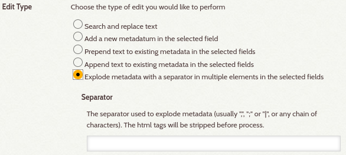

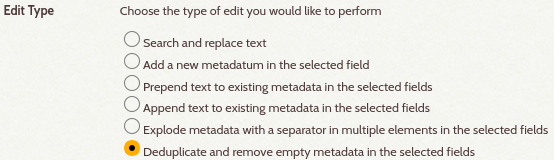

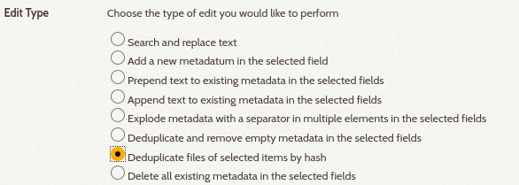

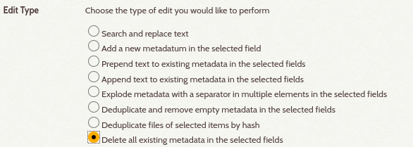

Para editar varios ítems a la vez:

1. Desde el complemento *Bulk Editor* (``/admin/bulk-metadata-editor/``).
2. Seleccionar los ítems que se desean modificar:

   |be-1|

   a. *Collection*: Para seleccionar los ítem de una determinada colección.
   b. *Select Items by Metadata*: Para seleccionar los ítems en base al contenido de sus metadatos.

      |be-1-1|

      Para crear una regla:

      1. Seleccionar el metadato a comprobar.
      2. Seleccionar la condición.
      3. Indicar el valor de la condición.
      4. Si queremos que el valor coincida de forma exacta, marcar la casilla *Match Case*.

3. Hacer clic sobre el botón "*Preview Selected Items*" para comprobar que los ítems seleccionados son los correctos.
4. Seleccionar los metadatos que deseamos modificar.

   |be-2|

   *Tips*: Mantener pulsado la tecla *Crtl* para escoger varios metadatos salteados.
5. Hacer clic sobre el botón "*Preview Selected Fields*" para visualizar el contenido actual de los metadatos seleccionados.
6. Seleccionar el tipo de cambio a ejecutar sobre los metadatos seleccionados.

   |be-3|

   a. *Search and replace text*: busca texto en el contenido de los metadatos seleccionados y lo sustituye.

   |be-3-1|

   b. *Add a new metadatum in the selected field*: añade un nuevo campo a los metadatos seleccionados.

   |be-3-2|

   c. *Prepend text to existing metadata in the selected fields*: añade texto al principio del contenido actual de los metadatos seleccionados.

   |be-3-3|

   d. *Append text to existing metadata in the selected fields*: añade texto al final del contenido actual de los metadatos seleccionados.

   |be-3-4|

   e. *Explode metadata with a separator in multiple elements in the selected fields*: dado un separador, divide el contenido actual de los metadatos seleccionados en varios campos.

   |be-3-5|

   f. *Deduplicate and remove empty metadata in the selected fields*: elimina campos vacíos o duplicados existentes en los metadatos seleccionados.

   |be-3-6|

   g. *Deduplicate files of selected items by hash*: elimina ficheros duplicados de los ítems seleccionados.

   |be-3-7|

   h. *Delete all existing metadata in the selected fields*: elimina todos los metadatos seleccionados.

   |be-3-8|

7. Marcar la casilla *Background Job* si se desea ejecutar la operación en segundo plano.
8. Hacer clic sobre el botón "*Apply Edits Now*".

.. seealso::
   * `Repositorio en Github - Bulk Metadata Editor <https://github.com/UCSCLibrary/BulkMetadataEditor>`__
   * `Omeka - Bulk Metadata Editor <https://omeka.org/classic/plugins/BulkMetadataEditor/>`__

*Tags Manager*
^^^^^^^^^^^^^^
El complemento *Tags Manager* añade nuevas funcionalidades:

* Sincronización entre *tags* y el elemento *Subject* del esquema de metadatos *Dublin core*: cuando se crea/importa un ítem, si este cuenta con el elemento *Subject* del esquema de metadatos *Dublin Core*, se crea de forma automática un nuevo *tag* cuyo nombre es el contenido del elemento *Subject*.
* Eliminación masiva de *tags*: permite eliminar varios *tags* a la vez.

Estas funcionalidades se pueden activar/desactivar su página de configuración (ver `Configurar complementos (plugins)`_).

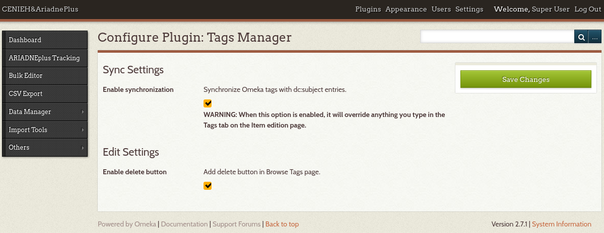

   Vista de la página de configuración del complemento Tags Manager

.. seealso::
   * `Repositorio en Github - Tags Manager <https://github.com/gcm1001/TFG-CeniehAriadne/tree/master/omeka/plugins/TagsManager>`__

*Geolocation Modified*
^^^^^^^^^^^^^^^^^^^^^^
.. note::
   Sólo se explicarán aquellas funcionalidades añadidas a la `versión original del complemento Geolocation <https://omeka.org/classic/plugins/Geolocation/>`__. Si quieres saber más acerca del *plugin*, haz `clic aquí <https://omeka.org/classic/docs/Plugins/Geolocation/>`__.

El complemento *Geolocation Modified* es una versión mejorada del complemento `Geolocation <ttps://omeka.org/classic/plugins/Geolocation/>`__. Las funcionalidades que se han añadido son:

* Marco avanzado de dibujo: añade en el mapa un cuadro de herramientas que permite trazar localizaciones simples (marcadores) y compuestas (rectangulares).

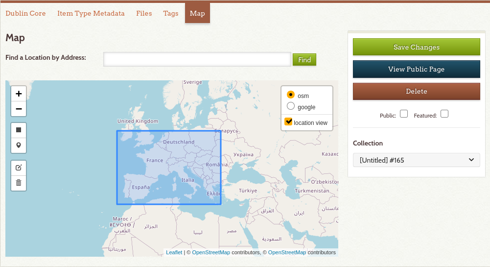

   Mapa de geolocalización con la funcionalidad activa

* Sincronización entre geolocalizaciones y el elemento *Spatial Coverage* del esquema de metadatos *Dublin Core*: cuando se establece una geolocalización para un ítem, el elemento *Spatial Coverage* del ítem se actualiza con las coordenadas de la geolocalización.
* Sincronización inversa: cuando se crea/importa un ítem, si este cuenta con el elemento *Spatial Coverage* del esquema de metadatos *Dublin Core*, se crea y asocia de forma automática una nueva geolocalización con las coordenadas indicadas por el elemento *Spatial Coverage*.

.. nota::
   Solo se puede activar un tipo de sincronización a la vez.

Estas funcionalidades se pueden activar/desactivar su página de configuración (ver `Configurar complementos (plugins)`_).

* *Enable draw plugin* para activar/desactivar el marco avanzado de dibujo.

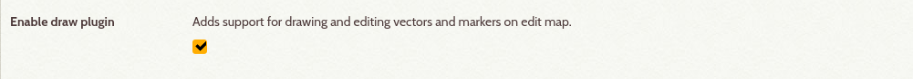

   Vista de la opción de configuración del complemento Geolocation Modified

* *Spatial Coverage synchronization* y *Reverse Spatial Coverage synchronization*  para activar/desactivar las funcionalidades de sincronización.

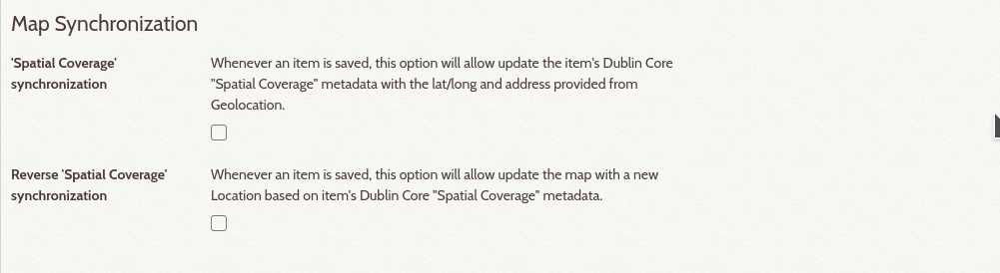

   Vista de las opciones de configuración del complemento Geolocation Modified

.. seealso::
   * `Repositorio en Github - Geolocation Modified <https://github.com/gcm1001/TFG-CeniehAriadne/tree/master/omeka/plugins/Geolocation>`__

*CENIEH export*
^^^^^^^^^^^^^^^
El complemento *CENIEH export* añade tres formatos de exportación para las colecciones y uno para los ítems. Este formato se ha adaptado a las necesidades del proyecto ARIADNEplus.

Para cada colección:

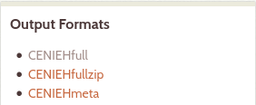

   Panel con los formatos de exportación de colecciones (/admin/collections/show/<idCollection>)

* CENIEHfull: exporta en un único fichero XML toda la colección, incluyendo a cada uno de sus ítems.
* CENIEHfullzip: exporta todos los ítems de la colección generando un fichero XML por ítem. Todos ellos comprimidos dentro de un fichero .zip.
* CENIEHmeta: exporta únicamente la colección, sin incluir ninguno de sus ítems.

Para cada ítem:

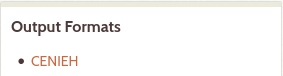

   Panel que muestra los formatos de exportación de colecciones (/admin/items/show/<idItem>)

* CENIEH: exporta el ítem en un único fichero XML.

.. seealso::
   * `Repositorio en Github - CENIEH export <https://github.com/gcm1001/TFG-CeniehAriadne/tree/master/omeka/plugins/CENIEHExport>`__

*Collection Files*
^^^^^^^^^^^^^^^^^^
El complemento *Collection Files* permite asociar ficheros a las colecciones. En la versión original de Omeka esta funcionalidad sólo está implementada para los ítems.

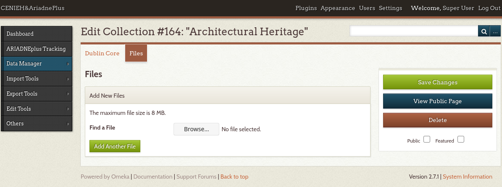

   Vista desde donde se edita una colección (/admin/collections/edit/<idCollection>)

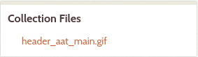

   Panel que muestra los ficheros asociados a una colección (/admin/collections/show/<idCollection>)

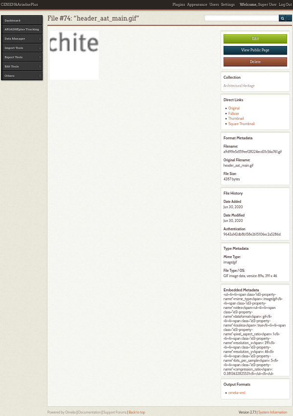

   Vista desde donde se visualiza un fichero asociado a una colección (/admin/collections/edit/<idCollection>)

.. seealso::
   * `Repositorio en Github - Collection Files <https://github.com/gcm1001/TFG-CeniehAriadne/tree/master/omeka/plugins/CollectionFiles>`__

*Admin Navigation Main Menu Design*
^^^^^^^^^^^^^^^^^^^^^^^^^^^^^^^^^^^
El complemento *Admin Navigation Main Menu Design* permite organizar las entradas del menú principal de navegación existente en el área de administración en secciones.

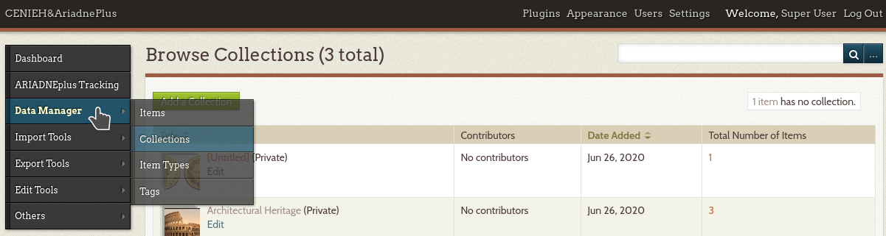

   Menú principal de navegación del área de administración.

Para modificar las entradas del menú:

1. Acceder a la página de configuración del complemento *Admin Navigation Main Menu Design* (ver `Configurar complementos (plugins)`_).
2. La tabla de configuración tiene fila para cada entrada y columna para cada sección.
3. Marcar/desmarcar una casilla de la tabla para añadir/eliminar una entrada (fila) en una sección (columna).
4. Pulsar sobre el botón "Save Changes".

.. seealso::
   * `Repositorio en Github - Admin Navigation Main Menu Design <https://github.com/gcm1001/TFG-CeniehAriadne/tree/master/omeka/plugins/AdminMenuDesign>`__

*Automatic Dublin Core Updates*
^^^^^^^^^^^^^^^^^^^^^^^^^^^^^^^
El complemento *Automatic Dublin Core Updates* permite actualizar automáticamente el contenido de alguno de los elementos del esquema de metadatos *Dublin Core*.

Para activar/desactivar la actualización automática de elementos:

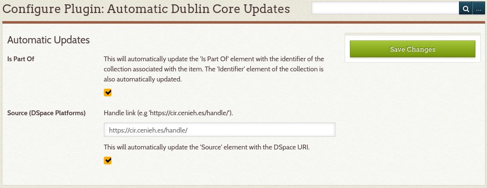

   Página de configuración del complemento Automatic Dublin Core Updates.

1. Acceder a la página de configuración del complemento *Automatic Dublin Core Updates* (ver `Configurar complementos (plugins)`_).
2. Marcar/Desmarcar la casilla del elemento que se quiera activar/desactivar.
3. Pulsar sobre el botón "Save Changes".

.. seealso::
   * `Repositorio en Github - Automatic Dublin Core Updates <https://github.com/gcm1001/TFG-CeniehAriadne/tree/master/omeka/plugins/AutoDublinCore>`__

*OAI-PMH Repository*
^^^^^^^^^^^^^^^^^^^^
El complemento *OAI-PMH Repository* permite que otros repositorios web recolecten metadatos de nuestra aplicación.

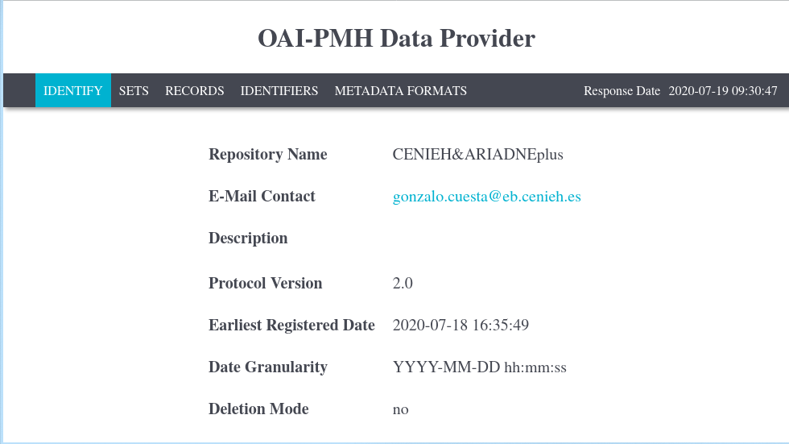

   Vista de la página *Identify* del repositorio OAI-PMH.

El *endpoint* de la aplicación tiene el siguiente formato: *http://<host>/oai-pmh-repository/request*.

.. seealso::
   * `Repositorio en Github - OAI-PMH Repository <https://github.com/zerocrates/OaiPmhRepository>`__
   * `Omeka - OAI-PMH Repository  <https://omeka.org/classic/plugins/OaiPmhRepository/>`__
   * `Omeka Classic User Manual - OAI-PMH Repository <https://omeka.org/classic/docs/Plugins/OaiPmhRepository/>`__

*Simple Pages*
^^^^^^^^^^^^^^
El complemento *Simple Pages* permite añadir páginas simples como la de "About" al área pública. Desde la entrada "*Simple Pages*", dentro de la sección "*Others*"  del menú principal, se accede al gestor de páginas simples (``/admin/simple-pages/``).

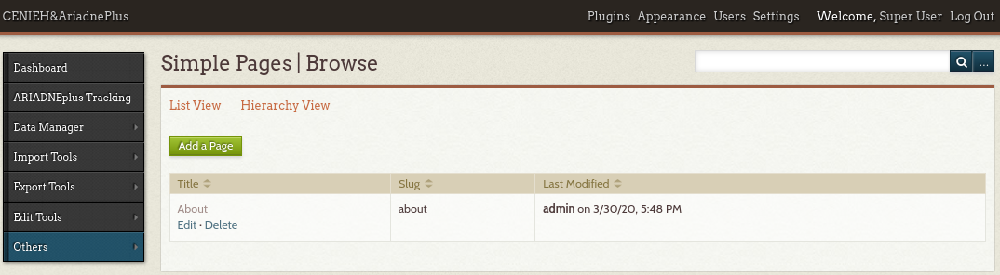

   Vista de la página principal del complemento *Simple Pages*.

Para añadir una página simple:

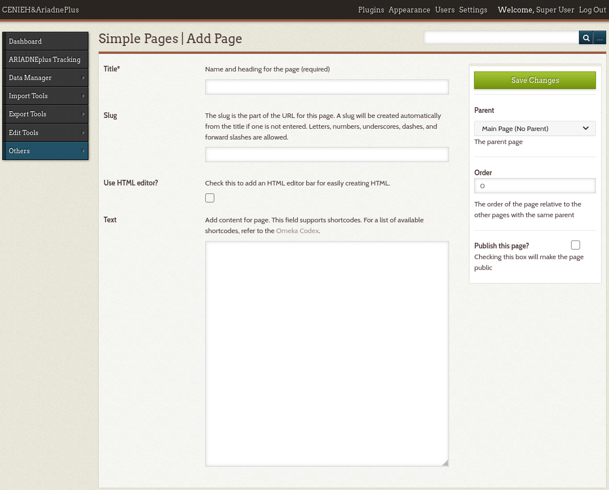

1. Desde el complemento *Simple Pages* (``/admin/simple-pages/``).
2. Hacer clic sobre el botón "*Add a Page*".
3. Rellenar el formulario:

   |sp-1|

   a. *Title*: nombre y cabecera para la página.
   b. *Slug*: parte de la *URL* que referencia a la página.
   c. *Use HTML editor?*: activar/desactivar el editor HTML para crear el contenido de la página.
   d. *Text*: contenido de la página.
   e. *Parent*: página "padre".
   f. *Order*: orden de la página respecto a otras con el mismo "padre".
   g. *Publish this page?*: publicar/desplublicar la página.

4. Hacer clic sobre el botón "*Save changes*".

Para eliminar una página simple:

1. Desde el complemento *Simple Pages* (``/admin/simple-pages/``).
2. Localizar la página a eliminar en la tabla principal.
3. Hacer clic sobre el texto "*Delete*".
4. Confirmar la eliminación haciendo clic sobre el botón rojo "*Delete*".

Para editar una página simple:

1. Desde el complemento *Simple Pages* (``/admin/simple-pages/``).
2. Localizar la página a eliminar en la tabla principal.
3. Hacer clic sobre el texto "*Edit*".
4. Modificar el formulario.
5. Hacer clic sobre el botón "*Save changes*".

.. seealso::
   * `Repositorio en Github - Simple Pages <https://github.com/omeka/plugin-SimplePages>`__
   * `Omeka - Simple Pages <https://omeka.org/classic/plugins/SimplePages/>`__
   * `Omeka Classic User Manual - Simple Pages <https://omeka.org/classic/docs/Plugins/SimplePages/>`__

*History Log*
^^^^^^^^^^^^^
El complemento *History Log* permite llevar un registro detallado de todas las acciones (eliminar, editar, crear, etc.) ejecutadas en la plataforma. Desde la entrada "*History Logs*", dentro de la sección "*Others*"  del menú principal, se accede a todos los registros de la aplicación (``/admin/history-log/``).

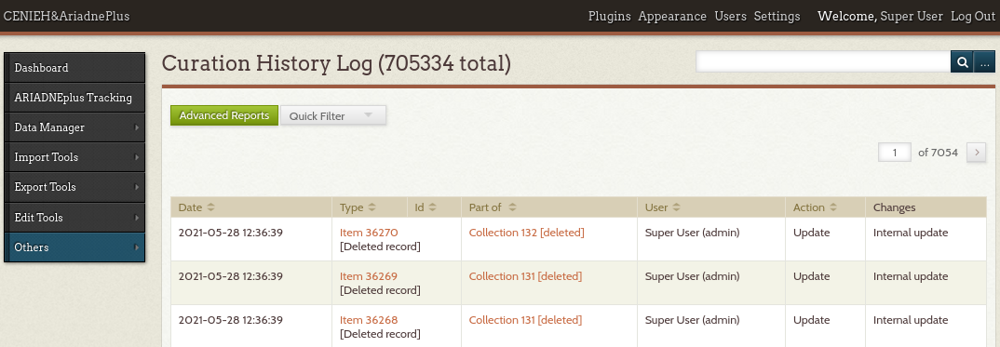

   Vista de la página principal del complemento *History Log*.

Desde su página principal se pueden hacer búsquedas avanzadas y aplicar filtros sobre todos los registros de la aplicación.

.. seealso::
   * `Repositorio en Github - History Log <https://github.com/UCSCLibrary/HistoryLog>`__
   * `Omeka - History Log <https://omeka.org/classic/plugins/HistoryLog/>`__

*Getty Suggest*
^^^^^^^^^^^^^^^
El complemento *Getty Suggest* permite sugerir términos de los vocabularios *Getty* durante el relleno de un elemento (metadato). Desde la entrada "*Getty Suggest*", dentro de la sección "*Others*"  del menú principal, se accede a todos los registros de la aplicación (``/admin/getty-suggest/``).

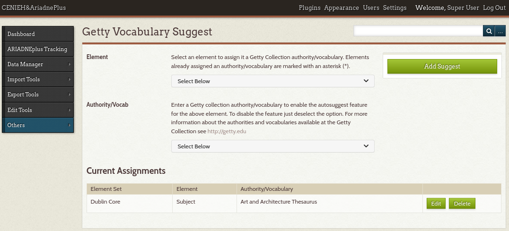

   Vista de la página principal del complemento *Getty Suggest*.

Para activar la sugerencia de vocabulario en un metadato:

1. Desde el complemento *Simple Pages* (``/admin/getty-suggest/``).
2. Rellenar el formulario.

   a. *Element*: metadato en el que se activará la sugerencia.
   b. *Authority/Vocab*: vocabulario *Getty* a sugerir.

3. Hacer clic sobre el botón "*Add Suggest*".

Para desactivar la sugerencia de vocabulario en un metadato:

1. Desde el complemento *Simple Pages* (``/admin/getty-suggest/``).
2. Buscar en la tabla de asignaciones el metadato a desactivar.
3. Hacer clic sobre el botón "*Delete*".

Para editar la sugerencia de vocabulario en un metadato:

1. Desde el complemento *Simple Pages* (``/admin/getty-suggest/``).
2. Buscar en la tabla de asignaciones el metadato a editar.
3. Hacer clic sobre el botón "*Edit*".
4. Modificar desde la tabla el metadato o la autoridad.
5. Hacer clic sobre el botón "*Save*".

.. seealso::
   * `Repositorio en Github - Getty Suggest <https://github.com/UCSCLibrary/GettySuggest>`__

*Simple Vocab*
^^^^^^^^^^^^^^
El complemento *Simple Vocab* permite crear y gestionar vocabularios simples para elementos de un determinado esquema. Desde la entrada "*Simple Vocab*", dentro de la sección "*Others*"  del menú principal, se accede al gestor de vocabularios simples (``/admin/simple-vocab/``).

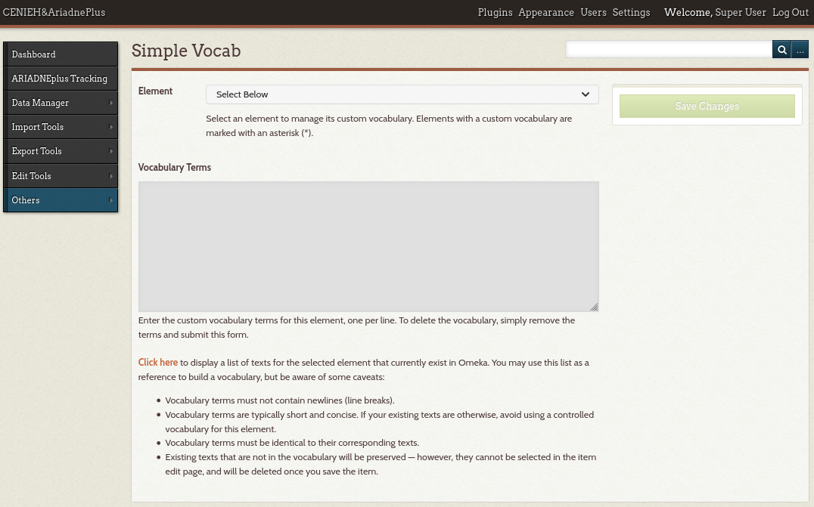

   Vista de la página principal del complemento *Simple Vocab*.

Para crear un vocabulario sobre un metadato específico:

1. Desde el complemento *Simple Vocab* (``/admin/getty-suggest/``).
2. Rellenar el formulario.

   a. *Element*: metadato en el que se activará el vocabulario.
   b. *Vocabulary terms*: términos del vocabulario, uno por línea.

3. Hacer clic sobre el botón "*Save Changes*".

Para eliminar un vocabulario sobre un metadato específico:

1. Desde el complemento *Simple Vocab* (``/admin/getty-suggest/``).
2. Seleccionar en el formulario el metadato donde se encuentra activado el vocabulario.

   a. *Element*: metadato involucrado.

3. Eliminar todos los términos del campo "*Vocabulary Terms*".
4. Hacer clic sobre el botón "*Save Changes*".

Para editar un vocabulario sobre un metadato específico:

1. Desde el complemento *Simple Vocab* (``/admin/getty-suggest/``).
2. Seleccionar en el formulario el metadato donde se encuentra activado el vocabulario.

   a. *Element*: metadato involucrado.

3. Editar los términos del campo "*Vocabulary Terms*".
4. Hacer clic sobre el botón "*Save Changes*".

.. seealso::
   * `Repositorio en Github - Simple Vocab <https://github.com/omeka/plugin-SimpleVocab>`__
   * `Omeka - Simple Vocab <https://omeka.org/classic/plugins/SimpleVocab/>`__

*Curatescape Admin Helper*
^^^^^^^^^^^^^^^^^^^^^^^^^^
El complemento *Curatescape Admin Helper* implementa funcionalidades que brindan ayuda a los administradores de la aplicación.

.. seealso::
   * `Repositorio en Github - Curatescape Admin Helper <https://github.com/CPHDH/CuratescapeAdminHelper>`__

*Curatescape JSON*
^^^^^^^^^^^^^^^^^^
El complemento *Curatescape JSON* implementa funcionalidades para la plantilla de diseño (*theme*) *Curatescape*.

.. seealso::
   * `Repositorio en Github - Curatescape JSON <https://github.com/CPHDH/CuratescapeJSON>`__

*Dublin Core Extended*
^^^^^^^^^^^^^^^^^^^^^^
El complemento *Dublin Core Extended* implementa nuevos elementos en el esquema de metadatos *Dublin Core*.

.. seealso::
   * `Repositorio en Github - Dublin Core Extended <https://github.com/omeka/plugin-DublinCoreExtended>`__
   * `Omeka - Dublin Core Extended  <https://omeka.org/classic/plugins/DublinCoreExtended/>`__
   * `Omeka Classic User Manual - Dublin Core Extended <https://omeka.org/classic/docs/Plugins/DublinCoreExtended/>`__

*Hide Elements*
^^^^^^^^^^^^^^^
El complemento *Hide Elements* permite ocultar elementos de los esquemas de metadatos existentes en la plataforma.

.. seealso::
   * `Repositorio en Github - Hide Elements <https://github.com/zerocrates/HideElements>`__
   * `Omeka - Hide Elements  <https://omeka.org/classic/plugins/HideElements/>`__

*Super RSS*
^^^^^^^^^^^
El complemento *Super RSS* muestra enlaces para compartir publicaciones (área pública) en redes sociales.

.. seealso::
   * `Repositorio en Github - Super RSS <https://github.com/CPHDH/SuperRss>`__
