========================
Documentación de usuario
========================

Introducción
------------
En este apartado se pretende dotar al usuario de la información necesaria para la correcta utilización de la aplicación. En primer lugar, se especificarán los requisitos *software* con los que el usuario debe contar para acceder a la aplicación. Posteriormente, se explicará paso a paso el proceso de instalación y, finalmente, se mostrará el manual de usuario.

Requisitos de usuario
---------------------

Instalación
-----------

Manual de usuario
-----------------

.. warning::
   Este manual de usuario **no es válido para la versión original** de `Omeka Classic <https://omeka.org/classic>`__. Ciertos aspectos de la aplicación han sido alterados por los complementos/*plugins* instalados y el tema escogido. Por lo tanto, antes de seguir leyendo, comprueba que se ha instalado el tema y todos los *plugins* indicados en el apartado `Instalación`_.

.. info::
   Para acceder al **manual de usuario original**, pulsa `aquí <https://omeka.org/classic/docs/>`__.

Acceder al área de administración
~~~~~~~~~~~~~~~~~~~~~~~~~~~~~~~~~
La zona de administración es el lugar desde el cual se gestionan los conjuntos de datos almacenados en la infraestructura y, además, se pueden configurar otros aspectos de la aplicación como, por ejemplo, su diseño, seguridad, usuarios, etc.

Este área se encuentra ubicado en la ruta `/admin` desde la raíz del directorio donde se encuentra la aplicación. Si, por ejemplo, hemos accedido desde la URL `www.aplicacion.es`, al acceder a `www.aplicacion.es/admin` se nos mostrará la pantalla de inicio de sesión al sistema.

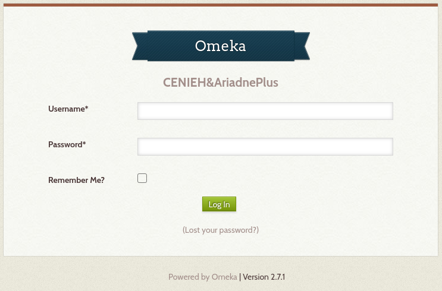

   Inicio de sesión del área de administración

Después de introducir un nombre de usuario y contraseña válidos, se debe pulsar sobre el botón "*Log In*". Si todo es correcto, accederemos a la zona de administración.

Otra forma de acceder al área de administración es desde la página principal. En la barra de navegación situada en la parte superior de la pantalla, veremos dos entradas, "*Login*" y "*Register*". Haciendo clic sobre "*Login*" accederemos a la pantalla de inicio de sesión pública.

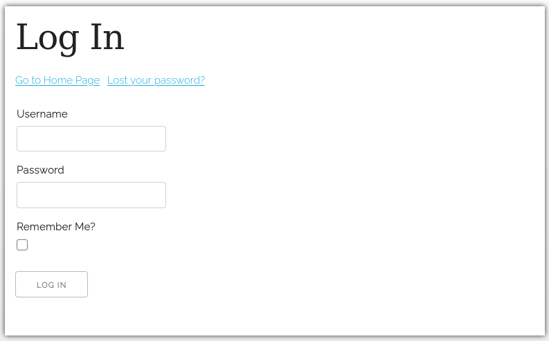

   Inicio de sesión público

Al autentificarnos, se actualizará la barra de navegación superior reemplazando las dos entradas anteriores por estas tres: "*Account*", "*Site Admin*" y "*Log out*". Al hacer clic sobre "*Site Admin*" accederemos al área de administración.

Menús de navegación
~~~~~~~~~~~~~~~~~~~
Dentro del área de administración podemos desplazarnos a través de los dos menús de navegación disponibles:

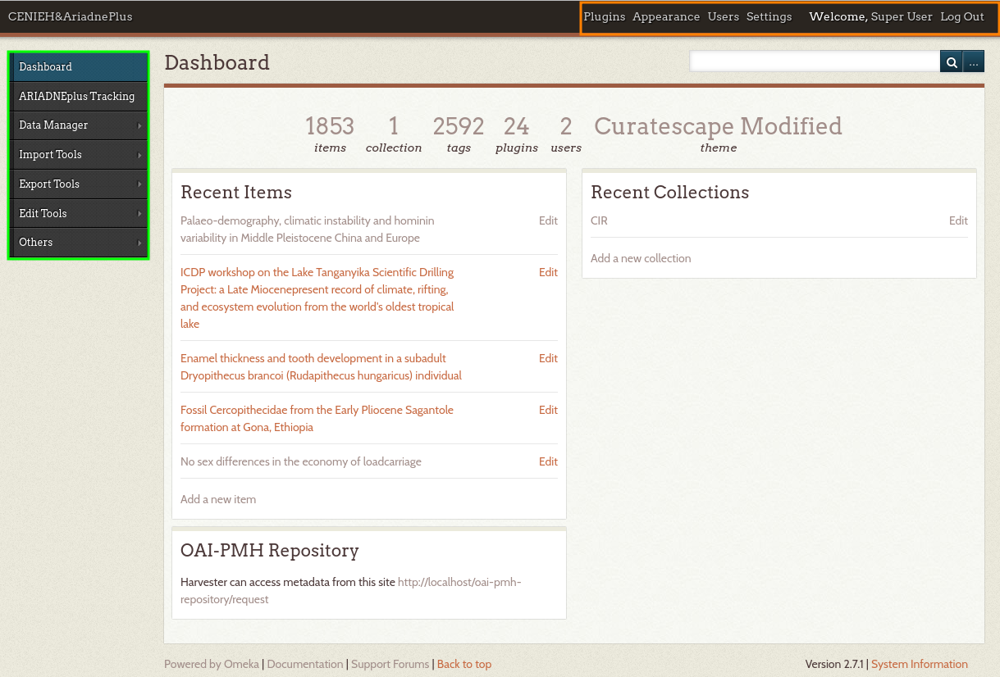

   Vista principal del panel de administración

1. **Menú global**: recoge los accesos hacia las principales zonas de configuración de la aplicación.

   a. *Plugins*: zona donde se gestionan complementos/*plugins*.
   b. *Appearance*: zona donde se gestionan temas de diseño.
   c. *Users*: zona donde se gestionan usuarios.
   d. *Settings* zona donde se gestiona la configuración de la aplicación.

2. **Menú principal**: a través de este menú se puede acceder a cada una de las funciones/complementos incluídos en la plataforma.

   a. *Dashboard*: recoge información general de la aplicación (número de ítems/coleciones almacenadas, *tags*, etc.).
   b. *ARIADNEplus Tracking*: zona donde se gestionan los procesos de integración de datos a la plataforma ARIADNEplus.
   c. *Data Manager*: zona donde se gestionan los objetos principales de la aplicación (ítems, tipo de ítems, colecciones y tags).
   d. *Import Tools*: recoge las distintas herramientas de importación.
   e. *Export Tools*: recoge las distintas herramientas de exportación.
   f. *Edit Tools*: recoge las distintas herramientas de edición de objetos.
   g. *Others*: recoge herramientas auxiliares.

*Data Manager*
~~~~~~~~~~~~~~
Esta sección del menú recoge todas las herramientas necesarias para la gestión de los elementos principales de la aplicación, que son: ítems, tipos de ítem, colecciones y tags.

*Items*
^^^^^^^
Los ítems son los **elementos principales** de la aplicación utilizados para representar cada uno de los objetos digitales que se van a almacenar en esta. A través de la entrada *Items*, dentro de la sección "*Data Manager*" del menú principal, se accede al gestor de ítems (`aplicacion.es/admin/items/`), lugar donde se llevan a cabo todas las tareas de gestión relacionadas con este elemento.

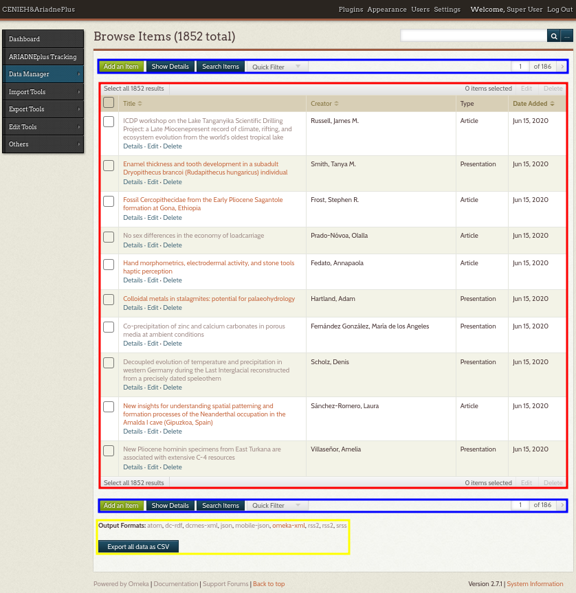

   Vista principal del gestor de ítems

Propiedades de un *Item*
************************
Cada *Item* está formado por:

- 0 o más elementos de información (metadatos).
- 0 o más ficheros (*Files*).
- 0 o más etiquetas (*Tags*).
- 0 o 1 geolocalización (*Geolocation*).

Además, presenta tres valores especiales:
- *Public*: indica si el ítem es público o no.
- *Feature*: indica si el ítem será destacado o no.
- *Collection*: indica si el ítem pertenece a una colección de ítems.

Crear un ítem
***************
Si se desean generar conjuntos de datos desde la aplicación, el primer paso es crear ítems.

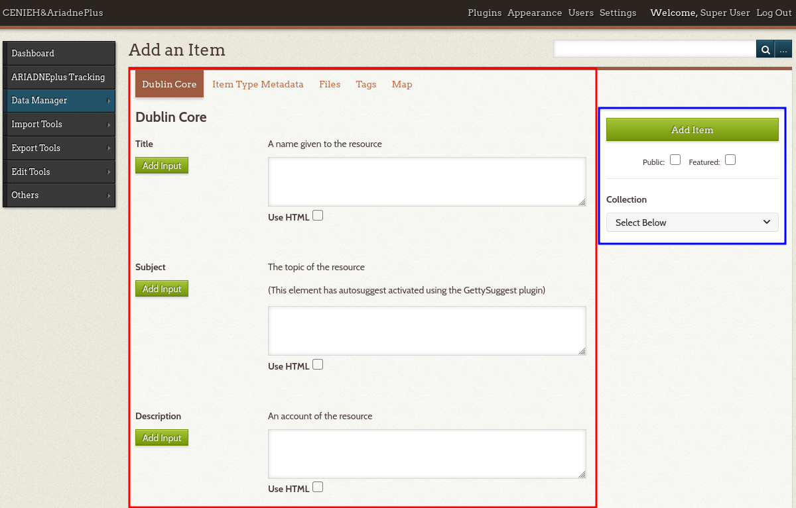

   Vista utilizada para la creación de ítems

Para crear un ítem:

1. Desde el gestor de ítems (`aplicacion.es/admin/items/`).
2. Hacer clic sobre el botón "*Add an Item*" situado en la parte superior de la tabla.
3. En la página actual (`aplicacion.es/admin/items/add`), se puede observar una barra de navegación (ver :numref:`add-items-view`). Desde ella se pueden configurar los elementos del ítem:

   a. *Dublin Core*: metadatos del esquema de metadatos *Dublin Core*.
   b. *Item Type Metadata*: metadatos asociados al tipo de *Item*.
   c. *Files*: ficheros asociados.
   d. *Tags*: etiquetas asociadas.
   e. *Map*: geolocalización del ítem.

4. Si queremos asignar el ítem a una colección:

   a. En la parte derecha de la página, debajo del botón "*Add Item*", hay un menú desplegable donde puede asignar el ítem actual a la colección seleccionada.

5. Además, se pueden marcar las casillas "*Public*" y/o "*Feature*" en la parte derecha del formulario, justo debajo del botón "*Add Item*".
6. Para finalizar, hacer clic sobre el botón "*Add Item*".

Editar un ítem
****************
Existen numerosos motivos por los que pueden surgir la necesidad de editar un ítem como, por ejemplo, cambiar el contenido de sus metadatados, agregar/eliminar ficheros, agruparlo a una colección, publicarlo, etc. 

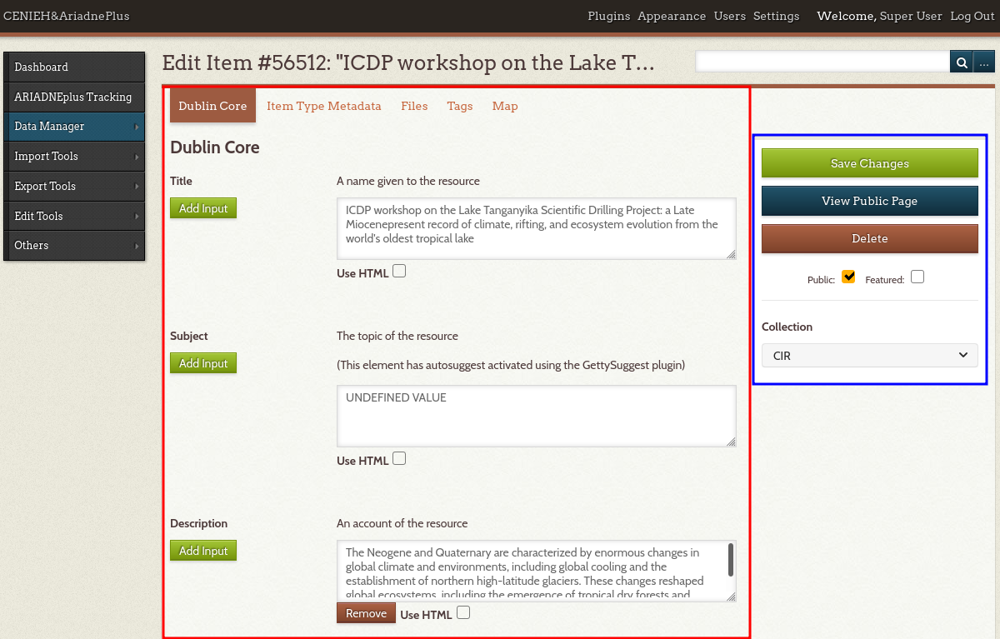

   Vista utilizada para la edición de ítems

Para editar un ítem existente:

1. Desde el gestor de ítems (`aplicacion.es/admin/items/`).
2. Localizar la fila en la que se encuentra el ítem y hacer clic sobre el hipertexto "*Edit*" situado justo debajo del título del ítem.
3. En la página actual (`aplicacion.es/admin/item/edit/<itemid>`), se puede observar una barra de navegación (ver :numref:`edit-items-view`). Desde ella se pueden configurar los elementos del ítem:

   a. *Dublin Core*: metadatos del esquema de metadatos *Dublin Core*.
   b. *Item Type Metadata*: metadatos asociados al tipo de ítem.
   c. *Files*: ficheros asociados.
   d. *Tags*: etiquetas asociadas.
   e. *Map*: geolocalización del ítem.

4. Si queremos asignar el ítem a una colección:

   a. En la parte derecha de la página, debajo del botón "*Add Item*", hay un menú desplegable donde puede asignar el ítem actual a la colección seleccionada.

5. Además, se pueden marcar las casillas "*Public*" y/o "*Feature*" en la parte derecha del formulario, justo debajo del botón "*Add Item*".
6. Para finalizar, hacer clic sobre el botón "*Save Changes*".

Eliminar un ítem
******************
El gestor de ítems ofrece múltiples formas de eliminar un ítem existente en la plataforma.

[Opción 1] Para eliminar un ítem existente:

1. Desde el gestor de ítems (`aplicacion.es/admin/items/`).
2. Localizar la fila en la que se encuentra el ítem y hacer clic sobre el hipertexto "*Delete*" situado justo debajo del título del ítem.
3. Confirmar la eliminación del ítem pulsando sobre el botón "*Delete*".

[Opción 2] Para eliminar un ítem existente:

1. Desde el gestor de ítems (`aplicacion.es/admin/items/`).
2. Localizar la fila en la que se encuentra el ítem y hacer clic sobre el hipertexto "*Edit*" situado justo debajo del título del ítem.
3. En la página actual (`aplicacion.es/admin/item/edit/<itemid>`), clicar sobre el botón "*Delete*" situado en la parte derecha del formulario.
4. Confirmar la eliminación del ítem pulsando sobre el botón "*Delete*".

[Opción 3] Para eliminar un ítem existente:

1. Desde el gestor de ítems (`aplicacion.es/admin/items/`).
2. Localizar la fila en la que se encuentra el ítem y hacer clic sobre la casilla situada en la primera columna de la izquierda de la tabla.
3. Hacer clic sobre el botón "*Delete*" situado en la parte superior derecha de la tabla.
4. En la página actual (`aplicacion.es/admin/items/batch-edit`), hacer clic sobre el botón "*Delete Items*" situado en la parte derecha de la página.

Buscar ítems
**************
Otro de los servicios que incluye este gestor es la búsqueda de ítems. Cuando entramos a este apartado a través del menú principal, se nos muestra una lista de ítems ordenados según su fecha de creación (de más recientes a más antiguos).

Como se puede apreciar en la :numref:`items-view`, los ítems son mostrados en una tabla donde cada fila representa a un ítem y cada columna contiene información específica de dicho ítem (título, creador, tipo de ítem y fecha de creación). Existe una columna adicional, en la parte izquierda de la tabla, que se utiliza para seleccionar varios ítems en el caso de que se quieran ejecutar una o varias acciones sobre varios ítems.  Para ordenar los ítems en funcion de los campos de la tabla (título, creador y fecha de modificación), se debe clicar sobre el elemento deseado.

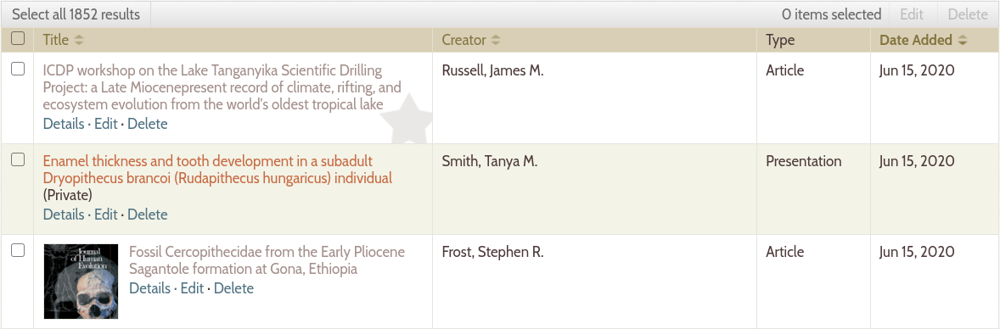

   Ítems especiales vistos desde el gestor de ítems: el primero es destacado, el segundo es privado y el tercero almacena un fichero (imagen)

Otra particularidad del gestor es que, en función de los valores especiales del ítem, se le da un formato u otro.

- Si al lado del título se encuentra el texto "(*Private*)" , el ítem no es público, es decir, solo será accesible desde la zona de administración.
- Si el fondo del título presenta una estrella, significa que el ítem es destacado (*feature*).
- Si el ítem tiene un archivo (*File*) asociado, se mostrará una miniatura del misma al lado del título.

Editar/Eliminar varios ítems a la vez
***************************************
La aplicación te permite modificar o eliminar varios ítems a la vez desde el gestor de ítems.

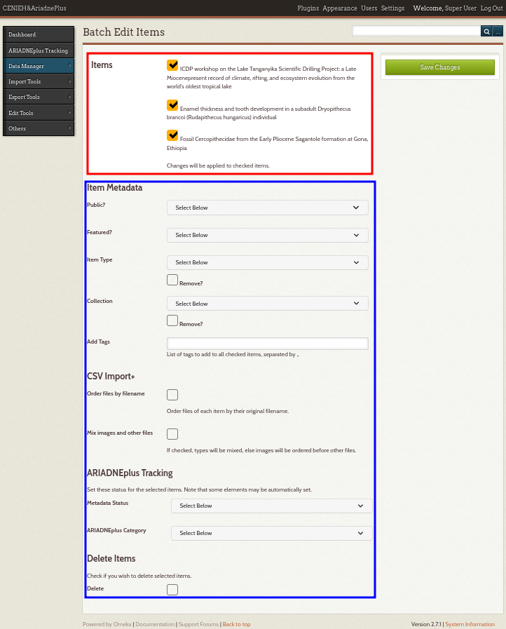

   Vista utilizada para la edición masiva de ítems

Para editar/eliminar varios ítems a la vez:

1. Desde el gestor de ítems (`aplicacion.es/admin/items/`).
2. Buscar los ítems que se quieran eliminar/editar.
3. Marcar la casilla situada en la parte izquierda de la tabla de todos los ítems que se pretenden editar/eliminar.
   Si se desean seleccionar todos los ítems, hacer clic sobre el botón "*Select all results*" situado en la parte superior izquierda de la tabla.
   Si se desean seleccionar todos los ítems de la página actual, marcar la casilla alojada en la cabecera de la tabla.
4. Hacer clic sobre el botón "*Edit*" situado en la parte superior derecha de la tabla.
5. Al pulsar el botón "*Edit*", desde la página actual (`aplicacion.es/admin/items/batch-edit`) podrás:

   * cambiar su accesibilidad (públicos / privados)
   * cambiar su estado (descatados o no destacados)
   * cambiar su tipo
   * cambiar o asociar todos los ítems a una colección
   * añadir etiquetas (*tags*)
   * ordenar los ítems seleccionados por el nombre de su fichero (*file*)
   * eliminar todos los ítems

6. Comprobar en la lista de ítems que todos los ítems seleccionados son correctos. Desmarcar los que no.
7. Hacer clic sobre el botón "*Save Changes*".

Visualizar un ítem completo
***************************
En la página principal del gestor de ítems (`aplicacion.es/admin/items/`) solo se pueden visualizar los datos más característicos de cada ítem como su título o tipo. La aplicación te da la posibilidad de visualizar el ítem al completo, junto a todos sus metadatos, ficheros, *tags*, etc.

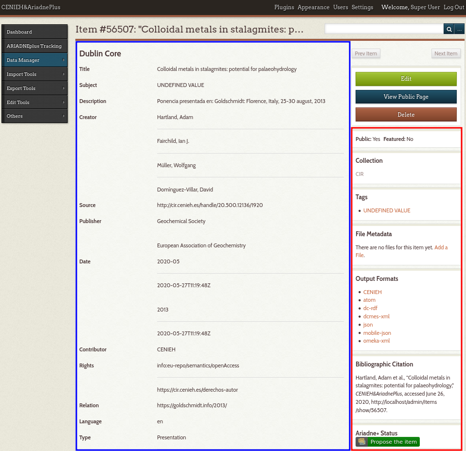

   Vista utilizada para visualizar ítems

Para visualizar un ítem:

1. Desde el gestor de ítems (`aplicacion.es/admin/items/`).
2. Buscar el ítem que se quiera visualizar.
3. Hacer clic sobre el título del ítem, situado en la segunda columna de la tabla.
4. Visualizar el ítem desde la página actual (`aplicacion.es/admin/items/show/<idItem>`).

Exportar ítems
**************
A través de este gestor también se pueden exportar ítems almacenados en la plataforma. Desde la página principal (`aplicacion.es/admin/items/`) se pueden exportar varios ítems a la vez, sin embargo, desde la página de visualización (`aplicacion.es/admin/items/show/<idItem>`) solo es posible exportar un único ítem. Por este motivo, alguno de los formatos de exportación disponibles se encontrarán en una sola vista o en ambas, dependiendo de los requisitos del lenguaje.

.. table:: Formato de exportación disponibles para los Items.
   :name: specialvaluestable
   :widths: auto

   +---------------+-----------+-------------------------------------------+--------------------------------------------------------------------------------------------------------------------------------------------------------------------------------+
   | Formato       | Extensión | Disponibilidad                            | Descripción                                                                                                                                                                    |
   +===============+===========+===========================================+================================================================================================================================================================================+
   | *atom*        | *none*    | `aplicacion.es/admin/items/`              | Esquema de metadatos oficial de *Omeka Classic*                                                                                                                                |
   |               |           |                                           |                                                                                                                                                                                |
   |               |           | `aplicacion.es/admin/items/show/<idItem>` |                                                                                                                                                                                |
   +---------------+-----------+-------------------------------------------+--------------------------------------------------------------------------------------------------------------------------------------------------------------------------------+
   | *dc-rdf*      | .rdf      | `aplicacion.es/admin/items/`              | Serialización `JsonML <http://www.jsonml.org/>`__ del esquema *omeka-xml*.                                                                                                     |
   |               |           |                                           |                                                                                                                                                                                |
   |               |           | `aplicacion.es/admin/items/show/<idItem>` |                                                                                                                                                                                |
   +---------------+-----------+-------------------------------------------+--------------------------------------------------------------------------------------------------------------------------------------------------------------------------------+
   | *dcmes-xml*   | .xml      | `aplicacion.es/admin/items/`              | Instancia `RDF/XML <https://www.w3.org/TR/rdf-syntax-grammar/>`__ del modelo `Dublin Core <http://dublincore.org/documents/dcmes-xml/>`__ simple.                              |
   |               |           |                                           |                                                                                                                                                                                |
   |               |           | `aplicacion.es/admin/items/show/<idItem>` |                                                                                                                                                                                |
   +---------------+-----------+-------------------------------------------+--------------------------------------------------------------------------------------------------------------------------------------------------------------------------------+
   | *json*        | .json     | `aplicacion.es/admin/items/`              | JSON simplificado utilizado principalmente para solicitudes `Ajax <https://en.wikipedia.org/wiki/Ajax_(programming)>`__.                                                       |
   |               |           |                                           |                                                                                                                                                                                |
   |               |           | `aplicacion.es/admin/items/show/<idItem>` |                                                                                                                                                                                |
   +---------------+-----------+-------------------------------------------+--------------------------------------------------------------------------------------------------------------------------------------------------------------------------------+
   | *mobile-json* | .json     | `aplicacion.es/admin/items/`              | Serialización `JsonML <http://www.jsonml.org/>`__ del modelo *omeka-xml*.                                                                                                      |
   |               |           |                                           |                                                                                                                                                                                |
   |               |           | `aplicacion.es/admin/items/show/<idItem>` |                                                                                                                                                                                |
   +---------------+-----------+-------------------------------------------+--------------------------------------------------------------------------------------------------------------------------------------------------------------------------------+
   | *omeka-xml*   | .xml      | `aplicacion.es/admin/items/`              | Esquema de metadatos oficial de *Omeka Classic*                                                                                                                                |
   |               |           |                                           |                                                                                                                                                                                |
   |               |           | `aplicacion.es/admin/items/show/<idItem>` |                                                                                                                                                                                |
   +---------------+-----------+-------------------------------------------+--------------------------------------------------------------------------------------------------------------------------------------------------------------------------------+
   | *rss2*        | .xml      | `aplicacion.es/admin/items/`              | Segunda versión del modelo *srss*.                                                                                                                                             |
   +---------------+-----------+-------------------------------------------+--------------------------------------------------------------------------------------------------------------------------------------------------------------------------------+
   | *srss*        | .xml      | `aplicacion.es/admin/items/`              | Modelo de metadatos empleado para la distribución (o sindicación, del inglés *syndication*) de noticias o información liberada a intervalos de tiempo en sitios web y weblogs. |
   +---------------+-----------+-------------------------------------------+--------------------------------------------------------------------------------------------------------------------------------------------------------------------------------+
   | *CENIEH*      | .xml      | `aplicacion.es/admin/items/show/<idItem>` | Esquema de metadatos empleado para el proceso de integración de datos entre el CENIEH y ARIADNEplus.                                                                           |
   +---------------+-----------+-------------------------------------------+--------------------------------------------------------------------------------------------------------------------------------------------------------------------------------+

Para exportar un único ítem:

1. Desde el gestor de ítems (`aplicacion.es/admin/items/`).
2. Buscar el ítem que se quiera exportar.
3. Hacer clic sobre el título del ítem, situado en la segunda columna de la tabla.
4. Desde la página de visualización del ítem (`aplicacion.es/admin/items/show/<idItem>`).
5. Hacer clic sobre el formato de exportación deseado existente en el panel "*Output Formats*" situado en la parte derecha de la pantalla (ver :numref:`show-items-view`).

Para exportar todos los ítems de una página:

1. Desde el gestor de ítems (`aplicacion.es/admin/items/`).
2. Buscar los ítems que se quieran exportar.
3. Hacer clic sobre el formato de exportación deseado de entre todos los que se encuentran en parte inferior de la pantalla, justo debajo de la tabla de ítems (ver :numref:`items-view`).

*Files*
^^^^^^^
Cuando se añaden nuevos ítems a la plataforma, es posible asociar ficheros (imágenes, documentos, etc.) a los mismos. Por cada uno de ellos se crea un elemento de tipo *File*, el cual contiene información detallada del fichero que se ha subido a la plataforma.

Estos elementos no tienen su propia página de gestión ya que son parte de los ítems, por lo que tiene más sentido que se gestionen desde el gestor de ítems (`aplicacion.es/admin/items/`).

Tipos de ficheros admitidos
***************************
La aplicación acepta la gran mayoría de ficheros. Si se tiene algún error o inconveniente durante la subida de un fichero, consulta en este mismo manual cómo ajustar los tipos de fichero o extensiones permitidas en la aplicación.

Tamaño máximo de ficheros
*************************
Lamentablemente, no se puede configurar el tamaño máximo de los ficheros desde la aplicación. Para poder modificarlo, es necesario contactar con el administrador del servidor donde se encuentre alojada la aplicación.

Visualizar un fichero
*********************
A través de la página de visualización de ficheros (`aplicacion.es/admin/files/show/<idFile>`) es posible obtener más informacion acerca de un determinado fichero.

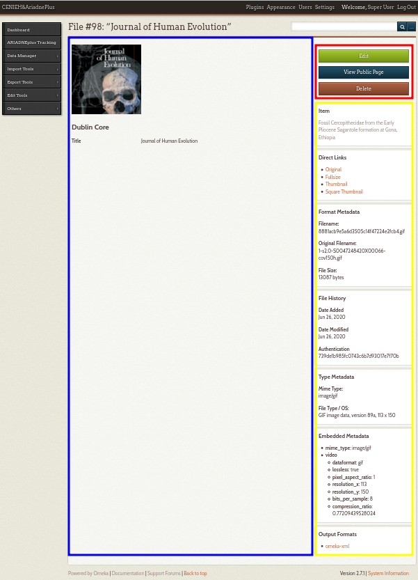

   Vista utilizada para visualizar ficheros

Para visualizar un fichero:

1. Desde el gestor de ítems (`aplicacion.es/admin/items/`).
2. Buscar el ítem que contenga al archivo involucrado.
3. Hacer clic sobre el título del ítem, situado en la segunda columna de la tabla (ver :numref:`items-view`).
4. Desde la página actual (`aplicacion.es/admin/items/show/<idItem>`).
5. Hacer clic sobre la miniatura del fichero (parte superior, justo encima de los metadatos) o bien clicar sobre su nombre (parte derecha, panel "*File Metadata*).

Añadir metadatos a un fichero
*****************************
La aplicación permite asociar metadatos del esquema *Dublin Core* a los ficheros almacenados en la plataforma.

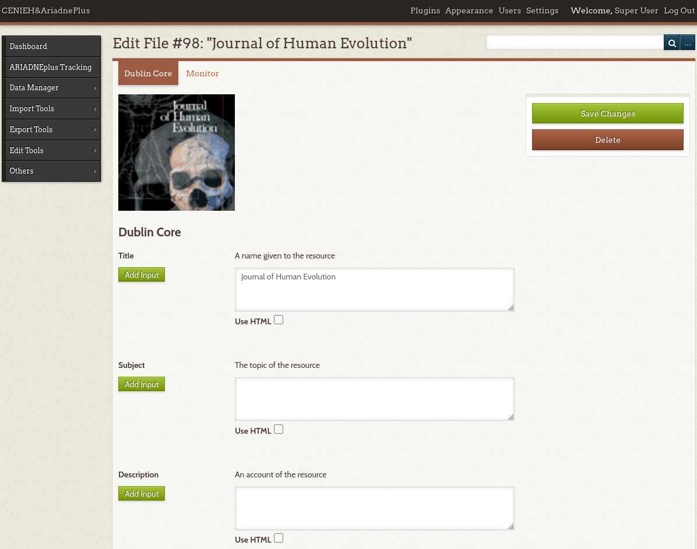

   Vista utilizada para editar ficheros

[Opción 1] Para añadir metadatos a un fichero:

1. Desde el gestor de ítems (`aplicacion.es/admin/items/`).
2. Buscar el ítem que contenga al archivo involucrado.
3. Hacer clic sobre el hipertexto "*Edit*" situado justo debajo del título del ítem (ver :numref:`items-view`).
4. Desde la página actual (`aplicacion.es/admin/items/edit/<idItem>`), acceder a la pestaña "*Files*" (ver :numref:`edit-items-view`).
5. Hacer clic sobre el hipertexto "*Edit*" situado en la parte derecha del nombre del fichero.

[Opción 2] Para añadir metadatos a un fichero:

1. Desde el gestor de ítems (`aplicacion.es/admin/items/`).
2. Buscar el ítem que contenga al archivo involucrado.
3. Hacer clic sobre el título del ítem, situado en la segunda columna de la tabla (ver :numref:`items-view`).
4. Desde la página actual (`aplicacion.es/admin/items/show/<idItem>`).
5. En el panel "*File Metadata*", situado en la parte derecha de la pantalla, hacer clic sobre el nombre del fichero al que deseamos añadir metadatos (ver :numref:`show-items-view`)..
6. Desde la página actual (`aplicacion.es/admin/files/show/<idFile>`), hacer clic sobre el botón "*Edit*".

*Collections*
^^^^^^^^^^^^^
Las colecciones pueden ser usadas en una gran variedad de contextos en los que puede tener sentido utilizarlas para tus conjuntos de datos. En la aplicación, un ítem puede pertenecer a una única colección y, como es lógico, una colección puede contener múltiple ítems. A través de la entrada *Collections*, dentro de la sección "*Data Manager*" del menú principal, se accede al espacio (`aplicacion.es/admin/collections`) donde se gestionan este tipo de elementos.

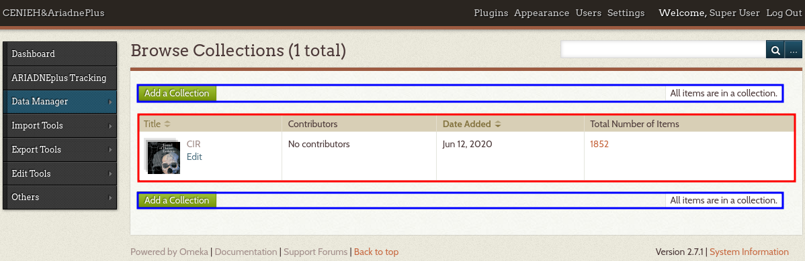

   Vista principal del gestor de colecciones

Crear una colección
*******************
Antes de poder agrupar ítems en una colección, esta debe ser creada.

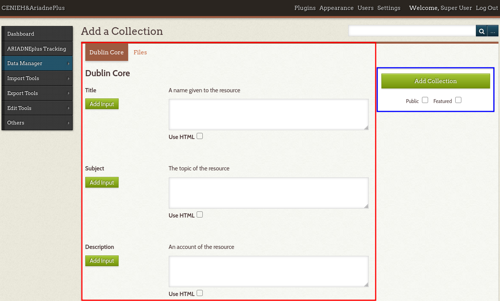

   Vista utilizada para crear colecciones

Para crear una colección:

1. Desde el gestor de colecciones (`aplicacion.es/admin/collections/`).
2. Hacer clic sobre uno de los dos botones "*Add a Collection*".
3. En la página actual (`aplicacion.es/admin/collections/add`),  se puede observar una barra de navegación. Desde ella se pueden configurar los elementos de la colección:

   a. *Dublin Core*: metadatos del esquema *Dublin Core*.
   b. *Files*: ficheros asociados.

4. Si se quiere hacer pública la colección, marcar la casilla *Public* situada justo debajo del botón "*Add Collection*". Además, si se quiere destacar la colección, marcar la casilla "*Feature*".
5. Hacer clic sobre "*Add Collection*".

Añadir ítems a una colección
****************************
Las colecciones pueden agrupar un número ilimitado de ítems. Para añadir ítems a una colección existente se debe señalar a la colección en el valor especial "*Collection*" de cada ítem. Esta operación no se puede llevar a cabo desde el gestor de colecciones, debes editar ese campo desde el gestor de ítems (`aplicacion.es/admin/items/`).

Para añadir un solo ítem a una colección:

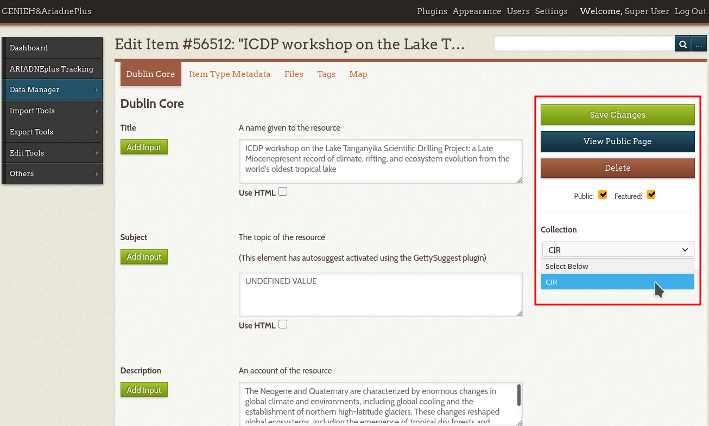

   Añadir un ítem a una colección

1. Desde el gestor de ítems (`aplicacion.es/admin/items/`).
2. Localizar la fila en la que se encuentra el ítem y hacer clic sobre el hipertexto "*Edit*" situado justo debajo del título del ítem.
3. En la página actual (`aplicacion.es/admin/item/edit/<itemid>`), en la parte derecha de la pantala, justo debajo del botón "*Add Item*", selecciona la colección en el campo "*Collection*".
4. Hacer clic sobre el botón "*Save Changes*".

Para añadir varios ítems a una colección:

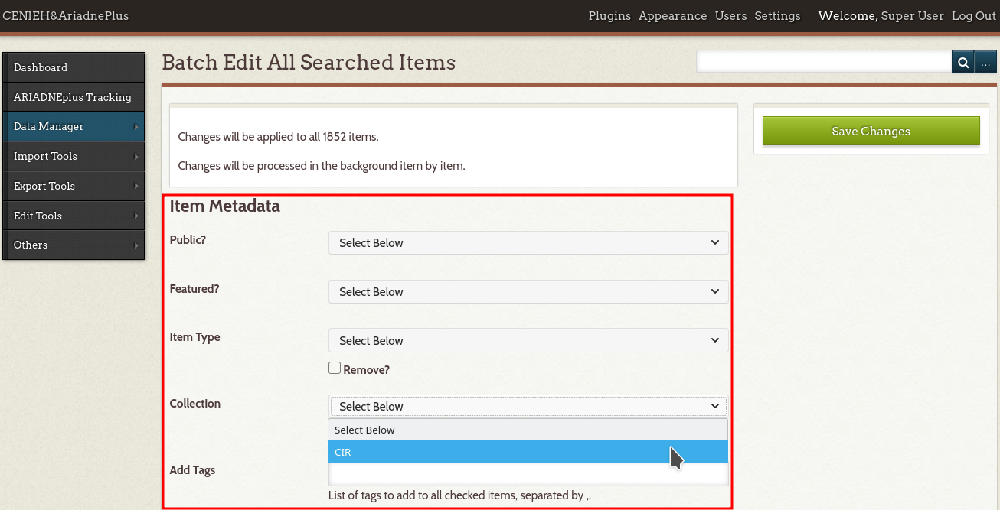

   Añadir varios ítems a una colección

1. Desde el gestor de ítems (`aplicacion.es/admin/items/`).
2. Buscar los ítems que se quieran añadir a la colección.
3. Marcar la casilla situada en la parte izquierda de la tabla de todos los ítems que se pretenden añadir.
   Si se desean seleccionar todos los ítems, hacer clic sobre el botón "*Select all results*" situado en la parte superior izquierda de la tabla.
   Si se desean seleccionar todos los ítems de la página actual, marcar la casilla alojada en la cabecera de la tabla.
4. Hacer clic sobre el botón "*Edit*" situado en la parte superior derecha de la tabla.
5. Desde la página actual (`aplicacion.es/admin/items/batch-edit`), seleccionar la colección en el campo "*Collection*".
6. Hacer clic sobre el botón "*Save Changes*".

Editar una colección
********************
Es posible modificar los datos exclusivos de la colección (no de sus ítems) una vez haya sido creada.

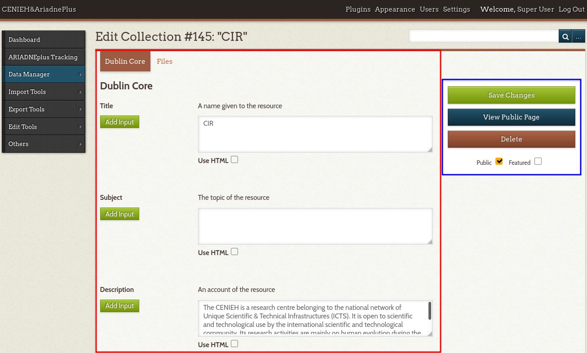

   Vista utilizada para editar colecciones

Para editar una colección existente:

1. Desde el gestor de colecciones (`aplicacion.es/admin/collections/`).
2. Hacer clic sobre el hipertexto "*Edit*".
3. En la página actual (`aplicacion.es/admin/collections/edit/<collectionId>`), realizar las modificaciones oportunas.
4. Hacer clic sobre el botón "*Save Changes*".

Eliminar una colección.
***********************
Al eliminar una colección los ítems que estaban asociados a esta no se eliminan, simplemente se desvinculan. Por tanto, si se pretende eliminar tanto los ítems como la colección asociada, elimina primero los ítems asociados a la colección y, posteriormente, elimina la colección.

Para eliminar una colección existente:

1. Desde el gestor de colecciones (`aplicacion.es/admin/collections/`).
2. Hacer clic sobre el hipertexto "*Edit*".
3. En la página actual (`aplicacion.es/admin/collections/edit/<collectionId>`), hacer clic sobre el botón "*Delete*".
4. Confirmar la eliminación haciendo de nuevo clic sobre el botón "*Delete*".

Visualizar una colección
************************
Desde la página principal del gestor de colecciones (`aplicacion.es/admin/collections/`) solo se muestran algunos datos de cada elemento. Si queremos conocer más información acerca de una colección, tendremos que acceder a su página de visualización.

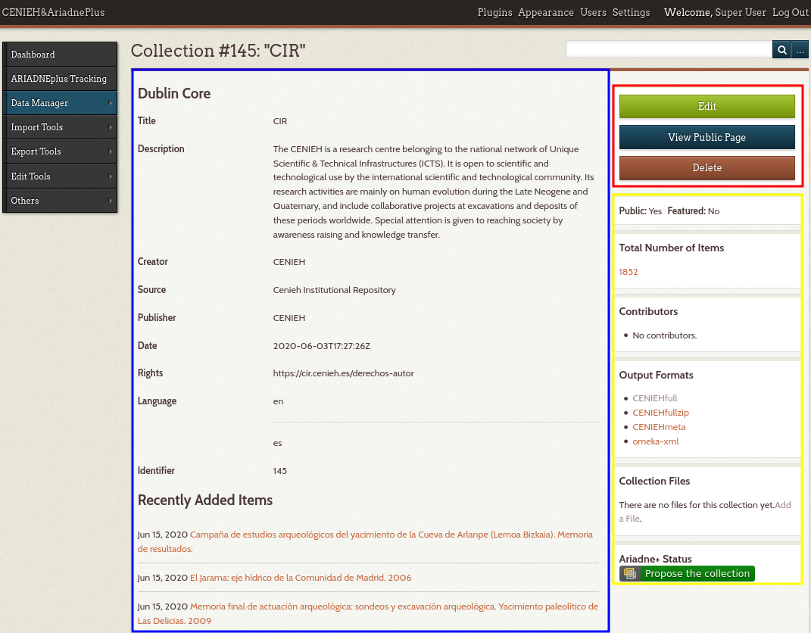

   Vista utilizada para visualizar colecciones

Para visualizar una colección:

1. Desde el gestor de colecciones (`aplicacion.es/admin/collections/`).
2. Buscar la colección que se quiera visualizar.
3. Hacer clic sobre el título de la colección, situado en la segunda columna de la tabla.
4. Visualizar la colección desde la página actual (`aplicacion.es/admin/collections/show/<idItem>`).

*Tags*
^^^^^^
Desde la entrada "*Tags*", dentro de la sección "*Data Manager*"  del menú principal, se accede al gestor de etiquetas o *tags* (`aplicacion.es/admin/tags/`). Las etiquetas son palabras clave o frases utilizadas para describir los datos almacenados en la plataforma. Permiten clasificar el contenido de los datos para facilitar su búsqueda. Estas se pueden asociar a ítems.

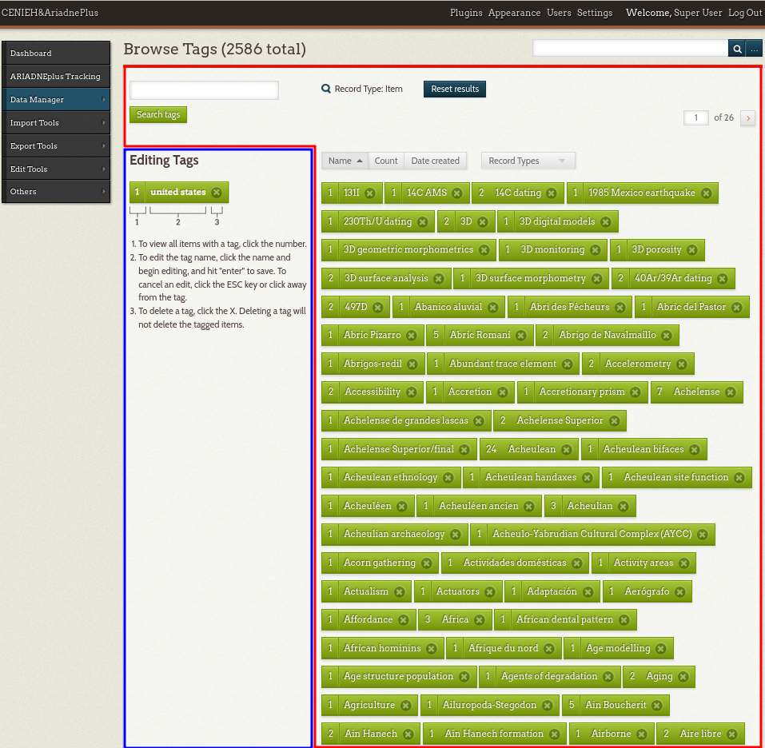

   Vista principal del gestor de etiquetas

Desde el gestor de etiquetas, en la parte derecha se pueden observar todos los *tags* empleados en cada uno de los ítems existentes en la plataforma, mientras que en la parte izquierda, al lado del menú principal, hay un buscador y una explicación de cómo están representados los *tags*.

Ordenar *tags*
**************
Es posible ordenar las etiquetas en función de su nombre, número de apariciones, o fecha en la que se creó.

Para ordenar etiquetas:

1. Desde el gestor de etiquetas (`aplicacion.es/admin/tags/`).
2. Hacer clic sobre alguno de los botones que se encuentran encima del conjunto de etiquetas.

   a. *Name*: se ordenan alfabéticamente por el nombre de cada etiqueta.
   b. *Count*: se ordenan en función del número de ítems asociado a cada etiqueta.
   c. *Date created*: se ordenan por fecha de creación. Por defecto más antiguos primero.

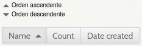

   Botones para ordenar etiquetas o tags

Buscar *tags*
*************
Se pueden buscar etiquetas por su nombre.

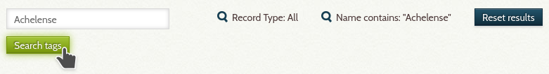

   Botones para ordenar etiquetas o tags

Para buscar etiquetas:

1. Desde el gestor de etiquetas (`aplicacion.es/admin/tags/`).
2. Escribir el nombre de la etiqueta que se está buscando sobre el cuadro de texto situado en la parte izquierda de la pantalla.
3. Hacer clic sobre el botón "*Search tags*".

Para volver al estado de búsqueda inicial:

1. Desde el gestor de etiquetas (`aplicacion.es/admin/tags/`).
2. Hacer clic sobre el botón "*Reset results*".

Editar *tags*
*************
Una vez creada una etiqueta, se puede modificar el nombre de esta. Este cambió se aplicará en todos los ítems que contengan a dicha etiqueta.

   Botones para ordenar etiquetas o tags

Para editar una etiqueta:

1. Desde el gestor de etiquetas (`aplicacion.es/admin/tags/`).
2. Buscar la etiqueta que se desea editar dentro del conjunto de etiquetas situado en la parte derecha de la pantalla.
3. Hacer clic sobre el nombre de la etiqueta.
4. Introducir el nuevo valor en el campo de texto emergente.
5. Pulsar la tecla '*Enter*' o clicar sobre cualquier punto externo.

Eliminar *tags*
***************
Es posible eliminar una o varias etiquetas a la vez. Es importante recalcar que, cuando se elimina una etiqueta, los ítems que están asociados no no se eliminan, simplemente se desvinculan de esta.

Para eliminar una sola etiqueta:

1. Desde el gestor de etiquetas (`aplicacion.es/admin/tags/`).
2. Buscar la etiqueta que se desea eliminar dentro del conjunto de etiquetas situado en la parte derecha de la pantalla.
3. Hacer clic sobre botón "*x*" situado en la parte derecha de la etiqueta.
4. Confirmar la eliminación haciendo clic sobre el botón "*Delete*".

Para eliminar varias etiquetas a la vez:

1. Desde el gestor de etiquetas (`aplicacion.es/admin/tags/`).
2. Buscar las etiquetas que se desean eliminar haciendo uso del buscador. Si se desean eliminar todas las etiquetas, ignorar este paso.
3. Hacer clic sobre botón rojo "*Delete results*" en caso de haber hecho una búsqueda, sino, hacer clic sobre el botón "*Delete all*".
4. Confirmar la eliminación haciendo clic sobre el botón "*Yes*".

Ver ítems asociados a una etiqueta
**********************************
Se pueden obtener todos los ítems asociados a una determinada etiqueta.

Para ello:

1. Desde el gestor de etiquetas (`aplicacion.es/admin/tags/`).
2. Buscar la etiqueta que se desea eliminar dentro del conjunto de etiquetas situado en la parte derecha de la pantalla.
3. Hacer clic sobre el contador situado en la parte izquierda de la etiqueta.

*Item Types*
^^^^^^^^^^^^
Cada ítem puede pertenecer a un determinado tipo, el cual aporta elementos extra al ítem. Por ejemplo, si un ítem hace referencia a una persona, puede resultar interesante indicar su fecha de nacimiento, fecha de muerte, ocupación, etc. Como el esquema de metadatos principal (*Dublin Core*) no contiene elementos que cubran esta información, atribuyendo un tipo al ítem se pueden incluir nuevos elementos que satisfazcan esa necesidad.

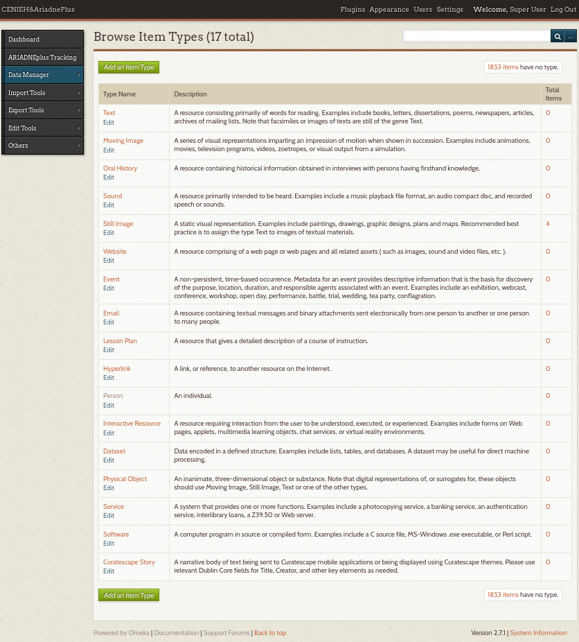

   Vista principal del gestor de tipos de ítem.

A través de la entrada "*Item Types*", dentro de la sección "*Data Manager*" del menú principal de administración, se puede acceder al gestor de tipos de ítem (`aplicacion.es/admin/item-types`).

Tipos de ítem predefinidos
**************************
Cuando se accede al gestor de tipos de ítem (`aplicacion.es/admin/item-types`) por primera vez se observan un conjunto de tipos de ítems ya definidos.

.. table:: Tipos de ítem predefinidos.
   :name: itemtypes
   :widths: auto

   +--------------------------+-----------------------------------------------------------------------------------------------------------------+---------------------------------------------------------+
   | Tipo de ítem             | Descripción                                                                                                     | Ejemplos                                                |
   +==========================+=================================================================================================================+=========================================================+
   | **Text**                 | Recurso cuyo principal contenido es texto                                                                       | Poemas, libros, cartas, artículos, etc.                 |
   +--------------------------+-----------------------------------------------------------------------------------------------------------------+---------------------------------------------------------+
   | **Moving Image**         | Conjunto de imágenes que puestas en sucesión imparten una sensación de movimiento                               | Animaciones, videos, películas, etc.                    |
   +--------------------------+-----------------------------------------------------------------------------------------------------------------+---------------------------------------------------------+
   | **Oral History**         | Recurso que contiene datos históricos obtenidos a partir de conferencias, charlas o reuniones.                  | Charlas, conferencias, entrevistas, etc.                |
   +--------------------------+-----------------------------------------------------------------------------------------------------------------+---------------------------------------------------------+
   | **Sound**                | Recurso cuyo principal cometido es ser escuchado.                                                               | Audios de cualquier tipo                                |
   +--------------------------+-----------------------------------------------------------------------------------------------------------------+---------------------------------------------------------+
   | **Still Image**          | Representación visual estática.                                                                                 | Pinturas, dibujos, planos, mapas, etc.                  |
   +--------------------------+-----------------------------------------------------------------------------------------------------------------+---------------------------------------------------------+
   | **Website**              | Recurso almacenado en una o varias páginas web.                                                                 | Página web                                              |
   +--------------------------+-----------------------------------------------------------------------------------------------------------------+---------------------------------------------------------+
   | **Event**                | Ocurrencia no persistente basada en el tiempo.                                                                  | Conferencia, *Workshop*, Exhibición, etc.               |
   +--------------------------+-----------------------------------------------------------------------------------------------------------------+---------------------------------------------------------+
   | **Email**                | Recurso cuyo contenido es el propio de un mensaje de correo electrónido (asunto, cuerpo, origen, destino, etc.) | Mensaje de correo electrónico                           |
   +--------------------------+-----------------------------------------------------------------------------------------------------------------+---------------------------------------------------------+
   | **Leson Plan**           | Recurso cuyo contenido ofrece una descripción detallada de un curso de formación.                               | Curso de formación                                      |
   +--------------------------+-----------------------------------------------------------------------------------------------------------------+---------------------------------------------------------+
   | **Hyperlink**            | Recurso existente en Internet.                                                                                  | Enlace, Referencia, etc.                                |
   +--------------------------+-----------------------------------------------------------------------------------------------------------------+---------------------------------------------------------+
   | **Person**               | Un individuo.                                                                                                   | Persona.                                                |
   +--------------------------+-----------------------------------------------------------------------------------------------------------------+---------------------------------------------------------+
   | **Interactive Resource** | Recurso que requiere la interacción del usuario para ser entenido, ejecutado o experimentado                    | Formularios, Aplicaciones, Entornos virtuales, etc.     |
   +--------------------------+-----------------------------------------------------------------------------------------------------------------+---------------------------------------------------------+
   | **Dataset**              | Datos codificados en una determinada estructura.                                                                | Metadatos.                                              |
   +--------------------------+-----------------------------------------------------------------------------------------------------------------+---------------------------------------------------------+
   | **Physical Object**      | Objeto o sustancia inanimada.                                                                                   | Cualquier objeto físico (e.g una piedra).               |
   +--------------------------+-----------------------------------------------------------------------------------------------------------------+---------------------------------------------------------+
   | **Service**              | Sistema que provee una o más funciones.                                                                         | Servicio de repostería, autentificación, bancario, etc. |
   +--------------------------+-----------------------------------------------------------------------------------------------------------------+---------------------------------------------------------+
   | **Software**             | Programa de ordenador.                                                                                          | Archuvos .java, .exe, etc.                              |
   +--------------------------+-----------------------------------------------------------------------------------------------------------------+---------------------------------------------------------+
   | **Curatescape Story**    | Historia narrativa que puede ser representada de forma especial por el tema *Curatescape*.                      | Rutas, viajes, etc.                                     |
   +--------------------------+-----------------------------------------------------------------------------------------------------------------+---------------------------------------------------------+

Editar un tipo de ítem
**********************
Se pueden modificar tipos de ítem existentes para modificar sus elementos (metadatos).

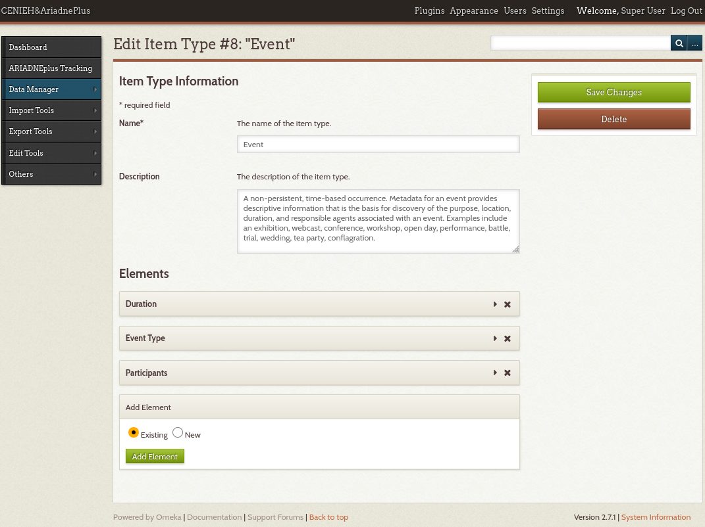

   Vista desde donde se edita un tipo de ítem

Para modificar un tipo de ítem existente:

1. Desde el gestor de tipos de ítem (`aplicacion.es/admin/item-types`).
2. Localizar el tipo de ítem que se desea editar en la tabla donde se encuentran todos los tipos (ver :numref:`item-type-view`).
3. Hacer clic sobre el hipertexto "*Edit*", situado justo debajo del nombre del tipo.
4. En la página actual (`aplicacion.es/admin/item-types/edit/<idItemType>`), realizar las modificaciones oportunas (ver `Crear un tipo de Item`_).
5. Hacer clic sobre el botón "*Save changes*" situado en la parte superior derecha de la pantalla.

Crear un tipo de ítem
**********************
En caso de que ninguno de los tipos de ítem predefinidos (ver :numref:`itemtypes`) cubra nuestras necesidades, se puede crear un nuevo tipo de ítem.

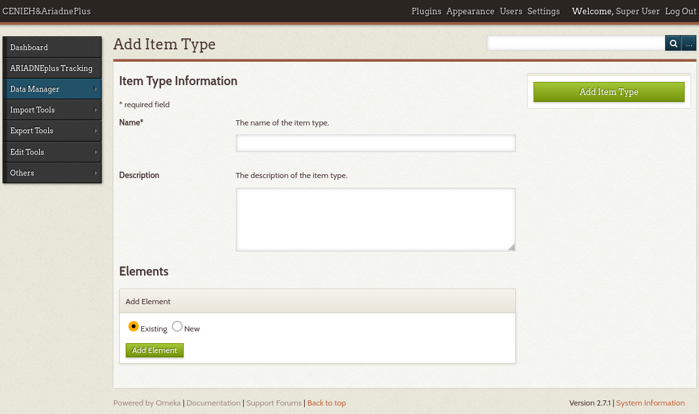

   Vista desde donde se añade un tipo de ítem

Para crear un tipo de ítem nuevo:

1. Desde el gestor de tipos de ítem (`aplicacion.es/admin/item-types`).
2. Hacer clic sobre el botón "*Add an Item Type*", situado en la parte superior/inferior de la pantalla (ver :numref:`item-type-view`).
3. En la página actual (`aplicacion.es/admin/item-types/add`):

   a. Establecer un nombre

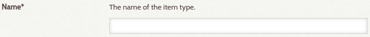

   b. Establecer una descripción

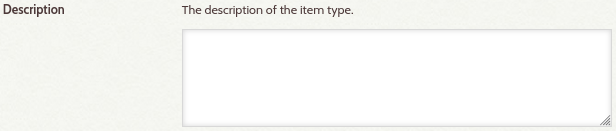

   a. Añadir un elemento existente.

      1. Seleccionar "*Existing*".
      2. Hacer clic sobre el botón "*Add element*".

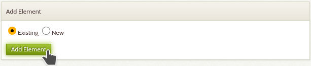

      3. En el bloque del elemento emergente, seleccionar el elemento existente.

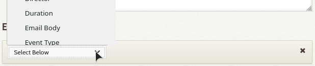

   b. Añadir un elemento nuevo

      1. Seleccionar "*New*".
      2. Hacer clic sobre el botón "*Add element*".

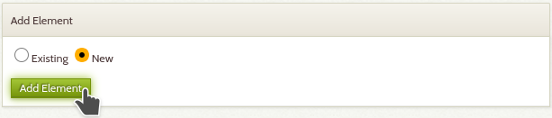

      3. En el bloque del elemento emergente, establecer el nombre y descripción del elemento.

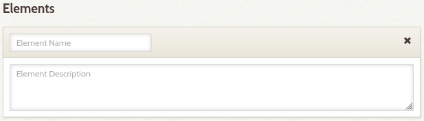

5. Hacer clic sobre el botón "*Add Item Type*" situado en la parte superior derecha de la pantalla.

Visualizar un tipo de ítem
**************************
Antes de realizar tareas de gestión sobre un determinado tipo de ítem, se puede comprobar el estado actual del mismo.

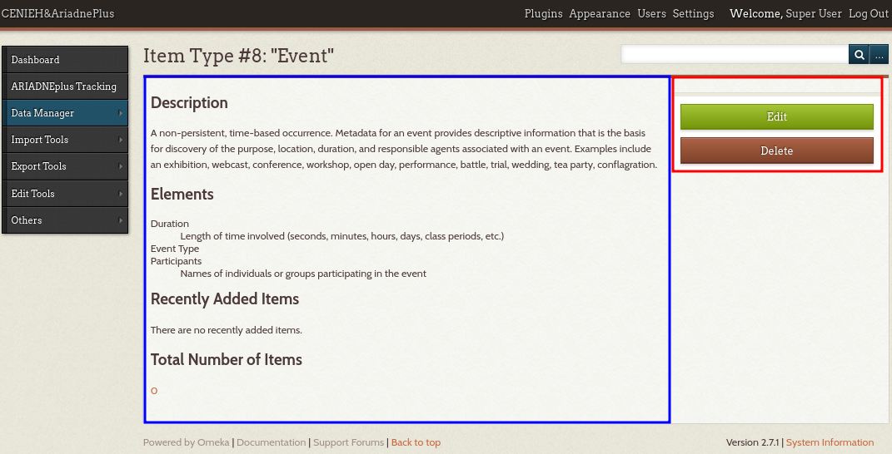

   Vista desde donde se visualiza un tipo de ítem

Para visualizar un tipo de ítem existente.

1. Desde el gestor de tipos de ítem (`aplicacion.es/admin/item-types`).
2. Localizar el tipo de ítem que se desea eliminar en la tabla donde se encuentran todos los tipos (ver :numref:`item-type-view`).
3. Hacer clic sobre el nombre del tipo de ítem.
4. Visualizar el tipo de ítem en la página actual (`aplicacion.es/admin/item-types/show/<idItemType>`).

Eliminar un tipo de item
************************
Al eliminar un tipo de ítem no se eliminan los elementos (metadatos) asignados al tipo de ítem. Sin embargo, todos los ítems que tengan asignado el tipo de ítem eliminado, perderán todos los metadatos especificados por el tipo de ítem.

[Opción 1] Para eliminar un tipo de ítem existente:

1. Desde el gestor de tipos de ítem (`aplicacion.es/admin/item-types`).
2. Localizar el tipo de ítem que se desea eliminar en la tabla donde se encuentran todos los tipos (ver :numref:`item-type-view`).
3. Hacer clic sobre el hipertexto "*Edit*", situado justo debajo del nombre del tipo.
4. En la página actual (`aplicacion.es/admin/item-types/edit/<idItemType>`), hacer clic sobre el botón rojo "*Delete*"  (ver :numref:`show-item-type`).
5. Confirmar la eliminación volviendo a pulsar sobre el botón "*Delete*".

[Opción 2] Para eliminar un tipo de ítem existente:

1. Desde el gestor de tipos de ítem (`aplicacion.es/admin/item-types`).
2. Localizar el tipo de ítem que se desea eliminar en la tabla donde se encuentran todos los tipos (ver :numref:`item-type-view`).
3. Hacer clic sobre el nombre del tipo de ítem.
4. En la página actual (`aplicacion.es/admin/item-types/show/<idItemType>`), hacer clic sobre el botón rojo "*Delete*".
5. Confirmar la eliminación volviendo a pulsar sobre el botón "*Delete*".

*Import Tools*
~~~~~~~~~~~~~~
En el interior de esta sección se encuentran las herramientas necesarias para importar conjuntos de datos a la plataforma. Las opciones de importación disponibles son dos: *CSV Import+* y *OAI-PMH Harvester*.

*CSV Import+*
^^^^^^^^^^^^^
Esta herramienta permite importar conjuntos de datos que están dispuestos en formato CSV. 

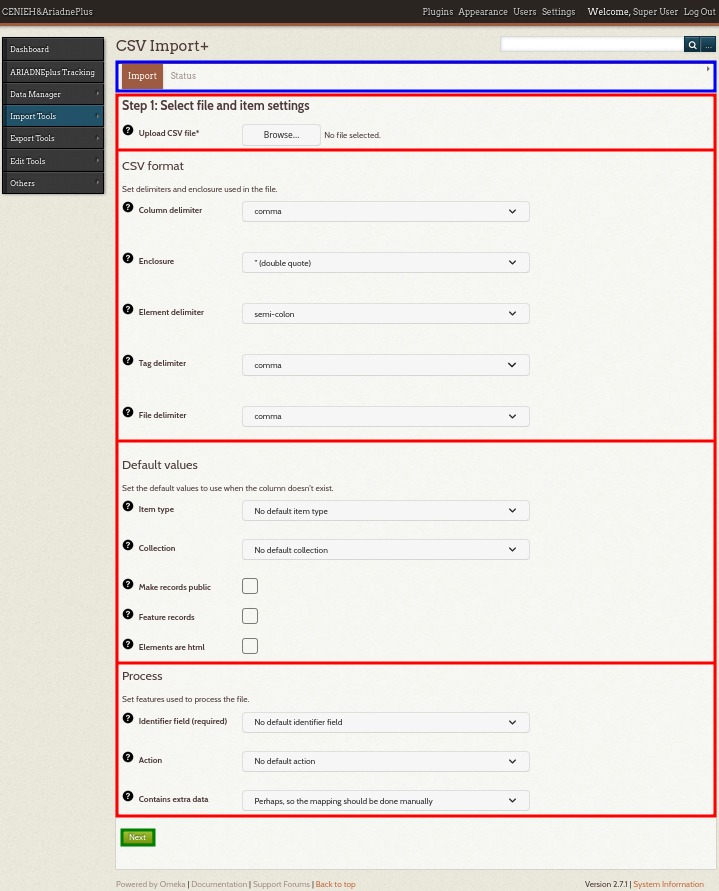

   Vista principal de la herramienta CSV Import+

Cuando se accede a esta herramienta, se nos muestra el primer paso a realizar para llevar a cabo la importación. Este es un formulario donde el usuario debe configurar los aspectos de la importación.

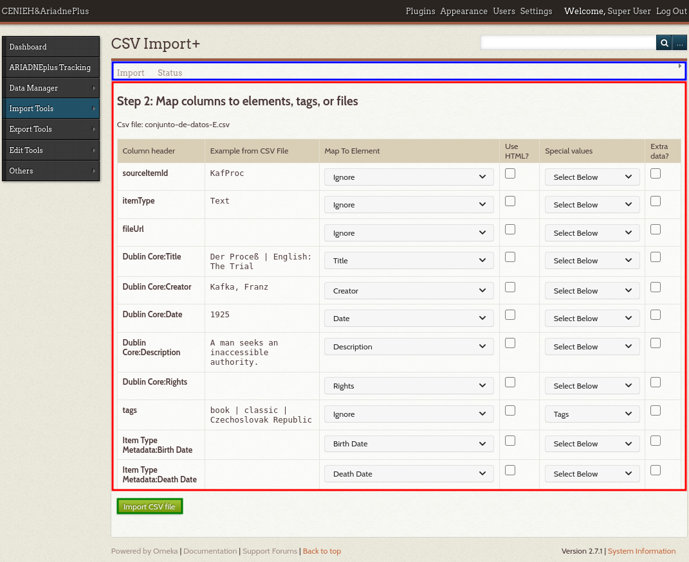

   Vista correspondiente al paso 2 del proceso de importación de la herramienta CSV Import+

Además, existe un segundo paso opcional, donde se lleva a cabo el mapeo de datos de forma manual.

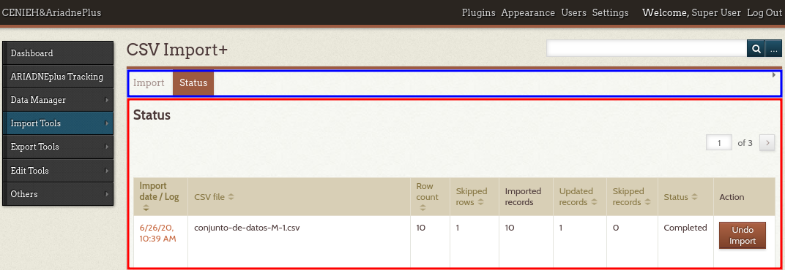

   Vista desde donde se visualizan los registros de la herramienta CSV Import+

Tras finalizar el recorrido de importación, es posible visualizar el registro de cada importación desde la pestaña "*Status*".

Importar datos CSV
******************
Antes de iniciar este proceso, es muy importante que el usuario que lo lleve a cabo conozca los datos que está importando para configurar adecuadamente el proceso de importación.

Para importar datos CSV:

1. Desde el complemento *CSV Import+* (`aplicacion.es/admin/csv-import-plus/`).
2. En la pestaña *Import* (ver :numref:`csv-import-plus-1`), rellenar el formulario correspondiente al paso 1 (*Step 1: Select file and item settings*). **Es muy recomendable** dejar los valores por defecto (ver :numref:`formImport`).

   a. Hacer clic sobre el botón "*Next*".

4. Al seleccionar la opción *Perhaps, so the mapping should be done manually* para el campo *Contains extra data*, se debe completar un segundo paso (ver :numref:`csv-import-plus-2`) :

   a. Establecer las relaciones entre los elementos de origen (e.g *Localización*) y los elementos de destino (e.g. *Dublin Core:Spatial Coverage*) haciendo uso de la columna *Map To Element*.
   b. Si alguno de los elementos tiene contenido HTML, indícalo en la columna *Use HTML?*.
   c. Si alguno de los elementos representa un valor especial (ver :numref:`specialvalues`), selecciona dicho valor en la columna *Special Values*.

      - **Es obligatorio** que el conjunto de datos cuente con un único elemento que contega el identificador de cada registro. Luego siempre existirá un elemento con el valor especial *Identifier*.

   d. Si alguno de los elementos no pertenece a ningún elemento estandarizado, sino que pertenece a otro elemento de otro tipo de objeto, se debe indicar en la casilla *Extra Data?*.
   e. Hacer clic sobre el botón *Import CSV file*.

5. Puedes visualizar el progreso de la importación desde la pestaña *Status* (ver :numref:`csv-import-plus-status`).

Tablas de configuración
***********************

.. table:: Formulario de configuración de la herramienta de importación CSV Import+
   :name: formImport
   :widths: auto

   +----------------------------------------------------------------------------------------+------------------------------------------------------------------------------------------------------------------------------------------------------------------------------+---------------------------------------------------------------------------------------------------------------------------------+-----------------------------------------------------+
   |                                         Sección                                        |                                                                                     Campo                                                                                    |                                                              Valor                                                              |                  Valor por defecto                  |
   +========================================================================================+==============================================================================================================================================================================+=================================================================================================================================+=====================================================+
   | **Upload**: adjuntar el fichero CSV a importar                                         | **Upload CSV file**: fichero CSV que se pretende importar.                                                                                                                   |                                                                                                                                 |                                                     |
   +----------------------------------------------------------------------------------------+------------------------------------------------------------------------------------------------------------------------------------------------------------------------------+---------------------------------------------------------------------------------------------------------------------------------+-----------------------------------------------------+
   | **CSV Format**: configurar el formato CSV del fichero adjuntado                        | **Column Delimiter**: caracter utilizado para separar las columnas.                                                                                                          | - **comma**: ','                                                                                                                | **Coma**                                            |
   |                                                                                        |                                                                                                                                                                              | - **Semi-colon**: ';'                                                                                                           |                                                     |
   |                                                                                        |                                                                                                                                                                              | - **Colon**: '.'                                                                                                                |                                                     |
   |                                                                                        |                                                                                                                                                                              | - **pipe**: '|'                                                                                                                 |                                                     |
   |                                                                                        |                                                                                                                                                                              | - **tabulation**: '    '                                                                                                        |                                                     |
   |                                                                                        |                                                                                                                                                                              | - **carriage return**: '↵'                                                                                                      |                                                     |
   |                                                                                        |                                                                                                                                                                              | - **space**: ' '                                                                                                                |                                                     |
   |                                                                                        |                                                                                                                                                                              | - **custom**: ?                                                                                                                 |                                                     |
   |                                                                                        +------------------------------------------------------------------------------------------------------------------------------------------------------------------------------+---------------------------------------------------------------------------------------------------------------------------------+-----------------------------------------------------+
   |                                                                                        | **Enclosure**: caracter utilizado para delimitar las columnas.                                                                                                               | - **double quote**: '"'                                                                                                         | **double quote**                                    |
   |                                                                                        |                                                                                                                                                                              | - **single quote**: '''                                                                                                         |                                                     |
   |                                                                                        |                                                                                                                                                                              | - **custom**: ?                                                                                                                 |                                                     |
   |                                                                                        +------------------------------------------------------------------------------------------------------------------------------------------------------------------------------+---------------------------------------------------------------------------------------------------------------------------------+-----------------------------------------------------+
   |                                                                                        | **Element delimiter**: caracter utilizado para separar metadatos dentro de una misma celda.                                                                                  | - **comma**: ','                                                                                                                | **Semi-colon**                                      |
   |                                                                                        +------------------------------------------------------------------------------------------------------------------------------------------------------------------------------+ - **Semi-colon**: ';'                                                                                                           +-----------------------------------------------------+
   |                                                                                        | **Tag delimiter**: caracter utilizado para separar *tags* dentro de una misma celda.                                                                                         | - **Colon**: '.'                                                                                                                | **comma**                                           |
   |                                                                                        |                                                                                                                                                                              | - **pipe**: '|'                                                                                                                 |                                                     |
   |                                                                                        | **Si tus datos no contienen tags, puedes ignorarlo**.                                                                                                                        | - **tabulation**: '    '                                                                                                        |                                                     |
   |                                                                                        +------------------------------------------------------------------------------------------------------------------------------------------------------------------------------+ - **carriage return**: '↵'                                                                                                      +-----------------------------------------------------+
   |                                                                                        | **File delimiter**: caracter utilizado para separar rutas de archivos o *URLs* dentro de una misma celda.                                                                    | - **space**: ' '                                                                                                                | **comma**                                           |
   |                                                                                        |                                                                                                                                                                              | - **double space**: '  '                                                                                                        |                                                     |
   |                                                                                        | **Si tus datos no referencian ficheros, puedes ignorarlo.**                                                                                                                  | - **custom**: ?                                                                                                                 |                                                     |
   +----------------------------------------------------------------------------------------+------------------------------------------------------------------------------------------------------------------------------------------------------------------------------+---------------------------------------------------------------------------------------------------------------------------------+-----------------------------------------------------+
   | **Default values**: configurar los valores por defecto para todos los ítems a importar | **Item type**: tipo de ítem que pretendemos importar.                                                                                                                        | - **No default item type**                                                                                                      | **No default item type**                            |
   |                                                                                        |                                                                                                                                                                              | - **Tipo de ítem**                                                                                                              |                                                     |
   |                                                                                        +------------------------------------------------------------------------------------------------------------------------------------------------------------------------------+---------------------------------------------------------------------------------------------------------------------------------+-----------------------------------------------------+
   |                                                                                        | **Collection**: colección a la que pertenecen los ítems.                                                                                                                     | - **No default collection**                                                                                                     | **No default collection**                           |
   |                                                                                        |                                                                                                                                                                              | - **Colección**                                                                                                                 |                                                     |
   |                                                                                        | **Si el fichero contiene muchos ítems, conviene agruparlos dentro de una colección previamente creada.**                                                                     |                                                                                                                                 |                                                     |
   |                                                                                        +------------------------------------------------------------------------------------------------------------------------------------------------------------------------------+---------------------------------------------------------------------------------------------------------------------------------+-----------------------------------------------------+
   |                                                                                        | **Make records public**: activado, se publicarán los ítems tras la importación                                                                                               | - **Activado**                                                                                                                  | **Desactivado**                                     |
   |                                                                                        +------------------------------------------------------------------------------------------------------------------------------------------------------------------------------+ - **Desactivado**                                                                                                               |                                                     |
   |                                                                                        | **Feature**: activado, se marcarán los ítems importados como *feature*.                                                                                                      |                                                                                                                                 |                                                     |
   |                                                                                        +------------------------------------------------------------------------------------------------------------------------------------------------------------------------------+                                                                                                                                 |                                                     |
   |                                                                                        | **Elements are html**: activado, se considerará que el contenido de los ítems está en html.                                                                                  |                                                                                                                                 |                                                     |
   +----------------------------------------------------------------------------------------+------------------------------------------------------------------------------------------------------------------------------------------------------------------------------+---------------------------------------------------------------------------------------------------------------------------------+-----------------------------------------------------+
   | **Process**: configurar el proceso de importación.                                     | **Identifier field**: elemento que señala el identificador de cada ítem.                                                                                                     | - **No default identifier field**: no se especifica ningún campo como identificador.                                            | **No default identifier field**                     |
   |                                                                                        |                                                                                                                                                                              | - **Table identifier**: columna "table id" o "Identifier" de la tabla CSV del fichero adjuntado.                                |                                                     |
   |                                                                                        |                                                                                                                                                                              | - **Internal id**: identificador interno del registro en la aplicación.                                                         |                                                     |
   | **Las opciones por defecto son válidas para cualquier importación**                    |                                                                                                                                                                              | - **Elemento**: elemento de algún esquema de metadatos.                                                                         |                                                     |
   +----------------------------------------------------------------------------------------+------------------------------------------------------------------------------------------------------------------------------------------------------------------------------+---------------------------------------------------------------------------------------------------------------------------------+-----------------------------------------------------+
   |                                                                                        | **Action**: acción que se ejecutará en cada ítem.                                                                                                                            | - **No default action**: no se ejecuta ninguna acción.                                                                          | **No default action**                               |
   |                                                                                        |                                                                                                                                                                              | - **Update record if exist, else create one**: se actualiza el registro si existe, sino se crea.                                |                                                     |
   |                                                                                        |                                                                                                                                                                              | - **Create a new record**: se crea un nuevo registro.                                                                           |                                                     |
   |                                                                                        | **Para que estas acciones se ejecuten, el identificador del dato importado ha de coincidir con el identificador del ítem existente en la plataforma.**                       | - **Update values of specific fields**: se actualizan los valores de los campos especificados.                                  |                                                     |
   |                                                                                        |                                                                                                                                                                              | - **Add values to specific fields**: se añaden los valores a los campos especificados.                                          |                                                     |
   |                                                                                        |                                                                                                                                                                              | - **Replace values of all fields**: se reemplazan los valores en todos los campos.                                              |                                                     |
   |                                                                                        |                                                                                                                                                                              | - **Delete the record**: se elimina el registro.                                                                                |                                                     |
   |                                                                                        |                                                                                                                                                                              | - **Skip process of the record**: se ignora el registro.                                                                        |                                                     |
   +----------------------------------------------------------------------------------------+------------------------------------------------------------------------------------------------------------------------------------------------------------------------------+---------------------------------------------------------------------------------------------------------------------------------+-----------------------------------------------------+
   |                                                                                        | **Contains extra data**: indicar si nuestro conjunto de datos contiene elementos que no siguen ningún estándar de metadatos, sino que se refieren a otro tipos de registros. | - **No, so unrecognized column names will be noticed**: no, así que se avisará al usuario de las columnas que no se reconozcan. | **Perhaps, so the mapping should be done manually** |
   |                                                                                        |                                                                                                                                                                              | - **Perhaps, so the mapping should be done manually**: quizás, por lo tanto, el mapeo se debe hacer manualmente.                |                                                     |
   |                                                                                        | **Si no se tiene conocimientos de la aplicación, dejar el valor por defecto.**                                                                                               | - **Ignore unrecognized column names**: ignorar aquellas columnas que no pertenezcan a ningún esquema de metadatos.             |                                                     |
   |                                                                                        |                                                                                                                                                                              | - **Yes, so column names won't be checked**: si, luego el nombre de las columnas no se debe tener en cuenta.                    |                                                     |
   +----------------------------------------------------------------------------------------+------------------------------------------------------------------------------------------------------------------------------------------------------------------------------+---------------------------------------------------------------------------------------------------------------------------------+-----------------------------------------------------+

.. table:: Posibles valores especiales de un objeto (Item, Collection, File) que pueden ser indicados por un elemento durante la importación.
   :name: specialvalues
   :widths: auto

   +---------------------------+----------------------------------------------------------------------------------------+
   | Valor especial            | Significado                                                                            |
   +===========================+========================================================================================+
   | **Tags**                  | El elemento contiene *tags*.                                                           |
   +---------------------------+----------------------------------------------------------------------------------------+
   | **Collection (for item)** | El elemento contiene el identificador de la colección asociada al ítem.                |
   +---------------------------+----------------------------------------------------------------------------------------+
   | **Item (for file)**       | El elemento contiene el identificador del item asociado al fichero.                    |
   +---------------------------+----------------------------------------------------------------------------------------+
   | **Files**                 | El elemento contiene ficheros (rutas o URLs).                                          |
   +---------------------------+----------------------------------------------------------------------------------------+
   | **Public**                | El elemento contiene el valor que indica si el ítem es público o no (*true*/*false*).  |
   +---------------------------+----------------------------------------------------------------------------------------+
   | **Featured**              | El elemento contiene el valor que indica si el ítem es *feature* o no.                 |
   +---------------------------+----------------------------------------------------------------------------------------+
   | **Action**                | El elemento contiene el valor que indica una acción (*Delete*, *Update*, *Add*, etc.). |
   +---------------------------+----------------------------------------------------------------------------------------+
   | **Record type**           | El elemento contiene el tipo de registro que estamos importando (*Collection*/*Item*). |
   +---------------------------+----------------------------------------------------------------------------------------+
   | **Item type**             | El elemento contiene el tipo de ítem que estamos importando (e.g *dataset*).           |
   +---------------------------+----------------------------------------------------------------------------------------+
   | **Identifier field**      | El elemento es un campo de identificación.                                             |
   +---------------------------+----------------------------------------------------------------------------------------+
   | **Identifier**            | El elemento contiene el identificador del registro.                                    |
   +---------------------------+----------------------------------------------------------------------------------------+

Ejemplos de importación
***********************

A continuación, se muestran diferentes conjuntos de datos de ejemplo:

- **Conjunto de datos A**: cómo importar ítems simples que no siguen ningún esquema de metadatos. El formato CSV es normal.

   - Descripción del conjunto: contiene información acerca de tres libros, cada uno de los cuales tiene asociado una imagen (fichero) de Wikipedia. La información (metadatos) no sigue ningún estándar.
   - Fichero CSV: :download:`Conjunto de datos A <../_static/csv_files/conjunto-de-datos-A.csv>`
   - *CSV Format*: Por defecto.
   - *Default values*: Por defecto.
   - *Process*: Por defecto.
   - ¿ Contiene valores especiales ? : Sí, *Tags* y *Files*.
   - ¿ Contiene contenido extra ? : No

- **Conjunto de datos B**: cómo importar ítems simples con metadatos que siguen el esquema de metadatos *Dublin Core*. El formato CSV es normal.

   - Descripción del conjunto: es el mismo que el conjunto de datos A solo que en este caso los elementos (metadatos) sí que siguen un estándar (*Dublin Core*) aceptado por la plataforma. En estos casos, no hará falta realizar un mapeo manual.
   - Fichero CSV: :download:`Conjunto de datos B <../_static/csv_files/conjunto-de-datos-B.csv>`
   - *CSV Format*: Por defecto.
   - *Default values*: Por defecto.
   - *Process*: Por defecto.
   - ¿ Contiene valores especiales ? : Sí, *Tags* y *Files*.
   - ¿ Contiene contenido extra ? : No

- **Conjunto de datos C**: cómo importar ítems simples con metadatos que siguen el esquema de metadatos *Dublin Core*. El formato CSV presenta particularidades.

   - Descripción del conjunto: es el mismo que el conjunto de datos A o B solo que el formato CSV adopta delimitadores distintos a los que vienen por defecto.
   - Fichero CSV: :download:`Conjunto de datos C <../_static/csv_files/conjunto-de-datos-C.csv>`
   - *CSV format*:

      - *Column delimiter*: tabulation
      - *Enclosure*: quotation mark "
      - *Element delimiter*: custom ^^
      - *Tag delimiter*: double space
      - *File delimiter*: semi-colon

   - *Default values*: Por defecto.
   - *Process*: Por defecto ...

      - *Contains extra data*: puede adquirir tanto el valor de *Perhaps ...* como de *No, ...*. Si es este último, se automatiza el paso 2.

   - ¿ Contiene valores especiales ? : Sí, *Tags* y *Files*.
   - ¿ Contiene contenido extra ? : No

- **Conjuntos de datos D-1 y D-2**: cómo importar ficheros con metadatos que siguen el esquema de metadatos *Dublin Core*. El formato CSV presenta particularidades.

   - Descripción del conjunto:

      - D-1: contiene, además del mismo contenido de los conjuntos anteriores, información adicional (metadatos) de las imágenes (ficheros) asociadas a los ítems.
      - D-2: **requiere que alguno de los conjuntos de datos anteriores (A,B,C,D-1)**.

   - Ficheros CSV: :download:`Conjunto de datos D-1 <../_static/csv_files/conjunto-de-datos-D-1.csv>` y :download:`Conjunto de datos D-2 <../_static/csv_files/conjunto-de-datos-D-2.csv>` 
   - *CSV format*:

      - *Column delimiter*: tabulation
      - *Enclosure*: quotation mark "
      - *Element delimiter*: pipe
      - *Tag delimiter*: pipe
      - *File delimiter*: pipe

   - *Default values*: Por defecto.
   - *Process*: Por defecto ...

      - *Contains extra data*: puede adquirir el valor de *Perhaps ...* y de *No, ...*. Si es este último, se salta el paso 2.

   - ¿ Contiene valores especiales ? : Sí, *Tags* y *Files*.
   - ¿ Contiene contenido extra ? : No

- **Conjunto de datos E**: cómo importar metadatos de ítems y ficheros a la vez.

   - Descripción del conjunto: contiene metadatos tanto de ítems como de ficheros. **Es importante** tener en cuenta que las filas de los ficheros deben estar por debajo de las filas de los ítems, de lo contrario, se omitirían.
   - Fichero CSV: :download:`Conjunto de datos E <../_static/csv_files/conjunto-de-datos-E.csv>`
   - *CSV format*:

      - *Column delimiter*: tabulation
      - *Enclosure*: quotation mark "
      - *Element delimiter*: pipe
      - *Tag delimiter*: pipe
      - *File delimiter*: pipe

   - *Default values*: Por defecto.
   - *Process*: Por defecto.
   - ¿ Contiene valores especiales ? : Sí, *Tags*.
   - ¿ Contiene contenido extra ? : No

- **Conjunto de datos F**: cómo actualizar metadatos de ítems y ficheros existentes en la plataforma.

   - Descripción del conjunto: contiene el conjunto de datos E con nuevos datos. **Para que la actualización funcione**, debes importar antes el :download:`conjunto de datos E <../_static/csv_files/conjunto-de-datos-E.csv>`.
   - Fichero CSV: :download:`Conjunto de datos F <../_static/csv_files/conjunto-de-datos-F.csv>`
   - *CSV format*:

      - *Column delimiter*: tabulation
      - *Enclosure*: quotation mark "
      - *Element delimiter*: pipe
      - *Tag delimiter*: pipe
      - *File delimiter*: pipe

   - *Default values*: Por defecto.
   - *Process*:

      - *Action*: *Update the record if exists, else create one*.

   - ¿ Contiene valores especiales ? : Sí, *Tags*.
   - ¿ Contiene contenido extra ? : No

- **Conjunto de datos G**: cómo importar una colección de ítems simples con metadatos que siguen o no un esquema de metadatos.

   - Descripción del conjunto: contiene metadatos de una colección y los metadatos de dos ítems que pertenecen a dicha colección.
   - Fichero CSV: :download:`Conjunto de datos G <../_static/csv_files/conjunto-de-datos-G.csv>`
   - *CSV format*:

      - *Column delimiter*: tabulation
      - *Enclosure*: quotation mark "
      - *Element delimiter*: pipe
      - *Tag delimiter*: pipe
      - *File delimiter*: pipe

   - *Default values*: Por defecto.
   - *Process*: Por defecto.
   - ¿ Contiene valores especiales ? : Sí, *Record Type* y *Collection*.
   - ¿ Contiene contenido extra ? : No

- **Conjunto de datos H**: cómo actualizar metadatos de una colección existente en la plataforma.

   - Descripción del conjunto: contiene el conjunto de datos G con nuevos datos. **Para que la actualización funcione**, debes importar antes el :download:`conjunto de datos G <../_static/csv_files/conjunto-de-datos-G.csv>`.
   - Fichero CSV: :download:`Conjunto de datos G <../_static/csv_files/conjunto-de-datos-G.csv>`
   - *CSV format*:

      - *Column delimiter*: tabulation
      - *Enclosure*: quotation mark "
      - *Element delimiter*: pipe
      - *Tag delimiter*: pipe
      - *File delimiter*: pipe

   - *Default values*: Por defecto.
   - *Process*: Por defecto.
   - ¿ Contiene valores especiales ? : Sí, *Record Type* y *Collection*.
   - ¿ Contiene contenido extra ? : No

- **Conjunto de datos I**: cómo añadir ítems a una colección existente en la plataforma desde el formulario.

   - Descripción del conjunto: contiene metadatos de un ítem. **Para que la importación funcione**, debes importar antes el :download:`conjunto de datos G <../_static/csv_files/conjunto-de-datos-G.csv>`.
   - Fichero CSV: :download:`Conjunto de datos I <../_static/csv_files/conjunto-de-datos-I.csv>`
   - *CSV format*:

      - *Column delimiter*: tabulation
      - *Enclosure*: quotation mark "
      - *Element delimiter*: pipe
      - *Tag delimiter*: pipe
      - *File delimiter*: pipe

   - *Default values*

      - *Collection*: *collection-a*

   - *Process*: Por defecto.
   - ¿ Contiene valores especiales ? : Sí, *Record Type*.
   - ¿ Contiene contenido extra ? : No

- **Conjunto de datos J**: cómo importar contenido extra que no es gestionado como elementos, sino como datos de un objeto (tabla) específico. Los elementos existentes siguen un estándar.

   - Descripción del conjunto: contiene información (metadatos y valores especiales) de ítems y ficheros. Además, contiene contenido extra, en concreto, geolocalizaciones.
   - Fichero CSV: :download:`Conjunto de datos J <../_static/csv_files/conjunto-de-datos-J.csv>`
   - *CSV format*:

      - *Column delimiter*: tabulation
      - *Enclosure*: quotation mark "
      - *Element delimiter*: pipe
      - *Tag delimiter*: pipe
      - *File delimiter*: pipe

   - *Default values*: Por defecto.
   - *Process*:

      - *Identifier Field*: *Dublin Core : Identifier*
      - *Contains extra data*: puede ser tanto *Yes, ...* (paso 2 automatizado) como *Perhaps, ...* (paso 2 manual).

   - ¿ Contiene valores especiales ? : Sí, *Record Type*, *Item Type*, *Public*, *Featured*, *Item* y *File*.
   - ¿ Contiene contenido extra ? : Sí, *geolocation*.

- **Conjunto de datos K**: cómo importar contenido extra que no es gestionado como elementos, sino como datos de un objeto (tabla) específico. Los elementos existentes no siguen ningún estándar.

   - Descripción del conjunto: es igual al conjunto de datos J solo que en este caso el nombre de los elementos no sigue ningún estándar.
   - Fichero CSV: :download:`Conjunto de datos K <../_static/csv_files/conjunto-de-datos-K.csv>`
   - *CSV format*:

      - *Column delimiter*: tabulation
      - *Enclosure*: quotation mark "
      - *Element delimiter*: pipe
      - *Tag delimiter*: pipe
      - *File delimiter*: pipe

   - *Default values*: Por defecto.
   - *Process*: Por defecto.
   - ¿ Contiene valores especiales ? : Sí, *Record Type*, *Item Type*, *Public*, *Featured*, *Item* y *File*.
   - ¿ Contiene contenido extra ? : Sí, *geolocation*.

- **Conjunto de datos L**: cómo actualizar contenido extra existente en la plataforma.

   - Descripción del conjunto: es igual al conjunto de datos J solo que el contenido extra ha cambiado. **Para que la actualización funcione**, debes importar antes el :download:`conjunto de datos J <../_static/csv_files/conjunto-de-datos-J.csv>`.
   - Fichero CSV: :download:`Conjunto de datos L <../_static/csv_files/conjunto-de-datos-L.csv>`
   - *CSV format*:

      - *Column delimiter*: tabulation
      - *Enclosure*: quotation mark "
      - *Element delimiter*: pipe
      - *Tag delimiter*: pipe
      - *File delimiter*: pipe

   - *Default values*: Por defecto.
   - *Process*: Por defecto.
   - ¿ Contiene valores especiales ? : Sí, *Record Type*, *Item Type*, *Public*, *Featured*, *Item* y *File*.
   - ¿ Contiene contenido extra ? : Sí, *geolocation*.

- **Conjuntos de datos M-1, M-2 y M-3**: cómo gestionar el proceso de importación.

   - Descripción del conjunto:

      - M-1: contiene información acerca de dos colecciones con ítems.
      - M-2: similar al conjunto M-1 solo que este tiene contenido nuevo y actualizado ya que M-1 tiene algún error.
      - M-3: se introduce un nuevo valor especial, *Action*, que permite actúar al fichero CSV como si fuera un *script*.
   - Ficheros CSV: :download:`Conjunto de datos M-1 <../_static/csv_files/conjunto-de-datos-M-1.csv>`, :download:`Conjunto de datos M-2 <../_static/csv_files/conjunto-de-datos-M-2.csv>` y :download:`Conjunto de datos M-3 <../_static/csv_files/conjunto-de-datos-M-3.csv>`
   - *CSV format*:

      - *Column delimiter*: tabulation
      - *Enclosure*: quotation mark "
      - *Element delimiter*: pipe
      - *Tag delimiter*: pipe
      - *File delimiter*: pipe

   - *Default values*: Por defecto.
   - *Process*: Por defecto.
   - ¿ Contienen valores especiales ? : Sí, *Record Type*, *Item Type*, *Tags*, *Item*, *Collection* y *File*. Además, en el caso del M-1, *Action*.
   - ¿ Contienen contenido extra ? : Sí, *geolocation*.

Deshacer una importación CSV
****************************
Si por algún motivo se desea eliminar todos los elementos importados en una sesión, el complemento te permite realizar esta operación de forma sencilla.

Para deshacer una importación:

1. Desde el complemento *CSV Import+* (`aplicacion.es/admin/csv-import-plus/`).
2. En la pestaña *Status* (ver :numref:`csv-import-plus-status`), localizar la fila de la tabla que muestre la sesión desde la que se importaron los elementos que se desean eliminar.
3. Hacer clic sobre el botón rojo "*Undo import*" situado bajo la columna "*Action*".
4. Esperar a que el contador alojado en la columna "*Imported records*" esté a 0. Puedes actualizarlo recargando la página.

Eliminar un registro de una importación CSV desecha
***************************************************

1. Desde el complemento *CSV Import+* (`aplicacion.es/admin/csv-import-plus/`).
2. En la pestaña *Status* (ver :numref:`csv-import-plus-status`) , localizar la fila de la tabla que muestre la sesión asociada a la importación desecha.
3. Hacer clic sobre el botón rojo "*Clear History*" situado bajo la columna "*Action*".

*OAI-PMH Harvester*
^^^^^^^^^^^^^^^^^^^
A través de esta herramienta se pueden importar registros almacenados en otros repositorios *on-line*. Para ello, hace uso del protocolo OAI-PMH, el cual define un mecanismo para la recolección de registros que contienen los metadatos de los repositorios.

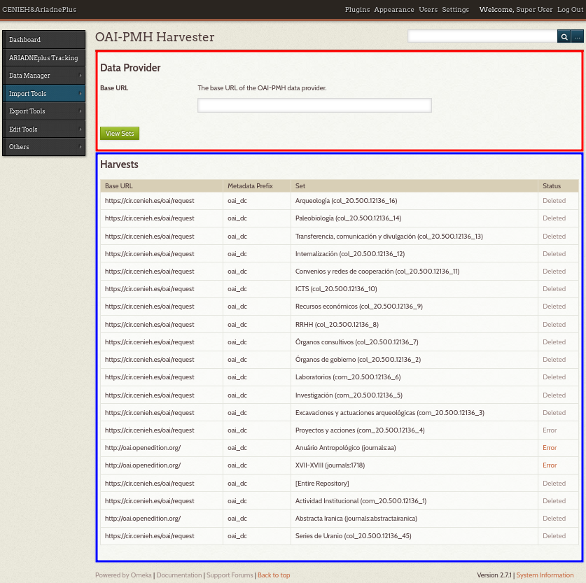

   Vista principal del complemento OAI-PMH Harvester

Recolectar metadatos de otros repositorios
******************************************
Antes de empezar con el proceso de recolección, hay que cerciorarse de que el repositorio objetivo tenga implementado el protocolo OAI-PMH. Lamentablemente, no existe ningún procedimiento específico de cómo realizar esta operación. Por tanto, si queremos recolectar metadatos de un repositorio determinado, hay que ponerse en contacto con el administrador del sitio para preguntarle si el repositorio dispone de este servicio. En tal caso, se deberá pedir además el enlace a dicho servicio.

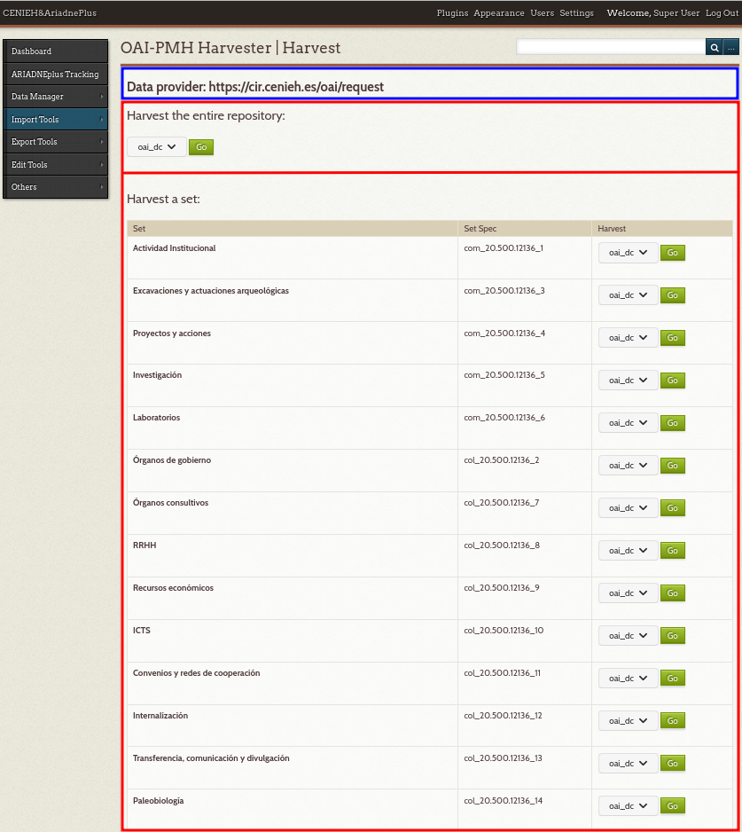

   Vista de los conjuntos de metadatos ofrecidos por un repositorio on-line

Para importar metadatos mediante el protocolo OAI-PMH:

1. Desde el complemento *OAI-PMH Harvester* (`aplicacion.es/admin/oaipmh-harvester`).
2. Introducir el enlace del servicio OAI-PMH en el campo "*Base URL* de la sección "*Data Provider*" y hacer clic sobre el botón "*View Sets*".

   a. Si el enlace es correcto, se mostrará en la parte inferior todos los conjuntos de datos del repositorio objetivo (ver :numref:`oai-pmh-harvester-view-2`).

3. En este punto se presentan dos opciones:

   a. Recolectar todos los metadatos existentes en el repositorio (sección "*Harvest the entire repository*").
   b. Recolectar los metadatos de un conjunto de datos específico (sección "*Harvest a set*").

   Si se desea la opción a, localizar la fila correspondiente al conjunto de datos que se desea importar.

4. Seleccionar el esquema de metadatos en el que queremos obtener los metadatos.
5. Hacer clic sobre el botón "Go".

Actualizar una importación
**************************
Una de las ventajas de este protocolo es que nos permite realizar varios procesos de importación sobre un mismo repositorio, manteniendo así actualizados los metadatos recolectados de ese repositorio.

Después de que se haya completado el proceso de recolección de metadatos, aparecerá un botón con el nombre de "*Re-harvest*" en el registro de la tabla existente en la página principal del complemento (ver :numref:`oai-pmh-harvester-view-1`).

.. figure:: ../_static/images/re-harvest-button.png
   :name: re-harvest-button
   :scale: 60%
   :align: center

   Vista de los conjuntos de metadatos ofrecidos por un repositorio on-line

Al hacer clic sobre ese botón se iniciará de nuevo el proceso de recolección, importando los nuevos ítems y aplicando cambios en los ya existentes.

Este proceso se puede hacer de forma manual volviendo a llevar a cabo los pasos del proceso de recolección.

Ver datos de una importación
****************************
Si queremos observar los acontecimientos que van sucediendo durante la importación, el complemento *OAI-PMH Harvester* lo permite.

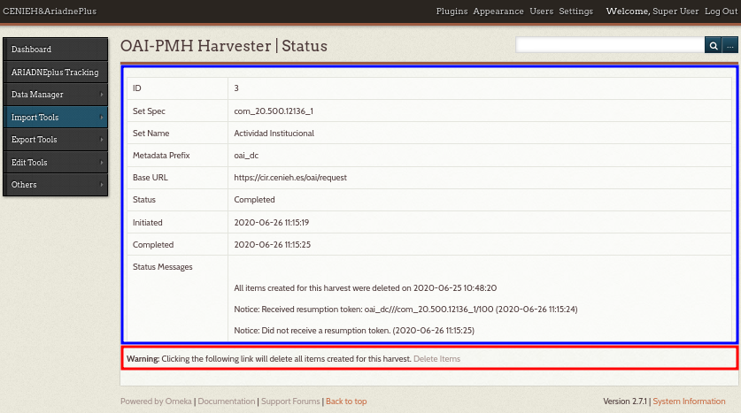

   Vista de los datos de una recolección

Para visualizar los datos de una importación:

1. Desde el complemento *OAI-PMH Harvester* (`aplicacion.es/admin/oaipmh-harvester`).
2. En la tabla que contiene todas las recolecciones efectuadas (ver :numref:`oai-pmh-harvester-view-1`), clicar sobre el estado de la recolección que quieras visualizar.
3. En la página actual (ver :numref:`oai-pmh-harvester-status`), se mostrarán los datos de la importación.

Deshacer una importación
************************
Existe la posibilidad de eliminar todos los ítems/colecciones recolectadas.

Para deshacer una importación:

1. Desde el complemento *OAI-PMH Harvester* (`aplicacion.es/admin/oaipmh-harvester`).
2. En la tabla que contiene todas las recolecciones efectuadas (ver :numref:`oai-pmh-harvester-view-1`), clicar sobre el estado (*Complete*) de la recolección que quieras deshacer.
3. En la página actual (ver :numref:`oai-pmh-harvester-status`), hacer clic sobre el hipertexto "*Delete Items*".

*ARIADNEplus Tracking*
~~~~~~~~~~~~~~~~~~~~~~
En esta sección se gestiona el **proceso de integración** para cada conjunto de datos almacenado en la plataforma. Por tanto, antes de poder iniciar cualquier proceso de integración, deben existir conjuntos de datos dentro de la plataforma con los que podamos trabajar (Ver importar conjuntos de datos).

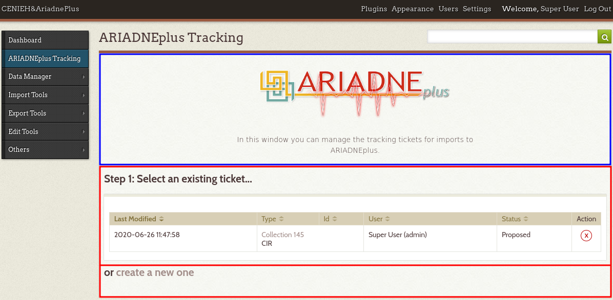

   Vista principal del complemento ARIADNEplus Tracking

Crear un ticket
^^^^^^^^^^^^^^^
Para someter una colección o ítem al proceso de integración de ARIADNEplus se debe crear antes un *ticket*. Este nos guiará y permitirá llevar un seguimiento del proceso.

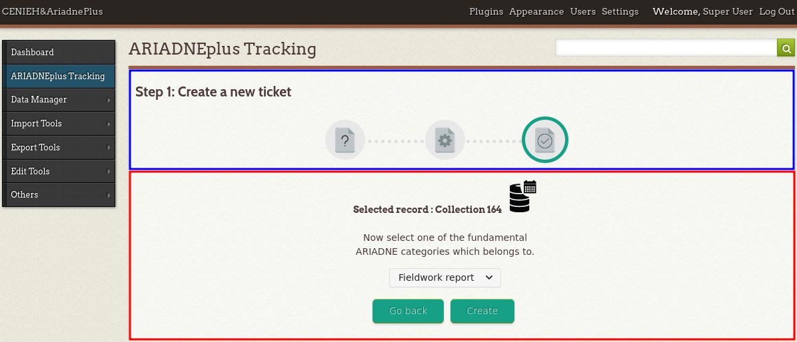

   Vista desde donde se crean los tickets

Para crear un nuevo ticket:

1. Desde el complemento *ARIADNEplus Tracking* (`aplicacion.es/admin/ariadne-plus-tracking`).
2. En la página principal, hacer clic sobre el hipertexto "*create new one*" situado bajo la tabla de tickets (ver :numref:`ariadne-plus-tracking`)..
3. En la página actual (ver :numref:`ariadne-plus-tracking-new`), seguir los pasos indicados:
   a. Seleccionar el tipo de dato que se pretende gestionar, pudiendo escoger entre "*Collection*" o "*Item*", y hacer clic sobre el botón *Continue*.
   b. Seleccionar el dato específico que se pretende introducir en el proceso y hacer clic sobre el botón *Continue*.
   c. Seleccionar la categoría fundamental de ARIADNEplus a la que el elemento seleccionado pertenece y hacer clic sobre el botón *Create*.
4. Aceptar el mensaje de confirmación haciendo clic sobre "*Yes, create it*".

Eliminar un *ticket*
^^^^^^^^^^^^^^^^^^^^
Pueden darse diversos motivos por los que ya no interese seguir con el proceso de integración para un determinado conjunto de datos. En tal caso, es conveniente eliminar el *ticket* correspondiente.

Para eliminar un ticket existente:

1. Desde el complemento *ARIADNEplus Tracking* (`aplicacion.es/admin/ariadne-plus-tracking`).
2. En la página principal, debemos visualizar una tabla con, al menos, una entrada (ver :numref:`ariadne-plus-tracking`).
3. Localizar, en la tabla, la fila correspondiente al ticket que se quiere eliminar.
4. Hacer clic sobre el botón circular "x" situado en la columna *Action* (última columna).
5. Aceptar el mensaje de confirmación haciendo clic sobre "*Yes, delete it*".

Ver registros de un *ticket*
^^^^^^^^^^^^^^^^^^^^^^^^^^^^
Cada vez que se solicita un cambio de fase, se genera un registro, el cual contiene un conjunto de mensajes informativos que indican los cambios que se van realizando. Puede resultar útil si queremos saber más acerca de lo que ocurre "por detrás" en cada cambio de fase.

Para someter una colección o ítem al proceso de integración de ARIADNEplus se debe crear antes un *ticket*. Este nos guiará y permitirá llevar un seguimiento del proceso.

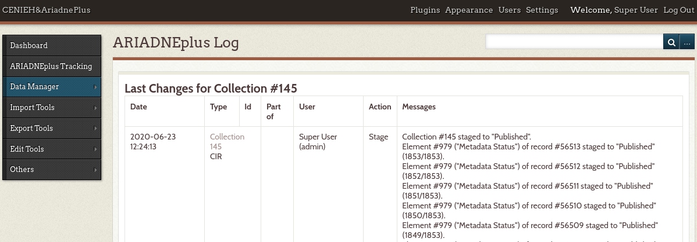

   Vista desde donde se observan los registros de cada ticket

Para visualizar los registros de un ticket existente:

1. Desde el complemento *ARIADNEplus Tracking* (`aplicacion.es/admin/ariadne-plus-tracking`).
2. En la página principal, debemos visualizar una tabla con, al menos, una entrada.
3. Localizar, en la tabla, la fila correspondiente al ticket que se quiere consultar.
4. Hacer clic sobre el hipertexto situado en las columnas *Type* e *Id* (segunda columna por la izquierda).

Cambiar de fase dentro un *ticket*
^^^^^^^^^^^^^^^^^^^^^^^^^^^^^^^^^^
El ciclo de vida de un ticket pasa por seis fases distintas, cada una de las cuales cuenta con sus propias reglas. Para pasar de una fase a otra, se deberán cumplir las reglas de la fase de partida. En la :numref:`rulesticket`, se muestra el conjunto de reglas por fase.

.. table:: Reglas existentes en el ciclo de vida de un ticket.
   :name: rulesticket
   :widths: auto

   +--------+------------------------------------------------------------------------------------------------+---------------------------------------------------------------------------------+
   |  Fase  |                                       Reglas                                                   |                                 Tipos de regla                                  |
   +========+================================================================================================+=================================================================================+
   |   01   | - **[S]** Todos los ítems involucrados en el proceso deben tener el estado "Complete".         | - Regla supervisada **[S]**: la aplicación exige que la regla se cumpla.        |
   |        |                                                                                                | - Regla opcional **[O]**: la aplicación avisa que la regla se cumpla.           |
   +--------+------------------------------------------------------------------------------------------------+ - Regla no supervisada **[NS]**: la aplicación no realiza ninguna comprobación. |
   |   02   | - **[S]** Indicar un identificador de mapeo válido. E.g. Mapping/123                           |                                                                                 |
   +--------+------------------------------------------------------------------------------------------------+                                                                                 |
   |   03   | - **[S]** Indicar un enlace válido hacia tu colección en periodO.                              |                                                                                 |
   |        | - **[O]** Adjuntar el fichero de definición de mapeo (.json) del vocabulario en la plataforma. |                                                                                 |
   +--------+------------------------------------------------------------------------------------------------+                                                                                 |
   |   04   | - **[NS]** Establecer comunicación con el contacto de ARIADNEplus.                             |                                                                                 |
   |        | - **[S]** Indicar el *SPARQL endpoint* obtenido fruto de la comunicación con ARIADNEplus.      |                                                                                 |
   +--------+------------------------------------------------------------------------------------------------+                                                                                 |
   |   05   | - **[NS]** Validar el contenido publicado en el portal fantasma de ARIADNEplus.                |                                                                                 |
   |        | - **[NS]** Enviar el mensaje de confimación al contacto.                                       |                                                                                 |
   +--------+------------------------------------------------------------------------------------------------+---------------------------------------------------------------------------------+

Además de cumplir con estas reglas, se deben tener en cuenta las siguientes condiciones:

- **El paso de fases es secuencial**, esto implica que, por ejemplo, para pasar a la fase 03 hemos tenido que completar previamente las fases 01 y 02.
- Para garantizar la consistencia de los datos, **no se permite cambiar de fase en sentido contrario**, por lo que si pasamos a la fase 02, no podremos retroceder hacia la fase 01.

   - Existen algunas **excepciones** a esta limitación: en las fases 04 y 06 es posible retroceder hasta la fase 01. Estas excepciones vienen dadas por el propio proceso de integración al que estamos sometiendo los datos.

Cada vez que ejecuta satisfactoriamente un cambio de fase, se actualiza el estado del ticket.

Para cambiar de fase dentro de un *ticket*:

1. Desde el complemento *ARIADNEplus Tracking* (`aplicacion.es/admin/ariadne-plus-tracking`).
2. En la página principal, debemos visualizar una tabla con, al menos, una entrada. Cada entrada es un *ticket*.
3. Clicar sobre la fila correspondiente al ticket que se quiere gestionar.
4. En la página actual (`aplicacion.es/ariadne-plus-tracking/index/ticket`), hacer clic sobre el botón "*Next Phase*" en caso de querer avanzar de fase o sobre el botón "*Restart*" en caso de querer retroceder hasta la primera fase. Ambos situados en la parte inferior central de la aplicación.

Configuración
^^^^^^^^^^^^^
La aplicación permite configurar ciertos aspectos que afectan al proceso de integración. A continuación se muestran todas las opciones posibles de configuración:

- Sección "*ARIADNEplus contact details*": establece la información de contacto de la persona encargada de supervisar las importaciones del CENIEH.

   - Campo "*Name*": nombre de la persona a la que nos estamos refiriendo.
   - Campo "*Email*": correo electrónico al que se enviarán los mensajes de comunicación en las fases que así se requiera.

- Sección "*Elements*": gestiona aspectos relacionados con los elementos de los esquemas de metadatos existentes en la plataforma.

   - Campo "*Display Remove Checkbox*": si se activa, se mostrará un *checkbox* en la página de configuración de elementos para eliminar cualquier elemento existente en el esquema de metadatos *Monitor*. Este esquema es el que recoge todos los campos relacionados con el proceso de integración (estado de los metadatos, categoría ARIADNEplus, etc.).

      - **Aviso**: todos los datos almacenados en los elementos seleccionados se eliminarán y no serán recuperables. Por lo tanto, verifique primero si las copias de seguridad están actualizadas y funcionando.

   - Campo "*Hide unnecessary Dublin Core elements*": si se activa, todos los elementos del esquema de metadatos *Dublin Core* considerados como innecesarios para el proyecto se ocultarán. Estos pueden ser configurados desde la tabla que puede ser desplegada pulsando sobre el botón "Show".

- Sección "Permissions": gestiona los permisos de los usuarios.

   - Campo "*Disable Batch Edit Tool*": si se activa, la edición masiva de ítems será desactivada.

- Sección "*Mandatory Elements*": establece los elementos del esquema de metadatos *Dublin Core* que serán obligatorios durante el proceso de integración, es decir, han de ser rellenados obligatoriamente. Estos pueden ser configurados desde la tabla que puede ser desplegada pulsando sobre el botón "Show".
- Sección "*Specific admin display*": establece los elementos que serán mostrados en las distintas zonas del buscador de ítems. Estos pueden ser configurados desde la tabla que puede ser desplegada pulsando sobre el botón "Show".

   - Zona "*Search*": en el buscador de ítems, saldrá como opción de búsqueda el elemento seleccionado.
   - Zona "*Filter*": en la lista de filtros del buscador, aparecerá el elemento seleccionado como un filtro más.
   - Zona "*Directly*": en cada ítem/colección aparecerá directamente sobre la tabla el elemento seleccionado.
   - Zona "*Details*": se mostrará el elemento seleccionado en el desplegable donde se muestran los detalles de cada ítem/colección.

Para acceder a la página de configuración:

1. Desde la zona de administración (`aplicacion.es/admin/`).
2. Seleccionar la entrada "Plugins" del menú global de navegación alojado en la parte superior de la aplicación.
3. Se mostrarán todos los complementos instalados en la aplicación. Localizar el complemento "ARIADNEplus Tracking".
4. Hacer clic sobre el botón "Configure".
