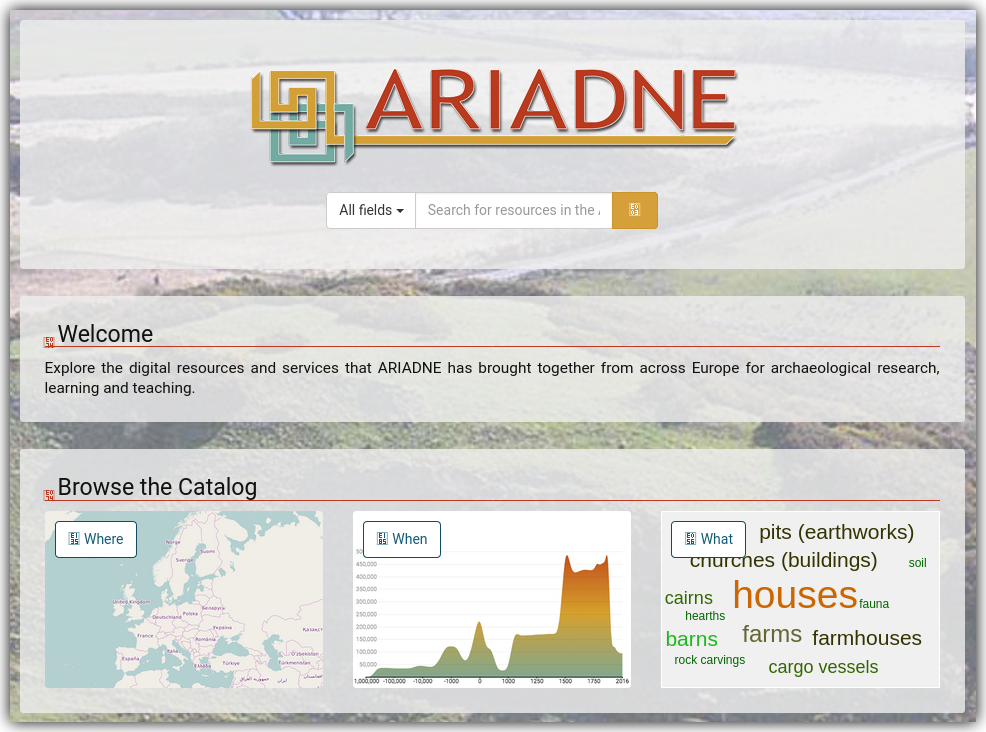
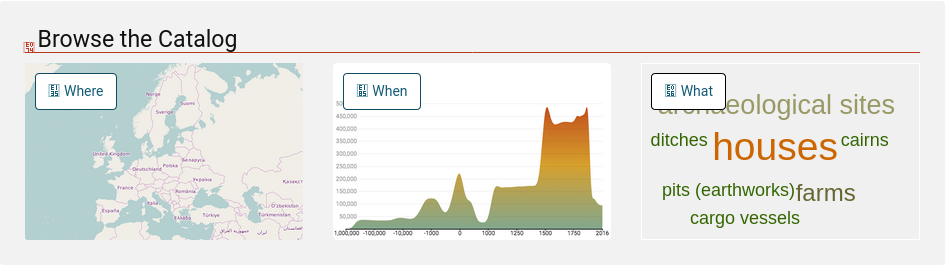

============
Introducción
============

El Centro Nacional de Investigación sobre la Evolución Humana, también conocido como CENIEH, se ha incorporado recientemente al proyecto europeo denominado *ARIADNEplus*. Este proporciona una infraestructura de investigación orientada a la arqueología cuyo principal objetivo es apoyar la investigación, el aprendizaje y la enseñanza al permitir el libre acceso a recursos y servicios digitales. Lo consigue manteniendo un catálogo de conjuntos de datos digitales :numref:`catalogAriadne`, promoviendo buenas prácticas en la gestión y uso de datos digitales arqueológicos, y apoyando el desarrollo de nuevos servicios innovadores para la arqueología.

   Vista del catálogo oficial de *ARIADNEplus*.

Los conjuntos de datos almacenados en el catálogo de *ARIADNEplus* son meramente descriptivos, es decir, no contienen el dato al que hacen referencia. Es por tanto competencia de los socios discernir quién tiene acceso a los datos reales y quién no. Podría decirse que el catálogo actúa simplemenete como un escaparate que permite mostrar a los investigadores de todo el mundo información sobre el qué, cuándo y dónde de los datos expuestos.

   Filtros de búsqueda principales del catálogo *ARIADNEplus*.

Son estos tres conceptos, el qué, cuándo y dónde, los pilares de información sobre los que está construido el catálogo. Hacen referencia al tipo de dato (e.g. *fieldwork*), al espacio temporal en el que se enmarca (e.g. *Neolithic*) , y al lugar geográfico donde se ubica (e.g. *Sierra de Atapuerca*).

Con la realización de este proyecto se pretende llevar a cabo el proceso de integración de los conjuntos de datos del CENIEH en *ARIADNEplus*, de forma que estos sean visibles desde su catálogo oficial.

Además, para aplicar los conocimientos desarrollados durante toda la carrera, se propone una infraestructura *software* que permita gestionar estos conjuntos de datos y sirva como guía a los investigadores del CENIEH durante el mencionado proceso de integración.

