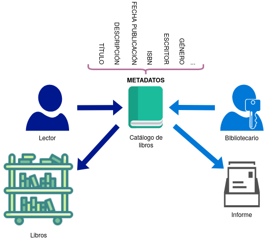
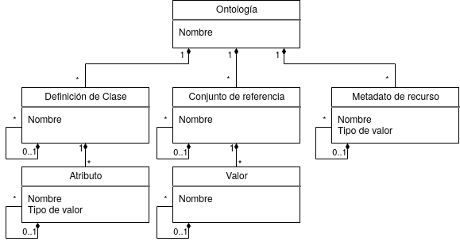
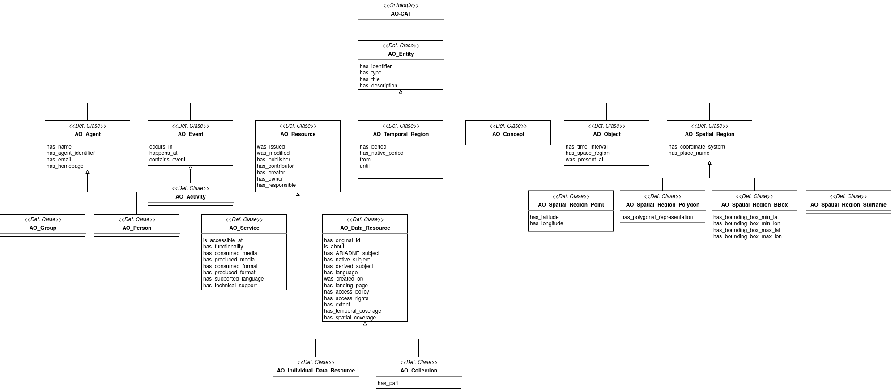
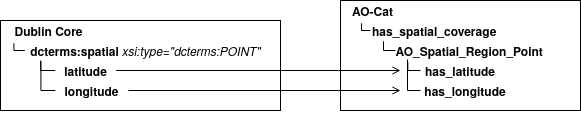
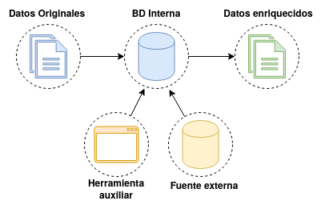
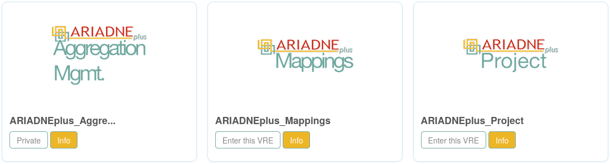
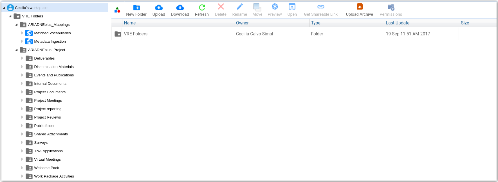
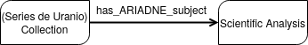
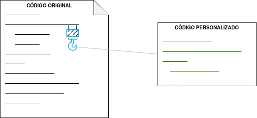
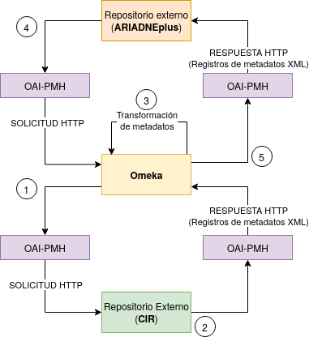

==================
Conceptos teóricos
==================
A lo largo de este apartado se van a exponer los conceptos teóricos relacionados con las dos primeras fases en las que se divide el proyecto, que son investigación y desarrollo.

Conceptos teóricos relativos a la investigación
-----------------------------------------------
En esta sección se definen todos aquellos conceptos relacionados con la investigación previa al desarrollo e implementación de la infraestructura *software* propuesta.

ARIADNEplus
~~~~~~~~~~~
ARIADNEplus [#]_ es la continuación del proyecto ARIADNE [#]_, el cual fue fundado por la Comisión Europea en febrero de 2013. Nació con el propósito de estimular la investigación en áreas relacionadas con la arqueología mediante la integración de diversas infraestructuras de datos arqueológicas situadas en Europa. Fruto de este proyecto surgió un catálogo *on-line* de metadatos referentes a conjuntos de datos que incluían reportes no publicados, imágenes, mapas, bases de datos, y otros tipos de información arqueológica.

Este segundo proyecto forma parte del programa H2020, fundado también por la Comisión Europea. El proyecto se encuentra en desarrollo desde enero de 2019 y tiene previsto una duración total de 48 meses. A través de ARIADNEplus, se actualizarán y extenderán los datos del catálogo *on-line* anterior añadiendo a los mismos dimensión geográfica y temporal. Además, se van a incorporar más organizaciones arqueológicas Europeas (entre ellas el CENIEH). También proveerá nuevos servicios en la nube para procesar y re-utilizar los datos incluidos en su portal.

CENIEH
~~~~~~
El Centro Nacional de Investigación sobre la Evolución Humana, tambien conocido como CENIEH, es una Infraestructura Científica y Técnica Singular (ICTS) abierta al uso de la comunidad científica y tecnológica, en la que se desarrollan investigaciones en el ámbito de la evolución humana durante el Neógeno superior y Cuaternario, promoviendo la sensibilización y transferencia de conocimientos a la sociedad e impulsando y apoyando la realización y colaboración en excavaciones de yacimientos de estos periodos, tanto españoles como de otros países.

Además, el CENIEH es responsable de la conservación, restauración, gestión y registro de las colecciones paleontológicas y arqueológicas procedentes de las excavaciones de Atapuerca y otros yacimientos tanto nacionales como internacionales de similares características [#]_.

CIR
^^^
El CIR (CENIEH Institutional Repository) [#]_ es el repositorio bibliográfico institucional del CENIEH. Alberga toda la información fruto de la actividad investigadora desarrollada en el CENIEH como, por ejemplo, publicaciones científicas. Toda esta información está organizada en ítems que pertenecen a una colección, que a su vez pertenece a una comunidad. Cada ítem tiene asignado un conjunto de metadatos que describe al objeto que contiene.

Metadatos
~~~~~~~~~
Los metadatos proporcionan la información mínima necesaria para identificar un recurso, pudiendo incluir información descriptiva sobre el contexto, calidad y condición o característica del dato [#]_. Puede resultar algo complejo de entender ya que podemos reducir su definición a "son datos que describen otros datos".

Para aportar algo de claridad a esta definición aplicaré el concepto de "metadato" tomando como ejemplo una biblioteca. En este contexto, el conjunto de datos estaría formado por los libros y el conjunto de metadatos se correspondería con las fichas asociadas a cada libro. Este ejemplo de "metadato" es algo antiguo ya que se presenta de una forma física, no digital.

   Ejemplo de metadatos

En la actualidad, estas "fichas" se encuentran en formato digital a través de lenguajes de marcado como *XML* o *RDF*.

Esquema de metadatos
~~~~~~~~~~~~~~~~~~~~
Antes de introducir metadatos en cualquier catálogo, es necesario indicar como van a estar organizados. Para llevar a cabo esta tarea hay que definir un **esquema de metadatos**, también llamado modelo o estándar.

Cada esquema está formado por un conjunto de campos de diferentes tipos, los cuales siguen una estructura jerárquica en forma de árbol.

   Estructura básica de un esquema de metadatos

En la :numref:`diagramacampos`, podemos observar la **estructura básica** de cualquier esquema:

    - **Ontología**: es la raíz del esquema. Su función es agrupar los demás campos en una única unidad temática. Puede tener tres tipos de descendientes: Clase, Referencia o Metadato.
    - **Definición de Clase**: define una clase o subclase dentro de una ontología determinada, creando así una jerarquía de clases.

        - **Atributo**: define un atributo para una determinada clase existente en la ontología.
    - **Conjunto de Referencia**: define un conjunto de valores que pueden ser instanciados en el Atributo de una Clase o en el Metadato de un recurso.

        - **Valor**: define el contenido de cada valor existente en un conjunto de referencia.
    - **Metadato de Recurso**: define el metadato de un recurso determinado. Además, puede ser descendiente de otro metadato a modo de especificación.

Cuando se define un atributo o un metadato, se debe indicar, además, el tipo de contenido que va a adquirir, es decir, señalar que se va a introducir. Algunos pueden ser texto plano, otros coordenadas, fechas, enlaces, etc.

CIDOC-CRM
^^^^^^^^^
**CIDOC** **C**\ onceptual **R**\ eference **M**\ odel (CRM) [#]_ es una ontología que ofrece definiciones y una estructura formal para describir conceptos implícitos y explícitos, así como las relaciones utilizadas en documentación sobre patrimonio cultural. CIDOC define un marco semántico en el cual se puede incluir cualquier tipo de información sobre patrimonio cultural.

ACDM
^^^^
El **A**\ RIADNE **C**\ atalogue **D**\ ata **M**\ odel es el modelo de datos utilizado por el catálogo antiguo de ARIADNE. Sirve para describir los recursos arqueológicos publicados por los participantes del proyecto. El uso de ACDM posibilita el descubrimiento, acceso e integración de los citados recursos. Para formalizar este modelo, se ha utilizado como base la ontología CIDOC CRM, la cual se adapta correctamente al dominio arqueológico.

PEM
^^^
PEM (\ **P**\ ARTHENOS **E**\ ntities **M**\ odel) es un esquema de metadatos desarrollado en el proyecto PARTHENOS [#]_ que extiende el modelo CIDOC-CRM. Está diseñado para ser lo suficientemente flexible como para mapear los diferentes tipos de esquemas de metadatos utilizados en todas las disciplinas académicas de manera uniforme.

AO-Cat
^^^^^^
La ontología *AO-Cat* (\ **A**\ RIADNE **O**\ ntology **-** **Cat**\ alog) deriva del modelo de datos ACDM, empleado en el proyecto antiguo (ARIADNE) para modelar recursos arqueológicos, y del modelo PEM, utilizado para modelar cualquier recurso gestionado por una infraestructura de investigación. Se podría decir que AO-Cat es una contracción del modelo ACDM impulsada por la conceptualización subyacente al PEM. Además, AO-Cat hereda del modelo PEM su estrecha relación con el modelo CIDOC-CRM, el cual sirve para representar cualquier aspecto relacionado con recursos arqueológicos.

   Diagrama de clases para la ontología AO-CAT

Es el **modelo utilizado por el catálogo actual de ARIADNEplus** y, por tanto, los metadatos del CENIEH se tendrán que adaptar a este modelo.

Mapeo de datos (*Data Mapping*)
~~~~~~~~~~~~~~~~~~~~~~~~~~~~~~~
El término "Mapeo" puede utilizarse en múltiples contextos como, por ejemplo, en la cartografía, matemáticas, neurociencia, etc. En esta ocasión, se describirá el concepto relacionado con la informática, más específicamente con la gestión de datos.

El mapeo de datos consiste en crear asignaciones entre dos elementos que pertenecen a esquemas de datos distintos. En procesos como la integración o migración de datos es fundamental llevar a cabo este tipo de proceso debido a que, generalmente, el sistema al que se trasladan los datos no utiliza la misma estructura que el sistema de partida.

   Ejemplo de mapeo entre el esquema "Dublin Core" y el modelo "AO-Cat"

Enriquecimiento de datos (*Data Enrichment*)
~~~~~~~~~~~~~~~~~~~~~~~~~~~~~~~~~~~~~~~~~~~~
El enriquecimiento de datos es el proceso mediante el cual se pretende mejorar la calidad de los datos sin necesidad de ser procesados. Durante este proceso, se fusionan los datos originales con datos de terceros provenientes de una determinada fuente autorizada externa. Para determinar las relación entre unos datos y otros, se suele hacer uso de herramientas auxiliares que permiten establecer dichas relaciones entre los elementos originales y los elementos externos.

   Proceso de enriquecimiento de datos.

D4Science
~~~~~~~~~
D4Science [#]_ es una organización que ofrece una infraestructura de datos basada en entornos virtuales. El usuario cuenta con un espacio de trabajo virtual que le da la posibilidad de acceder a datos y compartir los suyos propios, además, también cuenta con herramientas y capacidad de cómputo para hacer uso de los datos en su proceso de investigación.

ARIADNEplus Gateway
^^^^^^^^^^^^^^^^^^^
ARIADNEplus cuenta con un portal en la plataforma *D4Science* denominado *ARIADNEplus Gateway* [#]_. En él tiene implementados varios entornos virtuales de investigación (VREs). Cada uno de ellos ofrece una serie de servicios que facilitan el proceso de integración a los miembros del proyecto. Actualmente, cuenta con tres entornos virtuales, cada uno de los cuales tiene un fin específico:

   Entornos virtuales de investigación en D4Science.

- *ARIADNEplus Aggregation Management*:  Es un entorno virtual donde los líderes del proyecto gestionan las importaciones de metadatos al catálogo. El acceso está restringido a los coordinadores del proyecto.
- *ARIADNEplus Mappings*: Es un entorno virtual que da soporte a la conversión de metadatos (*mapping*) para su integración en ARIADNEplus.
- *ARIADNEplus Project*: Es un entorno virtual que permite la colaboración y cooperación entre los beneficiarios del proyecto ARIADNEplus.

*Workspace*
^^^^^^^^^^^
Otro de los servicios que ofrece *D4Science* es el *Workspace*. La idea principal de esta herramienta es que los miembros de un determinado portal intercambien recursos digitales como, por ejemplo, documentos, imágenes, vídeos, etc.

En este espacio de trabajo los miembros de ARIADNEplus organizan y comparten recursos relacionados con el proyecto como, por ejemplos, guías, tutoriales, presentaciones, etc.

   Espacio de trabajo (*Workspace*) del proyecto ARIADNEPlus

Además, este mismo espacio se puede utilizar como medio de importación. Para tal fin, como podemos ver en el imagen, existen dos carpetas públicas, *Matched Vocabularies* y *Metadata Ingestion*, en cuyo interior se aloja una carpeta para cada miembro. Estas tienen el nombre de cada socio y su misión es almacenar los ficheros de mapeo de vocabulario (*.json*) y los ficheros con los metadatos (*.xml*). De esta manera, el coordinador asignado solo tendrá que acceder a la carpeta del miembro que pretenda ejecutar una importación.

*Getty AAT*
~~~~~~~~~~~
Getty AAT [#]_ es un vocabulario controlado y estructurado que se emplea para describir elementos de arte, arquitectura y material cultural. Está compuesto por términos generales como, por ejemplo, "Acueducto", pero no contiene nombres propios como "Acueducto de Segovia". Actualmente cuenta con alrededor de 55.000 conceptos registrados, incluyendo 131.000 términos, descripciones, citaciones bibliográficas, y otra información relacionada con las áreas previamente mencionadas.

*PeriodO*
~~~~~~~~~
PeriodO [#]_ es un diccionario digital público donde se almacenan definiciones académicas de periodos históricos, histórico-artísticos y arqueológicos. Este proyecto es liderado por Adam Rabinowitz (Universidad de Texas, Austin) y Ryan Shaw (Universidad de Carolina del norte, Chapel Hill).

Tecnología GraphDB
~~~~~~~~~~~~~~~~~~
ARIADNEplus almacena todos los metadatos en un almacén de RDF (*triplestore*) basado en la tecnología *GraphDB* [#]_. Este tipo de tecnología utiliza **bases de datos orientadas a grafos**. Estas se basan en un conjunto de objetos (vértices y aristas) que permiten representar datos interconectados junto a las relaciones existentes entre sí. Cada grafo está compuesto por nodos o vértices, que se corresponden con los datos (objetos), y aristas o arcos, que serían las relaciones entre los datos. La estructura de este tipo de bases de datos puede adoptar dos formas: *Labeled-Property Graph* (grafo de propiedades etiquetadas) o *Resource Description Framework* (marco de descripción de recursos, RDF).

GraphDB adopta la segunda estructura, que consiste en estructurar los grafos mediante *triples* y *quads*: los *triples* están compuestos por nodo-arco-nodo y los *quads* complementan a estos con información de contexto adicional, lo que facilita la división de los datos en grupos. Esta estrutucta es la ideal para almacenar ontologías como AO-CAT, de ahí que ARIADNEplus haya escogido esta tecnología.

   GraphDB - Triple.

En la :numref:`vmt` se ha representado un *triple* que se correspondería con una parte del grafo asociado a la colección CIR almacenada en este tipo de base de datos. Vemos como se compone de dos nodos, uno para el sujeto (CIR) y otro para el objeto (*Scientific analysis*), unidos por un arco, que sería el predicado (*has_ARIADNE_subject*).

Conceptos teóricos relativos al desarrollo de la infraestructura
----------------------------------------------------------------
A continuación se definen aquellos conceptos relacionados con el desarrollo de la infraestructura.

LAMP
~~~~
Las siglas LAMP son utilizadas para describir infraestructuras *software* que hacen uso de cuatro herramientas específicas:

- **L**\ inux como sistema operativo.
- **A**\ pache como servidor web.
- **M**\ ysql o **M**\ ariaDB como gestor de base de datos.
- **P**\ HP como lenguaje de programación.

La aplicación *software* escogida (*Omeka Classic*) emplea dicha infraestructura.

Complementos (*Plugins*)
~~~~~~~~~~~~~~~~~~~~~~~~
Los complementos, más conocidos como *plugins*, son aplicaciones que permiten ampliar la funcionalidad básica de un determinado producto software. Normalmente este tipo de aplicaciones son ejecutadas a través del *software* principal, interactuando con este a través de una determinada interfaz.

*Hooking*
~~~~~~~~~
El término *hooking* es utilizado para referirse a todas aquellas técnicas utilizadas para modificar el comportamiento de un sistema operativo, aplicación u otro componente *software* interceptando llamadas de función, mensajes o eventos pasados entre componentes *software*. El código que maneja estos acontecimientos se le denomina *hook*.

   Ejemplo de *hook*

Los *hooks* se encuentran distribuidos a lo largo de todo el código *Omeka*, evitando así tener que modificar el código original para poder añadir funcionalidades a la aplicación. Además, si sacan una nueva versión del producto, al tener nuestro código separado del original, podemos reincorporar todas las modificaciones tras actualizarlo.

En aplicaciones como Omeka suelen existir dos tipos de *hooks*: *action hooks* y *filter hooks*.

*Action hooks*
^^^^^^^^^^^^^^
A través de los *action hooks* podemos ejecutar nuestras propias funciones en un determinado punto. Por ejemplo, si queremos introducir un formulario en una página de Omeka, tendremos que utilizar el *action hook* alojado en dicha página para ejecutar nuestra función, la cual imprimirá el código del formulario HTTP. En este ejemplo, la función no retornaría nada ya que simplemente se limita a imprimir código, y es que en este tipo de *hooks* la función no tiene por qué devolver nada.

En los archivos de Omeka se pueden localizar estos *hooks* buscando la función *fire_plugin_hook()*. Una vez encontrada, desde el *plugin* que estamos desarrollando, haciendo uso de la interfaz *Omeka_Plugin_AbstractPlugin* bastaría con añadir este *hook* a la lista *_hooks* e instanciar el método correspondiente, el cual siempre tiene la nomenclatura *hookNombreDelHook()*.

.. figure:: ../_static/images/actionhooks.png
   :name: actionhooks
   :alt: Ejemplo de action hook
   :scale: 100%
   :align: center

   Ejemplo de *action hook*

En el ejemplo vemos como *fire_plugin_hook()* tiene dos parámetros de entrada, el primero indica el nombre del *hook* y el segundo almacena los argumentos de entrada que tendrá la función que almacena la acción.

*Filter hooks*
^^^^^^^^^^^^^^
Los *filter hooks* nos permiten, al igual que los *action hooks*, ejecutar funciones personalizadas en un determinado punto. Sin embargo, el objetivo de estos es algo distinto ya que no pretenden modificar código sino alterar los datos de una determinada variable. Por tanto, las funciones implicadas deben tener un parámetro de entrada de forma que, desde el interior de nuestra función, modificaremos el valor de dicho parámetro y devolveremos el resultado.

En los archivos de *Omeka* se pueden localizar estos *hooks* buscando la función *apply_filters()*. Una vez encontrada, existen dos formas de usar ese *filter hook*:

1. Utilizando la interfaz *Omeka_Plugin_AbstractPlugin* podemos utilizar el *filter hook* añadiendo el nombre del filtro a la lista *_filters*. A continuación, habría que agregar el método público con el nombre *filter* seguido del nombre del filtro.

.. figure:: ../_static/images/filterhooksA.png
   :name: filterhooksA
   :alt: Ejemplo de filter hook
   :scale: 100%
   :align: center

   Ejemplo de *filter hook*

2. Utilizando el método *add_filter()* podemos utilizar el *filter hook* pasando como primer parámetro el nombre del filtro implicado y como segundo parámetro la función que se ejecutará. En este caso el nombre de la función es personalizable. Además, se puede pasar un tercer parámetro para indicar la prioridad de nuestra función, es decir, si existiera más de un *plugin* utilizando ese mismo filtro, se ejecutaría la función de cada uno en función de su prioridad, de mayor a menor prioridad. Por defecto, todos los *filtros* de cada *plugin* tienen una prioridad de 10, por lo que el orden de ejecución se determina por la fecha de instalación, de más antiguos a más nuevos.

.. figure:: ../_static/images/filterhooksB.png
   :name: filterhooksB
   :alt: Ejemplo de filter hook
   :scale: 100%
   :align: center

   Segundo ejemplo de *filter hook*

Prácticas ágiles
~~~~~~~~~~~~~~~~
Durante esta fase, se han adoptado una serie de prácticas ágiles que han contribuído favorablemente al desarrollo del *software*. A continuación, se explica en qué consiste cada una de ellas.

Desarrollo iterativo e incremental
^^^^^^^^^^^^^^^^^^^^^^^^^^^^^^^^^^
En un desarrollo iterativo e incremental el proyecto se va planificando en intervalos de tiempo constantes, cada uno de los cuales recibe el nombre de iteración. En todas las iteraciones se sigue un mismo procedimiento (de ahí el nombre de iterativo) para conseguir una funcionalidad determinada del producto que se pretende desarrollar.

En cada iteración, se van completando partes del producto final que son aptas para ser entregadas al cliente. Este goteo constante de entregas es el responsable de que a este procedimiento se le denomine incremental. Para que esto sea posible, se definen unos objetivos/requisitos al inicio de cada iteración, que marcarán la evolución del proyecto. También se pueden plantear mejoras para requisitos que se entregaron en iteraciones anteriores.

Pruebas unitarias
^^^^^^^^^^^^^^^^^
Las pruebas unitarias permiten comprobar el correcto funcionamiento de unidades de código fuente. Con el uso de este tipo de pruebas se pretende asegurar que cada unidad se comporta adecuadamente antes distintas situaciones. Resulta complicado determinar a qué nos referimos cuando decimos "unidad de código" ya que, por definición, puedes asociar este concepto tanto a una clase como a un método.

Habitualmente se desarrolla más de una prueba unitaria por unidad de código. El motivo radica en que una prueba unitaria sólo es capaz de comprobar el comportamiento de la unidad ante una única entrada. Lo ideal es comprobar su comportamiento ante todas aquellas entradas que tengan una probabilidad razonable de hacer que falle. El conjunto de pruebas que recoge todas estas entradas se le denomina *test suite*.

Integración y Despliegue continuo (CI/CD)
^^^^^^^^^^^^^^^^^^^^^^^^^^^^^^^^^^^^^^^^^
La integración continua (CI) es una práctica utilizada en el desarrollo de *software* mediante la cual es posible automatizar operaciones tales como la compilación o ejecución de pruebas. Aplicando esta metodología, se consigue detectar fallos con mayor rapidez, mejorar la calidad del *software* y reducir el tiempo empleado en validar y publicar nuevas actualizaciones *software*.

El despliegue continuo (CD) se puede considerar como el siguiente paso a la integración continua, es decir, una vez automatizados los procesos de compilación y ejecución de pruebas, se procede a automatizar el despliegue del producto *software* que estemos desarrollando.

Otros conceptos
---------------
En este apartado se recogen todos aquellos conceptos que tienen cierta relevancia en el proyecto y no han sido explicados en secciones anteriores.

*Dublin Core*
~~~~~~~~~~~~~
*Dublin Core* es un esquema de metadatos elaborado por la *DCMI* [#]_ (*Dublin Core Metadata Initiative*), organización cuya misión principal es facilitar la compartición de recursos *on-line* por medio del desarrollo de un modelo de metadatos "base", capaz de proporcionar información descriptiva básica sobre cualquier recurso, sin importar el formato de origen, área de especialización u origen cultural. Dispone de 15 elementos descriptivos, los cuales pueden ser repetidos, aparecer en cualquier orden y estar o no presentes (opcionales).

*Dublin Core Extended*
~~~~~~~~~~~~~~~~~~~~~~
Dado que el modelo *Dublin Core* puede resultar algo escueto, se presenta como solución el esquema *Dublin Core Extended*, el cual cuenta con los elementos descriptivos del modelo original y, además, incluye una serie de elementos adicionales/complementarios [#]_ que satisfacen las necesidades que el modelo original no cubre.

Interoperabilidad
~~~~~~~~~~~~~~~~~~
La interoperabilidad es la capacidad que tiene un sistema o producto de compartir datos y posibilitar el intercambio de información y conocimiento entre ellos [#]_. En lo que respecta a repositorios, se puede conseguir dicha capacidad haciendo uso de estándares como, por ejemplo, el protocolo OAI-PMH.

Protocolo OAI-PMH
~~~~~~~~~~~~~~~~~
El protocolo *Open Archive Initiative-Protocol for Metadata Harvesting* (OAI-PMH) tiene como objetivo desarrollar y promover estándares de interoperabilidad que faciliten la difusión eficiente de contenidos en Internet. Permite transmitir metadatos entre diferentes tipos de infraestructuras *software* (repositorios, gestores, etc.) siempre y cuando éstos se codifiquen en *Dublin Core*.

Gracias a que la aplicación escogida ofrece este servicio, haciendo uso del mismo se han podido recolectar todos los metadatos existentes en el CIR. Además, ARIADNEplus permite importar metadatos en su catálogo haciendo uso de este protocolo, por lo que su implantación también abre otro posible camino de importación.

   Ejemplo básico del protocolo OAI-PMH

Geolocalización
~~~~~~~~~~~~~~~
La geolocalización es la capacidad para obtener la ubicación geográfica real de un objeto [#]_. Uno de los requisitos fundamentales del catálodo de ARIADNEplus es que todos los metadatos importados han de estar geolocalizados, es decir, tienen que tener, al menos, un elemento descriptivo que indique la ubicación actual del objeto. Nuestra plataforma cuenta con el elemento *Spatial Coverage* del modelo *Dublin Core Extended* para cubrir este requisito.

WSG84
^^^^^
El **W**\ orld **G**\ eodetic **S**\ ystem **84** es un sistema de coordenadas geográficas usado mundialmente para localizar cualquier punto de la Tierra [#]_. Uno de los requisitos de ARIADNEplus es que todas aquellas localizaciones señaladas a través de coordenadas geográficas deben utilizar este sistema.

.. References

.. [#] “ARIADNE PLUS – Ariadne infrastructure.” https://ariadne-infrastructure.eu/.
.. [#] "Ariadne Project EU | Foundation." https://www.ariadne-eu.org/
.. [#] “Sobre el CENIEH | CENIEH.” https://www.cenieh.es/sobre-el-cenieh.
.. [#] “CIR – CENIEH Institutional Repository” https://cir.cenieh.es/
.. [#] Senso, José Antonio; Rosa Piñero, Alberto de la (2003). "El concepto de metadato. Algo más que descripción de recursos electrónicos". http://www.scielo.br/pdf/ci/v32n2/17038.pdf/
.. [#] “CIDOC CRM.” http://www.cidoc-crm.org/.
.. [#] "PARTHENOS Project." https://www.parthenos-project.eu/
.. [#] "D4Science" https://www.d4science.org/
.. [#] "ARIADNEplus Gateway" https://ariadne.d4science.org/
.. [#] "D4Science – Workspace" https://data.d4science.net/okCN/
.. [#] "The Getty Research Institute – Art & Architecture Thesaurus" https://www.getty.edu/research/tools/vocabularies/aat/
.. [#] "GraphDB Technology" http://graphdb.ontotext.com/
.. [#] "DCMI." https://www.dublincore.org/
.. [#] "DCMI Metadata Terms." http://dublincore.org/documents/dcmi-terms/
.. [#] "Interoperabilidad." https://administracionelectronica.gob.es/pae_Home/pae_Estrategias/pae_Interoperabilidad_Inicio.html
.. [#] "Wikipedia - Geolocalización." https://es.wikipedia.org/wiki/Geolocalizaci%C3%B3n
.. [#] "Wikipedia - WSG84" https://es.wikipedia.org/wiki/WGS84
