===============================================
Aspectos relevantes del desarrollo del proyecto
===============================================

A continuación se van a mostrar los aspectos más relevantes del desarrollo del proyecto, justificando las decisiones tomadas y dando visibilidad a los problemas encontrados.

Ciclo de vida del proyecto
--------------------------
El 01 de febrero de 2020 se inició este proyecto con el objetivo de llevar a cabo el proceso de integración de los datos del CENIEH en ARIADNEplus. Adicionalmente, se propuso implantar en el CENIEH una infraestructura *software* mediante la cual los investigadores del CENIEH fueran capaces de llevar a cabo las tareas de integración por sí solos. De esta manera, a través de la infraestructura propuesta, serían capaces de continuar con las labores de integración una vez concluido el periodo de colaboración entre el CENIEH y la UBU.

El proyecto ha tenido una duración total de 5 meses, lo que significa que el 01 de julio de 2020 finalizaron las tareas implicadas en el proyecto. Sin embargo, las tareas de integración se siguieron llevando a cabo desde el CENIEH hasta el 31 de julio de 2020, fecha en la que se da por concluido el periodo de colaboración.

Las fases en las que se puede dividir el proyecto son:

- **Investigación**: en esta fase se realiza un estudio previo del proyecto ARIADNEplus, así como de los conjuntos de datos del CENIEH que están involucrados en el proceso de integración.
- **Desarrollo**: a lo largo de esta fase se ejecutan todas las tareas relacionadas con el diseño, desarrollo e implementación de la infraestructura *software*.
- **Integración**: en esta fase se integran los datos del CENIEH en ARIADNEplus haciendo uso tanto de la infraestructura *software* implementada como de los servicios ofrecidos por ARIADNEplus.

Investigación
-------------
Durante las primeras semanas de trabajo, se llevó a cabo un estudio exhaustivo del proyecto ARIADNEplus, especialmente del **proceso de integración** al que cada miembro debía someter sus datos. A medida que se iban aprendiendo nuevos aspectos, se comprobaba su compatibilidad con los datos propuestos por el CENIEH, anotando en todo momento los problemas que pudieran surgir.

Proceso de integración
~~~~~~~~~~~~~~~~~~~~~~
ARIADNEplus no agrega ni mueve datos de los sistemas de información de los miembros del proyecto, solo añade **metadatos** a los conjuntos de datos que son mantenidos y gestionados por cada miembro. Este tipo de información debe adoptar un **esquema o modelo** para poder ser representado a través de catálogos o repositorios. En el caso de ARIADNEplus, cuentan con un esquema denominado **AO-Cat** (\ **A**\ RIADNE **O**\ ntology **-** **Cat**\ alog), diseñado exclusivamente para el proyecto.

Cada miembro del proyecto, incluído el CENIEH, cuenta desde un principio con sus propias colecciones de metadatos. Esto puede considerarse un problema ya que, como se ha comentado anteriormente, este tipo de información se representa a través de un esquema, el cual será distinto en cada uno de los miembros. Ante esta situación, al no coincidir el esquema de origen (?) con el de destino (AO-Cat), sería imposible poder representar los datos del origen en el catálogo.

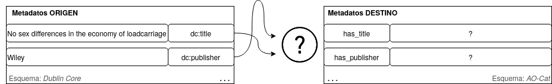

   Conflicto entre esquemas de metadatos distintos

Además, un esquema está formado por un conjunto de elementos, cada uno de los cuales está sujeto a unas determinadas reglas. Por ejemplo, podría especificarse el tipo de dato que almacena (*string*, *date*, etc.) o considerarse como imprescindible (no nulo). Este hecho aumenta aún más la complejidad del problema de integración ya que cada miembro cuenta con sus propios elementos y con sus propias reglas.

Para dar solución a todos estos problemas, ARIADNEplus propone dividir el proceso de integración en 6 fases.

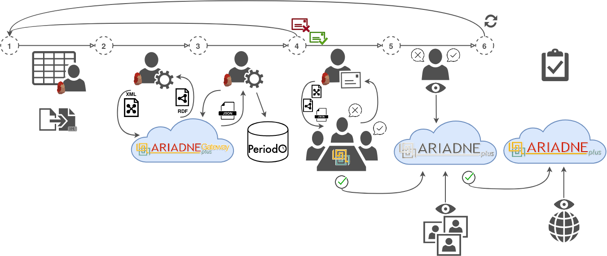

   Fases en las que se divide el proceso de integración

1. **Confirmación**: se confirman las colecciones de metadatos que serán agregadas y, además, se indica a qué categoria de datos de ARIADNEplus pertenecen.
2. **Transformación**: una vez estén listos los metadatos de origen, se genera un fichero de definición de mapeo que permita transformar el esquema de metadatos de origen al esquema objetivo (AO-Cat).
3. **Enriquecimiento**: se mejora la calidad de los metadatos sometiendo los datos a un proceso de enriquecimiento utilizando el vocabulario *Getty AAT* y/o *PeriodO*.
4. **Importación**: habiendo completado las tres fases anteriores, se ejecuta el proceso de importación de los metadatos.
5. **Simulación de publicación**: con los metadatos de origen ya importados en la base de datos, se realiza una simulación de publicación.
6. **Publicación**: si los resultados obtenidos en la fase 5 son favorables, se lleva a cabo la publicación de los metadatos en el catálogo oficial.

Confirmación
^^^^^^^^^^^^
En esta fase se confirman qué colecciones de datos serán integradas en el proyecto. Además, se debe indicar a qué categoría de datos de ARIADNE pertenecen.

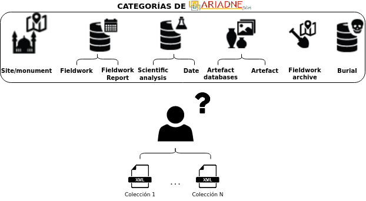

   Fase de confirmación

Afortunadamente, los datos propuestos se obtuvieron con suma facilidad, sin ningún tipo de reticencia por parte del CENIEH. En la siguiente tabla se indican las principales características de cada una de las colecciones de datos confirmadas para la integración con ARIADNEplus. Además, se especifica la categoría ARIADNE a la que corresponden.

.. table:: Colecciones de metadatos propuestas por el CENIEH para la integración con ARIADNEplus.
   :widths: auto

   +--------------------+------------------+----------------+------------------------------+-----------+---------------------+
   |      Colección     |  Núm. Registros  | Docs asociados |            Campos            |  Formato  |  Categoría ARIADNE  |
   +====================+==================+================+==============================+===========+=====================+
   | Anatomía Comparada |       571        |       Sí       | SIGNA_CENIEH, Clase, Orden,  |    CSV    | Scientific analysis |
   |                    |                  |                | Familia Género, Especie,     |           |                     |
   |                    |                  |                | Sigla de campo, Elemento,    |           |                     |
   |                    |                  |                | Sexo, Adulto Localidad,      |           |                     |
   |                    |                  |                | Municipio, Provincia, Pais,  |           |                     |
   |                    |                  |                | Tipo de objeto               |           |                     |
   +--------------------+------------------+----------------+------------------------------+-----------+---------------------+
   |      Litoteca      |       99         |       Sí       | Afloramiento, Sigla,         |    CSV    | Scientific analysis |
   |                    |                  |                | Localización, Datum, X, Y, Z,|           |                     |
   |                    |                  |                | Acceso, Tipo de Afloramiento,|           |                     |
   |                    |                  |                | Tipo de roca, Depositante,   |           |                     |
   |                    |                  |                | Muestra física, Lámina       |           |                     |
   |                    |                  |                | delgada, Laboratorio geología|           |                     |
   |                    |                  |                | CENIEH, Fotografías, Otros   |           |                     |
   |                    |                  |                | datos, Topografía            |           |                     |
   +--------------------+------------------+----------------+------------------------------+-----------+---------------------+
   |     Ratón Pérez    |       1323       |       Sí       | Sigla, Individuo, Sexo, Edad,|    CSV    | Scientific analysis |
   |                    |                  |                | Pieza, Superior/inferior,    |           |                     |
   |                    |                  |                | Lado, Conservación,          |           |                     |
   |                    |                  |                | Consolidado, Pegado,         |           |                     |
   |                    |                  |                | Observaciones, Localización, |           |                     |
   |                    |                  |                | Fecha MicroCT, Archivo mCT,  |           |                     |
   |                    |                  |                | Proyecto Amira, localización,|           |                     |
   |                    |                  |                | No Imágenes, kv/mA, Vxl,     |           |                     |
   |                    |                  |                | Size, Filter, Fotos mCT      |           |                     |
   +--------------------+------------------+----------------+------------------------------+-----------+---------------------+
   |     Sedimentos     |       7695       |       No       | ReferenciaBolsa,             |    CSV    | Scientific analysis |
   |                    |                  |                | ReferenciaCaja, Yacimiento,  |           |                     |
   |                    |                  |                | Nivel, Cuadro, Z, Situacion, |           |                     |
   |                    |                  |                | FechaRecogida, FechaAlmacen, |           |                     |
   |                    |                  |                | FechaProcesando              |           |                     |
   +--------------------+------------------+----------------+------------------------------+-----------+---------------------+
   |        CIR         |       1853       |       Sí       | *Dublin Core terms*          |    CSV    | Scientific analysis |
   +--------------------+------------------+----------------+------------------------------+-----------+---------------------+

Transformación
^^^^^^^^^^^^^^
Para evitar el problema mostrado en la :numref:`mappingProblem`, ARIADNEplus pone a disposición de sus miembros la **herramienta X3ML Mapping Tool**, disponible en el VRE *ARIADNEplus Mappings* del portal *ARIADNEplus Gateway* de *D4Science*. Está compuesta por un conjunto de microservicios, de código abierto, que siguen el modelo de referencia *SYNERGY* para la transmisión y agregación de datos.

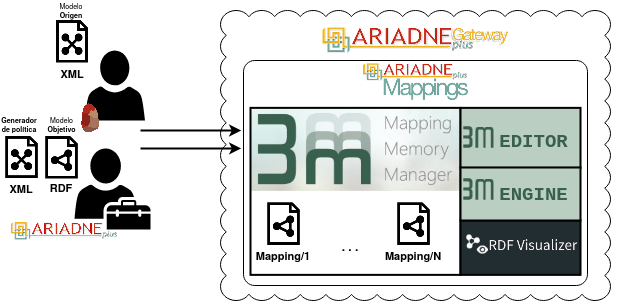

   Fase de transformación

Los componentes clave de este servicio son:

- *3M – Mapping Memory Manager*: herramienta utilizada para la gestión de archivos de definición de mapeo. Proporciona una serie de acciones administrativas que ayudan a los proveedores de datos a administrar sus archivos de definición de mapeo.

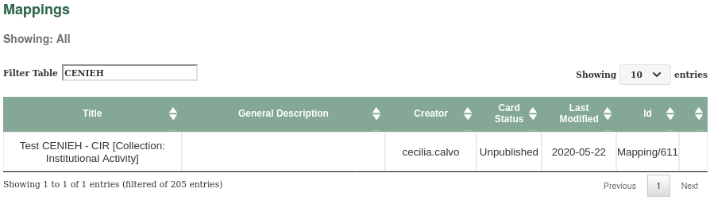

   Vista de la herramienta *Mapping Memory Manager - 3M*

- *3M Editor*: provee la interfaz que permite crear asignaciones entre los elementos del esquema de metadatos a mapear y el esquema objetivo.

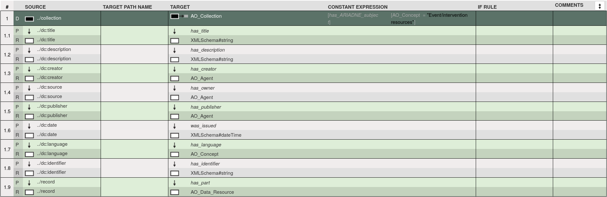

   Vista de la herramienta *3M Editor*

- *X3ML Engine*: ejecuta la transformación de los elementos de origen al formato de destino. Tomando como entrada los datos de origen (en formato XML), la descripción de las asignaciones existentes en el fichero de definición de mapeo y el archivo que contiene las políticas para la generación de URIs, es responsable de transformar el documento original en un documento RDF válido que corresponda al archivo XML de entrada con las asignaciones y políticas indicadas.

- *RDF visualizer*: permite, de una forma rápida, inspeccionar los documentos transformados.

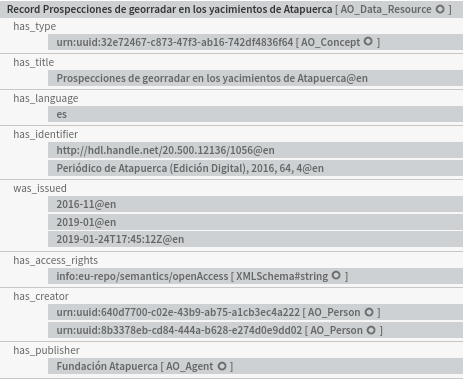

   Vista de la herramienta *RDF visualizer*

Esta herramienta toma un **papel decisivo** en el proceso de integración ya que permite transformar el modelo de origen al esquema de metadatos utilizado en ARIADNEplus (AO-CAT).

A continuación se van a describir los principales **retos** a los que nos hemos tenido que enfrentar durante esta segunda fase:

- Todos los conjuntos de datos propuestos por el CENIEH están en formato CSV. Esto supone un problema ya que **ARIADNEplus solo trabaja con ficheros XML**, es decir, no cuenta con ningún método de importación que tolere archivos CSV.
- **Los conjuntos de datos del CENIEH**, a excepción de la colección del CIR, están dispuestos de forma irregular, es decir, **no siguen ningún esquema estandarizado**. Esto implica que para cada conjunto de datos, se necesita hacer un fichero de definición de mapeo distinto, lo que no es para nada eficiente.
- En el esquema objetivo, los **elementos** pueden ser opcionales u **obligatorios**. Los elementos opcionales no suponen ningún problema ya que pueden quedar vacíos, sin embargo, los elementos obligatorios requieren la existencia de un elemento en el modelo de origen que pueda sustituirlo, es decir, que tenga el mismo significado. Esta regla supone un reto para el CENIEH ya que muchos de los elementos obligatorios no cuentan con un elemento apto en las colecciones de datos propuestas.
- **El contenido** almacenado en cada elemento del esquema objetivo **ha de tener un formato específico**. Por ejemplo, el contenido del elemento *has_language*, responsable de indicar el idioma en el que está dispuesto el objeto al que referencia, debe cumplir con el estándar ISO639-1 o ISO639-2. Por tanto, el elemento asignado en el origen debe seguir el mismo formato.

Enriquecimiento
^^^^^^^^^^^^^^^
En ocasiones, los metadatos por si solos no son lo suficientemente precisos o claros como para describir una determinada característica del objeto al que se refieren. En el caso de la arqueología, existen multitud de conceptos con un alto grado de complejidad que necesitan ser explicados en detalle. Por este motivo, ARIADNEplus propone enriquecer los metadatos haciendo uso del vocabulario *Getty AAT* y del cliente *PeriodO*.

.. figure:: ../_static/images/enrichment.png
   :name: enrichment
   :alt: Enriquecimiento de metadatos.
   :scale: 60%
   :align: center

   Enriquecimiento de metadatos

En la :numref:`enrichment` se muestra el flujo de datos del proceso de enriquecimiento de metadatos. Por una parte, vemos un archivo .json, el cual se obtiene a través de la **herramienta Vocabulary Matching Tool**. Esta es otra de las herramientas que se pueden encontrar en el VRE *ARIADNEplus Mappings*. Permite mapear el vocabulario utilizado en el documento de origen al vocabulario *Getty AAT*.

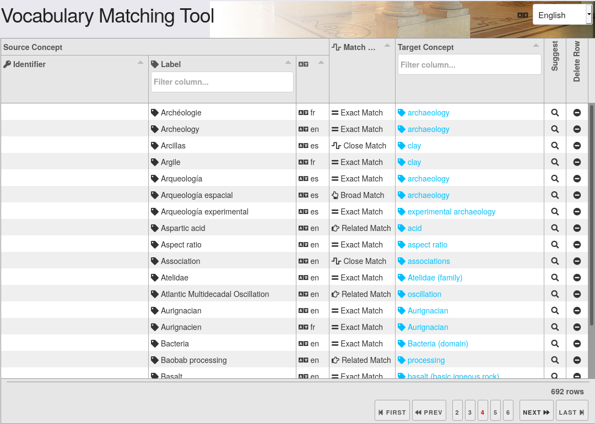

   Vista de la herramienta *Vocabulary Matching Tool*

El archivo generado por esta herramienta (.json) define las relaciones entre los conceptos del vocabulario de origen y los conceptos del vocabulario *Getty AAT*. Desde el catálogo de ARIADNEplus, todos aquellos términos que tengan una asociación definida, serán hiperenlaces que apunten al concepto Getty AAT asociado.

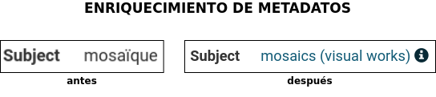

   Vista de un metadato (*Subject*) antes y depués de ser enriquecido

Además, vemos representada la BD donde **PeriodO** almacena sus registros. Para aportar información adicional a los periodos existentes en nuestros datos, debemos publicar en el cliente de PeriodO nuestra propia colección de periodos. De esta forma, ARIADNEplus podrá recoger desde la BD de periodO nuestra colección para, posteriormente, establecer una relación entre los periodos de un lado y de otro. Al igual que con el vocabulario, todos los periodos que tengan una asociación definida, serán hiperenlaces que apunten al objeto de periodO.

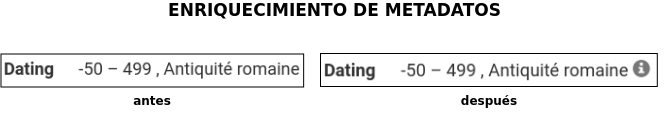

   Vista de un metadato (*Dating*) antes y depués de ser enriquecido

En esta fase se encontraron varios **inconvenientes**:
- Muchos de los términos existentes en los conjuntos de datos del CENIEH no están presentes en el vocabulario *Getty AAT*. Por este motivo, solo se pudo enriquecer una pequeña parte del conjunto total.
- Para poder publicar la colección en periodO, se requería determinar la autoridad de los periodos, es decir, indicar de donde procedían. Desde el CENIEH no me pudieron facilitar ese dato ya que lo desconocían. Por este motivo, no se pudo llevar a cabo la publicación y por ende no se enriquecerieron los periodos.

Importación
^^^^^^^^^^^
El sistema de importación de ARIADNEplus, conocido como ARIADNEplus *Aggregator*, se basa en el kit de herramientas de *software* D-Net (implementado y mantenido por ISTI-CNR [#]_), que proporciona funciones integradas que permiten recopilar conjuntos de metadatos a través de múltiples métodos. Está disponible en el portal *ARIADNEplus Gateway*, sin embargo, su acceso está restringido a los coordinadores del proyecto. Las principales opciones son:

1. **OAI-PMH**: es un protocolo estándar para el intercambio de metadatos. A través de este método ARIADNEplus puede recopilar todo el contenido o los conjuntos de datos OAI que le indiquemos.
2. **SFTP**: es un protocolo de transmisión de ficheros. Esta opción es algo engorrosa ya que debe existir un archivo XML por recurso, es decir, no puedes agrupar varios registros en un mismo fichero XML. Los socios son responsables del servidor SFTP. Se admiten modos de autentificación.
3. **FTP(S)**: es otro protocolo de transferencia de ficheros. Presenta las mismas características de importación que SFTP.
4. **Workspace**: se pueden subir directamente los registros en el *workspace* de D4Sciente (ARIADNEplus Gateway). Cada socio tiene su propia carpeta donde puede ir almacenando los documentos XML (metadatos) que desee importar.

Dado que este sistema es inaccesible para la mayoría de los miembros (incluido el CENIEH), se debe escoger una de esas opciones y comunicársela al coordinador responsable. Una vez realizada la importación, se deben facilitar tres datos:

- Qué ficheros (*.xml*) de los importados se desean publicar.
- Cuál es el identificador del fichero de definición de mapeo (e.g. *Mapping/621*) que transformará el esquema de metadatos presente en tus ficheros al esquema AO-Cat.
- Opcionalmente, el enlace a tu colección de periodO y/o el fichero de mapeo (*.json*) del vocabulario.

Los conjuntos de datos del CENIEH están almacenados de forma local, exceptuando el CIR. Por ello, de entre todas las opciones posibles, la única forma válida de importar metadatos sería a través del *Workspace*.

Simulación de publicación
^^^^^^^^^^^^^^^^^^^^^^^^^
Una vez establecida la comunicación con el coordinador responsable del proceso de importación, se debe esperar a su respuesta. Dependiendo del contenido de la respuesta, se pueden tomar dos caminos:

1. Nos indican que todas las partes del proceso (metadatos, mapeo, enriquecimiento) son correctos. En tal caso, los metadatos propuestos estarían ya disponibles desde el portal fantasma de ARIADNEplus. Este es idéntico al original con la única diferencia de que sólo tienen acceso los miembros del proyecto.
2. Nos indican que alguna parte del proceso no es correcta. Ante esta situación, se debe volver hacia atrás en el proceso de integración para solventar los conflictos señalados por el coordinador.

Publicación
^^^^^^^^^^^
Si en la fase previa se ha obtenido una respuesta satisfactoria, el miembro que inició el proceso de integración sería ya capaz de observar el resultado final. A continuación, deberá comunicarse de nuevo con el responsable de la importación para indicarle sus impresiones. Se pueden dar dos situaciones:

1. El resultado es favorable. Ante esta situación el coordinador lleva a cabo la publicación de los datos en el portal original.
2. No se esperaba el resultado obtenido. En tal caso, se deben mantener las conversaciones hasta llegar a una solución.

En el caso de que todo haya salido según lo planeado, el proceso de integración para los conjuntos de datos publicados quedaría suspendido. Existe la posibilidad de reactivar este proceso en el caso de que se deseen actualizar ciertos datos, sin embargo, hay que tener en cuenta que cualquier cambio en la estructura de los datos supondría tener que volver a realizar el proceso desde 0.

Desarrollo
----------
Recordemos que en la fase anterior se anotaron todos los aspectos relevantes del proceso de integración, incluyendo además los problemas de incompatibilidad encontrados entre dicho proceso y los datos propuestos por el CENIEH. Es en esta fase cuando se aplican las competencias y los conocimientos adquiridos a lo largo del grado con el objetivo de desarrollar una infraestructura *software* que sea capaz de guiar a los operarios del CENIEH en el proceso de integración y, además, resuelva los problemas mencionados en la fase anterior.

*Omeka* como aplicación principal
~~~~~~~~~~~~~~~~~~~~~~~~~~~~~~~~~
Desarrollar desde cero una infraestructura *software* que cumpliera con todos los requisitos propuestos no era viable debido a la limitación temporal del proyecto. Por este motivo, se decidió utilizar *software* de terceros que cumpliera con un mínimo de **requisitos**:

- Permitir la **gestión de metadatos**: los archivos de información involucrados son metadatos, por tanto, se necesita un sistema que permita realizar todo tipo de tareas de gestión sobre este tipo de datos.
- Disponer de **herramientas de importación y exportación**: los datos de origen necesitarán ser importados a la plataforma para realizar sobre ellos las operaciones oportunas. Una vez gestionados, deberán ser exportados para someterlos al proceso de integración.
- Ser **software libre**: este requisito era fundamental ya que, para poder adaptar la infraestructura a las necesidades del proyecto, se debe tener total libertad a la hora de ejecutar, copiar, distribuir, estudiar, modificar y mejorar el *software*.

Se consideraron varios productos *software* para acabar escogiendo `Omeka Classic <https://omeka.org/classic/>`__. Una de las características que hacen de la aplicación una magnífica plataforma para el proyecto es su **escalabilidad**. Gracias a su sistema de **complementos** o *plugins*, cualquier programador tiene la posibilidad de adaptarla a sus necesidades individuales sin necesidad de modificar el código base de la aplicación.

Actualmente, *Omeka* cuenta con una gran cantidad de *plugins* disponibles tanto en su `página oficial <https://omeka.org/classic/plugins/>`__ como en `GitHub <https://daniel-km.github.io/UpgradeToOmekaS/omeka_plugins.html>`__. Esto es posible gracias a la extensa comunidad de usuarios que le respalda. Parte de esos *plugins* se han podido utilizar para adaptar la infraestructura a las necesidades del proyecto, sin embargo, se han tenido que desarrollar nuevos *plugins* para cubrir requisitos específicos. Además, se han llevado a cabo modificaciones sobre alguno de los *plugins* de terceros utilizados.

Por tanto, parte de las tareas de esta fase están relacionadas con la creación y modificación de *plugins* para *Omeka*.

Adaptación de la plataforma
^^^^^^^^^^^^^^^^^^^^^^^^^^^
Los complementos o *plugins* son capaces de añadir nuevas funcionalidades a *Omeka* gracias a que esta tiene implementado un sistema de ganchos o *hooks*. Estos nos permiten acoplar código en puntos específicos del flujo de ejecución de la aplicación, evitando así tener que alterar el código base de esta.

Dentro de la aplicación se pueden encontrar dos tipos distintos de *hooks*: *hooks* de acción y filtros (*filters*).

*Hooks* de acción
*****************
Este tipo de *hook* permite añadir la ejecución de funciones en puntos de ejecución específicos.

Por ejemplo, en el caso de que se quiera introducir un formulario en una página de *Omeka*, se debería utilizar el *action hook* alojado en dicha página para ejecutar la función encargada de imprimir el código HTML del formulario. En este ejemplo, la función no retornaría nada ya que se limita a imprimir código, y es que en este tipo de *hooks* la función no tiene por qué devolver nada.

En los archivos de Omeka se pueden localizar estos *hooks* buscando la función *fire_plugin_hook()*. Una vez encontrada, desde el *plugin* que estamos desarrollando, haciendo uso de la interfaz *Omeka_Plugin_AbstractPlugin*, bastaría con añadir este *hook* a la lista *_hooks* e instanciar el método correspondiente, el cual siempre tiene la nomenclatura *hook<NombreDelHook>()*.

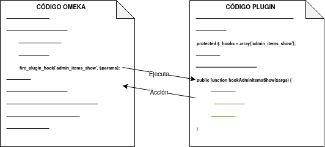

   Ejemplo de hook de acción

En el ejemplo vemos como *fire_plugin_hook()* tiene dos parámetros de entrada, el primero indica el nombre del *hook* y el segundo almacena los argumentos de entrada que tendrá la función que almacena la acción.

Filtros (*Filters*)
*******************
Los filtros permiten, al igual que los *hooks* de acción, ejecutar funciones propias en puntos específicos de la aplicación. Sin embargo, el objetivo de estos es algo distinto ya que no pretenden modificar código sino alterar los datos de una determinada variable.

Las funciones implicadas deben tener un parámetro de entrada y otro de salida de forma que, desde el interior de la función, se procesa el valor de entrada y se devuelve el valor resultante.

En los archivos de *Omeka* se pueden localizar estos *hooks* buscando la función *apply_filters()*. Una vez encontrada, existen dos formas de usar ese filtro:

1. Utilizando la interfaz *Omeka_Plugin_AbstractPlugin* es posible utilizar el filtro añadiendo su nombre a la lista *_filters*. A continuación, se añadiría el método público con el nombre *filter* seguido del nombre del filtro.

   Ejemplo de *filter hook*

2. Utilizando el método *add_filter()*, se puede utilizar el filtro pasando como primer parámetro el nombre del filtro implicado y como segundo parámetro la función que se ejecutará. En este caso, el nombre de la función es personalizable.
   Además, se puede pasar un tercer parámetro para indicar la prioridad de nuestro *hook*, es decir, si existiera más de un *plugin* utilizando ese mismo filtro, se ejecutaría la función de cada uno en función de su prioridad, de mayor a menor prioridad.
   Por defecto, todos los *filtros* de cada *plugin* tienen una prioridad de 10, por lo que el orden de ejecución se determina por la fecha de instalación, de más antiguos a más nuevos.

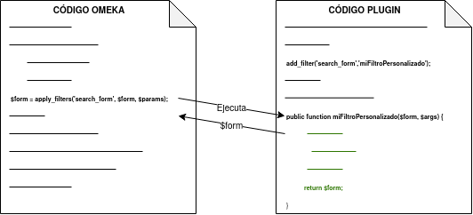

   Segundo ejemplo de *filter hook*

Entornos de trabajo
~~~~~~~~~~~~~~~~~~~
Durante la fase de desarrollo, se ha trabajado sobre dos entornos:

- **Entorno de desarrollo**: se actualiza al cometer cambios sobre la rama *develop*. Permite llevar un seguimiento diario del estado de la aplicación durante el desarrollo de la misma. Es público.
- **Entorno de producción**: se actualiza al cometer cambios sobre la rama *main*. En su interior se puede encontrar una versión estable de la aplicación. El intervalo de tiempo de actualización gira entorno a las dos semanas. Es privado, sólo tienen acceso los miembros del CENIEH.

Despliegue de la infraestructura
~~~~~~~~~~~~~~~~~~~~~~~~~~~~~~~~
Para llevar a cabo el despliegue de la infraestructura se ha utilizado la herramienta *GitHub Actions*. Dependiendo del entorno de trabajo, se ha procedido de una manera u otra:

Servidor de desarrollo
^^^^^^^^^^^^^^^^^^^^^^
A través de la herramienta *GitHub Actions* se ha automatizado el despliegue de la infraestructura sobre el servidor de desarrollo. A esta técnica se la conoce como despliegue continuo.

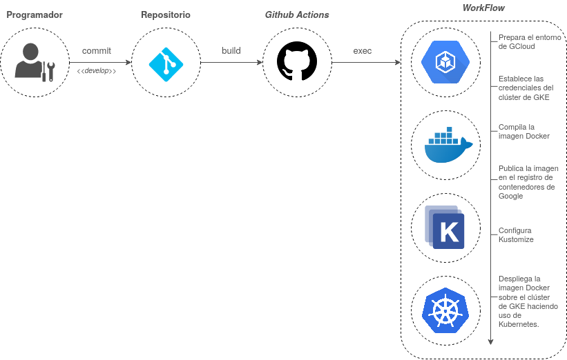

   Despliegue continuo de la aplicación

En la :numref:`cicd` he representado el proceso mediante el cual se lleva a cabo el despliegue. Con el *workflow* configurado y alojado en la ruta *.github/workflows* de mi repositorio en GitHub, cuando ejecuto un *push* sobre la rama *develop*, si los cambios cometidos afectan a cualquier carpeta que no sea la de */docs*, se ejecutan las acciones correspondientes al despliegue de mi aplicación, las cuales se pueden apreciar en la imagen.

Servidor de producción
^^^^^^^^^^^^^^^^^^^^^^
Sobre el servidor de producción no se ha podido automatizar el despliegue debido a que el acceso a este era privado, es decir, no se podía establecer comunicación desde el exterior sin previa conexión al VPN del CENIEH y el posterior acceso vía *ssh* al servidor.

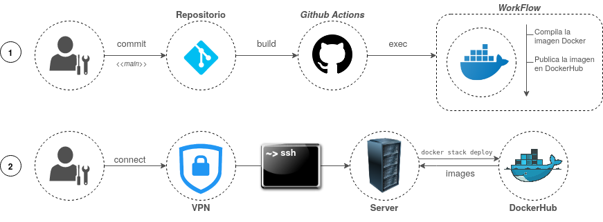

   Despliegue "semi-continuo" de la aplicación

Como solución a este inconveniente, se automatizó por separado la compilación y publicación de la imagen *Docker* asociada a nuestra aplicación. De esta manera, cada vez que se cometía un cambio sobre la rama *main*, se ejecutaba dicho proceso, actualizando la imagen publicada en el repositorio de *DockerHub*.
Finalizado el proceso, se accedía al servidor de producción y se desplegaba manualmente la infraestructura. Durante el despliegue, se recogían las imágenes desde *DockerHub*, incluyendo la imagen actualizada de nuestra aplicación.

.. References

.. [#] "ISTI-CNR – Istituto di Scienza e Tecnologie dell’Informazione " https://www.isti.cnr.it/

