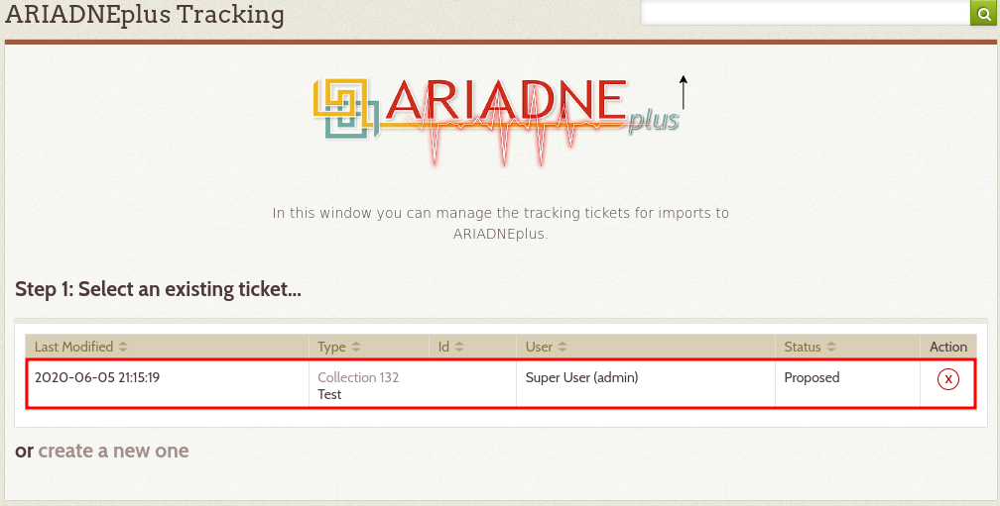
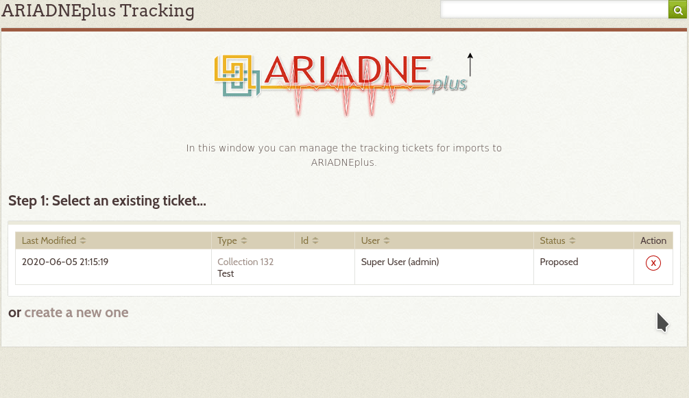
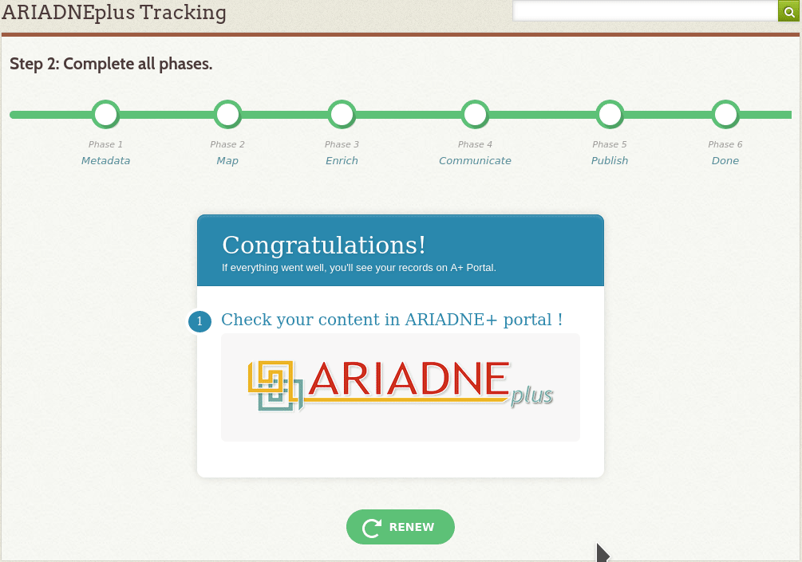

# ARIADNEplus Tracking Plugin

This is a plugin for Omeka 2.x that allows you to track the metadata import process to ARIADNEplus.

------

## Installation

1. Copy the ARIADNEplusTracking folder into the "plugins" folder of the root Omeka installation. (see [Installing a Plugin](https://omeka.org/classic/docs/Admin/Adding_and_Managing_Plugins/))

2. Replace the 'XXXXX' values in the imap.ini file with your email host, username, password, port and security protocol. It must be the same email (username and password) as the one you configured in config.ini.

3. In the Omeka administrative interface, click on the "Settings" button at the top right of the screen, go to the "Plugins" tab, and click the "Install" button next to the listing for ARIADNEplus Tracking.

------

## Usage

### Create a new tracking ticket

1. If you haven't imported your metadata to Omeka yet, do it now through plugins like [CsvImportPlus](https://github.com/Daniel-KM/Omeka-plugin-CsvImportPlus) or [OAI-PMH Harvester](https://github.com/omeka/plugin-OaipmhHarvester). You can also create new metadata from Omeka (see [Add an Item](https://omeka.org/classic/docs/Content/Items/#add-an-item)).

2. Go to the main page of the plugin and click on "Create a new one" link.

3. Select the type of record you want to import into ARIADNE +. For example, if you imported a collection in step 1, select "Collection".

4. Choose the specific record. If you chose "Collection" in the previous step, you can only choose among all the existing collections on Omeka that are not associated with another ticket.

5. Now select one of the fundamental ARIADNE categories which belongs to and click Continue.

6. You'll see the ticket on the main page. To access, just click on the corresponding row.

7. Now you just have to complete the phases.

### Delete a ticket
If you don't want to continue the operation for any reason, you can delete the ticket.

1 . On the main page of the plugin, click the "X" button under "Actions".

### Renew a ticket
If you want to add new items, modify the existing ones or delete them and you have passed the first phase, you must renew the ticket.

1. In the last phase of the import process (Phase 6), you can renew the ticket by clicking on the "Renew" button.

2. You'll see the ticket on the main page with the initial state.