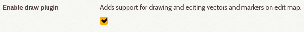
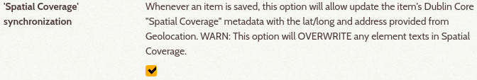
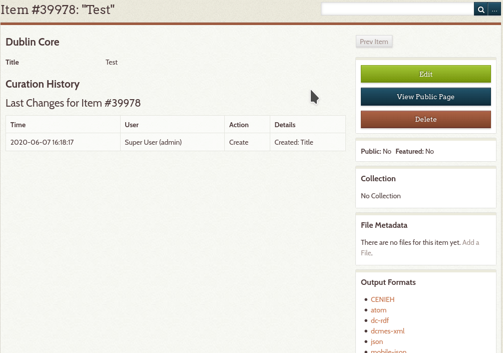
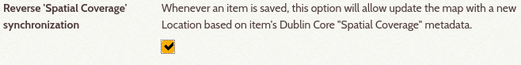

# Geolocation Plugin with extra features

## ORIGINAL PLUGIN: [Omeka Site](https://omeka.org/classic/plugins/Geolocation/) | [Github Repository](https://github.com/omeka/plugin-Geolocation)

Allows administrative users to save geolocation data for an individual item. The plugin generates a Google map containing items with geolocation data and a web page for displaying the map.

-----

## Installation

1. Copy the Geolocation folder into the "plugins" folder of the root Omeka installation. (see [Installing a Plugin](https://omeka.org/classic/docs/Admin/Adding_and_Managing_Plugins/))

2. In the Omeka administrative interface, click on the "Settings" button at the top right of the screen, go to the "Plugins" tab, and click the "Install" button next to the listing for Geolocation.

-----

## Additional features

- **Bounding Box Area** 
**Plugin used**: [Leaflet Draw](http://leaflet.github.io/Leaflet.draw/docs/leaflet-draw-latest.html)

- **'Spatial Coverage' synchronization**

- **Reverse 'Spatial Coverage' synchronization**

